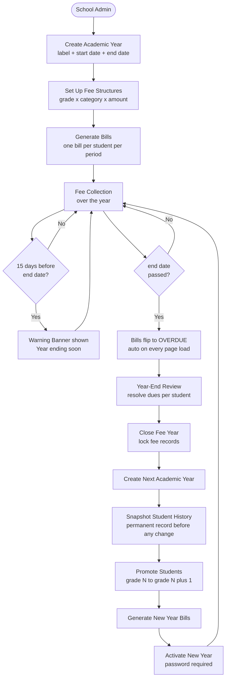
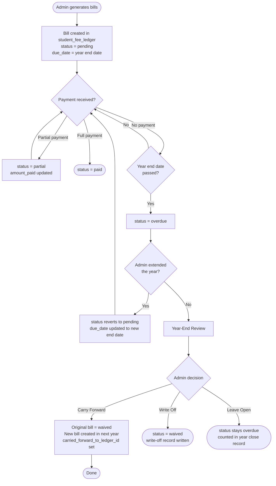
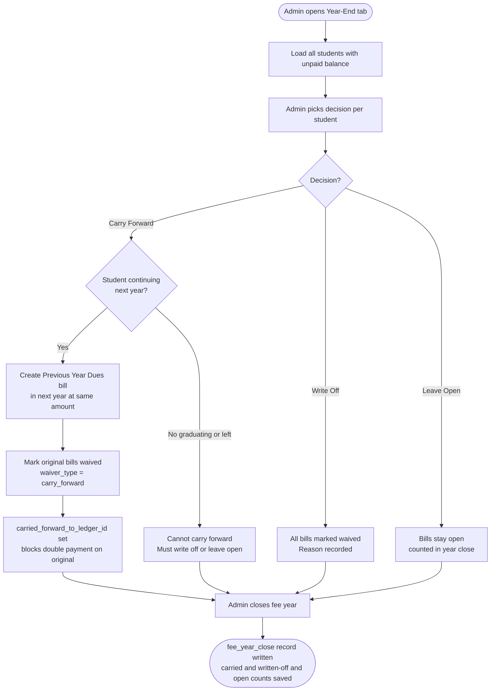
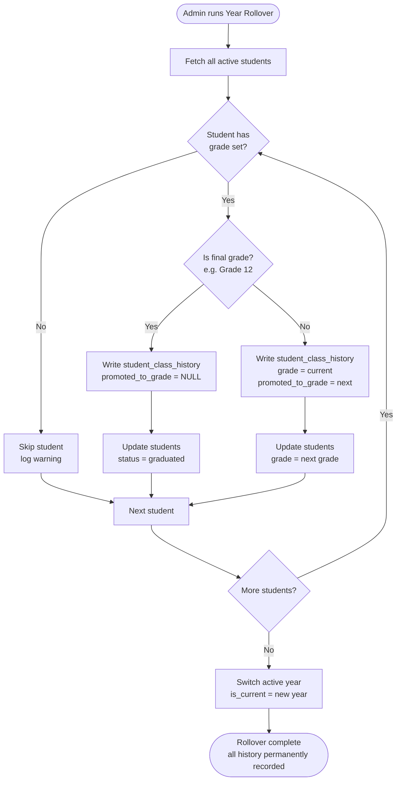
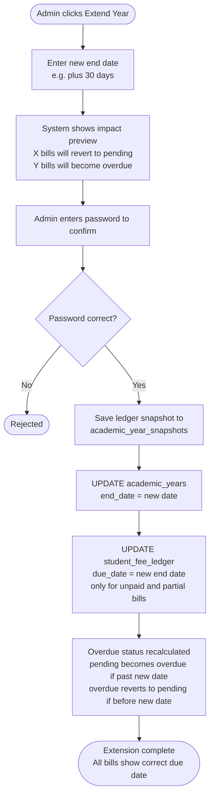
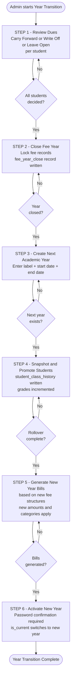
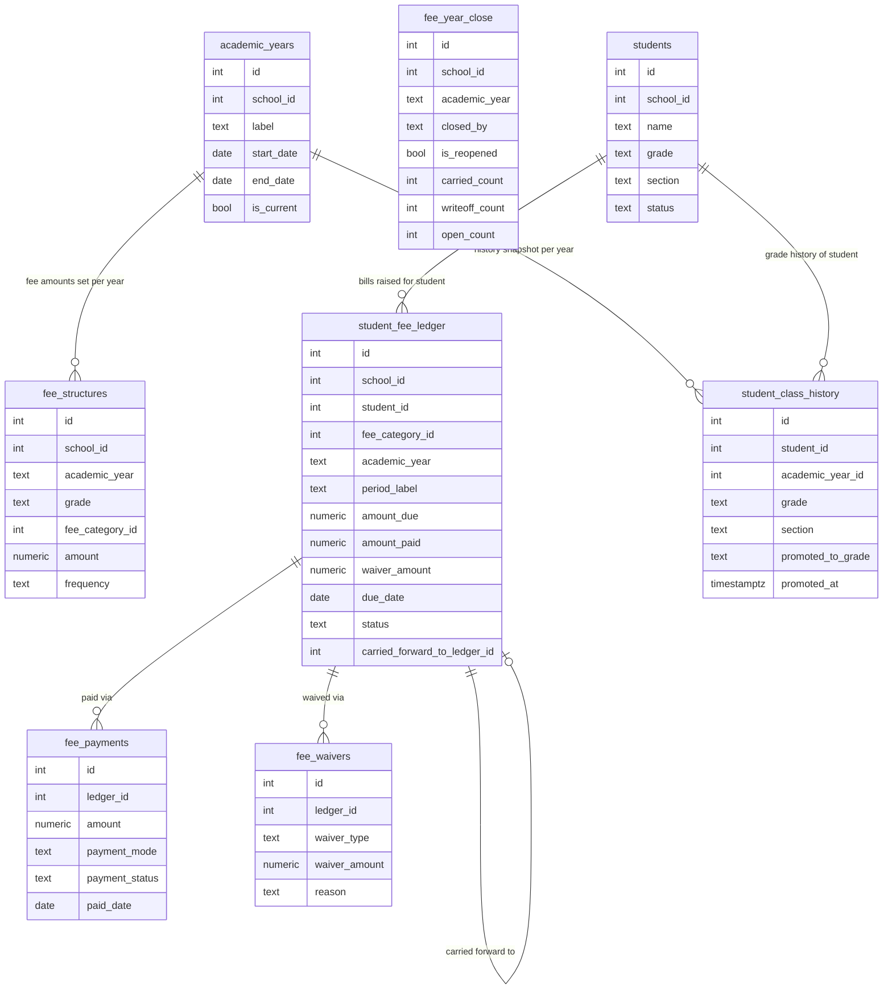

# Academic Year Lifecycle — Flow Diagrams

Paste each diagram block at https://mermaid.live to preview.

---

## Diagram 1 — Complete Year Lifecycle

---

## Diagram 2 — Fee Bill Lifecycle

---

## Diagram 3 — Year-End Dues Resolution

---

## Diagram 4 — Student Grade Promotion

Grade sequence used: `Nursery → LKG → UKG → 1 → 2 → 3 → 4 → 5 → 6 → 7 → 8 → 9 → 10 → 11 → 12 → Graduated`

---

## Diagram 5 — Year Extension and Bill Cascade

---

## Diagram 6 — New Year Transition Wizard

---

## Diagram 7 — Table Relationships

