# WLYL — Investor / Summit Deck (single-file bundle)

> **Instructions for Claude:** the PROMPT below is your task. Everything after it (marked SOURCE) is the ONLY source of truth. Do not ask for other files.

# PART 1 — THE PROMPT

ROLE: You are a world-class pitch strategist and presentation designer — the kind who builds keynote storytelling for global summits, accelerator demo days and investor meetings — and you think like a founder, a product manager and a systems architect.

CONTEXT: I am the founder-developer of WLYL, a multi-portal, multi-tenant school-management SaaS for Indian schools (5 portals: Platform Admin, School Admin, Teacher, Student, Parent; 19 plan-gated features). The attached files are the ONLY source of truth. `PRODUCT-FACTBOOK.md` is the fact-checker; the `features/*.md` dossiers hold the flows, business rules, demo scripts and honest answers. Never invent features, traction, customers, revenue, prices, market numbers, partnerships or dates.

HARD HONESTY RULES (these are true of the code today):
- NOT live: WhatsApp messaging or OTP (email alerts only); a payment gateway or automatic payment confirmation (UPI is a QR + parent self-report + admin verification flow); any AI feature (never call the product "AI-powered"); LEAP integration (only an absentee export); timetable, leaderboard, rewards, homework, doubts, leave requests, learning hub, TV display (removed from `dev`).
- Do NOT claim "every endpoint is authenticated". A scan on 2026-09-21 found some API routes without a login check (plan change, announcements, textbooks, some platform routes). Treat security as "tenant isolation, revocable staff sessions, audit logs; a known set of routes being hardened" unless I tell you the fix has shipped.
- Seeded plan prices (499 / 999 / 1999) have no defined unit or currency — do not show them unless I confirm them.
- Anything I have not answered must appear as a visible yellow "[FILL: …]" placeholder — never guess.

FIRST STEP: ask me, in ONE message, everything you need that only I know: founder name(s) and bio and "why me"; company legal name, city, year, contact; traction (schools, pilots, users, revenue, LOIs, testimonials — only what is true); real pricing (unit, currency); funding ask, instrument, use of funds, runway; market-size numbers with sources; competitors; target segment (board, geography, school size); team and advisors; go-to-market; pilot outcomes with real numbers; whether the API-guard fix has shipped. Wait for my answers. If I say "skip", use a placeholder.

AUDIENCE: top summits, accelerators and investors who see a hundred decks. This must NOT look like a normal PPT: one idea per slide, insight-led headlines (a sentence that makes a claim, not a label like "Problem"), large visuals, minimal text, no bullet walls, a cinematic opening and a memorable close.

DELIVERABLES
1. A real, editable `.pptx` (16:9) if you can create files; otherwise a single-file HTML deck plus a slide-by-slide spec. Main deck 16–18 slides + an appendix of 8–10.
2. For EVERY slide: headline, exact visual (chart / diagram / screenshot / illustration), on-slide text (max 25 words), speaker notes (a spoken script, 20–40 seconds), and the dossier it relies on.
3. Three cut-downs as slide lists: 3-minute lightning pitch (6 slides), 10-minute pitch, 20-minute deep dive.
4. Also: a one-line pitch; 30-second and 2-minute elevator pitches; a founder story (150 words); the 20 hardest investor questions with honest answers grounded in the files; and a short "what I say when asked about AI / WhatsApp / payments / security" script.
5. A live-demo run sheet (8 minutes) using the order in `00-deck-storyline.md`, with a throwaway school and sample names only.

SLIDE SKELETON (adapt, keep the order of the argument)
1. Cinematic hook: "a day in an Indian school" — paper registers, WhatsApp chaos, a parent waiting at the office.
2. The problem, in numbers I supply (qualitative version from dossiers 08, 13, 19 if I skip).
3. Why now / market — my numbers only.
4. The insight: one source of truth; every role sees its own slice, computed by one set of rules.
5. The product on a page: 5 portals, one database, plan-controlled features.
6. Showcase — attendance: first-submit lock, holiday-aware, one formula everywhere, role dashboards (dossier 08).
7. Money — fee ledger, FIFO receipts, waivers, day-close, year-end carry-forward; UPI verify flow; say "no gateway yet" yourself (13, 14, 15).
8. Learning — three-layer syllabus with coverage analytics; governed exam pipeline: enter → class-teacher review → admin release → parent acknowledge (09, 10).
9. Families — parent and student apps, announcements, calendar, QR feedback with issue pipeline (06, 05, 11, 12, 16).
10. Retention engine — Year Rollover with fee gate, Student 360, full history (19, 03).
11. Proof of depth — the stats block from the factbook (tables, API operations, test suites, code size), framed as capital-efficient founder-developer speed and quality.
12. SaaS engine — tiers, per-school overrides, usage analytics, audit log (21, roles doc).
13. Architecture and trust — multi-tenant isolation, revocable sessions, single-source rules, tests, daily backup (architecture doc §5–§10).
14. Traction — mine.
15. Business model and pricing — mine.
16. Go-to-market and competition — mine; differentiators from the files: shared-rule consistency, attendance locking, UPI flow, Year Rollover, Telugu/English parent app.
17. Roadmap, honestly labelled as intentions: WhatsApp, payment gateway, timetable, rebuilt analytics, annual report card, half-day holidays.
18. Team, the ask, vision.
Appendix: architecture diagram, security model, permission matrix, per-feature detail slides, data model by domain, testing and quality, known limits.

DESIGN DIRECTION: modern, confident, premium. Palette: deep indigo/violet with one bright accent; green/amber/red used ONLY to show data status. Large type (Inter or Poppins), generous whitespace, one consistent grid, device mockups of real screens (mark each "[SCREENSHOT: route]"; routes are `/school-admin`, `/teacher`, `/parent`, `/student`, `/platform-admin`, `/api-docs`), simple honest charts, one icon set, no clip-art or stock-photo clichés. Readable from the back of a hall. No decorative accent lines under titles.

BEFORE YOU ANSWER, self-check: every claim traces to an attached file or to my answers; nothing not-built is shown as built; each slide carries exactly one message; the headlines alone, read in order, tell the whole story; every number is either from the factbook stats block or marked "[FILL]".

---

# PART 2 — SOURCE MATERIAL

<!-- SOURCE FILE: docs/product/features/00-deck-storyline.md -->

# Deck Storylines — Investors and Schools

> Use with the dossiers and the factbook. Every slide points to the dossier that holds its facts, flows and demo script. Anything in **[TBD – founder]** must be supplied by you — never invent it.

## 0. Ground rules for both decks

**Say (all true on `dev`)**
- One platform, five portals, one source of truth: admin, teacher, student, parent, platform owner.
- Attendance locked, holiday-aware and identical on every screen.
- Fee ledger with FIFO receipts, waivers, day-close, year-end carry-forward.
- UPI QR fee flow with human verification.
- Governed exam pipeline: enter → class-teacher review → admin release → parent acknowledge.
- Per-school feature switches; Basic / Standard / Premium tiers.
- India-first: IST, 10-digit mobile validation, April–March year, UPI, Telugu/Hindi.
- Individual revocable staff logins, 20-minute idle timeout.
- 26 automated end-to-end suites; API spec guarded by tests.

**Never say**
- "AI-powered" (only a per-school link page to external assistants exists).
- "WhatsApp alerts / OTP" (scaffold only; alerts are email).
- "Integrated payment gateway" or "automatic payment confirmation".
- "LEAP integration" (only an absentee export).
- "Timetable", "leaderboard", "rewards", "homework", "doubts", "leave", "TV display", "learning hub" (removed from `dev`).
- "Every endpoint is authenticated" (see architecture §12.1) until the fix lands.
- Any customer count, revenue, price or market size that is not in your **[TBD – founder]** answers.

## 1. Investor / summit deck (15–18 slides, ~12 minutes + demo)

| # | Slide | Content | Source |
|---|---|---|---|
| 1 | Title | Company, one-line promise | **[TBD – founder]** |
| 2 | The problem | Schools run on registers, Excel, WhatsApp; parents in the dark; fees leak; year-end chaos | dossiers 08, 13, 19 |
| 3 | Why now / why schools | Digitisation of private schools in India; parents expect app access | **[TBD – founder]** market data with sources |
| 4 | The product on a page | Five portals, one platform diagram | architecture §2, roles doc |
| 5 | Daily heartbeat: Attendance | Lock, holidays, dashboards, one formula | [08](08-attendance-tracking.md) |
| 6 | Money: Fees + UPI + Expenses | Ledger, day-close, carry-forward, UPI verify; honest "no gateway yet" | [13](13-fee-management.md), [14](14-online-fee-payments-upi.md), [15](15-expense-tracking.md) |
| 7 | Learning: Syllabus + Exams | Three-layer syllabus, weekly trend, governed results | [09](09-syllabus-customizer.md), [10](10-exam-schedule-and-marks.md) |
| 8 | Family engagement | Parent and student portals; acknowledgements; feedback QR | [06](06-parent-portal.md), [05](05-student-portal.md), [12](12-feedback-management.md) |
| 9 | Retention engine | Year Rollover, Student 360, history — why a school never leaves | [19](19-year-rollover.md), [03](03-students-list-and-onboarding.md) |
| 10 | SaaS engine | Tiers, per-school overrides, usage analytics, audit | [21](21-platform-admin-portal.md), roles doc §4 |
| 11 | Architecture & trust | Multi-tenant, sessions, single-source rules, tests | architecture §5–§10 |
| 12 | Live demo | Order in §3 below | — |
| 13 | Traction | Schools, pilots, users, LOIs | **[TBD – founder]** |
| 14 | Business model & pricing | Seeded tiers exist (499 / 999 / 1999, unit undefined) | **[TBD – founder]** confirm before showing |
| 15 | Go-to-market | | **[TBD – founder]** |
| 16 | Competition | | **[TBD – founder]** |
| 17 | Roadmap (honest) | WhatsApp, payment gateway, timetable, analytics, half-day holidays | factbook §8 |
| 18 | Team & the ask | | **[TBD – founder]** |

Investors' technical follow-ups (have answers ready): tenancy model, session model, what is not built (gateway, WhatsApp, encryption), test coverage, and the API-guard fix status.

## 2. School (client) deck (12–14 slides, ~10 minutes + demo)

Tone: benefits in the principal's words, no jargon, every slide ends with a **"what you'll notice on Monday"**.

| # | Slide | Content | Source |
|---|---|---|---|
| 1 | Title | "Your school, on one page" | — |
| 2 | Today's reality | Registers, calls, lost dues | dossiers 08, 13 |
| 3 | One platform, five doors | Admin, teacher, student, parent (and us) | roles doc |
| 4 | Morning in 2 minutes | Overview dashboard | [01](01-overview-dashboard.md) |
| 5 | Attendance that everyone trusts | Two taps, lock, holiday-aware, parent email | [08](08-attendance-tracking.md) |
| 6 | Fees without fear | Receipts, part-payments, waivers, day-close, UPI | [13](13-fee-management.md), [14](14-online-fee-payments-upi.md) |
| 7 | Exams and results, done right | Enter → review → release → acknowledge | [10](10-exam-schedule-and-marks.md) |
| 8 | Syllabus you can see | Coverage by class, nudge, parents see progress | [09](09-syllabus-customizer.md) |
| 9 | Parents in the loop | Parent app, announcements, calendar | [06](06-parent-portal.md), [11](11-announcement-board.md), [16](16-academic-calendar.md) |
| 10 | Hear every voice | QR feedback with issue tracking | [12](12-feedback-management.md) |
| 11 | Admissions to new year | Bulk upload, Student 360, Year Rollover | [03](03-students-list-and-onboarding.md), [19](19-year-rollover.md) |
| 12 | Safe and controlled | Individual logins, idle timeout, audit | [18](18-school-settings.md) |
| 13 | Getting started | Onboarding steps (roles doc §5) | roles doc |
| 14 | Plans | **[TBD – founder]** | — |

## 3. Demo order (works for both audiences; ~8 minutes)

1. **Platform Admin** creates a school (30 s) → [21](21-platform-admin-portal.md)
2. **Admin** uploads staff and students from a template; show one parent linked to two siblings (60 s) → [02](02-staff-directory-and-onboarding.md), [03](03-students-list-and-onboarding.md)
3. **Teacher** marks attendance; a second teacher hits the lock; add a holiday (90 s) → [08](08-attendance-tracking.md), [16](16-academic-calendar.md)
4. **Admin Overview** updates; open **Student 360** (60 s) → [01](01-overview-dashboard.md), [03](03-students-list-and-onboarding.md)
5. **Fees:** take a ₹15,000 payment across two terms; parent reports a UPI payment; admin approves (120 s) → [13](13-fee-management.md), [14](14-online-fee-payments-upi.md)
6. **Exam:** enter marks, review, release; parent acknowledges (90 s) → [10](10-exam-schedule-and-marks.md)
7. **Feedback QR** on a phone → issue appears (45 s) → [12](12-feedback-management.md)
8. **Year Rollover** blocked popup, then success (45 s) → [19](19-year-rollover.md)

**Demo hygiene:** use a throwaway school and sample names (no real school names without permission). Until the API-guard fix is deployed, do not demo write actions against shared production data.

## 4. Questions you will be asked — with honest answers

| Question | Answer (all true today) | Detail |
|---|---|---|
| Do you have a payment gateway? | Not yet — UPI QR with admin verification; gateway is roadmap | [14](14-online-fee-payments-upi.md) |
| WhatsApp? | Email alerts today; WhatsApp needs Meta setup, roadmap | [06](06-parent-portal.md) |
| Is it AI? | No. We do not claim it | [05](05-student-portal.md) |
| LEAP? | No public API; we export the absentee list | [08](08-attendance-tracking.md) |
| Timetable? | Built on a branch, awaiting sign-off | [04](04-class-management.md) |
| Data safety? | Tenant-scoped, revocable sessions, daily R2 backup; a known set of unguarded routes is being fixed | architecture §5, §12 |
| Can each school have its own domain/branding? | Logo and receipt header yes; separate domain no | [18](18-school-settings.md) |
| What if a school leaves? | Data-export request path exists (email to support) | [18](18-school-settings.md) |

## 5. Facts you must supply (ask Claude to leave these highlighted)

Founder bio and why you · legal name, city, year, contact · traction (schools, pilots, users, LOIs, testimonials) · real pricing (unit, currency) · funding ask and use of funds · market size with sources · competitors · target segment (board, geography, size) · team and advisors · go-to-market · pilot outcomes with real numbers · demo data · languages to stress.

---

<!-- SOURCE FILE: docs/product/PRODUCT-FACTBOOK.md -->

# WLYL School Platform — Product Factbook

> **Source of truth for documentation, investor decks and school demos.** Snapshot = the `dev` branch.
> Blocks marked `AUTO` are regenerated by `node scripts/product-docs.mjs` — never edit them by hand.
> Everything else is edited by people when a feature ships (see `.claude/skills/update-product-docs/SKILL.md`).
> Status vocabulary: BUILT (works end to end on dev) · PARTIAL · PLANNED · REMOVED (preserved on a branch, not in the product).

## 0. Items only the founder can supply — `[FOUNDER TO FILL]`

Claude must ask for these (in ONE message) before producing anything that needs them. Never guess them.

| # | Item | Needed by |
|---|---|---|
| F1 | Founder name(s), photo, 3-line bio, why you (domain insight — why schools?), links | Investor deck, school deck |
| F2 | Company legal name, city, year founded, website, contact email/phone | All |
| F3 | Traction: schools live / pilots / students / teachers / parents on the platform, MRR/ARR, waitlist, LOIs, testimonials, named reference schools (only what is true) | Investor deck, school deck |
| F4 | Pricing you will actually quote (currency, per school vs per student, monthly vs yearly, setup fee). The code seeds plans "Basic 499 / Standard 999 / Premium 1999 per month" — confirm the unit and whether these are real | Both decks |
| F5 | Funding: amount asked, use of funds by %, runway, instrument (equity / SAFE / grant), previous funding | Investor deck |
| F6 | Market size numbers you trust, with sources (number of private schools in India / AP / Telangana, fee per student, etc.) | Investor deck |
| F7 | Competitors you consider relevant (names) and your honest view of them | Investor deck |
| F8 | Target segment: which schools first (budget private schools? CBSE/State board? student count range? geography — Andhra Pradesh / Telangana?) | Both |
| F9 | Team: co-founders, hires, advisors, mentors, institutions/programs you belong to | Investor deck |
| F10 | Go-to-market you are actually doing (direct sales, channel partners, school chains, government tie-ups) | Investor deck |
| F11 | Any pilot outcomes with real numbers (time saved, fee collection improvement, attendance improvement) | Both |
| F12 | Demo school data you will use on stage (real school names must not appear without permission) | School deck |
| F13 | Languages/regions you want to stress (Telugu, Hindi, English) | Both |

---

---

## 1. One-paragraph description

WLYL School is a multi-portal school-management platform for Indian schools: one app with separate portals for the school admin, teachers, students, parents and the platform owner. It covers student and staff records, class management, attendance with role-based dashboards, syllabus, exams and marks, fees (including a manual UPI-QR flow with admin verification), expenses, announcements, an academic calendar, a digital library, exports and year-end rollover. Schools get only the features their plan (and any per-school override) enables.

---

## 2. Who uses it

| Role | Portal | Main things they do |
|---|---|---|
| Platform admin | `/platform-admin` (admin subdomain only) | Create schools, set plans, switch features per plan / per school, billing and monitoring |
| School admin / staff | `/school-admin` | Run the school: students, staff, classes, attendance dashboards, fees, expenses, exams, calendar, announcements, settings, year rollover |
| Teacher | `/teacher` | Mark attendance, see their class dashboard, syllabus, marks entry |
| Student | `/student` | Own attendance, marks, syllabus, calendar, library, class circle |
| Parent | `/parent` | Child's attendance, marks, fees (incl. UPI self-report), announcements, calendar |

---

## 3. Feature catalog (matches Platform Admin → feature configuration)

<!-- AUTO:catalog:start (generated by scripts/product-docs.mjs — do not edit by hand) -->
Generated from `lib/features.ts` + code evidence. **A ⚠ row must not be presented as a working feature.**

| Feature (Platform Admin → features) | Category | Portals | Doc | Code evidence |
|---|---|---|---|---|
| **Overview Dashboard** (`overview`) | Core | school-admin | [overview.md](overview.md) | ✅ all routes exist |
| **Staff Directory & Onboarding** (`staff`) | Core | school-admin | [staff.md](staff.md) | ✅ all routes exist |
| **Students List & Onboarding** (`students`) | Core | school-admin | [students.md](students.md) | ✅ all routes exist |
| **Class Management** (`class-management`) | Core | school-admin | [class-management.md](class-management.md) | ✅ all routes exist |
| **Student Portal Access** (`student-portal`) | Core | school-admin | [student-portal.md](student-portal.md) | ✅ all routes exist |
| **Parent Portal Access** (`parent-portal`) | Core | school-admin | [parent-portal.md](parent-portal.md) | ✅ all routes exist |
| **WLYL Digital Library** (`library`) | Core | school-admin, student, parent, teacher | [library.md](library.md) | ✅ all routes exist |
| **Attendance Tracking** (`attendance`) | Scheduling | school-admin, student, parent, teacher | [attendance.md](attendance.md) | ✅ all routes exist |
| **Syllabus Customizer** (`curriculum`) | Scheduling | school-admin, student, parent, teacher | [curriculum.md](curriculum.md) | ✅ all routes exist |
| **Exam Schedule & Marks** (`exam-marks`) | Scheduling | school-admin, student, parent, teacher | [exam-marks.md](exam-marks.md) | ✅ all routes exist |
| **Announcement Board** (`announcements`) | Communication | school-admin | [announcements.md](announcements.md) | ✅ all routes exist |
| **Feedback Management** (`feedback-management`) | Communication | school-admin | [feedback-management.md](feedback-management.md) | ✅ all routes exist |
| **Fee Management** (`fee-management`) | Finance | school-admin, parent | [fee-management.md](fee-management.md) | ✅ all routes exist |
| **Online Fee Payments (UPI)** (`online-payments`) | Finance | school-admin, parent | [online-payments.md](online-payments.md) | ✅ all routes exist |
| **Expense Tracking** (`expenses`) | Finance | school-admin | [expenses.md](expenses.md) | ✅ all routes exist |
| **Academic Calendar** (`calendar`) | Administration | school-admin, teacher, student, parent | [calendar.md](calendar.md) | ✅ all routes exist |
| **Export & Reports** (`export`) | Administration | school-admin | [export.md](export.md) | ✅ all routes exist |
| **School Settings** (`settings`) | Administration | school-admin | [settings.md](settings.md) | ✅ all routes exist |
| **Year Rollover** (`year-rollover`) | Administration | school-admin | [year-rollover.md](year-rollover.md) | ✅ all routes exist |

| Part of the product (not a feature switch) | Doc | Code evidence |
|---|---|---|
| platform-admin | [platform-admin.md](platform-admin.md) | ✅ all routes exist |
| feedback-public-form | [feedback-management.md](feedback-management.md) | ✅ all routes exist |
| auth-and-sessions | [auth.md](auth.md) | ✅ all routes exist |
<!-- AUTO:catalog:end -->

Per-feature summaries live in `wiki/features/` (one per catalog row; index `wiki/features/CATALOG.md`). **Deep, code-verified dossiers** (product brief, end-to-end flow, business rules, developer reference, pitch kit) for every feature, the Teacher and Platform Admin portals, the architecture and the roles/plans are in `docs/product/features/` — start at its `README.md`.

**Watchline (API monitoring)** is not a plan feature: it is a per-school switch only.
**Per-school AI access** is a per-school switch only — the product does not have an AI headline feature.

**Removed from dev (preserved on branches — do not present as live):** full timetable workflow (#175, draft PR #177), Learning Hub & Daily Knowledge, rewards marketplace, teacher lesson planner, weekly test (#164–#168), Year-in-Review, Parent Engagement, Class Analytics + performance tab (#181–#183), Daily Briefing, Student–Teacher Analysis, Notification Center page (#188–#190). Deleted for good: TV display kiosk, admin Student Leaderboard. Homework/tasks, doubts, leave requests and emergency cover were removed earlier.

---

## 4. The attendance system (the most developed module — use as the showcase)

**Rules (one shared module, used by every screen):**
- Statuses: Present, Absent, Late — **late counts as attended**.
- Two sessions a day (Morning, Afternoon); each marked session counts equally.
- Attendance % = attended ÷ marked sessions (whole number); "—" when nothing is marked.
- Bands: **90%+ good · 75–89% needs care · below 75% low.** A dashboard needs 4 marked sessions before it labels anyone (else "too early to tell").
- Holidays and weekly-off days can't be marked and are excluded from every percentage; an unmarked working day is a gap, not an absence; joined-mid-year students count only from joining.
- "Today" is India time (IST).

**Who marks:** any teacher, any class. First submit locks that class+date+session (database-enforced, safe even if two teachers tap Submit at the same instant). Marking window: teachers = today and 2 days back; admin = any past day; nobody = the future. Corrections: the marking teacher the same day; the admin any time; other teachers use "Report a mistake" to the admin.

**Notifications:** parents of a student newly marked absent today are emailed (email only; WhatsApp alerts NOT built).

**Dashboards by role (BUILT):**
- *School admin Overview:* period switch (7 days / month / school year), school %, students below 75%, today strip (classes marked, who hasn't), mistake-report alert, trend chart, class ranking, needs-attention list, student search → class → student.
- *Class teacher "My class":* class %, need-attention count, absent today, trend, weekday pattern ("Mondays are the problem"), student list with filters/search/sort.
- *Parent / student:* own calendar, month + year %, streak, trend, upcoming holidays.
- *Student 360 profile* pulls attendance into the wider picture.

**Also:** offline marking queue with clear "not saved because…" messages; register CSV and daily absentee list (to key into the government LEAP app manually — **no direct LEAP integration exists**); weekly-off configuration.

Full reference: `DOCS/ATTENDANCE.md`.

---

---

## 5. Plans and pricing (as coded)

<!-- AUTO:plans:start (generated by scripts/product-docs.mjs — do not edit by hand) -->
| Plan | Seeded monthly price (unit/currency undefined in code) | Included WhatsApp msgs | Overage rate | Online payments flag | WhatsApp flag |
|---|---|---|---|---|---|
| Basic | 499 | 0 | 0 | false | false |
| Standard | 999 | 1000 | 0.20 | true | true |
| Premium | 1999 | 5000 | 0.20 | true | true |
<!-- AUTO:plans:end -->

Seeded numbers only — unit and currency are not defined in code. **Do not present as final pricing until the founder confirms (F4).** Overridable per school: student portal, parent portal, Watchline, online payments.

---

## 6. Technology and quality (safe to quote)

<!-- AUTO:stats:start (generated by scripts/product-docs.mjs — do not edit by hand) -->
Generated 2026-09-21 from commit `29f0e6a`.

- TypeScript files: **519** · lines: **96,412**
- Database tables: **130**
- API route files: **234** · operations (GET/POST/PUT/PATCH/DELETE): **332**
- End-to-end test suites: **26**
- Platform-Admin features: **19** (19 with every backend route present, 0 with missing routes)
<!-- AUTO:stats:end -->

**Stack:** Next.js (App Router) + React, TypeScript strict, Tailwind + shadcn/ui, Zustand, Zod, PostgreSQL (Supabase as database only), custom per-role JWT cookies, Resend email, Vercel hosting, Playwright end-to-end tests, pnpm.

**Practices:** issue → branch → PR → review checklist; living wiki with per-feature docs; OpenAPI spec at `/api-docs` with a test that fails on an undocumented route; a docs-coverage test that fails when a feature has no doc; end-to-end workflow tests across portals.

**Security (verifiable):** role-separated sessions; tenant isolation on the school-scoped routes; server-revocable staff sessions (20 min idle / 12 h max); hashed passwords; one-time invite links; rate-limited public feedback; audit logs. Field-level encryption for gateway secrets is **not built** (nothing needs it yet). **Do not claim "every endpoint is authenticated"**: a scan found several state-changing routes without a session check (limit 9 below).

**India-specific:** IST everywhere; 10-digit mobile validation; academic year April–March default; UPI QR fee flow.

---

## 7. Honest limits — do NOT claim any of these

1. **WhatsApp messaging is not live** (logging scaffold only; parent WhatsApp OTP is draft PR #155 pending Meta setup). Absence alerts go by email.
2. **No payment gateway.** Online fees = school UPI QR → parent self-reports → admin verifies; plus cash/cheque/DD recording.
3. **No AI headline.** Do not call the product "AI-powered". The only AI-related item is a per-school access switch; the student "AI Hub" only links to external assistants.
4. **No LEAP (AP government app) integration** — only an absentee export staff key in manually.
5. **No timetable, leaderboard, TV display, marketplace, learning hub, lesson planner, weekly test** in the product today (see Removed list).
6. **No per-school dedicated URL / white-label domain.** All schools use the same site.
7. No **annual multi-exam** report card. (A per-exam printable report card, one page per student, exists in Export Center.)
8. Traction, customers, revenue and market numbers are unknown to the codebase — only the founder can supply them.
9. **Some API routes have no authentication (INTERNAL — fix before a public pilot or investor technical due diligence):** plan/subscription update (`PUT /api/schools/{id}/subscription`), announcement create/edit/delete, textbook upload/delete, and several `/api/platform/*` routes. Tracked in `docs/KNOWN_ISSUES.md` (#131); details in `docs/product/features/00-platform-architecture.md` §12.1. Until fixed, do not demo write actions on shared data and do not state that all routes are protected.

---

## 8. Roadmap (intentions, not commitments)

Near term: WhatsApp integration (Meta) + WhatsApp OTP for parents · timetable workflow (built, awaiting sign-off) · rebuilt analytics (Year-in-Review, Parent Engagement, Class Analytics) · report cards UI.
Later: payment gateway · half-day / class-specific holidays · school health score · AI features.

---

## 9. Key screens to screenshot

`/school-admin` (Overview, Attendance, Class Management → student 360, Fee Management) · `/teacher` (My class) · `/parent` · `/student` · `/platform-admin` (feature configuration) · `/api-docs`.

---

<!-- SOURCE FILE: docs/product/features/00-roles-access-and-plans.md -->

# Roles, Access & Plans

> **Audience:** product, sales, school onboarding, investors.
> **Snapshot:** `dev`, 2026-09-21.

## 1. The five roles

| Role | Portal & route | Signs in with | Owns |
|---|---|---|---|
| **Platform Admin** (WLYL team) | `/platform-admin`, `admin.` subdomain only | email + password | Creating schools, subscriptions, plan/feature switches, audit log, master syllabus and library, usage & monitoring |
| **School Admin** (owner, principal, vice principal, more admins) | `/school-admin` | own email + password | Running the school |
| **Teacher** | `/teacher` | employee id + password | Marking attendance, class dashboard, syllabus coverage, marks entry, library |
| **Student** | `/student` | system student id + password | Own attendance, marks, syllabus, calendar, library, class circle |
| **Parent** | `/parent` | email or phone + password | Own children: attendance, results, fees, announcements, calendar, syllabus, library |
| *Visitor* (no login) | `/feedback/<code>` | scans a QR poster | Submitting feedback only |

Personas, goals and pains (for slides):

| Persona | Goal | Pain today | What WLYL gives |
|---|---|---|---|
| Principal / owner | Know the school's health in 10 seconds | Registers, Excel, calls to teachers | Overview dashboard, attendance & fee visibility, exports |
| Accountant / admin staff | Collect and reconcile fees without errors | Paper receipts, dues lost between years | Ledger, FIFO receipts, waivers, day-close, year-end carry-forward |
| Class teacher | Mark attendance in seconds, know who needs care | Repeated paperwork | Two-tap marking, class dashboard, weekday patterns |
| Parent | Know how my child is doing, pay simply | Finding out late | Own calendar, results, fee ledger, UPI report |
| Student | See own progress | Unclear standing | Attendance ring, marks, syllabus |

## 2. Permission matrix (who can see / do what)

Legend: **E** edit/create · **V** view · **M** mark/enter · **R** request/report · **—** none.

| Capability | Platform Admin | School Admin | Teacher | Student | Parent |
|---|:-:|:-:|:-:|:-:|:-:|
| Create schools, plans, feature switches | E | — | — | — | — |
| School profile, staff accounts, academic years | — | E | — | — | — |
| Add / edit teachers | — | E | — | — | — |
| Add / edit / promote students | — | E | V (own classes) | V (self) | V (own child) |
| Classes, subjects, class teacher | — | E | V | — | — |
| Attendance — mark | — | E (any past day) | M (today + 2 days, any class) | — | — |
| Attendance — view | — | V (whole school) | V (class dashboard for class teacher) | V (self) | V (own child) |
| Attendance — report a mistake | — | resolves | R | — | — |
| Academic calendar | — | E | V | V | V |
| Syllabus — master catalog | E | — | — | — | — |
| Syllabus — customise school copy | — | E | — | — | — |
| Syllabus — mark covered | — | V | M | V | V |
| Exams — create, release | — | E | — | — | — |
| Exams — enter marks, review | — | V | M (own subjects / class teacher) | — | — |
| Exam results | — | V | V | V (released only) | V (released only) + acknowledge |
| Fees — set up, collect, waive, close | — | E | — | — | — |
| Fees — view own ledger | — | V | — | — | V |
| UPI payment | set-up by admin | verify | — | — | R (self-report) |
| Expenses | — | E | — | — | — |
| Announcements | — | E | V | V | V |
| Feedback — manage | — | E | — | — | — |
| Feedback — submit | — | anyone with the QR | | | |
| Exports | — | E | — | — | — |
| Year Rollover | — | E | — | — | — |
| Digital Library | E (master) | E (textbooks) | E (textbooks) / V | V | V |

## 3. Which portals does each feature reach?

From `lib/features.ts` (source of truth):

| Feature (key) | Category | School Admin | Teacher | Student | Parent |
|---|---|:-:|:-:|:-:|:-:|
| Overview Dashboard (`overview`) | Core | ✔ | | | |
| Staff Directory & Onboarding (`staff`) | Core | ✔ | | | |
| Students List & Onboarding (`students`) | Core | ✔ | | | |
| Class Management (`class-management`) | Core | ✔ | | | |
| Student Portal Access (`student-portal`) | Core | ✔ (switch) | | ✔ (the portal) | |
| Parent Portal Access (`parent-portal`) | Core | ✔ (switch) | | | ✔ (the portal) |
| WLYL Digital Library (`library`) | Core | ✔ | ✔ | ✔ | ✔ |
| Attendance Tracking (`attendance`) | Scheduling | ✔ | ✔ | ✔ | ✔ |
| Syllabus Customizer (`curriculum`) | Scheduling | ✔ | ✔ | ✔ | ✔ |
| Exam Schedule & Marks (`exam-marks`) | Scheduling | ✔ | ✔ | ✔ | ✔ |
| Announcement Board (`announcements`) | Communication | ✔ | | | |
| Feedback Management (`feedback-management`) | Communication | ✔ | | | |
| Fee Management (`fee-management`) | Finance | ✔ | | | ✔ |
| Online Fee Payments — UPI (`online-payments`) | Finance | ✔ | | | ✔ |
| Expense Tracking (`expenses`) | Finance | ✔ | | | |
| Academic Calendar (`calendar`) | Administration | ✔ | ✔ | ✔ | ✔ |
| Export & Reports (`export`) | Administration | ✔ | | | |
| School Settings (`settings`) | Administration | ✔ | | | |
| Year Rollover (`year-rollover`) | Administration | ✔ | | | |

## 4. Plans (as seeded in code — **not final pricing**)

| Plan | Seeded monthly price | Included WhatsApp msgs | Overage | Online payments flag | WhatsApp flag |
|---|---|---|---|---|---|
| Basic | 499 | 0 | 0 | false | false |
| Standard | 999 | 1000 | 0.20 | true | true |
| Premium | 1999 | 5000 | 0.20 | true | true |

**Read before quoting anything:** the unit (per school? per student? currency?) is not defined in code; the WhatsApp columns describe a **scaffold, not a working channel**. **`[TBD – founder]`** must confirm real pricing before it appears on any slide. `plan_pricing` also carries a `staff_limit`, enforced when staff accounts are created.

Per-school overrides exist for: `student-portal`, `parent-portal`, `online-payments`, and Watchline (`api-monitoring`, per school only).

## 5. How a school goes live (platform view)

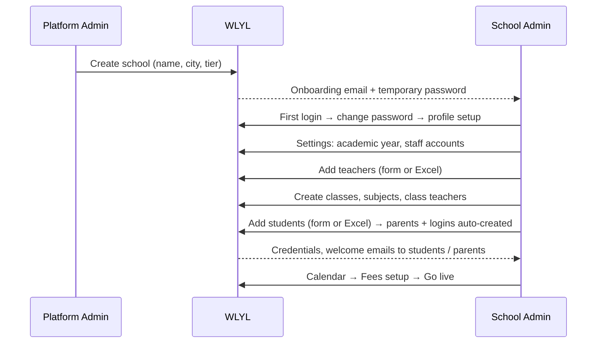

Every tier/feature change by the Platform Admin is written to the **immutable audit log** (actor, entity, before/after).

---

<!-- SOURCE FILE: docs/product/features/03-students-list-and-onboarding.md -->

# 03 · Students List & Onboarding (with Student 360)

| | |
|---|---|
| **Feature key** | `students` |
| **Category** | Core |
| **Portals** | School Admin |
| **Status** | **BUILT** |
| **Primary users** | School admin, front-office staff |
| **Snapshot** | `dev` @ `29f0e6a`, 2026-09-21 |

---

## 1. Product brief

**The problem.** Admissions arrive in a rush each April. Data is typed into Excel, parents are duplicated across siblings, and nobody has a single place to see "everything about this child" before a parent meeting.

**The solution.** One place to add students (singly or by spreadsheet), automatically link **parents** and create **logins**, catch **duplicates**, and open a **Student 360 profile** with attendance, marks, fees and talking points.

| Capability | Detail |
|---|---|
| Add one / bulk | Form or CSV/Excel template; bulk runs through duplicate detection first |
| System id | `wlyl-stu-<school>-<5 digits>` — the student's login id |
| Class roll number | `school_roll_number`, **unique per grade + section** (separate from the system id) |
| Parents | Found by email, then phone **within the school**, else created and linked; siblings share one parent |
| Credentials | Student and parent logins issued; welcome / credential emails sent; **reset** on demand |
| Duplicates | Detected before saving (roll number, parent phone, name pairs); a cleanup tool with an audit log |
| Lifecycle | Edit, promote (via Year Rollover), deactivate; graduates flagged `graduated` |
| **Student 360** | Talking points for the parent meeting, contacts, attendance, marks, fees, activity — with a **year switcher** for past years |
| Portal backfill | Create missing portal accounts for students added before a portal was enabled |

**Value.** Admissions day becomes a file upload. The principal walks into a parent meeting with the child's whole picture in one page.

**Where it stops.** No admission-enquiry pipeline, no document/certificate storage, no annual multi-exam report card (a per-exam printable report card exists in Export Center).

## 2. End-to-end flow

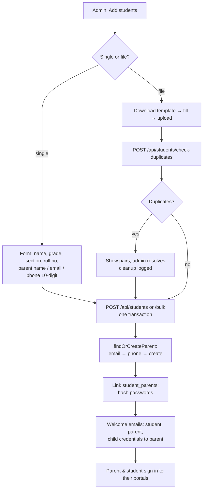

**Step by step (admin)**
1. **Students → Add** (or *Bulk upload*). Grade, section and a valid **10-digit Indian mobile** for the parent are required.
2. For a file, the system checks every row against existing students and within the file, and shows the conflicts.
3. On confirm the student row, parent row and link are created **in one transaction**. If the parent-portal feature is off for this school, existing parents are still linked but **no new parent account is created**.
4. Emails go out fire-and-forget: student welcome, parent welcome and the child's credentials to the parent.
5. Later, **click a name** anywhere (Students, Class Management) to open **Student 360**.
6. **Reset credentials** re-issues a password if a family loses it.

**Student 360 (`GET /api/students/{id}/profile`)** — read-only and school-scoped: parent-meeting talking points, contacts, attendance summary, marks, fees, recent activity, and a switcher to previous academic years (from `student_class_history` / snapshots).

## 3. Business rules & edge cases

| Rule | Detail |
|---|---|
| Parent phone | Must be a valid 10-digit Indian mobile; unique per school (`idx_parents_school_phone_unique`) |
| Roll number | Unique within `(school_id, grade, section)`; may be blank after a promotion and reassigned |
| Siblings | A batch cache guarantees two siblings in one upload resolve to **one** parent row, not a race of duplicates |
| Name checks | `nameValidation` rejects obviously bad names |
| Duplicates | Pair detection by roll number and phone; cleanup writes `student_cleanup_log`; nothing is deleted silently |
| Tenant | Every query scoped to the admin's school; profile endpoint is read-only |
| Feature switches | Student/parent account creation follows `student-portal` / `parent-portal` |

## 4. Technical reference (developers)

**Screens**
- `StudentOnboarding.tsx` (add + bulk), `StudentsManagement.tsx` (list, edit, promote, reset), `StudentProfile.tsx` (Student 360) — `app/school-admin/components/` (~2,000 lines total).

**API**

| Method | Route | Purpose |
|---|---|---|
| GET/POST | `/api/students` | List; create one |
| POST | `/api/students/bulk` | Bulk create (transactional, uses batch cache) |
| POST | `/api/students/check-duplicates` | Pre-save conflict check |
| GET | `/api/students/duplicates` | Existing duplicate pairs |
| POST | `/api/students/duplicates/cleanup` | Resolve duplicates (audited) |
| GET | `/api/students/template` | Excel template (ExcelJS) |
| GET/PUT/DELETE | `/api/students/{id}` | Read / update / deactivate |
| GET | `/api/students/{id}/profile` | Student 360 payload |
| POST | `/api/students/{id}/reset-credentials` | Re-issue login |
| GET/POST | `/api/school-admin/students/backfill-portal` | Create missing portal accounts |
| GET/POST/PUT | `/api/attendance` | Used by the profile for attendance |

**Tables:** `students`, `parents`, `student_parents`, `classes`, `student_fee_ledger`, `fee_payments`, `fee_waivers`, `exam_records`, `attendance`, `attendance_sessions`, `student_cleanup_log`, `platform_audit_log`.

**Libraries:** `lib/studentOnboarding.ts` (`generateStudentId`, `findOrCreateParent`, credential emails), `lib/studentProfile.ts`, `lib/nameValidation.ts`, `lib/parseCSV.ts`, `lib/academicYear.ts`, `lib/attendance*`, `lib/email.ts`.

**Validation:** Zod on the create/bulk bodies. **Auth:** `requireSchoolAdmin` / `requireFeeAccess`; family portals read through `student_parents`.

**Design notes**
- `roll_number` (system id, `VARCHAR`) vs `school_roll_number` (`INTEGER`, class roll) are deliberately separate.
- `findOrCreateParent(..., createIfMissing)` keeps portal gating consistent with the feature flags.

**Tests:** `workflow-student-onboarding.spec.ts`, `workflow-student-csv-import.spec.ts`, `workflow-student-profile.spec.ts`, `auth-student.spec.ts`, `auth-parent.spec.ts`.

## 5. Pitch kit

**Investor one-liner** — "Admissions become a spreadsheet upload: students, parents and logins created and linked automatically, duplicates caught."

**School one-liner** — "Upload your admission list and every child and parent gets their own login. Open any child and see everything — in one page."

**Slide bullets**
- Bulk upload with duplicate detection and sibling-aware parent linking.
- Student + parent logins issued and emailed automatically.
- **Student 360:** attendance, marks, fees and talking points for the parent meeting.
- Full history across academic years.

**60-second demo:** upload 20 students (two siblings) → show one parent for both → open Student 360 → flip the year switcher.

**Objection → honest answer**
- *"Can we import from our old software?"* — Any CSV/Excel that matches the template; there is no direct integration with other school software.

## 6. Limits & roadmap

- No enquiry/admission pipeline, no document uploads, no annual multi-exam report card.
- Credentials go by **email** only.
- Roll numbers cleared on promotion when they collide need re-assigning by the school (the rollover screen reports how many).

---

<!-- SOURCE FILE: docs/product/features/06-parent-portal.md -->

# 06 · Parent Portal Access

| | |
|---|---|
| **Feature key** | `parent-portal` (switch in School Admin; portal at `/parent`) |
| **Category** | Core |
| **Portals** | Parent (delivery), School Admin (switch) |
| **Status** | **BUILT** |
| **Primary users** | Parents / guardians |
| **Overridable per school** | **Yes** |
| **Snapshot** | `dev` @ `29f0e6a`, 2026-09-21 |

---

## 1. Product brief

**The problem.** Parents find out about absences, results and dues late — usually by phone, or when a child is already behind.

**The solution.** A parent portal at `/parent` showing **their own children only**: attendance, results, fees, exams, announcements, calendar, syllabus and the library — in **English or Telugu**.

| Area | What the parent gets |
|---|---|
| Child summary | Attendance %, upcoming exams, results waiting acknowledgement, fee status — per child |
| Attendance | Colour calendar, month/year %, days absent, **streak of full days**, six-month trend, upcoming holidays |
| Fees | Ledger, waivers, payment history and receipts; **report a UPI payment** (see [14](14-online-fee-payments-upi.md)) |
| Exams & results | Exam calendar; released results with grades; **Acknowledge** button |
| Announcements / Calendar | Audience-filtered notices; read-only school calendar |
| Syllabus / Library | What has been covered; class materials |
| Multiple children | Switch between siblings under one login |
| Language | English and Telugu (`app/parent/translations.ts`) |

**Value.** Fewer phone calls to the school office, earlier awareness of absence and dues, and an acknowledged-results trail for the school.

**Where it stops.** Read-mostly: parents cannot change data except acknowledging results and reporting a payment. **WhatsApp OTP sign-in is *not* live** (draft PR #155 pending Meta setup) — forgot-password goes by **email**. No chat, no leave requests.

## 2. End-to-end flow

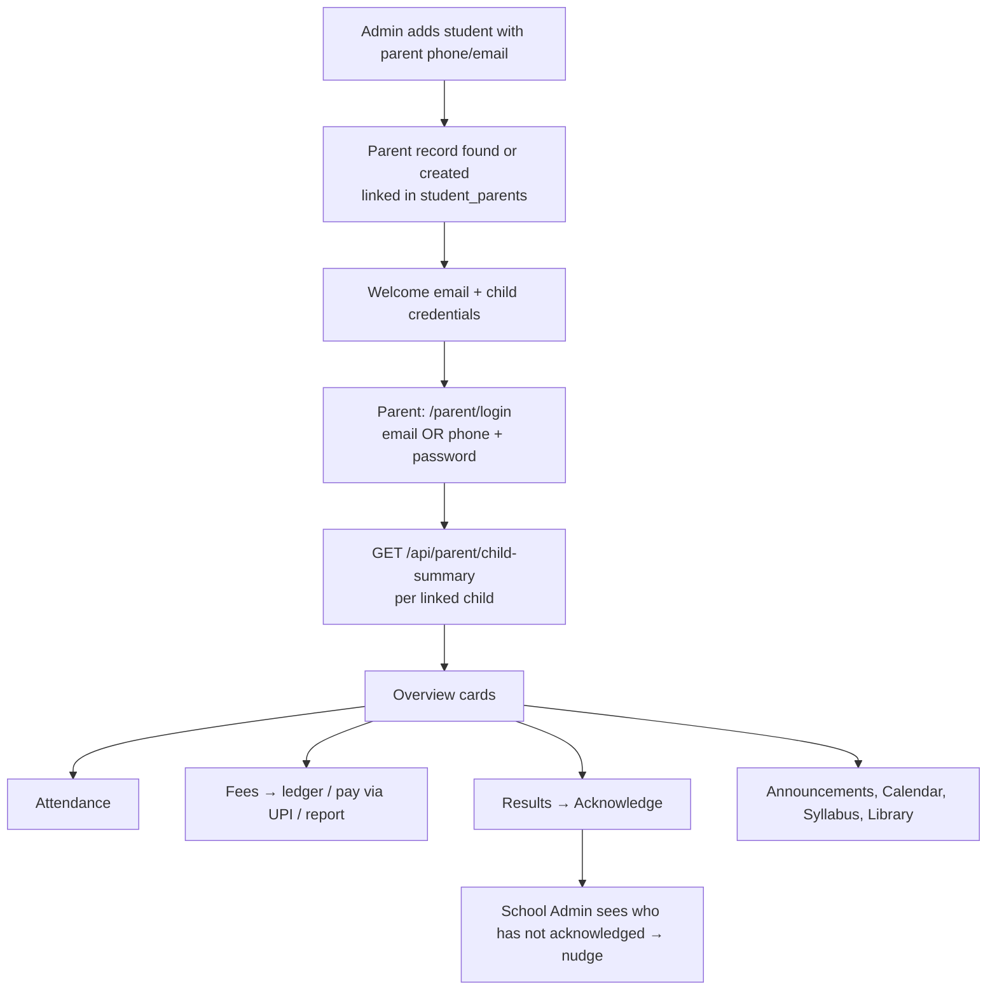

**Step by step (parent)**
1. Sign in with the email **or** phone the school has on record; change the password on first login; optionally add a date of birth.
2. Overview shows a card per child with four numbers: attendance %, upcoming exams, results to acknowledge, overdue fees.
3. **Attendance** → tap a day for its detail; the streak counts full days in a row.
4. **Fees** → see each bill, waivers and payments; if Online Payments is enabled, pay through any UPI app and press *I've paid* to report it.
5. **Results** → after release, open the result and press **Acknowledge**.
6. Forgot password → reset link by email.

## 3. Business rules & edge cases

| Rule | Detail |
|---|---|
| Own children only | Reads go through `student_parents`; any other student id is answered **"not found"** (not "forbidden") |
| Phone uniqueness | A school cannot have two parent rows with the same phone (`idx_parents_school_phone_unique`) — so phone login is safe |
| Sign-in | Email or phone in one field; per-school lookup |
| Fees tab vs. UPI | Fees tab needs `fee-management`; the "Pay via UPI" sub-flow needs `online-payments` too |
| Duplicate submit | A per-attempt idempotency key stops a flaky connection creating two payment reports (`lib/idempotency.ts`) |
| Results | Visible only once the exam is `released`; acknowledgement recorded in `parent_mark_acks` |
| Feature gating | `results`/`exams` → `exam-marks`, `fees` → `fee-management`, `syllabus` → `curriculum` via the alias map |
| Password reset | Email link; a WhatsApp send call exists only as a logging scaffold |

## 4. Technical reference (developers)

**Screens:** `app/parent/page.tsx` (~1,650 lines incl. nav, overview, fees), `components/ParentProfile.tsx`, `components/ParentSyllabus.tsx`, shared attendance calendar and school calendar view, `translations.ts`. Section navigation is URL-driven via the `tab` query parameter.

**API**

| Method | Route | Purpose |
|---|---|---|
| POST | `/api/parent/auth/login`, `/logout`, `/change-password`, `/forgot-password`, `/reset-password` | Account |
| GET | `/api/parent/auth/me` | Session + linked children |
| PUT | `/api/parent/auth/date-of-birth` | DOB |
| GET | `/api/parent/child-summary` | Per-child overview numbers |
| GET | `/api/parent/attendance?student_id&month` | Child attendance (shared rules) |
| GET/POST | `/api/parent/fees` | Fee ledger (read) and payment report (write, idempotent) |
| GET | `/api/fees/upi-qr`, `/api/fees/upi-qr/info` | School UPI QR/info |
| POST | `/api/exams/{id}/acknowledge` | Acknowledge a result |
| GET | `/api/academic-years`, `/api/academic-year/current` | Year switcher |
| GET | `/api/school/enabled-features`, `/api/school/library`, `/api/syllabus`, `/api/announcements`, `/api/classes` | Gated content |

**Tables:** `parents`, `student_parents`, `students`, `student_fee_ledger`, `fee_payments`, `fee_waivers`, `fee_structures`, `fee_categories`, `exam_records/subjects/marks`, `parent_mark_acks`, `announcements`, `notifications`, `student_class_history`, `academic_year_snapshots`, syllabus and library tables.

**Libraries:** `lib/attendanceStudentView.ts`, `lib/idempotency.ts`, `lib/examsAuth.ts`, `lib/features-context.tsx`, `lib/usageTracking.ts`.

**Security:** `getParentSession()`; cookie `wlyl-parent`, JWT 7 days; every child-scoped query joins `student_parents`.

**Tests:** `auth-parent.spec.ts`, `workflow-portals.spec.ts`, `workflow-attendance.spec.ts`, `workflow-fee-management.spec.ts`.

## 5. Pitch kit

**Investor one-liner** — "The parent app that turns a school from a black box into a transparent partner: attendance, results and fees in the parent's language."

**School one-liner** — "Parents see attendance, results and fees for their own child — in English or Telugu — without calling the office."

**Slide bullets**
- Child summary, colour attendance calendar with streaks.
- Fee ledger + UPI payment reporting.
- Result **acknowledgement** with an admin follow-up list.
- Multi-child, English/Telugu.

**60-second demo:** sign in with a phone number → two children → show the attendance calendar → open a released result and acknowledge → back in admin show the acknowledgement list.

**Objection → honest answer**
- *"Do parents get WhatsApp alerts?"* — No. Absence alerts go by **email**. WhatsApp is on the roadmap pending Meta approval; we do not claim it today.

## 6. Limits & roadmap

- No WhatsApp OTP / alerts, no push, no chat.
- Roadmap: WhatsApp (Meta) + OTP sign-in, parent-facing report-card view, Parent Engagement analytics (built on a branch).

---

<!-- SOURCE FILE: docs/product/features/08-attendance-tracking.md -->

# 08 · Attendance Tracking (the showcase module)

| | |
|---|---|
| **Feature key** | `attendance` |
| **Category** | Scheduling |
| **Portals** | School Admin, Teacher, Student, Parent |
| **Status** | **BUILT** — the most developed module; use it as the demo centrepiece |
| **Deep reference** | [`docs/ATTENDANCE.md`](../../ATTENDANCE.md) (verified accurate against the code) |
| **Snapshot** | `dev` @ `29f0e6a`, 2026-09-21 |

---

## 1. Product brief

**The problem.** Attendance is the daily heartbeat of a school, yet registers get lost, two teachers mark the same class, holidays distort percentages, and each report shows a different number.

**The solution.** Two-session daily attendance (Morning, Afternoon) with **locking, holiday awareness, role-specific dashboards and one formula everywhere**.

| Capability | Detail |
|---|---|
| Marking | **Any teacher** can mark **any class**, Morning or Afternoon; two taps per student, review, submit |
| Locking | The **first submit locks** that class + date + session, database-enforced; others see "Already marked by …" |
| Corrections | The marking teacher **same day**; the **admin any time**; other teachers use **Report a mistake** |
| Holidays | Holidays and weekly-off days can't be marked and are **excluded from every percentage** |
| Offline | Teacher screen queues marking offline with clear "not saved because…" messages |
| Alerts | Parents of a student **newly marked absent today** get an **email** |
| Exports | Class register CSV, daily absentee list (for keying into LEAP manually) |
| Dashboards | Admin: school → class → student; class teacher: **My class**; parent/student: personal calendar |

**Dashboards by role**

| Role | Question answered | On screen |
|---|---|---|
| School admin (Overview) | "How is the school doing, where do I act?" | Period switch (7 days / month / school year), school %, students below 75%, today strip (classes marked, who hasn't), mistake-report alert, trend, class ranking, needs-attention list, student search |
| Class teacher (My class) | "Which of my students need help?" | Class %, need-attention count, absent today, trend, **weekday pattern**, filterable student list |
| Parent / student | "How am I / is my child doing?" | Calendar, month + year %, streak, trend, upcoming holidays |

**Value.** Accurate, trusted numbers; early intervention (students below 75% or absent 3+ days in a row); fewer disputes because every screen shows the same figure.

**Where it stops.** Whole-school holidays only (no class-specific or half-day closures). **No direct LEAP integration**; **no WhatsApp alerts** (email only). No biometric/RFID capture.

## 2. End-to-end flow

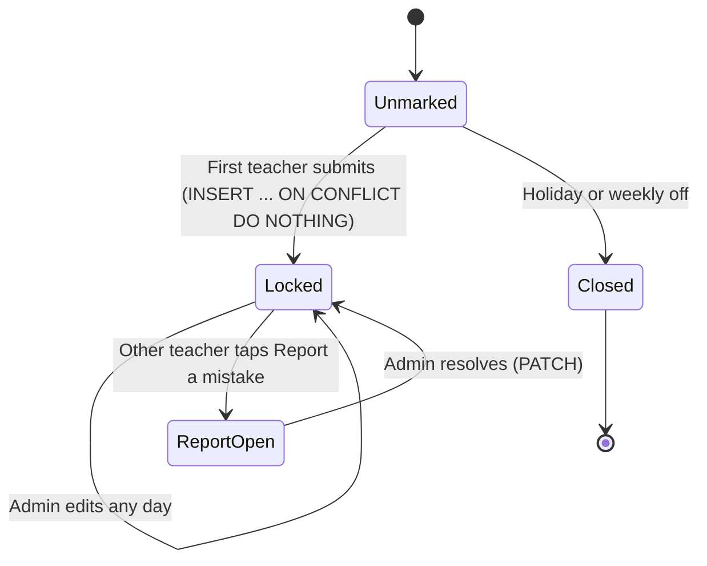

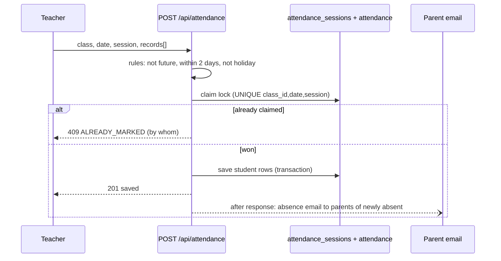

**Step by step**
- **Teacher:** *Attendance* → class picker (each class shows Morning/Afternoon state and who marked) → mark sheet → review → **Submit**. If someone already marked it, the sheet is read-only.
- **Class teacher:** *My class* shows the dashboard for their own class only.
- **Admin:** *Attendance → Overview* for the whole school; *Today* panel to chase unmarked classes, mark a day as a holiday, review mistake reports; *Academic Calendar* for holidays and weekly off ([16](16-academic-calendar.md)).
- **Parent / student:** *Attendance* tab.

## 3. Business rules & calculations

| Rule | Value |
|---|---|
| Statuses | Present, Absent, **Late — counts as attended** |
| Sessions | Morning, Afternoon; each marked session counts equally |
| **Attendance %** | `(present + late) ÷ marked sessions`, rounded to a whole number; `—` when nothing marked |
| Bands | **90%+ good · 75–89% needs care · below 75% low** |
| Minimum data | A dashboard needs **4 marked sessions** before labelling anyone ("too early to tell") |
| Needs attention | Below 75% (with enough sessions) **or** absent 3+ school days in a row |
| Working day | Not a holiday, not a weekly-off weekday |
| Unmarked working day | A gap to chase — **not** an absence, left out of the % |
| Joined mid-year | Counted from joining date only |
| Marking window | Teachers: today and 2 days back; admin: any past day; nobody: future |
| "Today" | India time (IST) |
| Day colour | both present = green · any late = amber · one session absent = half · all absent = red |

**Worked example (illustrative numbers).** A student has 20 marked sessions: 15 present, 3 late, 2 absent → attended 18 → 18 ÷ 20 = **90 %** → band **good**. If 2 more absences follow, 18 ÷ 22 = 82 % → **needs care**.

**Error codes returned by marking:** `CLASS_NOT_FOUND`, `FUTURE`, `TOO_OLD`, `HOLIDAY`, `WEEKLY_OFF`, `NO_STUDENTS`, `INVALID_RECORDS`, `ALREADY_MARKED`, `NOT_MARKED`, `LOCKED`.

## 4. Technical reference (developers)

**Screens:** teacher — `app/teacher/components/Attendance.tsx` + `attendance/{ClassPicker,MarkSheet,HistoryView,types}`; admin — `AttendanceDashboard.tsx`, `AttendanceOverviewDashboard.tsx`, `AttendanceTodayPanel.tsx`; shared — `app/components/AttendanceCalendar.tsx`, `app/components/attendance-dashboard/{ClassDashboard,StudentModal,parts}`.

**API**

| Method | Route | Purpose |
|---|---|---|
| GET | `/api/attendance/overview?date=` | Every class's Morning/Afternoon state, holiday, can-mark |
| GET | `/api/attendance?view=sheet|student|class-month` | Roster + lock + permissions; per-student numbers |
| POST | `/api/attendance` | Claim lock + save → `201`; `409 ALREADY_MARKED/HOLIDAY/WEEKLY_OFF`; `403 TOO_OLD`; `400 FUTURE/INVALID_RECORDS` |
| PUT | `/api/attendance` | Correct a session; `403 LOCKED` otherwise |
| GET | `/api/attendance/dashboard?scope=school|class|my-classes|find&range=week|month|year` | Dashboards (admin; class teacher for own class) |
| GET | `/api/attendance/analytics` | Older rolling analytics kept for reports |
| POST/GET/PATCH | `/api/attendance/report` | Report a mistake / list / resolve |
| GET | `/api/parent/attendance`, `/api/student/attendance` | Family views (own data only) |
| GET | `/api/export/attendance` | Register CSV or `?mode=absentees&date=` |

**Tables:** `attendance` (one row per student/date/class/session, `status IN (present, absent, late)`), `attendance_sessions` (the **lock**: unique `(class_id, date, session)`, who/when/edit count), `attendance_issue_reports`, `school_calendar`, `schools.weekly_off_days`.

**Libraries (single source of truth):**
`lib/attendanceRules.ts` (pure, client-safe) · `lib/attendance.ts` (queries) · `lib/attendanceAuth.ts` (who is calling) · `lib/attendanceMarking.ts` (claim/save/edit) · `lib/attendanceDashboard.ts` · `lib/attendanceStudentView.ts` · `lib/attendanceNotify.ts` (absence email, after the response) · `lib/calendarSchemas.ts`.

**Concurrency & integrity**
- The lock is a **database unique key** and the claim is `INSERT … ON CONFLICT DO NOTHING`, so two teachers submitting at the same instant cannot both win — one gets `409`.
- Edits take `SELECT … FOR UPDATE` on the session row, read the "before" picture, then write.
- Absence email runs **after** the response so a slow mail server never blocks marking, and only for **newly** absent students so re-saves do not spam parents.
- Identity always comes from the session; students/parents can never write or read class-level data.

**Tests:** `attendance-rules.spec.ts` (pure rules, no server) and `workflow-attendance.spec.ts` (34 tests: permissions, isolation, simultaneous-submit race, corrections, reports, calendar security, holidays, identical numbers across four portals, exports, real-browser checks at phone width). Run against a **throwaway** database only.

## 5. Pitch kit

**Investor one-liner** — "Attendance that is locked, holiday-aware and identical on every screen — the daily habit that anchors every school on our platform."

**School one-liner** — "Two taps per class. Parents know the same day. Every number matches — for the principal, the teacher and the parent."

**Slide bullets**
- First submit locks the session — no double marking, even if two teachers tap at once.
- Holiday & weekly-off aware; percentages never punish a closed day.
- Dashboards per role: school, class, student, parent.
- Early-warning: below 75% or 3+ days absent, weekday patterns.
- Absence email to parents the same day; CSV exports.

**Demo (2 minutes):** mark Grade 6-A Morning → try marking it from a second teacher (see the lock) → admin Overview updates → add a holiday and watch percentages ignore it → parent app shows the same %.

**Objections → honest answers**
- *"Do parents get WhatsApp?"* — Email today; WhatsApp is roadmap.
- *"LEAP integration?"* — No public API exists; we export the absentee list to key in.
- *"Half-day / class-specific holidays?"* — Not yet.

## 6. Limits & roadmap

- Whole-school, whole-day holidays only; no LEAP; email-only alerts.
- Roadmap: half-day and class-specific holidays, WhatsApp alerts, school health score.

---

<!-- SOURCE FILE: docs/product/features/09-syllabus-customizer.md -->

# 09 · Syllabus Customizer (Curriculum)

| | |
|---|---|
| **Feature key** | `curriculum` (portal nav aliases: `syllabus`, `syllabus-tracking`) |
| **Category** | Scheduling |
| **Portals** | School Admin, Teacher, Student, Parent |
| **Status** | **BUILT** |
| **Deep reference** | [`docs/SYLLABUS-FEATURE-README.md`](../../SYLLABUS-FEATURE-README.md) (long, schema-level) |
| **Snapshot** | `dev` @ `29f0e6a`, 2026-09-21 |

---

## 1. Product brief

**The problem.** Every school teaches a board syllabus (CBSE, State, etc.) but tracks it on paper. Nobody knows, mid-term, whether Grade 9-A is behind on Maths, and parents can't see what has been taught.

**The solution.** A three-layer system that keeps a professional master syllabus at platform level and lets each school and each class shape it:

```
MASTER CATALOG (platform, shared)   board → grade → subject → chapter → topic
        │  school subscribes → deep COPY (not a live link)
SCHOOL COPY (per school)            editable; custom chapters allowed
        │  each class's teacher runs one-time Class Syllabus Setup
CLASS SETUP (per class-section)     which chapters/topics this class needs, semester groups
        │  teacher marks topics taught
PROGRESS (per class)                drives % everywhere
```

| Role | What they do |
|---|---|
| Platform admin | Builds and maintains the master catalog (subjects → chapters → topics → tasks, resources, PDFs) |
| School admin | **Subscribes** to subjects, customises the school copy, sees each class's setup, watches **coverage analytics**, **nudges** a teacher who is behind |
| Teacher | Runs **Class Syllabus Setup** (deselect what the class won't do, group into semesters, copy from a sibling section), marks topics **taught** with a date; adds custom chapters; can bulk-import an outline |
| Student | Sees the syllabus for their class (what is unlocked) |
| Parent | Sees the full syllabus: taught vs not yet taught |

**Highlights**
- **Per-class overlay:** 9-A and 9-B can keep different chapters and semester groupings — nothing is destructively deleted.
- **Chapter-weighted progress** with partial credit (not a naïve topic ratio).
- **Weekly coverage trend** charts by class or teacher.
- **Telugu/Hindi names:** teachers type in English letters and convert in place (server-side transliteration).
- **Year-to-year:** copy a subject's setup from a previous year.

**Value.** Curriculum accountability without spreadsheets; principals see who is behind *before* exams; parents see the syllabus is being taught.

**Where it stops.** No lesson planner (removed; on a branch), no timetable-linked pacing. Homework/task templates exist in the catalog schema but are **not** a homework feature.

## 2. End-to-end flow

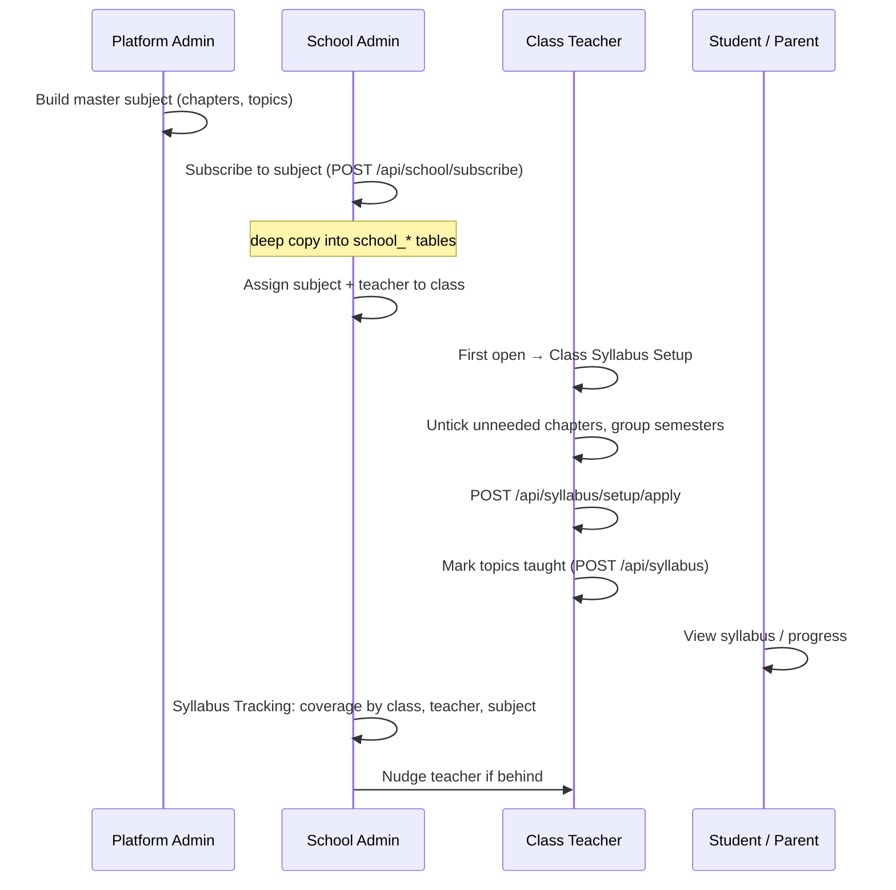

**Step by step**
1. **Subscribe** (School Admin → Syllabus Customizer): pick board/grade/subject; the full tree is copied to the school.
2. **Assign** the subject and teacher to a class ([04](04-class-management.md)).
3. **Class Syllabus Setup** (teacher, once per class + subject, re-editable): untick chapters/topics the class will skip, optionally group into Semester 1/2…; if another section of the same grade already did it, **copy from sibling** with one click.
4. **Teach and mark**: the teacher marks topics covered with a date.
5. **Track**: admin opens *Syllabus Tracking* → by class, teacher (one row per class + subject) and subject; trend chart from weekly snapshots.
6. **Nudge**: from a behind-schedule row the admin sends the teacher a notification.
7. **New year**: copy setup from the previous year instead of redoing it.

## 3. Business rules & calculations

| Rule | Detail |
|---|---|
| Copy, not link | Later master edits don't change a school's copy; `POST /api/school/subjects/{id}/resync` can pull new content on demand |
| Absence of a row = active | Class visibility rows are written only by Setup **Apply**; an unchecked item gets an explicit `is_active = false` row |
| Progress is per class | `school_topic_progress` keyed `(class_id, school_topic_id)` — two sections can be at different points |
| **Percent is chapter-weighted with partial credit** | Exact formula in the syllabus README §11; every active chapter counts in the denominator (including zero-topic chapters — a past bug that inflated 47% to 78% was fixed) |
| Zero chapters | `pct = null`, shown as "—" |
| Trend | Weekly **binary** covered/total snapshots (Mondays 02:00 UTC cron) — answers "how is it trending", not "exact progress now" |
| Who edits what | Only the class's own teacher edits Setup; admin sees it read-only (`/api/syllabus/setup/status`) |
| Sibling copy | Same grade only; source must have completed Setup; a one-time clone, not a live link |
| Custom content | `is_custom` flag; teachers can add or rename their own chapters |

## 4. Technical reference (developers)

**Screens:** admin — `CurriculumCustomizer.tsx` (subscribe/customise, ~1,400 lines), `SyllabusTracking.tsx` (analytics, ~630), `AcademicAnalytics.tsx`; teacher — `TeacherSyllabus.tsx`; student — `StudentSyllabus.tsx`; parent — `ParentSyllabus.tsx`.

**API (main groups)**

| Route | Purpose | Guard |
|---|---|---|
| `POST /api/school/subscribe` | Subscribe (deep copy) | school admin |
| `GET/POST /api/syllabus`, `PATCH/DELETE /api/syllabus/{id}`, `POST/PATCH /api/syllabus/chapters` | Tree + mark taught + chapters | `requireSyllabusAccess` / `requireSyllabusWriteAccess` |
| `GET /api/syllabus/setup`, `POST /setup/apply`, `GET /setup/siblings`, `POST /setup/copy-from-sibling`, `GET /setup/status` | Class Syllabus Setup | as above |
| `GET /api/syllabus/analytics`, `/analytics/trend` | Admin coverage analytics | `requireFeeAccess` |
| `POST /api/notifications/nudge-teacher` | Nudge | `requireFeeAccess` + teacher-in-school check |
| `GET /api/school/subjects`, `DELETE /{id}`, `POST /{id}/resync`, `/create-custom`, `/copy-from-year`, `GET /materials` | School subject management | school scoped |
| `POST /api/school/syllabus/bulk-import`, `/bootstrap-chapters` | Teacher bulk outline import | write access |
| `GET/POST/DELETE /api/platform/subjects` | Master catalog | Platform Admin |
| `GET /api/cron/syllabus-coverage-snapshot` | Weekly snapshots | `CRON_SECRET` |
| `GET /api/transliterate` | English → Telugu/Hindi (staff only) | staff session |

**Tables:** master — `master_subjects/chapters/topics/resources/tasks`, `master_subject_materials`; school — `school_subjects/chapters/topics/resources/tasks`, `school_topic_progress`, `school_subscriptions`; class — `class_chapter_visibility`, `class_topic_visibility`, `class_subject_setup_status`, `class_subjects`, `curriculum_assignments`; history — `syllabus_coverage_snapshots`, `academic_year_snapshots`.

**Libraries:** `lib/curricula.ts`, `lib/syllabus/*`, `lib/board-syllabus/*` (board data), `lib/matchTeacher.ts`, `lib/academicYear.ts`.

**Design notes:** teacher access to write routes is resolved from `class_subjects` (assigned teacher only); admin analytics deliberately uses the tenant guard rather than a syllabus guard; the Setup **Apply** runs in one transaction with a per-item ownership check against stale/malformed payloads.

**Tests:** `syllabus-audit.spec.ts`, `workflow-syllabus-audit.spec.ts`, `workflow-syllabus-translate.spec.ts`.

## 5. Pitch kit

**Investor one-liner** — "A board-aligned master syllabus each school can shape per class, with live coverage analytics — curriculum accountability, not paperwork."

**School one-liner** — "Know which classes are behind on which subjects — before the exams — and let parents see what has been taught."

**Slide bullets**
- Master catalog → school copy → per-class setup (three layers).
- Teachers mark topics taught; progress is chapter-weighted.
- Weekly coverage trend by class and by teacher; one-click nudge.
- Telugu/Hindi names typed phonetically in English letters.
- Parents see taught vs. not-yet-taught.

**60-second demo:** subscribe Grade 9 Maths → open as the class teacher, untick two chapters, apply → mark three topics taught → switch to admin: coverage % and trend appear → nudge a teacher.

**Objections → honest answers**
- *"Is it AI?"* — No. Transliteration uses a public Google Input Tools endpoint through our server; no AI generation.
- *"Who supplies the content?"* — The master catalog is maintained by WLYL; coverage of boards/grades is `[TBD – founder]` (state which boards are actually loaded before stating this externally).

## 6. Limits & roadmap

- Master catalog completeness varies by board/grade — verify before promising.
- No lesson planner, no pacing against a timetable (both on branches).
- Roadmap: rebuilt analytics (Class Analytics) and school health score.

---

<!-- SOURCE FILE: docs/product/features/10-exam-schedule-and-marks.md -->

# 10 · Exam Schedule & Marks

| | |
|---|---|
| **Feature key** | `exam-marks` (nav aliases: `exam-schedule`, `my-marks`, `results`, `exams`) |
| **Category** | Scheduling |
| **Portals** | School Admin, Teacher, Student, Parent |
| **Status** | **BUILT** — a single switch governs the whole exam workflow across all four portals |
| **Snapshot** | `dev` @ `29f0e6a`, 2026-09-21 |

---

## 1. Product brief

**The problem.** Exam marks travel on paper and WhatsApp; marks get changed after release; parents say they never saw the result.

**The solution.** A controlled pipeline: the admin **schedules** an exam for many classes at once, subject teachers **enter marks**, the class teacher **reviews**, the admin **releases** — and only then do students and parents see results. Parents can **acknowledge**, and the school sees who has not.

| Stage | Who | What happens |
|---|---|---|
| 1. Schedule | School admin | Create one exam (e.g. Half-Yearly) across many classes; each class's subjects **and subject teachers** are copied from **that class's own** subject list; max marks and pass % set |
| 2. Collect | Subject teachers / class teacher | Marks entry opens automatically **the day after the exam date** (nightly job); each teacher edits only their subject; the class teacher may edit any subject |
| 3. Review | Class teacher | "I've checked every subject" → notifies school admins |
| 4. Release | School admin | Final, irreversible release; **only now** do students/parents see results |
| 5. Acknowledge | Parent | Taps **Acknowledge**; admin sees who hasn't and can **nudge** |

**Extras:** the class teacher can **reopen** a submitted subject to fix a mistake before review; one grading ladder everywhere; results exports (see [17](17-export-and-reports.md)); exam calendar entries.

**Value.** Traceable, tamper-resistant results and an acknowledgement trail; no result is visible before the school says so.

**Where it stops.** No annual multi-exam report card (a per-exam printable one is in Export Center), no rank lists, no question-paper management, no online tests (weekly test removed; on a branch).

## 2. End-to-end flow

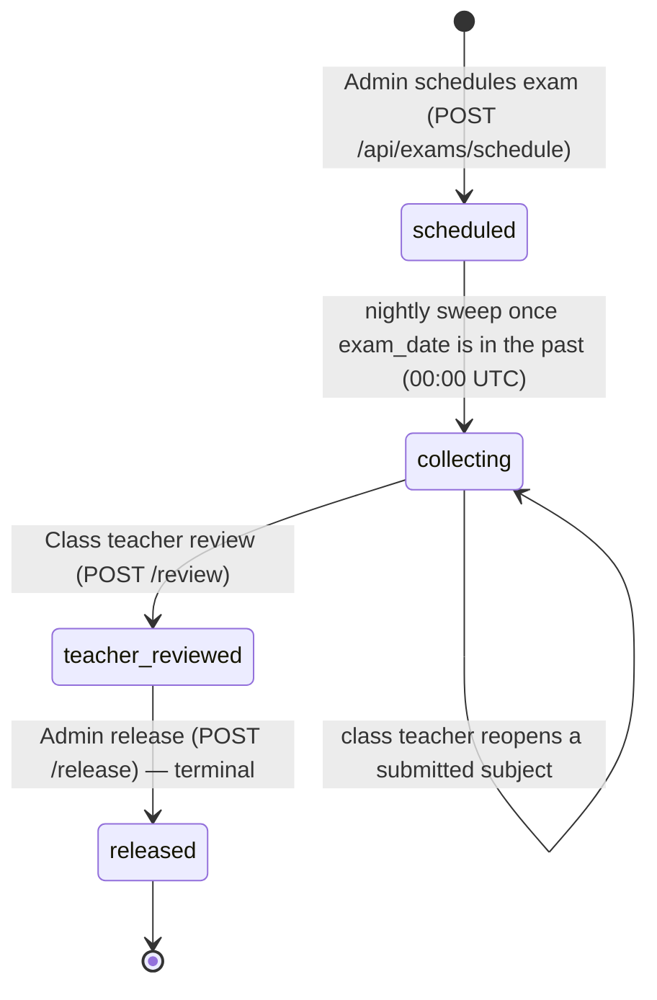

**Step by step**
1. **Admin:** *Exam Schedule* → choose classes, exam name, date, pass %; subjects fill from each class. Creating it stamps one shared `exam_group_id` so all classes can be edited or deleted as one unit, while each class has its own lifecycle.
2. **Status flips** to *collecting* the day after the exam date via the nightly sweep; subject teachers are notified. (There is **no** manual force-open on `dev`.)
3. **Teachers:** *Exam Marks* → enter marks per student (or mark absent) → **Submit** the subject (locks it).
4. **Class teacher:** reviews all subjects → **Review**; every school admin receives a notification.
5. **Admin:** **Release**. Once an exam is `teacher_reviewed`, subjects can no longer be reopened — corrections must be made before the class teacher reviews.
6. **Student/Parent:** results appear; the parent acknowledges.
7. **Admin:** *Acknowledgements* list → **Nudge** parents who haven't.

## 3. Business rules & calculations

| Rule | Detail |
|---|---|
| Grade ladder (`lib/examGrading.ts`) | **A1** ≥91 · **A2** ≥81 · **B1** ≥71 · **B2** ≥61 · **C1** ≥51 · **C2** ≥41 · **D** ≥33 · **E** <33 (on percentage) |
| Pass / fail | Separate from grade: `percentage ≥ exam.passing_pct`. A 33 % score is grade **D** yet a **fail** on an exam with a 50 % pass mark |
| Visibility | Students/parents may read **only `released`** exams and only **their own** marks |
| Permissions | Subject teacher → own subject; class teacher → any subject in their class (and reopen/review); admin → schedule and release |
| Release | Admin-only, irreversible; no edits accepted at release |
| Subject lock | Submitting a subject locks it; only the **class teacher** can reopen it, and only while the exam is still `collecting` |
| Subjects per class | Taken from that class's `class_subjects` — never a shared typed list |
| Notifications | Review notifies school admins; nudge notifies parents |

**Worked example (illustrative).** Maths max 50, Meera scores 39 → 78 % → grade **B1**; exam pass mark 40 % → **pass**.

## 4. Technical reference (developers)

**Screens:** `ExamSchedule.tsx` (admin, ~1,000 lines), `app/teacher/components/ExamMarks.tsx`, `app/student/components/StudentMarks.tsx`, parent results in `app/parent/page.tsx`.

**API**

| Method | Route | Purpose |
|---|---|---|
| POST | `/api/exams/schedule` | Create exam across classes (validates every class belongs to the school) |
| GET | `/api/exams`, `/api/exams/calendar` | Lists; calendar view |
| GET/PUT/DELETE | `/api/exams/{id}` | Exam detail, edit, delete |
| POST | `/api/exams/{id}/subjects`, `/subjects/{sid}/reopen` | Subjects; reopen (class teacher, collecting only) |
| GET/POST | `/api/exams/{id}/marks` | Read (role-scoped) / enter marks + submit subjects |
| POST | `/api/exams/{id}/review` | Class-teacher review → `teacher_reviewed` |
| POST | `/api/exams/{id}/release` | Admin release → `released` (irreversible) |
| GET/POST | `/api/exams/{id}/acknowledgements`, `/acknowledge`, `/nudge-parent` | Parent acknowledgement loop |
| GET | `/api/students/{id}/exams` | Student/parent results |
| GET | `/api/cron/exam-status-sweep` | `scheduled → collecting` |

**Tables:** `exam_records` (status `scheduled | collecting | teacher_reviewed | released`, `exam_group_id`, `passing_pct`), `exam_subjects` (`teacher_id`, max marks, submit lock), `exam_marks` (`marks_obtained`, `is_absent`), `parent_mark_acks`, `parent_mark_ack_nudges`, `notifications`, `class_subjects`.

**Libraries:** `lib/examGrading.ts` (single grade source, used by five places that previously drifted), `lib/examsAuth.ts` (`requireExamsAdmin/Teacher/Access`), `lib/rewards.ts` (legacy), `lib/email.ts`.

**Security:** marks route checks *which* student the caller may see (a former gap where any logged-in user could pass any `student_id` was closed); results gated on `status === 'released'`.

**Tests:** covered by `workflow-portals.spec.ts` and `workflow-full-platform.spec.ts`; **no dedicated exam-marks spec** — worth adding before scale.

## 5. Pitch kit

**Investor one-liner** — "A governed results pipeline — enter, review, release, acknowledge — that removes tampering and 'I never saw it' from school results."

**School one-liner** — "Marks are entered by the right teacher, checked by the class teacher, and released by you — parents see nothing until then, and you can see who has acknowledged."

**Slide bullets**
- Schedule one exam across many classes.
- Subject-level permissions and locks; class-teacher review; admin release.
- One grading ladder everywhere; separate pass mark.
- Parent acknowledgement with nudges.

**60-second demo:** schedule an exam for two classes → teacher enters and submits marks → class teacher reviews → admin releases → parent acknowledges → admin sees the list.

**Objection → honest answer**
- *"Report cards?"* — A per-exam printable report card is in Export Center; a multi-exam annual card with remarks is roadmap.

## 6. Limits & roadmap

- No annual multi-exam report card, ranks or grace-marks logic; no online tests. A **per-exam printable report card** exists in [Export Center](17-export-and-reports.md).
- The legacy `wiki/features/exam-marks.md` described a single "admin review" step — the code implements class-teacher review + admin release (this dossier is correct).

---

<!-- SOURCE FILE: docs/product/features/12-feedback-management.md -->

# 12 · Feedback Management (QR-code feedback)

| | |
|---|---|
| **Feature key** | `feedback-management` |
| **Category** | Communication |
| **Portals** | School Admin (manage); **public, no-login form** at `/feedback/<code>` |
| **Status** | **BUILT** |
| **Snapshot** | `dev` @ `29f0e6a`, 2026-09-21 |

---

## 1. Product brief

**The problem.** Schools rarely hear honest feedback: parents won't log in to complain, suggestion boxes are ignored, and problems (dirty toilets, late buses, a rude gatekeeper) never reach the right department.

**The solution.** A **QR poster** on the school wall. Anyone — parent, student, teacher, visitor — scans it, **no login**, picks their role, rates categories with an emoji scale, adds quick tags, text, or a **voice note**, and can stay **anonymous**. Low ratings become **issues** routed to a department and tracked to resolution.

| Piece | What it does |
|---|---|
| Public wizard | Role → optional identity (name/phone) or anonymous → categories → 5-point emoji rating → tags / text / voice → submit |
| Roles | Parent, Student, Teacher, Visitor, Other — each with role-specific default categories |
| Advanced forms | Optional richer form types (`advanced_form_type`) |
| Auto-issues | Rating **1** → high priority, rating **2** → medium; each snapshots the category's **department** for routing |
| Admin tabs | Dashboard (pulse score, mood mix, best/worst categories) · Submissions · **Issue Pipeline** · Categories editor · Settings & QR |
| Issue workflow | open → in progress → resolved / dismissed; priority and department editable |
| QR poster | Downloadable QR + printable poster; **regenerate** the code to invalidate old posters |

**Value.** A safe channel for candid feedback that turns complaints into a **workflow with accountability**, and a live "pulse score" for the owner.

**Where it stops.** Alerts to staff are in-app only (no WhatsApp/SMS). No sentiment AI on text or voice. Voice notes are stored, not transcribed.

## 2. End-to-end flow

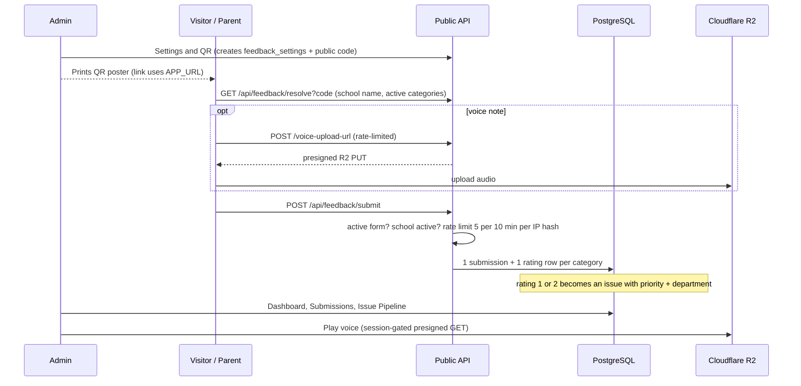

**Step by step (visitor):** scan → choose *Parent* → (optional name/phone or *anonymous*) → pick categories to rate → tap emojis → add tags/text/voice → **Submit** → thank-you.

**Step by step (admin):** *Feedback Management* → **Settings & QR** (form is created lazily; copy link / download poster) → watch **Dashboard**; open **Issue Pipeline** and move issues open → in progress → resolved; edit **Categories** (per role, with department); regenerate the code if a poster leaks.

## 3. Business rules & edge cases

| Rule | Detail |
|---|---|
| No login | Public routes: resolve, submit, voice-upload-url |
| Rate limit | **5 submissions / 10 minutes** per hashed IP per school (`ip_hash`); voice uploads also rate-limited (`feedback_voice_upload_log`) |
| Validity | Form must be active and school active; categories resolved against the school's live rows so label/department are accurate snapshots; ratings de-duplicated and capped |
| Issue creation | Rating 1 → `high`, 2 → `medium`; only 1–2 create issues |
| Pulse score | `round(avg_rating / 5 × 100)` |
| Anonymity | Anonymous submissions store no name/phone; voice playback is **session-gated** (a recording is personal data even when anonymous) |
| Public code | Independent of `schools.school_code`; freely rotatable without touching login; **URL built from `APP_URL`**, never the request host (the admin subdomain would dead-end) |
| Soft delete | Categories deactivate via `is_active` |

## 4. Technical reference (developers)

**Screens:** public — `app/feedback/[code]/{page,FeedbackWizard}.tsx`, `steps/*` (incl. `AdvancedFormStep`), `roleVisuals.ts`, `advancedFormVisuals.ts`; admin — `FeedbackManagement.tsx` + `feedback/{FeedbackDashboardTab,FeedbackSubmissionsTab,FeedbackIssueTable,FeedbackCategoryEditor,FeedbackQrPoster,useFeedbackFetch}`.

**API**

| Method | Route | Access |
|---|---|---|
| GET | `/api/feedback/resolve?code=` | Public |
| POST | `/api/feedback/voice-upload-url` | Public, rate-limited (presigned R2 PUT) |
| POST | `/api/feedback/submit` | Public, rate-limited |
| GET | `/api/feedback/voice/{id}` | Staff session (presigned GET redirect) |
| GET | `/api/feedback/submissions` (+`/{id}`) | Staff |
| GET / PATCH | `/api/feedback/issues` / `/{id}` | Staff |
| GET | `/api/feedback/stats` | Staff (pulse, mood, best/worst) |
| GET/POST, PATCH | `/api/feedback/categories`, `/{id}` | Staff |
| GET/PATCH, POST | `/api/feedback/settings`, `/regenerate-code` | Staff |
| GET | `/api/feedback/qr` | Staff (PNG) |

**Tables:** `feedback_settings` (code + active toggle, 1 per school), `feedback_categories`, `feedback_submissions` (role, identity, text, `voice_object_key`, `ip_hash`, `advanced_form_*`), `feedback_submission_ratings` (unit of the issue pipeline; partial index on `(school_id, priority, status) WHERE priority IS NOT NULL`), `feedback_voice_upload_log`.

**Libraries:** `lib/feedback-defaults.ts` (seeded + backfilled categories), `lib/validation/feedback.ts` (Zod), `lib/feedback-public-access.ts`, `lib/request-ip.ts`, `lib/r2.ts`, `lib/auth.ts` (`generateFeedbackCode`, `requireFeeAccess` for tenant isolation).

**Known technical gaps:** no server-enforced max size on the presigned voice upload (client caps ~60 s); some duplicated role definitions and fetch hooks across admin tabs (refactor debt).

**Tests:** `workflow-feedback-management.spec.ts`.

## 5. Pitch kit

**Investor one-liner** — "A no-login QR feedback channel that converts complaints into a routed, tracked issue pipeline and a live school pulse score."

**School one-liner** — "Put a QR poster at the gate. Parents speak freely — anonymously if they wish — and every low rating becomes a tracked issue for the right department."

**Slide bullets**
- Scan-and-rate in under a minute, no app, no login; Telugu-friendly emoji scale.
- Anonymous option; voice notes.
- Auto-flagged issues routed by department, with status workflow.
- Pulse score and best/worst categories for the owner.
- QR poster generator; rotate the code any time.

**60-second demo:** scan the poster on a phone → give a 1-star on "Cleanliness" with a voice note → admin Issue Pipeline shows a **high** issue → move it to *in progress* → resolved; show the pulse score change.

**Objections → honest answers**
- *"Can it be spammed?"* — Per-IP rate limits (5 per 10 minutes) and hashed IPs; it is not a full anti-abuse system.
- *"Is voice transcribed?"* — No, stored and played back by staff only.

## 6. Limits & roadmap

- In-app alerts only; no WhatsApp/SMS to department heads.
- No text/voice analysis. Voice size cap enforced only on the client.

---

<!-- SOURCE FILE: docs/product/features/13-fee-management.md -->

# 13 · Fee Management

| | |
|---|---|
| **Feature key** | `fee-management` |
| **Category** | Finance |
| **Portals** | School Admin (full); Parent (read-only ledger via `/api/parent/fees`) |
| **Status** | **BUILT** — the deepest finance module; 109 dedicated e2e cases |
| **Related** | [14 · Online Fee Payments (UPI)](14-online-fee-payments-upi.md), [19 · Year Rollover](19-year-rollover.md) |
| **Snapshot** | `dev` @ `29f0e6a`, 2026-09-21 |

---

## 1. Product brief

**The problem.** Fees are the school's cash flow and its biggest source of errors: paper receipts, half-payments nobody tracks, waivers given verbally, dues lost when the year changes, and cash that doesn't match the register at day end.

**The solution.** One tool for the **whole fee lifecycle**, with an audit trail on every rupee.

| Tab | What it does |
|---|---|
| **Overview** | Billed / collected / waived / unpaid headline, collection %, setup-wizard banner |
| **Fee Plan (Setup)** | Fee categories (fixed per grade, or variable per student), amounts per grade, **generate bills** for all active students, **lock** the plan (later changes need an audited amendment) |
| **Collect** | Daily counter: students with dues, take a payment (full/partial, **FIFO** across selected bills), grant a **waiver**, **Day Close** cash reconciliation, verify online (UPI) payments |
| **Student Passbook** | One student's bills, payments, waivers; **cancel/correct** a payment or revoke a waiver (with reasons, logged) |
| **Reports** | Collection and dues reports, exports, **audit report (Excel)** |
| **Year-End** | Per student: **carry forward**, **write off**, move to **passout ledger**, or leave open; close the year (reopen needs a reason) |
| **Past Records** | Read-only headline for every past academic year; jump into its report/ledger |
| **Leavers & Dues** | Students who left with unpaid balance; the always-open passout ledger |

**Receipts:** configurable school branding (logo, alignment, header blocks), signature block and **dual-copy printing**, also used for passbook reprints and year-end statements.

**Payment modes:** cash, cheque, DD, UPI, online. **Statuses:** bill = pending · partial · paid · overdue · waived; payment = completed · pending_verification.

**Value.** Every receipt numbered, every waiver reasoned, cash reconciled daily, and dues never silently vanish at year end. The principal can answer "how much is outstanding and from whom?" in seconds.

**Where it stops.** **No payment gateway** (online = UPI QR + parent self-report + admin verification). WhatsApp fee reminders are **not** live. No GST invoicing, no fee-head-wise accounting export to Tally.

## 2. End-to-end flow

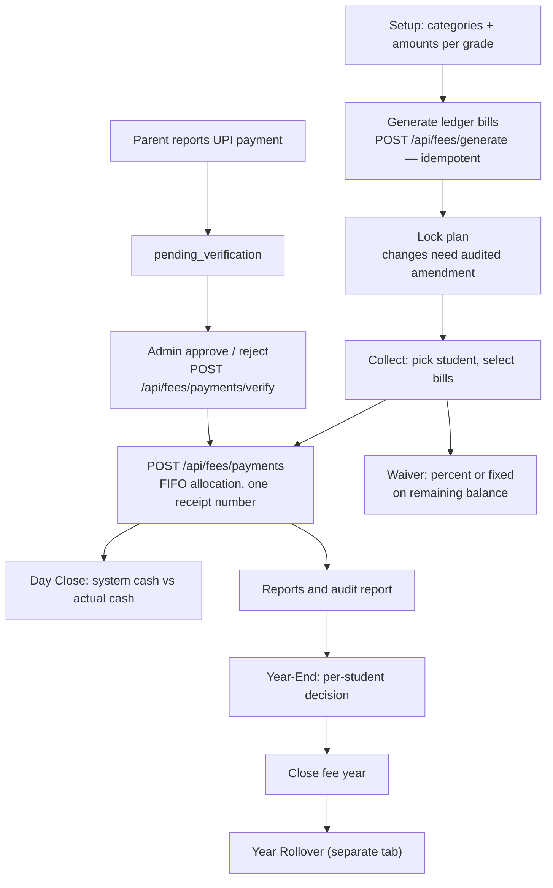

**Step by step**
1. **Setup.** Create fee heads (e.g. Tuition, Transport). Fixed heads take one amount per grade; variable heads are assigned per student (`student_fee_category_assignments`). **Generate** bills — safe to re-run; students who changed grade are re-synced to the new grade's amount (never below what they've already paid). Every bill is **due at the academic year's end date**.
2. **Lock** the plan. After locking, changes go through `structures/amend`, which records who/why in `fee_structure_history`.
3. **Collect.** Search the student, select one or many bills, enter amount and mode. With several bills, the server allocates **oldest first** and issues **one receipt number** for all parts. `collected_by` is mandatory (several staff share one login at the counter).
4. **Waive.** Percent or fixed, computed on the **remaining** balance after existing waivers. Reason required. Revocable from the Passbook.
5. **Day Close.** The system totals the day's cash; the admin enters actual cash and notes; differences are recorded.
6. **Online payments.** See [14](14-online-fee-payments-upi.md).
7. **Year-End.** Decide every unpaid student; apply in batches (resumable); close the year. Carried dues become one **Previous Year Dues** bill in the next year.
8. **Past Records** to browse any prior year.

## 3. Business rules & calculations

| Rule | Detail |
|---|---|
| **Balance** | `amount_due − waiver − amount_paid` |
| **FIFO** | A multi-bill payment fills the oldest selected bill first; all rows share one receipt number |
| **Payment modes** | Whitelisted: `cash`, `cheque`, `dd`, `upi`, `online` (no DB constraint, so the API enforces it — otherwise a typo would fall out of Day Close's cash reconciliation) |
| **Amount** | Must be positive; date cannot be in the future (compared as IST date strings) |
| **Waiver** | On remaining balance; `carry_forward` is a **system-only** waiver type used by year-end bookkeeping and excluded from "discretionary waived" totals; callers cannot set it |
| **Duplicate guard** | Payments and waivers use `lib/idempotency.ts` so a double click or retry cannot post twice |
| **Concurrency** | Row locked `FOR UPDATE` when paying/waiving so a payment and a waiver cannot race |
| **Closed year** | Payments, waivers, generation and re-sync are blocked on a closed year |
| **Plan lock** | Amounts frozen after lock; amendments audited |
| **Year-end apply** | Serialised per `(school, year)` with `pg_advisory_xact_lock`; resumable; close is race-safe |
| **Reopen** | Only with a reason (logged), and **not** once the school has rolled over |
| **Roll number order** | Ledger sorted by grade, section, `school_roll_number` (nulls last), name |

**Worked example (illustrative).** Bills: Term-1 ₹10,000, Term-2 ₹10,000. Parent pays ₹15,000 in one go → Term-1 fully paid (₹10,000), Term-2 gets ₹5,000 → one receipt. A ₹2,000 waiver on Term-2 → remaining ₹3,000.

## 4. Technical reference (developers)

**Screens:** `FeeManagement.tsx` (1,329-line shell that owns cross-tab state and lazy-mounts tabs) + eight tabs in `app/school-admin/components/fee-management/` (Overview, Setup/Applicability, Collect, Passbook, Reports, Year-End, Archive, Leavers). Zustand store `lib/stores/feeStore.ts` holds cross-tab versions/one-shot requests.

**API (`/api/fees/*`, 33 route operations used by the UI)**

| Group | Routes |
|---|---|
| Setup | `categories`, `category-assignments`, `category-changelog`, `structures` (+ `lock`, `amend`), `structure-history`, `setup-status`, `generate` |
| Money | `ledger`, `payments`, `payments/verify`, `payments/cancel`, `waivers`, `day-close`, `passbook`, `stats` |
| Reporting | `reports`, `audit-report` (+ `/excel`), `audit-log`, `export`, `archive` |
| Year | `year-end`, `year-rollover`, `passout`, `removed-students` |
| UPI | `upi-id` (+ `/verify`), `upi-qr` (+ `/info`) |
| Parent | `/api/parent/fees` (GET ledger, POST payment report) |

**Tables:** `fee_categories`, `fee_structures`, `fee_structure_locks`, `fee_structure_amendments`, `fee_structure_history`, `student_fee_category_assignments`, `student_fee_assignment_history`, `student_fee_ledger`, `student_fee_ledger_edits`, `fee_payments`, `fee_payment_corrections`, `fee_waivers`, `fee_day_close`, `fee_year_close`, `fee_category_changelog`, `passout_students`, `academic_years`, `academic_year_snapshots`, `platform_audit_log`.

**Libraries:** `lib/feeRollover.ts` (system categories *Previous Year Dues / Passout Dues*, close-out bill, upsert carry-forward, race-safe year-close claim, remaining-open summary), `lib/feeAuditReport.ts`, `lib/idempotency.ts`, `lib/istDate.ts`, `lib/academicYear.ts`, `lib/auth.ts` (`requireFeeAccess` — the tenant guard used by every fee route).

**Design notes**
- Validation runs **before** a pool connection is acquired (pool is `max: 1` on Vercel).
- `source_academic_year` / `source_ledger_id` on ledger rows trace carry-forward and passout bills to their origin.
- Past Records is a thin read layer over existing data, not a new source of truth.

**Known technical debt (INTERNAL):** the yearly billed/collected/waived/unpaid aggregate exists in three places (`reports`, `feeRollover`, `archive`); `fmt/pct/sanitizeMoney` helpers are duplicated across tab files; year-end/rollover loops run 1–2 queries per bill (fine for a once-a-year admin task); Archive/Leavers do not auto-refresh after a year-end action.

**Tests:** `workflow-fee-management.spec.ts` (109 cases; needs an existing platform-admin in the target DB), `workflow-year-rollover.spec.ts`.

## 5. Pitch kit

**Investor one-liner** — "A complete fee ledger with receipts, waivers, day-close and year-end carry-forward — the system of record for a school's cash."

**School one-liner** — "Every rupee tracked: numbered receipts, reasoned waivers, daily cash match, and dues that carry safely into next year."

**Slide bullets**
- Fee plan per grade, one-click bill generation, plan lock with audited amendments.
- Part-payments allocated oldest-first under one receipt.
- Waivers with reasons; cancel/correct with a trail.
- **Day Close** cash reconciliation; Excel audit report.
- Year-end: carry forward, write off, passout ledger; Past Records for every year.

**60-second demo:** generate bills → take a ₹15,000 payment across two terms (show one receipt) → grant a waiver → Day Close → open Reports → Year-End preview.

**Objections → honest answers**
- *"Payment gateway?"* — Not yet; UPI QR with admin verification. Gateway is roadmap.
- *"WhatsApp fee reminders?"* — Not live.

## 6. Limits & roadmap

- No gateway, no WhatsApp reminders, no Tally/GST exports, no late-fee rules engine.
- Roadmap: payment gateway (needs field-level encryption first), WhatsApp reminders.

---

<!-- SOURCE FILE: docs/product/features/14-online-fee-payments-upi.md -->

# 14 · Online Fee Payments (UPI)

| | |
|---|---|
| **Feature key** | `online-payments` (**overridable per school**) |
| **Category** | Finance |
| **Portals** | School Admin (set up, verify), Parent (pay, report) |
| **Status** | **BUILT as a manual, verified flow. There is NO payment gateway.** |
| **Depends on** | `fee-management` must also be on |
| **Snapshot** | `dev` @ `29f0e6a`, 2026-09-21 |

---

## 1. Product brief

**The problem.** Parents want to pay from their phone; schools want proof before crediting a payment. A full gateway needs merchant onboarding, fees and compliance that early-stage schools don't have.

**The solution.** A pragmatic bridge: the school shows **its own UPI ID / QR**; the parent pays in any UPI app and **reports** the payment; the admin **verifies** it against the bank credit; only then is it posted to the ledger and the parent's receipt appears.

| Step | Who | Screen |
|---|---|---|
| Set the school's UPI ID (locked once saved; changing it needs a fresh unlock) | School admin | Fee Management → Setup |
| See the QR and school info | Parent | Fees → Pay via UPI |
| Pay in any UPI app, then submit "I've paid" with reference | Parent | Fees |
| Approve or reject (with reason) | School admin | Collect → Online |
| Receipt visible after approval | Parent | Fees |

**Value.** Zero gateway cost, works with any bank, and every credit is confirmed by a human — appropriate for budget private schools. Parents get a phone-native payment experience.

**Where it stops (say this out loud).** No order creation, no webhook, **no automatic confirmation**; the admin must match each report with the bank statement. Gateway tables (`school_payment_config`, `payment_transactions`, `payment_webhook_log`) are **schema-only scaffolding**. Cashfree/gateway secrets would need field-level encryption first (`lib/encryption.ts` is not built).

## 2. End-to-end flow

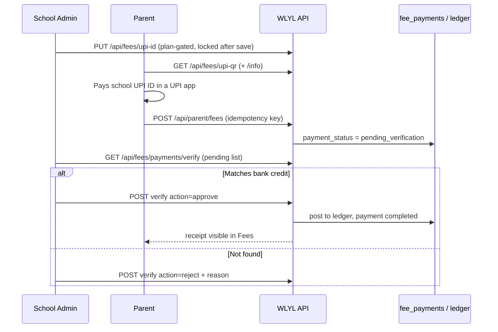

**Step by step**
1. Admin enables the feature (tier or per-school override), sets the UPI ID under **Setup**. The UPI ID **locks**; changing it requires `POST /api/fees/upi-id/verify` to mint an unlock token.
2. Parent opens **Fees**; if `online-payments` is on, the *Pay via UPI* panel shows the QR.
3. After paying, the parent submits the amount and UPI reference; a per-attempt **idempotency key** prevents a retry creating two reports.
4. The payment appears in admin **Collect → Online** as *pending*.
5. Admin **approves** (posts to the ledger exactly like a normal payment) or **rejects** with a reason.

## 3. Business rules & edge cases

| Rule | Detail |
|---|---|
| Server-side plan gate | The UI hides the panel, **and** the API refuses setup without the feature — a direct call cannot enable UPI on an ineligible plan |
| Pending ≠ paid | `pending_verification` payments do **not** reduce the balance or show a receipt |
| Approval | Uses the same ledger update as a counter payment (closed-year guard, receipt); a confirmation **email** goes to the parent (non-blocking). Approve racing reject is guarded |
| Rejection | Stores a `rejection_reason`, returned to the parent in their Fees list |
| Duplicates | Idempotency key on the parent POST |
| Tiers (as seeded) | Basic: off · Standard, Premium: on; per-school override wins |
| Separate switch | A school can have Fee Management **without** Online Payments — the Fees tab still works |

## 4. Technical reference (developers)

**Screens:** `app/school-admin/components/fee-management/FeeCollectTab.tsx` (online verification queue) and Setup tab (UPI ID); parent Fees section in `app/parent/page.tsx`.

**API**

| Method | Route | Purpose |
|---|---|---|
| GET/PUT | `/api/fees/upi-id` | Read (`{upi_id, locked}`) / set (plan-gated) |
| POST | `/api/fees/upi-id/verify` | Mint unlock token to change a locked UPI ID |
| GET | `/api/fees/upi-qr`, `/api/fees/upi-qr/info` | QR and display info (parent) |
| GET/POST | `/api/parent/fees` | Ledger; **payment report** (idempotent) |
| GET/POST | `/api/fees/payments/verify` | Pending list; approve/reject `{payment_id, action, verified_by, rejection_reason?}` |

**Tables:** `fee_payments` (`payment_status` `completed | pending_verification`), `student_fee_ledger`, `schools.upi_id`. **Scaffolding only:** `school_payment_config`, `payment_transactions`, `payment_webhook_log`.

**Libraries:** `lib/idempotency.ts`, `lib/auth.ts` (`schoolHasFeature`), `lib/email.ts`.

**Future design (documented in `verify/route.ts`):** a gateway webhook would insert the payment already `completed`, run the same ledger update, and auto-issue receipts; `verify` remains as the manual/fallback path. **Do not merge gateway/WhatsApp code to `wlylV1_main` without explicit approval.**

**Tests:** `workflow-fee-management.spec.ts`.

## 5. Pitch kit

**Investor one-liner** — "UPI-native fee collection with human verification today — the on-ramp to a full payment gateway once schools are ready."

**School one-liner** — "Parents pay with any UPI app and tell us; you confirm against your bank and the receipt appears — no gateway fees."

**Slide bullets**
- Your own UPI ID/QR, locked against accidental change.
- Parent self-report → admin approval → ledger + receipt.
- Plan-gated and switchable per school.
- Path to gateway already designed.

**Never say:** "automatic payment confirmation", "integrated payment gateway", "Cashfree/Razorpay live".

**60-second demo:** parent submits a payment → admin sees it pending → approve → parent's Fees tab now shows the receipt and lower balance.

**Objection → honest answer**
- *"So someone must check the bank?"* — Yes. That is the trade-off for zero gateway cost; a gateway with automatic confirmation is roadmap.

## 6. Limits & roadmap

- Manual verification only; no refunds flow; no auto-reconciliation with bank statements.
- Roadmap: payment gateway (encryption first), WhatsApp receipts.

---

<!-- SOURCE FILE: docs/product/features/19-year-rollover.md -->

# 19 · Year Rollover

| | |
|---|---|
| **Feature key** | `year-rollover` |
| **Category** | Administration |
| **Portals** | School Admin |
| **Status** | **BUILT** (issues #199, #201) |
| **Snapshot** | `dev` @ `29f0e6a`, 2026-09-21 |

---

## 1. Product brief

**The problem.** Every April the whole school changes at once: students move up a grade, the last grade graduates, some repeat, some change section, dues carry forward, and every module must start on the new year — usually done with a weekend of Excel and errors nobody notices until June.

**The solution.** **One central, guarded, all-or-nothing rollover.** It is the *only* place a school's active academic year advances after the first year is set up.

| Capability | Detail |
|---|---|
| Fee gate | The fee year-end must be **closed first** (Fee Management → Year-End). Otherwise a popup ("Complete the fee year-end first") with a button — and the server also refuses (`409 FEES_NOT_CLOSED`) |
| Preview | Readiness check and promotion preview before running |
| Snapshot | Each active student's grade, section and roll number saved to **class history** (permanent audit trail) |
| Promote | Everyone moves up one grade (numeric 6→7, or Nursery→LKG→UKG→1) |
| Graduate | Final-grade students become `graduated` |
| Exceptions | Per student: **repeat** the year (same grade + section, roll number kept) or **move** to a different existing section of the next grade; final-grade students may repeat instead of graduating |
| New year current | Attendance, exams, syllabus, calendar, fees and all portals follow |
| History | Past years remain in Student 360 through the year switcher |

**Value.** A stressful, error-prone annual chore becomes a checked, reversible-by-design, one-screen operation with a full audit trail — a strong reason to stay on the platform year after year (retention).

**Where it stops.** Not undoable once run. No automatic class re-sectioning/balancing, no timetable rebuild, no automatic new-fee-structure copy beyond what Fee Setup provides.

## 2. End-to-end flow

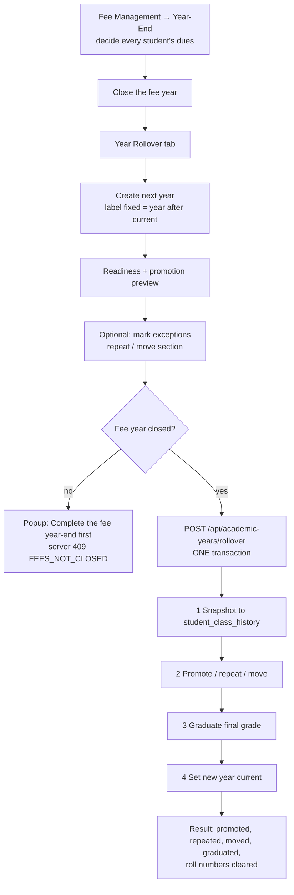

**Step by step**
1. **Year-End (fees):** apply decisions for every student with dues (carry forward → "Previous Year Dues" bill in the next year; write off; passout; leave open). **Close** the year.
2. **Year Rollover tab:** create the next year (label is fixed to the year after the current one, e.g. `2026-27` → `2027-28`).
3. **Review** the preview; mark **exceptions** (repeat / different section).
4. **Run.** Everything happens in a single database transaction; concurrent runs are serialised (the second gets `409`).
5. **Read the result:** counts promoted / repeated / moved / graduated and how many roll numbers were cleared.
6. **Follow-up:** re-assign cleared roll numbers; generate the new year's fee bills.

## 3. Business rules & edge cases

| Rule | Detail |
|---|---|
| Only current → next | Only the **current** year can roll over, only into the year that **follows** it, and **once** |
| Fee gate | Schools **with** Fee Management need a closed (not reopened) fee year; schools **without** it are not gated |
| Atomic | Snapshot + promote + graduate + switch year in one transaction; concurrent runs serialised (race-safe claim) |
| Grade sequence | `grade_sequence` and `final_grade` define promotion order; `nextGradeInSequence` returns none at the end |
| **Roll numbers** | Unique per class. A promoted student keeps their roll number if it is free in the new class; otherwise it is **cleared** and the school reassigns (counted in `roll_numbers_cleared`). Graduates' roll numbers are cleared; the old value stays in class history |
| Exceptions validated up front | Unknown student or missing section is refused **before anything changes** (Zod, max 5,000 exceptions) |
| Outcomes recorded | Each student's outcome — `promoted`, `repeated`, `moved`, `graduated` — stored in `student_class_history` |
| After rollover | The old fee year **cannot be reopened**; the active year cannot be switched by hand |
| Idempotent readiness | `rolled_over` = students have a class-history row for the year |

**Worked example (illustrative).** School has Grades 1–10 with 300 students. 285 promote, 6 repeat (exceptions), 4 move to section B, and 25 in Grade 10 graduate (2 of them chose to repeat instead). Result shows counts; if 12 promoted students' roll numbers clash in the new class, "12 roll numbers cleared" is reported.

## 4. Technical reference (developers)

**Screen:** `app/school-admin/components/YearRollover.tsx` (~600 lines).

**API**

| Method | Route | Purpose |
|---|---|---|
| GET | `/api/academic-years/rollover` | Readiness (`getRolloverReadiness`) and preview |
| POST | `/api/academic-years/rollover` | Run `{school_id, from_year_id, to_year_id, final_grade, grade_sequence, exceptions[]}` |
| GET/POST/PATCH/PUT | `/api/academic-years` | Create the next year (only here after year one) |
| GET/POST | `/api/students/promote` | Promotion support |
| GET | `/api/fees/year-rollover` | Fee-side rollover state |
| GET/POST | `/api/classes`, `/api/students` | Section existence, roster |

**Tables:** `academic_years`, `academic_year_snapshots`, `student_class_history`, `students`, `classes`, `fee_year_close`, `student_fee_ledger`, `fee_categories`, `fee_structures`, `class_subjects`, `curriculum_assignments`, `school_subjects`.

**Libraries:** `lib/yearRollover.ts` (`getRolloverReadiness`, `isFeeYearClosed`, `isYearRolledOver`, `feeGateRequired`, `FEES_NOT_CLOSED`), `lib/feeRollover.ts` (`nextAcademicYearLabel`, `lockYearClose`), `lib/grades.ts`, `lib/academicYear.ts`.

**Design notes:** Fee Year-End no longer creates years or promotes anyone (responsibility separated); readiness is computed by one function used by both the screen and the route so they always agree; the exception schema is a Zod discriminated union (`repeat` | `move`).

**Tests:** `workflow-year-rollover.spec.ts`. **ADR:** `docs/DECISIONS.md` — "One central Year Rollover, gated by fee year-end (#199)".

## 5. Pitch kit

**Investor one-liner** — "The annual reset that other tools leave to Excel: one guarded, atomic operation that promotes, graduates and carries dues — and locks the customer in year after year."

**School one-liner** — "New academic year in one screen: everyone promoted, exceptions handled, dues carried forward — and nothing half-done."

**Slide bullets**
- Fee year-end gate prevents rolling over with unresolved dues.
- One atomic transaction; concurrent-run safe.
- Repeat-year and section-change exceptions.
- Full class history retained; Student 360 year switcher.

**60-second demo:** show the blocked popup ("complete fee year-end first") → close fee year → mark one student to repeat → run → show the result counts and the student's history.

**Objection → honest answer**
- *"Can we undo it?"* — No; the design is to prevent mistakes with the gate, preview and exceptions. Take a backup first (daily R2 backup exists).

## 6. Limits & roadmap

- Irreversible once run; cleared roll numbers need manual reassignment.
- No automatic timetable/section rebalancing.

---

<!-- SOURCE FILE: docs/product/features/21-platform-admin-portal.md -->

# 21 · Platform Admin Portal (the business engine)

> The WLYL team's control room. Not sold to schools, but it is **how the SaaS business runs** — important for investor decks (multi-tenant control, plans, monitoring).

| | |
|---|---|
| **Route** | `/platform-admin` — served **only** on the `admin.` subdomain (blocked on the main domain by `proxy.ts`) |
| **Cookie / token** | `wlyl-platform`, JWT 7 days; role `platform_admin` |
| **Signs in with** | Email + password (first admin created via `/api/auth/setup-admin`, protected by `SETUP_SECRET`) |
| **Status** | **BUILT** |
| **Snapshot** | `dev` @ `29f0e6a`, 2026-09-21 |

---

## 1. Product brief

**The problem.** A SaaS serving many schools needs one place to onboard schools, control what each can use, watch health and keep an audit trail — without engineers touching the database.

**The solution.** A left-nav console:

| Section | What it does |
|---|---|
| **Schools** | Directory (search by name/city/code; filter by tier; active/inactive/deleted). **Create school** → auto school code + temporary admin password + onboarding email. School detail: subscription tier and dates, per-school **feature overrides** (student portal, parent portal, online payments), **AI access** switch, **Watchline** switch, reset the owner's password |
| **Master Syllabus** | Build the master catalog: subjects → chapters → topics → tasks/resources; bulk import; gap detection; bulk delete |
| **Digital Library** | Master materials per subject (signed uploads to R2) |
| **Feature Plans** | Turn each of the 19 features on/off **per tier** (Basic / Standard / Premium); changes apply instantly |
| **Usage Analytics** | Growth, feature adoption, per-school health |
| **Watchline** | Per-school API monitoring (request logs and health), enabled school by school |
| **Audit Log** | Immutable record: school created, subscription changed, school deleted, password reset — with actor and before/after |
| **Admins** | Manage platform admins and reset their passwords; send a test email |

**Value.** Onboard a school in minutes; sell tiers by switching features; see which schools actually use what; every sensitive action is on record.

**Where it stops.** No self-serve school sign-up or billing/payment collection from schools in code (subscription amounts are recorded, not charged). Seeded plan prices are **not final** — `[TBD – founder]`.

## 2. End-to-end flow

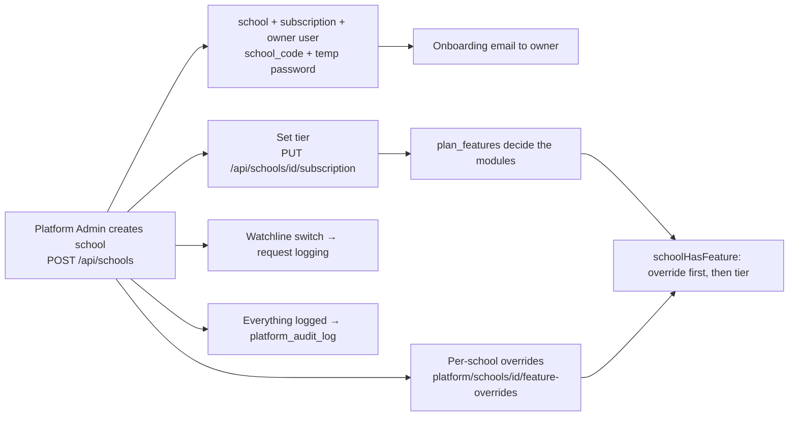

## 3. Business rules

| Rule | Detail |
|---|---|
| Two-layer flags | Tier setting, overridden per school; overridable keys: `student-portal`, `parent-portal`, `online-payments`, `api-monitoring` |
| Watchline | Not a plan feature; per school only; the Edge middleware caches the monitored-school list for 60 s and logs monitored requests fire-and-forget |
| Domain | Platform admin is reachable only on `admin.` — the main domain blocks it |
| Reset password | For a school it resets **only the owner** account |
| Audit | Immutable; captures actor, entity, before/after |
| Plans (seeded) | Basic 499 · Standard 999 · Premium 1999 (unit and currency undefined) with WhatsApp/online-payment flags — **do not quote** |

## 4. Technical reference (developers)

**Screens:** `app/platform-admin/page.tsx` (schools), `schools/[id]`, `curriculum`, `library`, `features`, `usage-analytics`, `logs` (Watchline), `audit`, shell in `components/PlatformAdminShell.tsx`.

**API groups**

| Group | Routes |
|---|---|
| Schools | `/api/schools`, `/api/schools/{id}`, `/{id}/subscription`, `/{id}/ai-access`, `/api/platform/schools/{id}/feature-overrides`, `/api/platform/schools/reset-password` |
| Plans | `/api/platform/features` |
| Catalog | `/api/platform/subjects`(+ `/{id}`, `/chapters`, `/full`, `/materials`, `/bulk-delete`, `/gaps`), `/chapters/{id}/topics|tasks`, `/topics`, `/tasks`, `/syllabus/bulk-import`, `/materials/*`, `/library` |
| Monitoring | `/api/platform/usage-analytics` (+ growth, feature-adoption, school-health, per school), `/api/platform/watchline` (+ health), `/api/internal/{log-ingest,log-cleanup,watchline-flags}` (secret-protected) |
| Admin | `/api/platform/admins`, `/admins/{id}/reset`, `/api/platform/audit`, `/api/platform/stats`, `/api/platform/test-email`, `/api/auth/setup-admin` |

**Tables:** `schools`, `users`, `school_subscriptions`, `plan_pricing`, `plan_features`, `school_feature_overrides`, `school_ai_access`, `platform_audit_log`, usage/Watchline log tables, `master_*`.

**Libraries:** `lib/auth.ts` (`requirePlatformAdmin`, `schoolHasFeature`), `lib/features.ts`, `lib/watchline.ts`, `lib/usageTracking.ts`, `proxy.ts`.

**⚠ INTERNAL security finding:** several `/api/platform/*` routes and `/api/schools/{id}/subscription` **have no auth guard** (details and fix in [architecture §12.1](00-platform-architecture.md)). Fix before any pilot with real data.

**Tests:** `auth-admin.spec.ts`, `watchline-config.spec.ts`, `workflow-full-platform.spec.ts`.

## 5. Pitch kit

**Investor one-liner** — "One control room runs every school: onboard in minutes, sell Basic/Standard/Premium by flipping switches, and see real usage per school."

**Slide bullets**
- Multi-tenant SaaS: schools, tiers, per-school overrides.
- Feature plans switch modules instantly; no code fork per customer.
- Usage analytics and per-school monitoring (Watchline).
- Immutable audit log.

**Never say:** automated billing/collection from schools (not built), or final prices.

## 6. Limits & roadmap

- No automated billing or self-serve sign-up. Roadmap: payment gateway (first for school fees, later possibly SaaS billing).

---
