# WLYL — School (Client) Demo Deck (single-file bundle)

> **Instructions for Claude:** the PROMPT below is your task. Everything after it (marked SOURCE) is the ONLY source of truth. Do not ask for other files.

# PART 1 — THE PROMPT

ROLE: You are a senior product manager and sales-enablement designer preparing a product demonstration for school owners, principals and management committees — non-technical, busy, price-sensitive, and skeptical of "software our teachers won't use".

CONTEXT: I am the founder of WLYL, a school-management platform for Indian schools. The attached files are the ONLY source of truth. `PRODUCT-FACTBOOK.md` is the fact-checker; the `features/*.md` dossiers hold the flows, business rules, demo scripts and honest answers. Never invent features, customers, results, prices or guarantees.

HARD HONESTY RULES (true of the code today)
- NOT live, so never promise: WhatsApp alerts or OTP (parents are alerted by **email**); an online payment gateway or automatic payment confirmation (fees can be paid by UPI QR — the parent reports it and the school confirms it against the bank); any AI feature; direct LEAP integration (we give the daily absentee list to key in); a timetable, leaderboard, rewards, homework, doubts, leave requests (removed from the product); annual multi-exam report cards (a per-exam printable report card exists); half-day or class-specific holidays.
- Show only built features as live. Show planned ones clearly as "coming next".
- Prices: the code seeds 499 / 999 / 1999 with no unit or currency — do not show them unless I confirm them.
- Never say "multi-tenant", "API", "JWT" or other jargon on main slides.
- Anything I have not answered must be a visible yellow "[FILL: …]" placeholder — never guess.

FIRST STEP: ask me, in ONE message: company name and contact; the pricing I will quote (unit, currency, what each plan includes); real pilot numbers if any (time saved, fee collection, attendance); reference schools I may name (with permission); language preference (English, Telugu headlines); the demo school name and sample data to use; target school type (board, size, region). If I skip, use a placeholder.

GOAL OF THE MEETING: the principal says "let's pilot this in our school." Sell outcomes, not features. Every feature slide must answer: what pain does this remove, for whom, and what will they see on Monday morning?

DELIVERABLES
1. An editable 16:9 `.pptx` if you can create files (otherwise HTML slides + a spec): 14–18 main slides plus an appendix (full feature checklist by portal, FAQ, data-safety page).
2. Per slide: headline, visual (use "[SCREENSHOT: route]" placeholders; routes are `/school-admin`, `/teacher`, `/parent`, `/student`), very short on-slide text (max 20 words), and presenter notes (what to say + what to click).
3. A 25-minute live-demo run-of-show: exact click paths, timings, one "wow moment" per role, and a fallback plan if the internet fails. Use the demo order in `00-deck-storyline.md` §3 and each dossier's "60-second demo".
4. A one-page leave-behind handout; a 7-day onboarding plan (accounts, upload of staff and students from the Excel templates, classes and subjects, fee setup, calendar, training); a pilot proposal outline; a simple ROI worksheet (formulas with blanks for the school's OWN numbers — no invented savings); and honest answers to the 15 objections principals raise: cost, teacher resistance, data safety, parents who are not tech-savvy, poor internet, Telugu, "we already use X", switching effort, who owns the data, WhatsApp, payment gateway, timetable, report cards, LEAP, what happens if we leave, who trains our staff.

SLIDE SKELETON (adapt; keep the order of the argument)
1. Title — "Your school, on one page."
2. Today's reality — registers, calls, lost dues (dossiers 08, 13).
3. One platform, five doors — admin, teacher, student, parent (roles doc).
4. 9:05 am — which classes haven't marked attendance? Overview dashboard (01).
5. Attendance everyone trusts — two taps, no double marking, holiday closes attendance, parent gets an email (08, 16).
6. Class teacher's view — students needing attention, weekday patterns (08, 20).
7. Fees without fear — receipts, part-payments, waivers, day-close, UPI with your confirmation (13, 14).
8. Expenses with the bill attached (15).
9. Exams and results done right — enter → class-teacher review → you release → parents acknowledge (10).
10. Syllabus you can see — coverage by class, nudge a teacher who is behind, parents see progress (09).
11. The parent's phone — attendance calendar, fees, results, Telugu/English (06).
12. Student view (05) and library (07), briefly.
13. Notices and feedback — audience-targeted announcements; QR feedback poster with tracked issues (11, 12).
14. The principal with a parent in the room — Student 360 in 30 seconds (03).
15. Admissions to new year — Excel upload, Year Rollover with the fee gate (02, 03, 19).
16. Control and safety in plain words — everyone has their own login, instant removal of leavers, automatic logout when idle, daily backup, who sees what (18, roles doc). Do not claim more than the files say.
17. What is live today vs coming next — honest two-column slide (factbook §7–§8).
18. Plans and pricing — mine, or placeholder.
19. Pilot plan and next steps — 7-day onboarding, what we need from the school.
Appendix: feature checklist by portal, permission matrix, FAQ, data-safety page, sample reports (attendance CSV, absentee list, report card).

DESIGN DIRECTION: friendly, high-trust, uncluttered. Large real-screen mockups in device frames, before/after comparisons (paper register vs dashboard), colour-coding consistent with the product (green/amber/red = attendance health only), one icon per role, big readable type, plain English (plus Telugu headlines if I choose). Every slide names a person and a benefit and can be followed in 5 seconds. No decorative accent lines under titles.

BEFORE YOU ANSWER, self-check: nothing unbuilt is shown as live; every slide names a person and a benefit; no INTERNAL or technical content leaked onto a slide; every number is from the files or my answers, otherwise "[FILL]".

---

# PART 2 — SOURCE MATERIAL

<!-- SOURCE FILE: docs/product/features/00-deck-storyline.md -->

# Deck Storylines — Investors and Schools

> Use with the dossiers and the factbook. Every slide points to the dossier that holds its facts, flows and demo script. Anything in **[TBD – founder]** must be supplied by you — never invent it.

## 0. Ground rules for both decks

**Say (all true on `dev`)**
- One platform, five portals, one source of truth: admin, teacher, student, parent, platform owner.
- Attendance locked, holiday-aware and identical on every screen.
- Fee ledger with FIFO receipts, waivers, day-close, year-end carry-forward.
- UPI QR fee flow with human verification.
- Governed exam pipeline: enter → class-teacher review → admin release → parent acknowledge.
- Per-school feature switches; Basic / Standard / Premium tiers.
- India-first: IST, 10-digit mobile validation, April–March year, UPI, Telugu/Hindi.
- Individual revocable staff logins, 20-minute idle timeout.
- 26 automated end-to-end suites; API spec guarded by tests.

**Never say**
- "AI-powered" (only a per-school link page to external assistants exists).
- "WhatsApp alerts / OTP" (scaffold only; alerts are email).
- "Integrated payment gateway" or "automatic payment confirmation".
- "LEAP integration" (only an absentee export).
- "Timetable", "leaderboard", "rewards", "homework", "doubts", "leave", "TV display", "learning hub" (removed from `dev`).
- "Every endpoint is authenticated" (see architecture §12.1) until the fix lands.
- Any customer count, revenue, price or market size that is not in your **[TBD – founder]** answers.

## 1. Investor / summit deck (15–18 slides, ~12 minutes + demo)

| # | Slide | Content | Source |
|---|---|---|---|
| 1 | Title | Company, one-line promise | **[TBD – founder]** |
| 2 | The problem | Schools run on registers, Excel, WhatsApp; parents in the dark; fees leak; year-end chaos | dossiers 08, 13, 19 |
| 3 | Why now / why schools | Digitisation of private schools in India; parents expect app access | **[TBD – founder]** market data with sources |
| 4 | The product on a page | Five portals, one platform diagram | architecture §2, roles doc |
| 5 | Daily heartbeat: Attendance | Lock, holidays, dashboards, one formula | [08](08-attendance-tracking.md) |
| 6 | Money: Fees + UPI + Expenses | Ledger, day-close, carry-forward, UPI verify; honest "no gateway yet" | [13](13-fee-management.md), [14](14-online-fee-payments-upi.md), [15](15-expense-tracking.md) |
| 7 | Learning: Syllabus + Exams | Three-layer syllabus, weekly trend, governed results | [09](09-syllabus-customizer.md), [10](10-exam-schedule-and-marks.md) |
| 8 | Family engagement | Parent and student portals; acknowledgements; feedback QR | [06](06-parent-portal.md), [05](05-student-portal.md), [12](12-feedback-management.md) |
| 9 | Retention engine | Year Rollover, Student 360, history — why a school never leaves | [19](19-year-rollover.md), [03](03-students-list-and-onboarding.md) |
| 10 | SaaS engine | Tiers, per-school overrides, usage analytics, audit | [21](21-platform-admin-portal.md), roles doc §4 |
| 11 | Architecture & trust | Multi-tenant, sessions, single-source rules, tests | architecture §5–§10 |
| 12 | Live demo | Order in §3 below | — |
| 13 | Traction | Schools, pilots, users, LOIs | **[TBD – founder]** |
| 14 | Business model & pricing | Seeded tiers exist (499 / 999 / 1999, unit undefined) | **[TBD – founder]** confirm before showing |
| 15 | Go-to-market | | **[TBD – founder]** |
| 16 | Competition | | **[TBD – founder]** |
| 17 | Roadmap (honest) | WhatsApp, payment gateway, timetable, analytics, half-day holidays | factbook §8 |
| 18 | Team & the ask | | **[TBD – founder]** |

Investors' technical follow-ups (have answers ready): tenancy model, session model, what is not built (gateway, WhatsApp, encryption), test coverage, and the API-guard fix status.

## 2. School (client) deck (12–14 slides, ~10 minutes + demo)

Tone: benefits in the principal's words, no jargon, every slide ends with a **"what you'll notice on Monday"**.

| # | Slide | Content | Source |
|---|---|---|---|
| 1 | Title | "Your school, on one page" | — |
| 2 | Today's reality | Registers, calls, lost dues | dossiers 08, 13 |
| 3 | One platform, five doors | Admin, teacher, student, parent (and us) | roles doc |
| 4 | Morning in 2 minutes | Overview dashboard | [01](01-overview-dashboard.md) |
| 5 | Attendance that everyone trusts | Two taps, lock, holiday-aware, parent email | [08](08-attendance-tracking.md) |
| 6 | Fees without fear | Receipts, part-payments, waivers, day-close, UPI | [13](13-fee-management.md), [14](14-online-fee-payments-upi.md) |
| 7 | Exams and results, done right | Enter → review → release → acknowledge | [10](10-exam-schedule-and-marks.md) |
| 8 | Syllabus you can see | Coverage by class, nudge, parents see progress | [09](09-syllabus-customizer.md) |
| 9 | Parents in the loop | Parent app, announcements, calendar | [06](06-parent-portal.md), [11](11-announcement-board.md), [16](16-academic-calendar.md) |
| 10 | Hear every voice | QR feedback with issue tracking | [12](12-feedback-management.md) |
| 11 | Admissions to new year | Bulk upload, Student 360, Year Rollover | [03](03-students-list-and-onboarding.md), [19](19-year-rollover.md) |
| 12 | Safe and controlled | Individual logins, idle timeout, audit | [18](18-school-settings.md) |
| 13 | Getting started | Onboarding steps (roles doc §5) | roles doc |
| 14 | Plans | **[TBD – founder]** | — |

## 3. Demo order (works for both audiences; ~8 minutes)

1. **Platform Admin** creates a school (30 s) → [21](21-platform-admin-portal.md)
2. **Admin** uploads staff and students from a template; show one parent linked to two siblings (60 s) → [02](02-staff-directory-and-onboarding.md), [03](03-students-list-and-onboarding.md)
3. **Teacher** marks attendance; a second teacher hits the lock; add a holiday (90 s) → [08](08-attendance-tracking.md), [16](16-academic-calendar.md)
4. **Admin Overview** updates; open **Student 360** (60 s) → [01](01-overview-dashboard.md), [03](03-students-list-and-onboarding.md)
5. **Fees:** take a ₹15,000 payment across two terms; parent reports a UPI payment; admin approves (120 s) → [13](13-fee-management.md), [14](14-online-fee-payments-upi.md)
6. **Exam:** enter marks, review, release; parent acknowledges (90 s) → [10](10-exam-schedule-and-marks.md)
7. **Feedback QR** on a phone → issue appears (45 s) → [12](12-feedback-management.md)
8. **Year Rollover** blocked popup, then success (45 s) → [19](19-year-rollover.md)

**Demo hygiene:** use a throwaway school and sample names (no real school names without permission). Until the API-guard fix is deployed, do not demo write actions against shared production data.

## 4. Questions you will be asked — with honest answers

| Question | Answer (all true today) | Detail |
|---|---|---|
| Do you have a payment gateway? | Not yet — UPI QR with admin verification; gateway is roadmap | [14](14-online-fee-payments-upi.md) |
| WhatsApp? | Email alerts today; WhatsApp needs Meta setup, roadmap | [06](06-parent-portal.md) |
| Is it AI? | No. We do not claim it | [05](05-student-portal.md) |
| LEAP? | No public API; we export the absentee list | [08](08-attendance-tracking.md) |
| Timetable? | Built on a branch, awaiting sign-off | [04](04-class-management.md) |
| Data safety? | Tenant-scoped, revocable sessions, daily R2 backup; a known set of unguarded routes is being fixed | architecture §5, §12 |
| Can each school have its own domain/branding? | Logo and receipt header yes; separate domain no | [18](18-school-settings.md) |
| What if a school leaves? | Data-export request path exists (email to support) | [18](18-school-settings.md) |

## 5. Facts you must supply (ask Claude to leave these highlighted)

Founder bio and why you · legal name, city, year, contact · traction (schools, pilots, users, LOIs, testimonials) · real pricing (unit, currency) · funding ask and use of funds · market size with sources · competitors · target segment (board, geography, size) · team and advisors · go-to-market · pilot outcomes with real numbers · demo data · languages to stress.

---

<!-- SOURCE FILE: docs/product/PRODUCT-FACTBOOK.md -->

# WLYL School Platform — Product Factbook

> **Source of truth for documentation, investor decks and school demos.** Snapshot = the `dev` branch.
> Blocks marked `AUTO` are regenerated by `node scripts/product-docs.mjs` — never edit them by hand.
> Everything else is edited by people when a feature ships (see `.claude/skills/update-product-docs/SKILL.md`).
> Status vocabulary: BUILT (works end to end on dev) · PARTIAL · PLANNED · REMOVED (preserved on a branch, not in the product).

## 0. Items only the founder can supply — `[FOUNDER TO FILL]`

Claude must ask for these (in ONE message) before producing anything that needs them. Never guess them.

| # | Item | Needed by |
|---|---|---|
| F1 | Founder name(s), photo, 3-line bio, why you (domain insight — why schools?), links | Investor deck, school deck |
| F2 | Company legal name, city, year founded, website, contact email/phone | All |
| F3 | Traction: schools live / pilots / students / teachers / parents on the platform, MRR/ARR, waitlist, LOIs, testimonials, named reference schools (only what is true) | Investor deck, school deck |
| F4 | Pricing you will actually quote (currency, per school vs per student, monthly vs yearly, setup fee). The code seeds plans "Basic 499 / Standard 999 / Premium 1999 per month" — confirm the unit and whether these are real | Both decks |
| F5 | Funding: amount asked, use of funds by %, runway, instrument (equity / SAFE / grant), previous funding | Investor deck |
| F6 | Market size numbers you trust, with sources (number of private schools in India / AP / Telangana, fee per student, etc.) | Investor deck |
| F7 | Competitors you consider relevant (names) and your honest view of them | Investor deck |
| F8 | Target segment: which schools first (budget private schools? CBSE/State board? student count range? geography — Andhra Pradesh / Telangana?) | Both |
| F9 | Team: co-founders, hires, advisors, mentors, institutions/programs you belong to | Investor deck |
| F10 | Go-to-market you are actually doing (direct sales, channel partners, school chains, government tie-ups) | Investor deck |
| F11 | Any pilot outcomes with real numbers (time saved, fee collection improvement, attendance improvement) | Both |
| F12 | Demo school data you will use on stage (real school names must not appear without permission) | School deck |
| F13 | Languages/regions you want to stress (Telugu, Hindi, English) | Both |

---

---

## 1. One-paragraph description

WLYL School is a multi-portal school-management platform for Indian schools: one app with separate portals for the school admin, teachers, students, parents and the platform owner. It covers student and staff records, class management, attendance with role-based dashboards, syllabus, exams and marks, fees (including a manual UPI-QR flow with admin verification), expenses, announcements, an academic calendar, a digital library, exports and year-end rollover. Schools get only the features their plan (and any per-school override) enables.

---

## 2. Who uses it

| Role | Portal | Main things they do |
|---|---|---|
| Platform admin | `/platform-admin` (admin subdomain only) | Create schools, set plans, switch features per plan / per school, billing and monitoring |
| School admin / staff | `/school-admin` | Run the school: students, staff, classes, attendance dashboards, fees, expenses, exams, calendar, announcements, settings, year rollover |
| Teacher | `/teacher` | Mark attendance, see their class dashboard, syllabus, marks entry |
| Student | `/student` | Own attendance, marks, syllabus, calendar, library, class circle |
| Parent | `/parent` | Child's attendance, marks, fees (incl. UPI self-report), announcements, calendar |

---

## 3. Feature catalog (matches Platform Admin → feature configuration)

<!-- AUTO:catalog:start (generated by scripts/product-docs.mjs — do not edit by hand) -->
Generated from `lib/features.ts` + code evidence. **A ⚠ row must not be presented as a working feature.**

| Feature (Platform Admin → features) | Category | Portals | Doc | Code evidence |
|---|---|---|---|---|
| **Overview Dashboard** (`overview`) | Core | school-admin | [overview.md](overview.md) | ✅ all routes exist |
| **Staff Directory & Onboarding** (`staff`) | Core | school-admin | [staff.md](staff.md) | ✅ all routes exist |
| **Students List & Onboarding** (`students`) | Core | school-admin | [students.md](students.md) | ✅ all routes exist |
| **Class Management** (`class-management`) | Core | school-admin | [class-management.md](class-management.md) | ✅ all routes exist |
| **Student Portal Access** (`student-portal`) | Core | school-admin | [student-portal.md](student-portal.md) | ✅ all routes exist |
| **Parent Portal Access** (`parent-portal`) | Core | school-admin | [parent-portal.md](parent-portal.md) | ✅ all routes exist |
| **WLYL Digital Library** (`library`) | Core | school-admin, student, parent, teacher | [library.md](library.md) | ✅ all routes exist |
| **Attendance Tracking** (`attendance`) | Scheduling | school-admin, student, parent, teacher | [attendance.md](attendance.md) | ✅ all routes exist |
| **Syllabus Customizer** (`curriculum`) | Scheduling | school-admin, student, parent, teacher | [curriculum.md](curriculum.md) | ✅ all routes exist |
| **Exam Schedule & Marks** (`exam-marks`) | Scheduling | school-admin, student, parent, teacher | [exam-marks.md](exam-marks.md) | ✅ all routes exist |
| **Announcement Board** (`announcements`) | Communication | school-admin | [announcements.md](announcements.md) | ✅ all routes exist |
| **Feedback Management** (`feedback-management`) | Communication | school-admin | [feedback-management.md](feedback-management.md) | ✅ all routes exist |
| **Fee Management** (`fee-management`) | Finance | school-admin, parent | [fee-management.md](fee-management.md) | ✅ all routes exist |
| **Online Fee Payments (UPI)** (`online-payments`) | Finance | school-admin, parent | [online-payments.md](online-payments.md) | ✅ all routes exist |
| **Expense Tracking** (`expenses`) | Finance | school-admin | [expenses.md](expenses.md) | ✅ all routes exist |
| **Academic Calendar** (`calendar`) | Administration | school-admin, teacher, student, parent | [calendar.md](calendar.md) | ✅ all routes exist |
| **Export & Reports** (`export`) | Administration | school-admin | [export.md](export.md) | ✅ all routes exist |
| **School Settings** (`settings`) | Administration | school-admin | [settings.md](settings.md) | ✅ all routes exist |
| **Year Rollover** (`year-rollover`) | Administration | school-admin | [year-rollover.md](year-rollover.md) | ✅ all routes exist |

| Part of the product (not a feature switch) | Doc | Code evidence |
|---|---|---|
| platform-admin | [platform-admin.md](platform-admin.md) | ✅ all routes exist |
| feedback-public-form | [feedback-management.md](feedback-management.md) | ✅ all routes exist |
| auth-and-sessions | [auth.md](auth.md) | ✅ all routes exist |
<!-- AUTO:catalog:end -->

Per-feature summaries live in `wiki/features/` (one per catalog row; index `wiki/features/CATALOG.md`). **Deep, code-verified dossiers** (product brief, end-to-end flow, business rules, developer reference, pitch kit) for every feature, the Teacher and Platform Admin portals, the architecture and the roles/plans are in `docs/product/features/` — start at its `README.md`.

**Watchline (API monitoring)** is not a plan feature: it is a per-school switch only.
**Per-school AI access** is a per-school switch only — the product does not have an AI headline feature.

**Removed from dev (preserved on branches — do not present as live):** full timetable workflow (#175, draft PR #177), Learning Hub & Daily Knowledge, rewards marketplace, teacher lesson planner, weekly test (#164–#168), Year-in-Review, Parent Engagement, Class Analytics + performance tab (#181–#183), Daily Briefing, Student–Teacher Analysis, Notification Center page (#188–#190). Deleted for good: TV display kiosk, admin Student Leaderboard. Homework/tasks, doubts, leave requests and emergency cover were removed earlier.

---

## 4. The attendance system (the most developed module — use as the showcase)

**Rules (one shared module, used by every screen):**
- Statuses: Present, Absent, Late — **late counts as attended**.
- Two sessions a day (Morning, Afternoon); each marked session counts equally.
- Attendance % = attended ÷ marked sessions (whole number); "—" when nothing is marked.
- Bands: **90%+ good · 75–89% needs care · below 75% low.** A dashboard needs 4 marked sessions before it labels anyone (else "too early to tell").
- Holidays and weekly-off days can't be marked and are excluded from every percentage; an unmarked working day is a gap, not an absence; joined-mid-year students count only from joining.
- "Today" is India time (IST).

**Who marks:** any teacher, any class. First submit locks that class+date+session (database-enforced, safe even if two teachers tap Submit at the same instant). Marking window: teachers = today and 2 days back; admin = any past day; nobody = the future. Corrections: the marking teacher the same day; the admin any time; other teachers use "Report a mistake" to the admin.

**Notifications:** parents of a student newly marked absent today are emailed (email only; WhatsApp alerts NOT built).

**Dashboards by role (BUILT):**
- *School admin Overview:* period switch (7 days / month / school year), school %, students below 75%, today strip (classes marked, who hasn't), mistake-report alert, trend chart, class ranking, needs-attention list, student search → class → student.
- *Class teacher "My class":* class %, need-attention count, absent today, trend, weekday pattern ("Mondays are the problem"), student list with filters/search/sort.
- *Parent / student:* own calendar, month + year %, streak, trend, upcoming holidays.
- *Student 360 profile* pulls attendance into the wider picture.

**Also:** offline marking queue with clear "not saved because…" messages; register CSV and daily absentee list (to key into the government LEAP app manually — **no direct LEAP integration exists**); weekly-off configuration.

Full reference: `DOCS/ATTENDANCE.md`.

---

---

## 5. Plans and pricing (as coded)

<!-- AUTO:plans:start (generated by scripts/product-docs.mjs — do not edit by hand) -->
| Plan | Seeded monthly price (unit/currency undefined in code) | Included WhatsApp msgs | Overage rate | Online payments flag | WhatsApp flag |
|---|---|---|---|---|---|
| Basic | 499 | 0 | 0 | false | false |
| Standard | 999 | 1000 | 0.20 | true | true |
| Premium | 1999 | 5000 | 0.20 | true | true |
<!-- AUTO:plans:end -->

Seeded numbers only — unit and currency are not defined in code. **Do not present as final pricing until the founder confirms (F4).** Overridable per school: student portal, parent portal, Watchline, online payments.

---

## 6. Technology and quality (safe to quote)

<!-- AUTO:stats:start (generated by scripts/product-docs.mjs — do not edit by hand) -->
Generated 2026-09-21 from commit `29f0e6a`.

- TypeScript files: **519** · lines: **96,412**
- Database tables: **130**
- API route files: **234** · operations (GET/POST/PUT/PATCH/DELETE): **332**
- End-to-end test suites: **26**
- Platform-Admin features: **19** (19 with every backend route present, 0 with missing routes)
<!-- AUTO:stats:end -->

**Stack:** Next.js (App Router) + React, TypeScript strict, Tailwind + shadcn/ui, Zustand, Zod, PostgreSQL (Supabase as database only), custom per-role JWT cookies, Resend email, Vercel hosting, Playwright end-to-end tests, pnpm.

**Practices:** issue → branch → PR → review checklist; living wiki with per-feature docs; OpenAPI spec at `/api-docs` with a test that fails on an undocumented route; a docs-coverage test that fails when a feature has no doc; end-to-end workflow tests across portals.

**Security (verifiable):** role-separated sessions; tenant isolation on the school-scoped routes; server-revocable staff sessions (20 min idle / 12 h max); hashed passwords; one-time invite links; rate-limited public feedback; audit logs. Field-level encryption for gateway secrets is **not built** (nothing needs it yet). **Do not claim "every endpoint is authenticated"**: a scan found several state-changing routes without a session check (limit 9 below).

**India-specific:** IST everywhere; 10-digit mobile validation; academic year April–March default; UPI QR fee flow.

---

## 7. Honest limits — do NOT claim any of these

1. **WhatsApp messaging is not live** (logging scaffold only; parent WhatsApp OTP is draft PR #155 pending Meta setup). Absence alerts go by email.
2. **No payment gateway.** Online fees = school UPI QR → parent self-reports → admin verifies; plus cash/cheque/DD recording.
3. **No AI headline.** Do not call the product "AI-powered". The only AI-related item is a per-school access switch; the student "AI Hub" only links to external assistants.
4. **No LEAP (AP government app) integration** — only an absentee export staff key in manually.
5. **No timetable, leaderboard, TV display, marketplace, learning hub, lesson planner, weekly test** in the product today (see Removed list).
6. **No per-school dedicated URL / white-label domain.** All schools use the same site.
7. No **annual multi-exam** report card. (A per-exam printable report card, one page per student, exists in Export Center.)
8. Traction, customers, revenue and market numbers are unknown to the codebase — only the founder can supply them.
9. **Some API routes have no authentication (INTERNAL — fix before a public pilot or investor technical due diligence):** plan/subscription update (`PUT /api/schools/{id}/subscription`), announcement create/edit/delete, textbook upload/delete, and several `/api/platform/*` routes. Tracked in `docs/KNOWN_ISSUES.md` (#131); details in `docs/product/features/00-platform-architecture.md` §12.1. Until fixed, do not demo write actions on shared data and do not state that all routes are protected.

---

## 8. Roadmap (intentions, not commitments)

Near term: WhatsApp integration (Meta) + WhatsApp OTP for parents · timetable workflow (built, awaiting sign-off) · rebuilt analytics (Year-in-Review, Parent Engagement, Class Analytics) · report cards UI.
Later: payment gateway · half-day / class-specific holidays · school health score · AI features.

---

## 9. Key screens to screenshot

`/school-admin` (Overview, Attendance, Class Management → student 360, Fee Management) · `/teacher` (My class) · `/parent` · `/student` · `/platform-admin` (feature configuration) · `/api-docs`.

---

<!-- SOURCE FILE: docs/product/features/00-roles-access-and-plans.md -->

# Roles, Access & Plans

> **Audience:** product, sales, school onboarding, investors.
> **Snapshot:** `dev`, 2026-09-21.

## 1. The five roles

| Role | Portal & route | Signs in with | Owns |
|---|---|---|---|
| **Platform Admin** (WLYL team) | `/platform-admin`, `admin.` subdomain only | email + password | Creating schools, subscriptions, plan/feature switches, audit log, master syllabus and library, usage & monitoring |
| **School Admin** (owner, principal, vice principal, more admins) | `/school-admin` | own email + password | Running the school |
| **Teacher** | `/teacher` | employee id + password | Marking attendance, class dashboard, syllabus coverage, marks entry, library |
| **Student** | `/student` | system student id + password | Own attendance, marks, syllabus, calendar, library, class circle |
| **Parent** | `/parent` | email or phone + password | Own children: attendance, results, fees, announcements, calendar, syllabus, library |
| *Visitor* (no login) | `/feedback/<code>` | scans a QR poster | Submitting feedback only |

Personas, goals and pains (for slides):

| Persona | Goal | Pain today | What WLYL gives |
|---|---|---|---|
| Principal / owner | Know the school's health in 10 seconds | Registers, Excel, calls to teachers | Overview dashboard, attendance & fee visibility, exports |
| Accountant / admin staff | Collect and reconcile fees without errors | Paper receipts, dues lost between years | Ledger, FIFO receipts, waivers, day-close, year-end carry-forward |
| Class teacher | Mark attendance in seconds, know who needs care | Repeated paperwork | Two-tap marking, class dashboard, weekday patterns |
| Parent | Know how my child is doing, pay simply | Finding out late | Own calendar, results, fee ledger, UPI report |
| Student | See own progress | Unclear standing | Attendance ring, marks, syllabus |

## 2. Permission matrix (who can see / do what)

Legend: **E** edit/create · **V** view · **M** mark/enter · **R** request/report · **—** none.

| Capability | Platform Admin | School Admin | Teacher | Student | Parent |
|---|:-:|:-:|:-:|:-:|:-:|
| Create schools, plans, feature switches | E | — | — | — | — |
| School profile, staff accounts, academic years | — | E | — | — | — |
| Add / edit teachers | — | E | — | — | — |
| Add / edit / promote students | — | E | V (own classes) | V (self) | V (own child) |
| Classes, subjects, class teacher | — | E | V | — | — |
| Attendance — mark | — | E (any past day) | M (today + 2 days, any class) | — | — |
| Attendance — view | — | V (whole school) | V (class dashboard for class teacher) | V (self) | V (own child) |
| Attendance — report a mistake | — | resolves | R | — | — |
| Academic calendar | — | E | V | V | V |
| Syllabus — master catalog | E | — | — | — | — |
| Syllabus — customise school copy | — | E | — | — | — |
| Syllabus — mark covered | — | V | M | V | V |
| Exams — create, release | — | E | — | — | — |
| Exams — enter marks, review | — | V | M (own subjects / class teacher) | — | — |
| Exam results | — | V | V | V (released only) | V (released only) + acknowledge |
| Fees — set up, collect, waive, close | — | E | — | — | — |
| Fees — view own ledger | — | V | — | — | V |
| UPI payment | set-up by admin | verify | — | — | R (self-report) |
| Expenses | — | E | — | — | — |
| Announcements | — | E | V | V | V |
| Feedback — manage | — | E | — | — | — |
| Feedback — submit | — | anyone with the QR | | | |
| Exports | — | E | — | — | — |
| Year Rollover | — | E | — | — | — |
| Digital Library | E (master) | E (textbooks) | E (textbooks) / V | V | V |

## 3. Which portals does each feature reach?

From `lib/features.ts` (source of truth):

| Feature (key) | Category | School Admin | Teacher | Student | Parent |
|---|---|:-:|:-:|:-:|:-:|
| Overview Dashboard (`overview`) | Core | ✔ | | | |
| Staff Directory & Onboarding (`staff`) | Core | ✔ | | | |
| Students List & Onboarding (`students`) | Core | ✔ | | | |
| Class Management (`class-management`) | Core | ✔ | | | |
| Student Portal Access (`student-portal`) | Core | ✔ (switch) | | ✔ (the portal) | |
| Parent Portal Access (`parent-portal`) | Core | ✔ (switch) | | | ✔ (the portal) |
| WLYL Digital Library (`library`) | Core | ✔ | ✔ | ✔ | ✔ |
| Attendance Tracking (`attendance`) | Scheduling | ✔ | ✔ | ✔ | ✔ |
| Syllabus Customizer (`curriculum`) | Scheduling | ✔ | ✔ | ✔ | ✔ |
| Exam Schedule & Marks (`exam-marks`) | Scheduling | ✔ | ✔ | ✔ | ✔ |
| Announcement Board (`announcements`) | Communication | ✔ | | | |
| Feedback Management (`feedback-management`) | Communication | ✔ | | | |
| Fee Management (`fee-management`) | Finance | ✔ | | | ✔ |
| Online Fee Payments — UPI (`online-payments`) | Finance | ✔ | | | ✔ |
| Expense Tracking (`expenses`) | Finance | ✔ | | | |
| Academic Calendar (`calendar`) | Administration | ✔ | ✔ | ✔ | ✔ |
| Export & Reports (`export`) | Administration | ✔ | | | |
| School Settings (`settings`) | Administration | ✔ | | | |
| Year Rollover (`year-rollover`) | Administration | ✔ | | | |

## 4. Plans (as seeded in code — **not final pricing**)

| Plan | Seeded monthly price | Included WhatsApp msgs | Overage | Online payments flag | WhatsApp flag |
|---|---|---|---|---|---|
| Basic | 499 | 0 | 0 | false | false |
| Standard | 999 | 1000 | 0.20 | true | true |
| Premium | 1999 | 5000 | 0.20 | true | true |

**Read before quoting anything:** the unit (per school? per student? currency?) is not defined in code; the WhatsApp columns describe a **scaffold, not a working channel**. **`[TBD – founder]`** must confirm real pricing before it appears on any slide. `plan_pricing` also carries a `staff_limit`, enforced when staff accounts are created.

Per-school overrides exist for: `student-portal`, `parent-portal`, `online-payments`, and Watchline (`api-monitoring`, per school only).

## 5. How a school goes live (platform view)

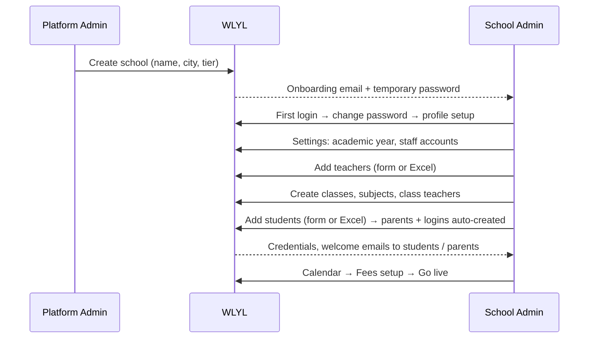
```mermaid
sequenceDiagram
  participant PA as Platform Admin
  participant SYS as WLYL
  participant SA as School Admin
  PA->>SYS: Create school (name, city, tier)
  SYS-->>SA: Onboarding email + temporary password
  SA->>SYS: First login → change password → profile setup
  SA->>SYS: Settings: academic year, staff accounts
  SA->>SYS: Add teachers (form or Excel)
  SA->>SYS: Create classes, subjects, class teachers
  SA->>SYS: Add students (form or Excel) → parents + logins auto-created
  SYS-->>SA: Credentials, welcome emails to students / parents
  SA->>SYS: Calendar → Fees setup → Go live
```

Every tier/feature change by the Platform Admin is written to the **immutable audit log** (actor, entity, before/after).

---

<!-- SOURCE FILE: docs/product/features/01-overview-dashboard.md -->

# 01 · Overview Dashboard

| | |
|---|---|
| **Feature key** | `overview` |
| **Category** | Core |
| **Portals** | School Admin |
| **Status** | **BUILT** — works end to end on `dev` |
| **Primary users** | Owner, principal, vice principal |
| **Snapshot** | `dev` @ `29f0e6a`, 2026-09-21 |

---

## 1. Product brief

**The problem.** A principal starts the day not knowing whether every class was marked, how fees are going, or what exams are coming. The answer sits in registers, Excel sheets and phone calls.

**The solution.** The first screen after sign-in is the school on one page: people counts, today's attendance, upcoming exams and fee collection, loaded in **one batched request** so it is fast even on a school-office connection.

**What the admin sees**

| Block | What it tells them |
|---|---|
| Counts | Teachers, students, classes, and the **current academic year** |
| Today's attendance | "Morning marked in N of M classes" — and who has not marked yet |
| Holiday banner | On a holiday or weekly-off day it **replaces** the attendance strip, so a closed day never looks like a problem |
| Upcoming exams | The next scheduled exams |
| Fee collection % | How much of what was billed has been collected |

**Value.** Replaces the morning round of phone calls. It is the screen that makes the platform *feel* like a control room in a demo.

**Where it stops.** It is a summary, not a report. Deep views live in Attendance (school → class → student), Fee Management (reports) and Export. It is school-admin only; teachers have their own snapshot inside the teacher portal.

## 2. End-to-end flow

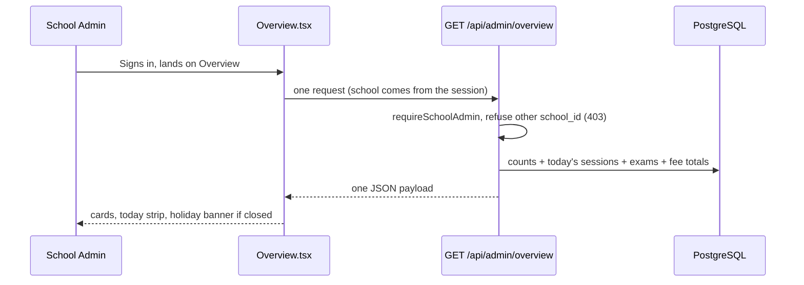
```mermaid
sequenceDiagram
  participant A as School Admin
  participant UI as Overview.tsx
  participant API as GET /api/admin/overview
  participant DB as PostgreSQL
  A->>UI: Signs in, lands on Overview
  UI->>API: one request (school comes from the session)
  API->>API: requireSchoolAdmin, refuse other school_id (403)
  API->>DB: counts + today's sessions + exams + fee totals
  API-->>UI: one JSON payload
  UI-->>A: cards, today strip, holiday banner if closed
```

**Step by step**

1. Admin signs in; the app opens `/school-admin` on Overview.
2. The screen asks for the school's data. The `school_id` is optional and only ever compared to the session — a different school is refused.
3. The server totals teachers, students and classes, checks whether **today (IST)** is a holiday or weekly-off using the shared attendance rules, counts marked sessions against classes, lists upcoming exams and computes fee-collected %.
4. The page renders; if today is non-working it shows the holiday banner instead of the attendance strip.
5. The academic year label comes from `GET /api/academic-year/current`.

## 3. Business rules & edge cases

| Rule | Detail |
|---|---|
| Tenant | School always from the login; another school's id → **403** |
| Attendance figures | Use `lib/attendanceRules.ts` — same numbers as the attendance dashboard |
| Non-working day | Holiday or weekly off → banner, no "unmarked" alarm |
| "Today" | India time, regardless of server time zone |
| No data yet | New school with no classes shows zero counts, not an error |
| Feature gate | Hidden if `overview` is switched off for the school's plan |

## 4. Technical reference (developers)

**Screens**
- `app/school-admin/components/Overview.tsx` (~350 lines; currently being restyled in the working tree by the shared portal design layer)

**API**

| Method | Route | Purpose | Guard |
|---|---|---|---|
| GET | `/api/admin/overview` | Batched dashboard payload | `requireSchoolAdmin`; `school_id` must equal session |
| GET | `/api/academic-year/current` | Current academic year label | session |

**Tables read:** `academic_years`, `attendance`, `attendance_sessions`, `classes`, `exam_records`, `student_fee_ledger`, `students`, `teachers` (read-only; nothing is written).

**Libraries:** `lib/attendanceRules.ts`, `lib/academicYear.ts`, `lib/grades.ts`, `lib/auth.ts`, `lib/db.ts`.

**Design notes**
- One batched endpoint instead of many small ones — fewer round trips, and the pool is `max: 1` on Vercel so each request must be cheap.
- No writes → no idempotency or locking concerns.

**Tests:** exercised by `workflow-school-admin.spec.ts` and `workflow-full-platform.spec.ts`. `e2e/docs-coverage.spec.ts` guarantees this doc and its evidence block stay current.

## 5. Pitch kit

**Investor one-liner** — "The principal opens one screen and knows if every class was marked, how fees stand and what's next — before the first bell."

**School one-liner** — "Your whole school at a glance, the moment you sign in."

**Slide bullets**
- One screen: people, today's attendance, exams, fee collection.
- Holiday-aware: closed days never show false alarms.
- Loads in one request; built for slow school-office internet.

**60-second demo:** sign in → point at today's attendance strip → mark a class in another window → refresh to show it change → click through to the class.

**Objection → honest answer**
- *"Is it customisable?"* — Not yet; the blocks are fixed. Deeper analytics are on the roadmap, not live.

## 6. Limits & roadmap

- No customisable widgets, no school "health score" (roadmap: later).
- Data freshness is per page load; no live push.

---

<!-- SOURCE FILE: docs/product/features/02-staff-directory-and-onboarding.md -->

# 02 · Staff Directory & Onboarding

| | |
|---|---|
| **Feature key** | `staff` |
| **Category** | Core |
| **Portals** | School Admin (teachers then use the Teacher portal) |
| **Status** | **BUILT** |
| **Primary users** | School admin |
| **Snapshot** | `dev` @ `29f0e6a`, 2026-09-21 |

---

## 1. Product brief

**The problem.** Schools keep staff lists in Excel and hand out passwords on paper. When a teacher leaves nobody switches their access off.

**The solution.** Add teachers one by one or **by uploading a spreadsheet**. The system issues an **employee id** and a **temporary password**, emails the teacher, forces a password change at first login, and lets the admin search, filter, edit or deactivate.

| Capability | Detail |
|---|---|
| Add a teacher | Form, or upload a CSV/Excel (a template is downloadable) |
| Bulk import preview | The file is parsed and checked **before** anything is saved |
| Identity | Auto **employee id**; the teacher signs in with employee id + password |
| First login | Must change the temporary password |
| Directory | Search, filter by department and staff type, edit profile fields |
| Remove | **Soft delete** — the teacher immediately can no longer mark attendance; history is kept |
| Plan limits | `staff_limit` per plan is enforced when accounts are created |

**Two kinds of staff — do not confuse them**
- **Teachers** (this feature) sign in to the **Teacher portal** with an employee id.
- **School-admin-level staff** (principal, vice principal, extra admins) are invited from **School Settings → Staff accounts** with a one-time set-password link — see [18 · School Settings](18-school-settings.md).

**Value.** Onboarding an entire staff room in minutes instead of days; no password sheets; instant offboarding.

**Where it stops.** No payroll, leave or HR records. (Leave requests and emergency cover existed earlier and were **removed** from `dev`.)

## 2. End-to-end flow

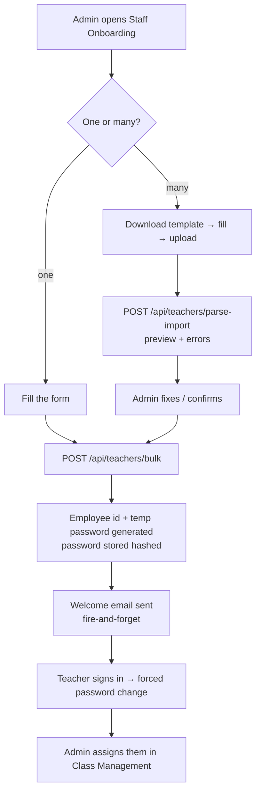
```mermaid
flowchart TD
  A["Admin opens Staff Onboarding"] --> B{"One or many?"}
  B -- one --> C["Fill the form"]
  B -- many --> D["Download template → fill → upload"]
  D --> E["POST /api/teachers/parse-import<br/>preview + errors"]
  E --> F["Admin fixes / confirms"]
  C & F --> G["POST /api/teachers/bulk"]
  G --> H["Employee id + temp password generated<br/>password stored hashed"]
  H --> I["Welcome email sent<br/>fire-and-forget"]
  I --> J["Teacher signs in → forced password change"]
  J --> K["Admin assigns them in Class Management"]
```

**Step by step (admin)**
1. Open **Staff** → *Add teacher*.
2. Enter name, email, subject, phone, department, qualification, date of joining, staff type and the grades they teach — or upload the filled template.
3. Review the import preview; rows with problems are listed, not silently dropped.
4. Confirm. Each teacher gets an employee id of the form `<school prefix>-<random 5 digits>`; a collision is retried automatically.
5. The teacher receives their id and temporary password by email.
6. On first sign-in the teacher is sent to *change password*.
7. To offboard: open the teacher → delete (soft). Their session can no longer mark attendance.

## 3. Business rules & edge cases

| Rule | Detail |
|---|---|
| Uniqueness | Employee id is unique **per school** (`idx_teachers_school_employee_id_unique`); the insert loops to a new suffix on collision |
| Password | Random temporary password, stored hashed; teacher must change it (`password_changed` flag) |
| Plan cap | `staff_limit` from `plan_pricing` is checked at creation |
| Soft delete | Deactivated teachers cannot mark attendance; records they created remain |
| Tenant | Every query filtered by the admin's `school_id` |
| Subjects | Subject choices come from the school's subject list (`/api/school/subjects`) and the platform catalog |
| Notifications | Welcome email fire-and-forget (never blocks the response). WhatsApp call is a **logging scaffold only** |

## 4. Technical reference (developers)

**Screens**
- `app/school-admin/components/StaffOnboarding.tsx` — add / bulk import
- `app/school-admin/components/TeachersManagement.tsx` — directory, edit, delete
- Teacher portal side: `app/teacher/*`, sign-in via `/api/teacher-auth/login`

**API**

| Method | Route | Purpose |
|---|---|---|
| GET | `/api/teachers` | List/search teachers for the school |
| GET | `/api/teachers/template` | Download the Excel template |
| POST | `/api/teachers/parse-import` | Parse an uploaded file and return a validated preview |
| POST | `/api/teachers/bulk` | Create teachers (used for **both** single and bulk add) |
| GET/PUT/DELETE | `/api/teachers/{id}` | Read, update, soft-delete |
| GET | `/api/school/subjects` | School subjects for the picker |
| GET/POST/DELETE | `/api/platform/subjects` | Platform subject catalog (Platform Admin) |
| GET | `/api/admin/overview` | Counts for the header |

The single-add `POST /api/teachers` was dead code and was removed; onboarding always goes through `/bulk`.

**Tables:** `teachers` (with `employee_id`, `department`, `qualification`, `date_of_joining`, `staff_type`, `teaches_grades`, `password_hash`, `password_changed`), plus reads/cleanups touching `classes`, `class_subjects`, `attendance*`, `notifications`.

**Libraries:** `lib/auth.ts` (`hashPassword`, `generateTempPassword`, `generateEmployeeId`), `lib/email.ts`, `lib/matchTeacher.ts` (teacher ↔ class/subject matching), `lib/nameValidation.ts`, `lib/whatsapp.ts` (scaffold).

**Security:** admin-only routes use `requireSchoolAdmin` / `requireFeeAccess`; a platform-admin path exists for support. The teacher session cookie is `wlyl-teacher` (JWT, 7 days).

**Tests:** `workflow-staff-onboarding.spec.ts`, `staff-teacher-data-flow.spec.ts`, `auth-teacher.spec.ts`.

## 5. Pitch kit

**Investor one-liner** — "Onboard a whole staff room from one spreadsheet; access is issued and revoked in a click."

**School one-liner** — "Upload your staff list once. Every teacher gets their own login — and when someone leaves, their access ends the same minute."

**Slide bullets**
- Excel/CSV bulk import with preview and error report.
- Auto employee id + temporary password; forced first-login change.
- Instant offboarding (soft delete keeps history).
- Plan-aware staff limits.

**60-second demo:** upload the template with 5 teachers → show the preview → confirm → open a second window and sign in as one → forced password change.

**Objection → honest answer**
- *"Can we send passwords by WhatsApp?"* — Not today. Email only; WhatsApp is on the roadmap pending Meta setup.

## 6. Limits & roadmap

- No payroll / HR / leave (removed earlier, preserved on branches).
- WhatsApp delivery of credentials is **not built**.
- Roadmap: bulk deactivate, staff roles beyond teacher, timetable (built on a branch, awaiting sign-off).

---

<!-- SOURCE FILE: docs/product/features/03-students-list-and-onboarding.md -->

# 03 · Students List & Onboarding (with Student 360)

| | |
|---|---|
| **Feature key** | `students` |
| **Category** | Core |
| **Portals** | School Admin |
| **Status** | **BUILT** |
| **Primary users** | School admin, front-office staff |
| **Snapshot** | `dev` @ `29f0e6a`, 2026-09-21 |

---

## 1. Product brief

**The problem.** Admissions arrive in a rush each April. Data is typed into Excel, parents are duplicated across siblings, and nobody has a single place to see "everything about this child" before a parent meeting.

**The solution.** One place to add students (singly or by spreadsheet), automatically link **parents** and create **logins**, catch **duplicates**, and open a **Student 360 profile** with attendance, marks, fees and talking points.

| Capability | Detail |
|---|---|
| Add one / bulk | Form or CSV/Excel template; bulk runs through duplicate detection first |
| System id | `wlyl-stu-<school>-<5 digits>` — the student's login id |
| Class roll number | `school_roll_number`, **unique per grade + section** (separate from the system id) |
| Parents | Found by email, then phone **within the school**, else created and linked; siblings share one parent |
| Credentials | Student and parent logins issued; welcome / credential emails sent; **reset** on demand |
| Duplicates | Detected before saving (roll number, parent phone, name pairs); a cleanup tool with an audit log |
| Lifecycle | Edit, promote (via Year Rollover), deactivate; graduates flagged `graduated` |
| **Student 360** | Talking points for the parent meeting, contacts, attendance, marks, fees, activity — with a **year switcher** for past years |
| Portal backfill | Create missing portal accounts for students added before a portal was enabled |

**Value.** Admissions day becomes a file upload. The principal walks into a parent meeting with the child's whole picture in one page.

**Where it stops.** No admission-enquiry pipeline, no document/certificate storage, no annual multi-exam report card (a per-exam printable report card exists in Export Center).

## 2. End-to-end flow

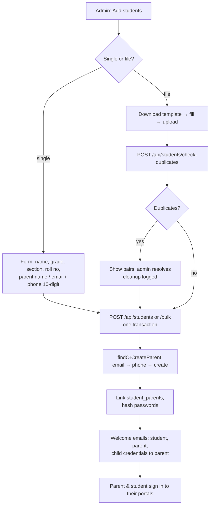
```mermaid
flowchart TD
  A["Admin: Add students"] --> B{"Single or file?"}
  B -- single --> C["Form: name, grade, section, roll no,<br/>parent name / email / phone 10-digit"]
  B -- file --> D["Download template → fill → upload"]
  D --> E["POST /api/students/check-duplicates"]
  E --> F{"Duplicates?"}
  F -- yes --> G["Show pairs; admin resolves<br/>cleanup logged"]
  F -- no --> H
  C --> H["POST /api/students or /bulk<br/>one transaction"]
  G --> H
  H --> I["findOrCreateParent:<br/>email → phone → create"]
  I --> J["Link student_parents;<br/>hash passwords"]
  J --> K["Welcome emails: student, parent,<br/>child credentials to parent"]
  K --> L["Parent & student sign in to their portals"]
```

**Step by step (admin)**
1. **Students → Add** (or *Bulk upload*). Grade, section and a valid **10-digit Indian mobile** for the parent are required.
2. For a file, the system checks every row against existing students and within the file, and shows the conflicts.
3. On confirm the student row, parent row and link are created **in one transaction**. If the parent-portal feature is off for this school, existing parents are still linked but **no new parent account is created**.
4. Emails go out fire-and-forget: student welcome, parent welcome and the child's credentials to the parent.
5. Later, **click a name** anywhere (Students, Class Management) to open **Student 360**.
6. **Reset credentials** re-issues a password if a family loses it.

**Student 360 (`GET /api/students/{id}/profile`)** — read-only and school-scoped: parent-meeting talking points, contacts, attendance summary, marks, fees, recent activity, and a switcher to previous academic years (from `student_class_history` / snapshots).

## 3. Business rules & edge cases

| Rule | Detail |
|---|---|
| Parent phone | Must be a valid 10-digit Indian mobile; unique per school (`idx_parents_school_phone_unique`) |
| Roll number | Unique within `(school_id, grade, section)`; may be blank after a promotion and reassigned |
| Siblings | A batch cache guarantees two siblings in one upload resolve to **one** parent row, not a race of duplicates |
| Name checks | `nameValidation` rejects obviously bad names |
| Duplicates | Pair detection by roll number and phone; cleanup writes `student_cleanup_log`; nothing is deleted silently |
| Tenant | Every query scoped to the admin's school; profile endpoint is read-only |
| Feature switches | Student/parent account creation follows `student-portal` / `parent-portal` |

## 4. Technical reference (developers)

**Screens**
- `StudentOnboarding.tsx` (add + bulk), `StudentsManagement.tsx` (list, edit, promote, reset), `StudentProfile.tsx` (Student 360) — `app/school-admin/components/` (~2,000 lines total).

**API**

| Method | Route | Purpose |
|---|---|---|
| GET/POST | `/api/students` | List; create one |
| POST | `/api/students/bulk` | Bulk create (transactional, uses batch cache) |
| POST | `/api/students/check-duplicates` | Pre-save conflict check |
| GET | `/api/students/duplicates` | Existing duplicate pairs |
| POST | `/api/students/duplicates/cleanup` | Resolve duplicates (audited) |
| GET | `/api/students/template` | Excel template (ExcelJS) |
| GET/PUT/DELETE | `/api/students/{id}` | Read / update / deactivate |
| GET | `/api/students/{id}/profile` | Student 360 payload |
| POST | `/api/students/{id}/reset-credentials` | Re-issue login |
| GET/POST | `/api/school-admin/students/backfill-portal` | Create missing portal accounts |
| GET/POST/PUT | `/api/attendance` | Used by the profile for attendance |

**Tables:** `students`, `parents`, `student_parents`, `classes`, `student_fee_ledger`, `fee_payments`, `fee_waivers`, `exam_records`, `attendance`, `attendance_sessions`, `student_cleanup_log`, `platform_audit_log`.

**Libraries:** `lib/studentOnboarding.ts` (`generateStudentId`, `findOrCreateParent`, credential emails), `lib/studentProfile.ts`, `lib/nameValidation.ts`, `lib/parseCSV.ts`, `lib/academicYear.ts`, `lib/attendance*`, `lib/email.ts`.

**Validation:** Zod on the create/bulk bodies. **Auth:** `requireSchoolAdmin` / `requireFeeAccess`; family portals read through `student_parents`.

**Design notes**
- `roll_number` (system id, `VARCHAR`) vs `school_roll_number` (`INTEGER`, class roll) are deliberately separate.
- `findOrCreateParent(..., createIfMissing)` keeps portal gating consistent with the feature flags.

**Tests:** `workflow-student-onboarding.spec.ts`, `workflow-student-csv-import.spec.ts`, `workflow-student-profile.spec.ts`, `auth-student.spec.ts`, `auth-parent.spec.ts`.

## 5. Pitch kit

**Investor one-liner** — "Admissions become a spreadsheet upload: students, parents and logins created and linked automatically, duplicates caught."

**School one-liner** — "Upload your admission list and every child and parent gets their own login. Open any child and see everything — in one page."

**Slide bullets**
- Bulk upload with duplicate detection and sibling-aware parent linking.
- Student + parent logins issued and emailed automatically.
- **Student 360:** attendance, marks, fees and talking points for the parent meeting.
- Full history across academic years.

**60-second demo:** upload 20 students (two siblings) → show one parent for both → open Student 360 → flip the year switcher.

**Objection → honest answer**
- *"Can we import from our old software?"* — Any CSV/Excel that matches the template; there is no direct integration with other school software.

## 6. Limits & roadmap

- No enquiry/admission pipeline, no document uploads, no annual multi-exam report card.
- Credentials go by **email** only.
- Roll numbers cleared on promotion when they collide need re-assigning by the school (the rollover screen reports how many).

---

<!-- SOURCE FILE: docs/product/features/04-class-management.md -->

# 04 · Class Management

| | |
|---|---|
| **Feature key** | `class-management` |
| **Category** | Core |
| **Portals** | School Admin |
| **Status** | **BUILT** |
| **Primary users** | School admin |
| **Snapshot** | `dev` @ `29f0e6a`, 2026-09-21 |

---

## 1. Product brief

**The problem.** Everything in a school hangs off the class — who teaches it, what subjects, which students, who marks attendance — and it usually lives in someone's head.

**The solution.** Create each class (**grade + section**), name its **class teacher**, attach **subjects with a teacher each**, and assign the syllabus. This is the wiring diagram every other feature reads.

| Capability | Detail |
|---|---|
| Create / edit class | Grade + section; unique per school |
| Class teacher | Gets the **My class** attendance dashboard and is the reviewer of exam marks |
| Subjects | Add subjects to a class and assign a teacher to each |
| Syllabus | Assign the syllabus (from the school's own copy) to the class |
| Students tab | Roster of the class; click a name for Student 360 |
| Overview tab | Recent attendance for the class |
| Soft delete | A class can be removed without destroying history |

**Why it matters for the platform.** Attendance marking, exam creation (a class's exam subjects come from *that class's own subjects*), teacher screens, syllabus visibility and year rollover all depend on this setup.

**Where it stops.** No timetable (built on a separate branch, awaiting sign-off) and no room/period scheduling.

## 2. End-to-end flow

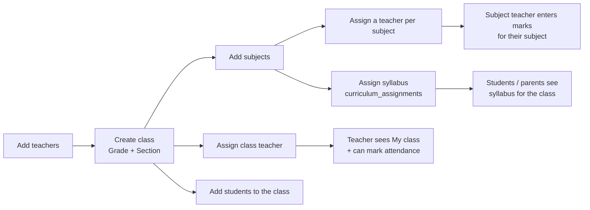
```mermaid
flowchart LR
  A["Add teachers"] --> B["Create class<br/>Grade + Section"]
  B --> C["Assign class teacher"]
  B --> D["Add subjects"]
  D --> E["Assign a teacher per subject"]
  D --> F["Assign syllabus<br/>curriculum_assignments"]
  B --> G["Add students to the class"]
  C --> H["Teacher sees My class<br/>+ can mark attendance"]
  E --> I["Subject teacher enters marks<br/>for their subject"]
  F --> J["Students / parents see<br/>syllabus for the class"]
```

**Step by step**
1. Ensure teachers exist ([02](02-staff-directory-and-onboarding.md)).
2. **Class Management → New class**: grade and section.
3. Pick the **class teacher**.
4. **Subjects tab**: add subjects; assign a teacher to each; assign the syllabus.
5. **Students tab**: add or move students; open any name for Student 360.
6. Open **Overview** to see recent attendance for the class.

## 3. Business rules & edge cases

| Rule | Detail |
|---|---|
| Ownership | A class belongs to exactly one school; classes are soft-deleted |
| Class teacher | Drives access to the class attendance dashboard (`class_teacher_grade` mapping) and exam review |
| Subject list per class | Exams take each class's **own** `class_subjects` — a class never gets a subject it doesn't teach |
| Syllabus source | `curriculum_assignments` links class + subject to the school's syllabus copy |
| Year | Class structure is per school; students move between classes through Year Rollover |
| Tenant | Guarded by `requireSchoolAdmin` / `getAnySession` |

## 4. Technical reference (developers)

**Screens:** `app/school-admin/components/ClassManagement.tsx` (~970 lines).

**API**

| Method | Route | Purpose |
|---|---|---|
| GET/POST | `/api/classes` | List / create |
| GET/PUT/DELETE | `/api/classes/{id}` | Read / edit / soft-delete |
| GET/POST/PATCH/DELETE | `/api/classes/{id}/subjects` | Class subjects and their teachers |
| GET | `/api/school/subjects` | Subject list for the school |
| GET | `/api/teachers` | Teacher picker |
| GET/POST | `/api/students` | Roster |
| GET/POST/PUT | `/api/attendance` | Recent attendance on the Overview tab |

**Tables:** `classes`, `class_subjects`, `curriculum_assignments`, `school_subjects`, `school_chapters`, `school_topics`, `school_tasks`, `school_resources`, `school_topic_progress`, `students`, `teachers`, `attendance`, `attendance_sessions`.

**Libraries:** `lib/curricula.ts`, `lib/matchTeacher.ts`, `lib/grades.ts` (grade ordering, used by rollover), `lib/attendance*`.

**Design notes**
- Grade values may be numeric or named (`Nursery`, `LKG`, `UKG`) — `lib/grades.ts` owns ordering, which Year Rollover uses to promote.
- Subject-teacher permission checks for marks entry use `class_subjects` / `exam_subjects.teacher_id`.

**Tests:** `workflow-school-admin.spec.ts`, `workflow-portals.spec.ts`, `staff-teacher-data-flow.spec.ts`.

## 5. Pitch kit

**Investor one-liner** — "The class is the spine of the product: define it once and attendance, marks, syllabus and rollover all follow."

**School one-liner** — "Set up each class once — teacher, subjects, students — and the whole school runs from it."

**Slide bullets**
- Grade + section, class teacher, subject teachers in one screen.
- Roster with one-click Student 360.
- Feeds attendance, exams, syllabus and year rollover automatically.

**60-second demo:** create "Grade 6-A" → set class teacher → add Maths + Telugu with teachers → show the teacher's portal now lists the class.

**Objection → honest answer**
- *"Do you do the timetable?"* — Not on `dev`. A timetable workflow is built on its own branch and awaiting sign-off.

## 6. Limits & roadmap

- No timetable/periods on `dev`.
- No capacity limits, house/club groupings, or multi-section merging.

---

<!-- SOURCE FILE: docs/product/features/05-student-portal.md -->

# 05 · Student Portal Access

| | |
|---|---|
| **Feature key** | `student-portal` (switch lives in School Admin; the portal itself is `/student`) |
| **Category** | Core |
| **Portals** | Student (delivery), School Admin (switch) |
| **Status** | **BUILT** |
| **Primary users** | Students |
| **Overridable per school** | **Yes** (`school_feature_overrides`) |
| **Snapshot** | `dev` @ `29f0e6a`, 2026-09-21 |

---

## 1. Product brief

**The problem.** Students learn their attendance and marks late, secondhand, or not at all.

**The solution.** A personal portal at `/student` where each child sees **only their own** school life.

| Tab | What the student gets |
|---|---|
| Dashboard | Attendance ring, recent marks, announcements |
| My Attendance | Own colour calendar, month/year %, six-month trend, upcoming holidays |
| My Marks | Released exam results with grades |
| Syllabus | Progress through the subjects (read-only) |
| Digital Library | Materials for their class's subjects |
| School Calendar | Holidays, exams, events (read-only) |
| Class Circle | Classmates' birthdays; send a wish |
| AI Hub | A page of **links** to external assistants (Gemini, Claude, ChatGPT) — **only** for schools with AI access switched on. It is **not** a built-in tutor |
| Profile | Change password, add date of birth |

Which tabs show is decided by the school's plan through the feature switches (`attendance`, `exam-marks`, `curriculum`, `library`, `calendar`).

**Value for the school.** Students and parents see the same numbers (shared rule modules) so there are fewer arguments; the school looks modern.

**Where it stops.** Removed from `dev` and preserved on branches: Learning Hub & Daily Knowledge, weekly test, rewards marketplace. There is no homework, doubts or leave feature in the live product.

## 2. End-to-end flow

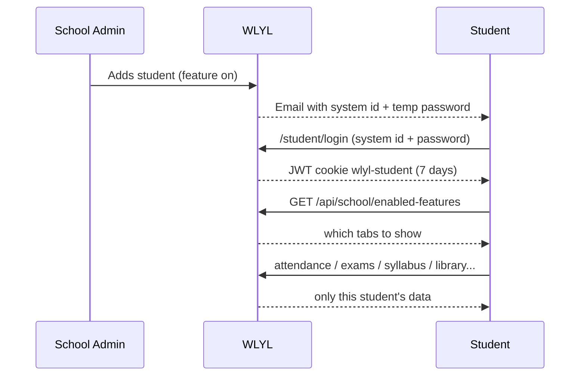
```mermaid
sequenceDiagram
  participant AD as School Admin
  participant SYS as WLYL
  participant ST as Student
  AD->>SYS: Adds student (feature on)
  SYS-->>ST: Email with system id + temp password
  ST->>SYS: /student/login (system id + password)
  SYS-->>ST: JWT cookie wlyl-student (7 days)
  ST->>SYS: GET /api/school/enabled-features
  SYS-->>ST: which tabs to show
  ST->>SYS: attendance / exams / syllabus / library...
  SYS-->>ST: only this student's data
```

**Step by step (student)**
1. Sign in at `/student/login` with the system id (`wlyl-stu-…`) and password; change the password when prompted.
2. First time: add a date of birth (`/student/add-birthday`) — used by Class Circle.
3. Land on the Dashboard; the sidebar shows only the tabs the school's plan includes.
4. **My Marks** lists an exam **only after the admin releases it**.
5. **Class Circle** shows classmates with birthdays coming up; a wish is one tap.

**Admin side:** turn the portal on/off per school (Platform Admin → school → overrides, or the tier); credentials for students added earlier are created with *Backfill portal accounts* ([03](03-students-list-and-onboarding.md)).

## 3. Business rules & edge cases

| Rule | Detail |
|---|---|
| Own data only | Every student endpoint derives the student from the session, never from a parameter; class-level attendance is never exposed |
| Marks visibility | Only exams with status `released` |
| Feature gating | Tabs from `/api/school/enabled-features`; `PORTAL_NAV_KEY_ALIASES` maps `my-marks` → `exam-marks`, `syllabus` → `curriculum` |
| AI Hub | Visible only when `school_ai_access` says so; external links only |
| Birthdays | Cron `birthday-sweep` (daily 18:30 UTC) creates birthday posts; wishes stored in `birthday_wishes` |
| Sessions | JWT 7 days, cookie `wlyl-student`; logout clears it |

## 4. Technical reference (developers)

**Screens:** `app/student/page.tsx` and `app/student/components/` — `StudentDashboard`, `StudentSyllabus`, `StudentMarks`, `StudentClassCircle`, `StudentAiHub`, `StudentProfile`; shared `app/components/AttendanceCalendar.tsx`, `SchoolCalendarView.tsx`, `library/DigitalLibrary.tsx`.

**API**

| Method | Route | Purpose |
|---|---|---|
| POST | `/api/student/auth/login` | Sign in (system id, case-insensitive) |
| GET | `/api/student/auth/me` | Session + profile |
| POST | `/api/student/auth/change-password`, `/logout`, `/forgot-password`, `/reset-password` | Account |
| PUT | `/api/student/auth/date-of-birth` | Add DOB |
| GET | `/api/student/attendance?month=` | Own attendance (shared rules) |
| GET | `/api/students/{id}/exams` | Own released results |
| GET | `/api/student/class-circle`, POST `/class-circle/wish` | Birthdays |
| GET | `/api/school/enabled-features` | Nav gating |
| GET | `/api/school/library`, `/api/school/subjects/materials`, `/api/syllabus` | Library, syllabus |
| GET | `/api/announcements` | Announcements for the student audience |
| GET/PUT | `/api/schools/{id}/ai-access` | AI Hub switch |

**Tables:** `students`, `student_parents`, `classes`, `attendance*`, `exam_records/subjects/marks`, `parent_mark_acks`, `announcements`, `birthday_posts`, `birthday_wishes`, `class_circles`, `school_ai_access`, syllabus tables (`school_*`, `class_*_visibility`), `master_subject_materials`.

**Libraries:** `lib/attendanceStudentView.ts`, `lib/examGrading.ts`, `lib/birthday.ts`, `lib/classCircle.ts`, `lib/features-context.tsx`, `lib/usageTracking.ts`.

**Security:** `getStudentSession()`; the token payload carries the student id and school id.

**Tests:** `auth-student.spec.ts`, `workflow-portals.spec.ts`, `workflow-attendance.spec.ts` (identical numbers in all four portals).

## 5. Pitch kit

**Investor one-liner** — "Every student gets a personal window into their school life, on the same data the teachers use."

**School one-liner** — "Your students see their own attendance, marks and syllabus — accurate, simple, and only theirs."

**Slide bullets**
- Attendance ring, marks with grades, syllabus progress, library, calendar.
- Same numbers as the parent and teacher (single rule module).
- Plan-controlled: schools switch it on when ready.

**60-second demo:** sign in as a student → show the ring → open My Marks (only released exams) → Class Circle wish.

**Objection → honest answer**
- *"Is there an AI tutor?"* — No. The AI Hub only links out to external assistants. We do not market the product as AI-powered.

## 6. Limits & roadmap

- No homework/tasks, doubts, leave requests, rewards or weekly tests (removed; on branches).
- No push notifications; email only.
- Roadmap: parent/student report-card view, rebuilt analytics (Year-in-Review).

---

<!-- SOURCE FILE: docs/product/features/06-parent-portal.md -->

# 06 · Parent Portal Access

| | |
|---|---|
| **Feature key** | `parent-portal` (switch in School Admin; portal at `/parent`) |
| **Category** | Core |
| **Portals** | Parent (delivery), School Admin (switch) |
| **Status** | **BUILT** |
| **Primary users** | Parents / guardians |
| **Overridable per school** | **Yes** |
| **Snapshot** | `dev` @ `29f0e6a`, 2026-09-21 |

---

## 1. Product brief

**The problem.** Parents find out about absences, results and dues late — usually by phone, or when a child is already behind.

**The solution.** A parent portal at `/parent` showing **their own children only**: attendance, results, fees, exams, announcements, calendar, syllabus and the library — in **English or Telugu**.

| Area | What the parent gets |
|---|---|
| Child summary | Attendance %, upcoming exams, results waiting acknowledgement, fee status — per child |
| Attendance | Colour calendar, month/year %, days absent, **streak of full days**, six-month trend, upcoming holidays |
| Fees | Ledger, waivers, payment history and receipts; **report a UPI payment** (see [14](14-online-fee-payments-upi.md)) |
| Exams & results | Exam calendar; released results with grades; **Acknowledge** button |
| Announcements / Calendar | Audience-filtered notices; read-only school calendar |
| Syllabus / Library | What has been covered; class materials |
| Multiple children | Switch between siblings under one login |
| Language | English and Telugu (`app/parent/translations.ts`) |

**Value.** Fewer phone calls to the school office, earlier awareness of absence and dues, and an acknowledged-results trail for the school.

**Where it stops.** Read-mostly: parents cannot change data except acknowledging results and reporting a payment. **WhatsApp OTP sign-in is *not* live** (draft PR #155 pending Meta setup) — forgot-password goes by **email**. No chat, no leave requests.

## 2. End-to-end flow

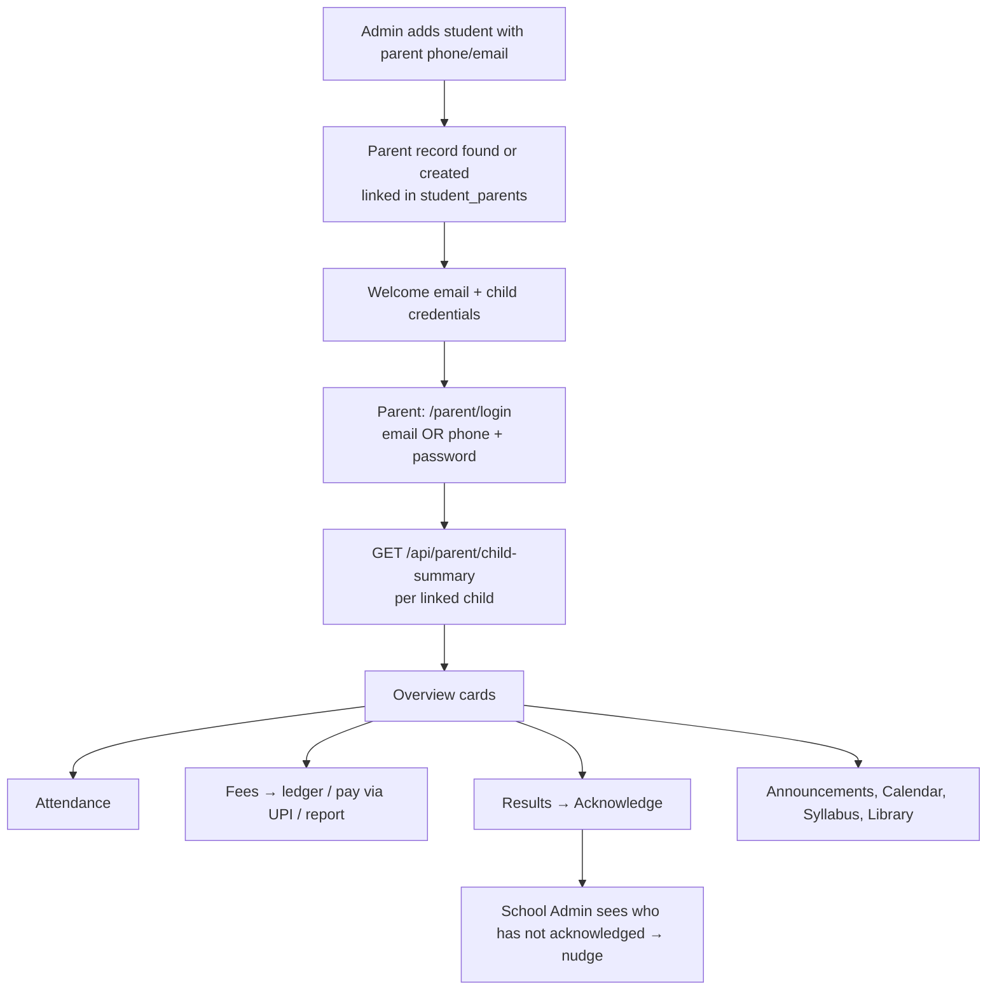
```mermaid
flowchart TD
  A["Admin adds student with parent phone/email"] --> B["Parent record found or created<br/>linked in student_parents"]
  B --> C["Welcome email + child credentials"]
  C --> D["Parent: /parent/login<br/>email OR phone + password"]
  D --> E["GET /api/parent/child-summary<br/>per linked child"]
  E --> F["Overview cards"]
  F --> G["Attendance"]
  F --> H["Fees → ledger / pay via UPI / report"]
  F --> I["Results → Acknowledge"]
  F --> J["Announcements, Calendar, Syllabus, Library"]
  I --> K["School Admin sees who has not acknowledged → nudge"]
```

**Step by step (parent)**
1. Sign in with the email **or** phone the school has on record; change the password on first login; optionally add a date of birth.
2. Overview shows a card per child with four numbers: attendance %, upcoming exams, results to acknowledge, overdue fees.
3. **Attendance** → tap a day for its detail; the streak counts full days in a row.
4. **Fees** → see each bill, waivers and payments; if Online Payments is enabled, pay through any UPI app and press *I've paid* to report it.
5. **Results** → after release, open the result and press **Acknowledge**.
6. Forgot password → reset link by email.

## 3. Business rules & edge cases

| Rule | Detail |
|---|---|
| Own children only | Reads go through `student_parents`; any other student id is answered **"not found"** (not "forbidden") |
| Phone uniqueness | A school cannot have two parent rows with the same phone (`idx_parents_school_phone_unique`) — so phone login is safe |
| Sign-in | Email or phone in one field; per-school lookup |
| Fees tab vs. UPI | Fees tab needs `fee-management`; the "Pay via UPI" sub-flow needs `online-payments` too |
| Duplicate submit | A per-attempt idempotency key stops a flaky connection creating two payment reports (`lib/idempotency.ts`) |
| Results | Visible only once the exam is `released`; acknowledgement recorded in `parent_mark_acks` |
| Feature gating | `results`/`exams` → `exam-marks`, `fees` → `fee-management`, `syllabus` → `curriculum` via the alias map |
| Password reset | Email link; a WhatsApp send call exists only as a logging scaffold |

## 4. Technical reference (developers)

**Screens:** `app/parent/page.tsx` (~1,650 lines incl. nav, overview, fees), `components/ParentProfile.tsx`, `components/ParentSyllabus.tsx`, shared attendance calendar and school calendar view, `translations.ts`. Section navigation is URL-driven via the `tab` query parameter.

**API**

| Method | Route | Purpose |
|---|---|---|
| POST | `/api/parent/auth/login`, `/logout`, `/change-password`, `/forgot-password`, `/reset-password` | Account |
| GET | `/api/parent/auth/me` | Session + linked children |
| PUT | `/api/parent/auth/date-of-birth` | DOB |
| GET | `/api/parent/child-summary` | Per-child overview numbers |
| GET | `/api/parent/attendance?student_id&month` | Child attendance (shared rules) |
| GET/POST | `/api/parent/fees` | Fee ledger (read) and payment report (write, idempotent) |
| GET | `/api/fees/upi-qr`, `/api/fees/upi-qr/info` | School UPI QR/info |
| POST | `/api/exams/{id}/acknowledge` | Acknowledge a result |
| GET | `/api/academic-years`, `/api/academic-year/current` | Year switcher |
| GET | `/api/school/enabled-features`, `/api/school/library`, `/api/syllabus`, `/api/announcements`, `/api/classes` | Gated content |

**Tables:** `parents`, `student_parents`, `students`, `student_fee_ledger`, `fee_payments`, `fee_waivers`, `fee_structures`, `fee_categories`, `exam_records/subjects/marks`, `parent_mark_acks`, `announcements`, `notifications`, `student_class_history`, `academic_year_snapshots`, syllabus and library tables.

**Libraries:** `lib/attendanceStudentView.ts`, `lib/idempotency.ts`, `lib/examsAuth.ts`, `lib/features-context.tsx`, `lib/usageTracking.ts`.

**Security:** `getParentSession()`; cookie `wlyl-parent`, JWT 7 days; every child-scoped query joins `student_parents`.

**Tests:** `auth-parent.spec.ts`, `workflow-portals.spec.ts`, `workflow-attendance.spec.ts`, `workflow-fee-management.spec.ts`.

## 5. Pitch kit

**Investor one-liner** — "The parent app that turns a school from a black box into a transparent partner: attendance, results and fees in the parent's language."

**School one-liner** — "Parents see attendance, results and fees for their own child — in English or Telugu — without calling the office."

**Slide bullets**
- Child summary, colour attendance calendar with streaks.
- Fee ledger + UPI payment reporting.
- Result **acknowledgement** with an admin follow-up list.
- Multi-child, English/Telugu.

**60-second demo:** sign in with a phone number → two children → show the attendance calendar → open a released result and acknowledge → back in admin show the acknowledgement list.

**Objection → honest answer**
- *"Do parents get WhatsApp alerts?"* — No. Absence alerts go by **email**. WhatsApp is on the roadmap pending Meta approval; we do not claim it today.

## 6. Limits & roadmap

- No WhatsApp OTP / alerts, no push, no chat.
- Roadmap: WhatsApp (Meta) + OTP sign-in, parent-facing report-card view, Parent Engagement analytics (built on a branch).

---

<!-- SOURCE FILE: docs/product/features/07-digital-library.md -->

# 07 · WLYL Digital Library

| | |
|---|---|
| **Feature key** | `library` |
| **Category** | Core |
| **Portals** | School Admin, Teacher, Student, Parent |
| **Status** | **BUILT** (content delivery). Text chunks are stored for future search — **no AI tutor uses them yet** |
| **Snapshot** | `dev` @ `29f0e6a`, 2026-09-21 |

---

## 1. Product brief

**The problem.** Study material is scattered across WhatsApp groups and pen-drives. Schools cannot share books with the right class, and teachers upload the same PDF ten times.

**The solution.** Two layers of learning content, both delivered inside the same screen:

1. **Platform master library** — WLYL maintains materials per subject; a school that subscribes to a subject gets that subject's materials for its classes.
2. **School textbook library** — the school admin or a teacher uploads the school's own textbooks; they are school-scoped.

| Role | What they do |
|---|---|
| Platform admin | Maintains master materials per subject |
| School admin / Teacher | Uploads and deletes school textbooks; picks class + subject |
| Student / Parent | Browse the materials for their class's subjects (read-only) |

**Value.** One trusted place for class material; visibility follows the class's subjects and the school's plan.

**Where it stops.** No search UI, no AI Q&A, no offline downloads management. Text extracted from uploaded textbooks is chunked into `textbook_chunks` **as groundwork only**.

## 2. End-to-end flow

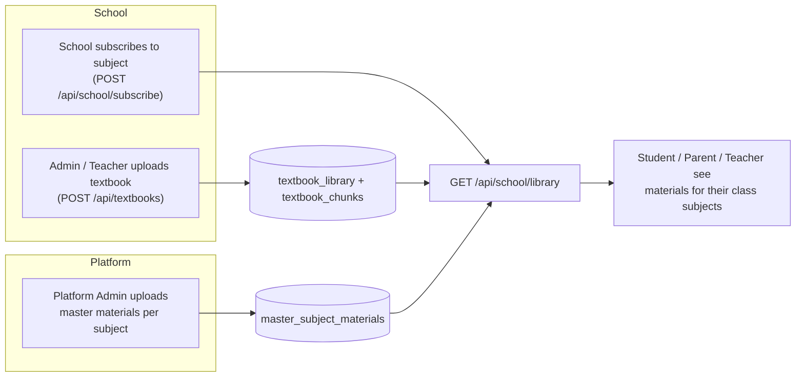
```mermaid
flowchart LR
  subgraph Platform
    P["Platform Admin uploads<br/>master materials per subject"]
  end
  subgraph School
    S["School subscribes to subject<br/>(POST /api/school/subscribe)"]
    T["Admin / Teacher uploads textbook<br/>(POST /api/textbooks)"]
  end
  P --> M[("master_subject_materials")]
  S --> V["GET /api/school/library"]
  M --> V
  T --> TL[("textbook_library + textbook_chunks")]
  TL --> V
  V --> R["Student / Parent / Teacher see<br/>materials for their class subjects"]
```

**Step by step**
1. Platform admin adds materials to a master subject.
2. The school subscribes to the subject ([09](09-syllabus-customizer.md)); the class gets that subject through Class Management.
3. A teacher opens **Digital Library**, chooses class + subject and uploads a textbook; it is stored school-scoped and split into text chunks.
4. Students and parents open **Digital Library**; the API returns only materials for **their class's subjects**.
5. Deleting a textbook (`DELETE /api/textbooks/{id}`) removes it for everyone in the school.

## 3. Business rules & edge cases

| Rule | Detail |
|---|---|
| Scope | Textbooks are per school; master materials are global but visible only to subscribing schools |
| Visibility | Follows `class_subjects` / `curriculum_assignments` and the plan's `library` switch |
| Roles | Students and parents are read-only; teachers see the classes/subjects they teach (`/api/teachers/{id}/class-subjects`) |
| Storage | Files go to Cloudflare R2 via presigned URLs; download links are presigned |
| Nav gating | `library` gates all four portals through `lib/features.ts` |

## 4. Technical reference (developers)

**Screens:** `app/components/library/DigitalLibrary.tsx` (shared by all portals), `app/school-admin/components/TextbookLibrary.tsx`, `app/teacher/components/TeacherLibrary.tsx`.

**API**

| Method | Route | Purpose |
|---|---|---|
| GET | `/api/school/library` | Materials visible to the caller (role-aware) |
| GET/POST | `/api/textbooks` | List / upload school textbooks |
| DELETE | `/api/textbooks/{id}` | Remove a textbook |
| GET | `/api/teachers/{id}/class-subjects` | Teacher's class/subject scope |
| GET/POST | `/api/classes` | Class picker |
| GET | `/api/school/subjects/materials` | Subject materials (used by student/parent) |

**Tables:** `master_subject_materials`, `textbook_library`, `textbook_chunks`, `school_subjects`, `class_subjects`, `curriculum_assignments`, `classes`, `student_parents`, `students`, `teachers`.

**Libraries:** `lib/r2.ts`, `lib/curricula.ts`, `lib/responseCache.ts`, `lib/auth.ts` (`getAnySession`, `getStudentSession`, `getParentSession`, `getTeacherSession`).

**Design notes:** the response is cached (`responseCache`) because the library is read-heavy and changes rarely.

**Tests:** covered indirectly by `workflow-portals.spec.ts` and the syllabus suites; no dedicated library spec.

## 5. Pitch kit

**Investor one-liner** — "A subject-aware content layer: WLYL's master library plus each school's own books, delivered to the right class."

**School one-liner** — "Upload your textbooks once; every student in that class can open them — and WLYL's own material is included."

**Slide bullets**
- Master library by subject + the school's own uploads.
- Delivered only to the classes that study the subject.
- One screen for admin, teacher, student, parent.
- Groundwork laid (text chunks) for future search.

**60-second demo:** teacher uploads a Maths textbook to Grade 6 → student in Grade 6 opens it → a Grade 7 student does not see it.

**Objection → honest answer**
- *"Can students ask questions of the book?"* — Not yet. Text is stored for future search but there is no AI tutor.

## 6. Limits & roadmap

- No in-book search or AI Q&A. No per-user progress or bookmarks.
- Content licensing of the master library is a business matter, not a code one — **`[TBD – founder]`**.

---

<!-- SOURCE FILE: docs/product/features/08-attendance-tracking.md -->

# 08 · Attendance Tracking (the showcase module)

| | |
|---|---|
| **Feature key** | `attendance` |
| **Category** | Scheduling |
| **Portals** | School Admin, Teacher, Student, Parent |
| **Status** | **BUILT** — the most developed module; use it as the demo centrepiece |
| **Deep reference** | [`docs/ATTENDANCE.md`](../../ATTENDANCE.md) (verified accurate against the code) |
| **Snapshot** | `dev` @ `29f0e6a`, 2026-09-21 |

---

## 1. Product brief

**The problem.** Attendance is the daily heartbeat of a school, yet registers get lost, two teachers mark the same class, holidays distort percentages, and each report shows a different number.

**The solution.** Two-session daily attendance (Morning, Afternoon) with **locking, holiday awareness, role-specific dashboards and one formula everywhere**.

| Capability | Detail |
|---|---|
| Marking | **Any teacher** can mark **any class**, Morning or Afternoon; two taps per student, review, submit |
| Locking | The **first submit locks** that class + date + session, database-enforced; others see "Already marked by …" |
| Corrections | The marking teacher **same day**; the **admin any time**; other teachers use **Report a mistake** |
| Holidays | Holidays and weekly-off days can't be marked and are **excluded from every percentage** |
| Offline | Teacher screen queues marking offline with clear "not saved because…" messages |
| Alerts | Parents of a student **newly marked absent today** get an **email** |
| Exports | Class register CSV, daily absentee list (for keying into LEAP manually) |
| Dashboards | Admin: school → class → student; class teacher: **My class**; parent/student: personal calendar |

**Dashboards by role**

| Role | Question answered | On screen |
|---|---|---|
| School admin (Overview) | "How is the school doing, where do I act?" | Period switch (7 days / month / school year), school %, students below 75%, today strip (classes marked, who hasn't), mistake-report alert, trend, class ranking, needs-attention list, student search |
| Class teacher (My class) | "Which of my students need help?" | Class %, need-attention count, absent today, trend, **weekday pattern**, filterable student list |
| Parent / student | "How am I / is my child doing?" | Calendar, month + year %, streak, trend, upcoming holidays |

**Value.** Accurate, trusted numbers; early intervention (students below 75% or absent 3+ days in a row); fewer disputes because every screen shows the same figure.

**Where it stops.** Whole-school holidays only (no class-specific or half-day closures). **No direct LEAP integration**; **no WhatsApp alerts** (email only). No biometric/RFID capture.

## 2. End-to-end flow

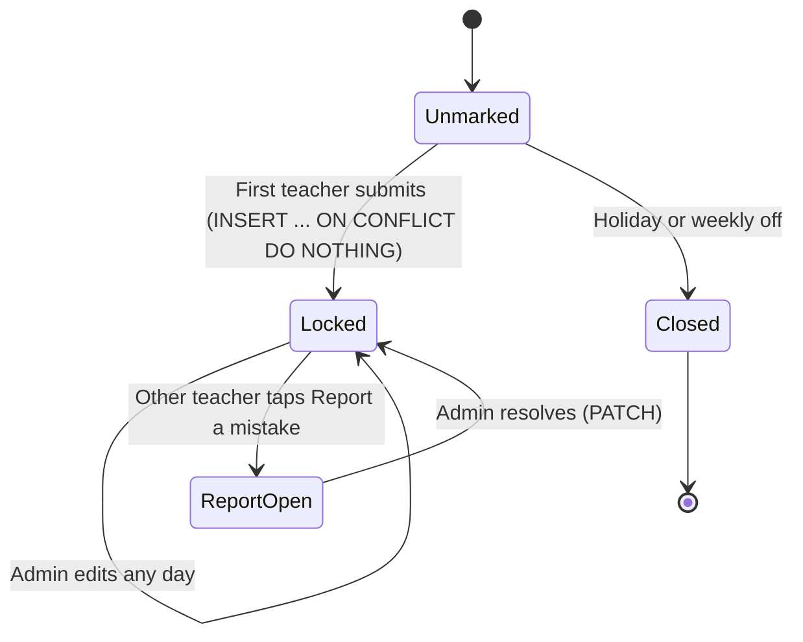
```mermaid
stateDiagram-v2
  [*] --> Unmarked
  Unmarked --> Locked: First teacher submits (INSERT ... ON CONFLICT DO NOTHING)
  Unmarked --> Closed: Holiday or weekly off
  Locked --> Locked: Same teacher, same day, edits
  Locked --> Locked: Admin edits any day
  Locked --> ReportOpen: Other teacher taps Report a mistake
  ReportOpen --> Locked: Admin resolves (PATCH)
  Closed --> [*]
```

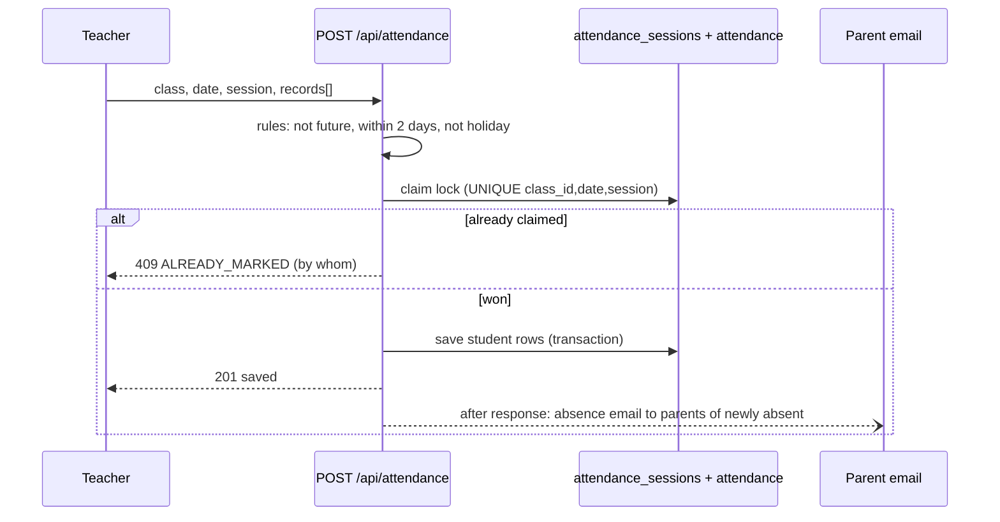
```mermaid
sequenceDiagram
  participant T as Teacher
  participant API as POST /api/attendance
  participant DB as attendance_sessions + attendance
  participant M as Parent email
  T->>API: class, date, session, records[]
  API->>API: rules: not future, within 2 days, not holiday
  API->>DB: claim lock (UNIQUE class_id,date,session)
  alt already claimed
    API-->>T: 409 ALREADY_MARKED (by whom)
  else won
    API->>DB: save student rows (transaction)
    API-->>T: 201 saved
    API--)M: after response: absence email to parents of newly absent
  end
```

**Step by step**
- **Teacher:** *Attendance* → class picker (each class shows Morning/Afternoon state and who marked) → mark sheet → review → **Submit**. If someone already marked it, the sheet is read-only.
- **Class teacher:** *My class* shows the dashboard for their own class only.
- **Admin:** *Attendance → Overview* for the whole school; *Today* panel to chase unmarked classes, mark a day as a holiday, review mistake reports; *Academic Calendar* for holidays and weekly off ([16](16-academic-calendar.md)).
- **Parent / student:** *Attendance* tab.

## 3. Business rules & calculations

| Rule | Value |
|---|---|
| Statuses | Present, Absent, **Late — counts as attended** |
| Sessions | Morning, Afternoon; each marked session counts equally |
| **Attendance %** | `(present + late) ÷ marked sessions`, rounded to a whole number; `—` when nothing marked |
| Bands | **90%+ good · 75–89% needs care · below 75% low** |
| Minimum data | A dashboard needs **4 marked sessions** before labelling anyone ("too early to tell") |
| Needs attention | Below 75% (with enough sessions) **or** absent 3+ school days in a row |
| Working day | Not a holiday, not a weekly-off weekday |
| Unmarked working day | A gap to chase — **not** an absence, left out of the % |
| Joined mid-year | Counted from joining date only |
| Marking window | Teachers: today and 2 days back; admin: any past day; nobody: future |
| "Today" | India time (IST) |
| Day colour | both present = green · any late = amber · one session absent = half · all absent = red |

**Worked example (illustrative numbers).** A student has 20 marked sessions: 15 present, 3 late, 2 absent → attended 18 → 18 ÷ 20 = **90 %** → band **good**. If 2 more absences follow, 18 ÷ 22 = 82 % → **needs care**.

**Error codes returned by marking:** `CLASS_NOT_FOUND`, `FUTURE`, `TOO_OLD`, `HOLIDAY`, `WEEKLY_OFF`, `NO_STUDENTS`, `INVALID_RECORDS`, `ALREADY_MARKED`, `NOT_MARKED`, `LOCKED`.

## 4. Technical reference (developers)

**Screens:** teacher — `app/teacher/components/Attendance.tsx` + `attendance/{ClassPicker,MarkSheet,HistoryView,types}`; admin — `AttendanceDashboard.tsx`, `AttendanceOverviewDashboard.tsx`, `AttendanceTodayPanel.tsx`; shared — `app/components/AttendanceCalendar.tsx`, `app/components/attendance-dashboard/{ClassDashboard,StudentModal,parts}`.

**API**

| Method | Route | Purpose |
|---|---|---|
| GET | `/api/attendance/overview?date=` | Every class's Morning/Afternoon state, holiday, can-mark |
| GET | `/api/attendance?view=sheet|student|class-month` | Roster + lock + permissions; per-student numbers |
| POST | `/api/attendance` | Claim lock + save → `201`; `409 ALREADY_MARKED/HOLIDAY/WEEKLY_OFF`; `403 TOO_OLD`; `400 FUTURE/INVALID_RECORDS` |
| PUT | `/api/attendance` | Correct a session; `403 LOCKED` otherwise |
| GET | `/api/attendance/dashboard?scope=school|class|my-classes|find&range=week|month|year` | Dashboards (admin; class teacher for own class) |
| GET | `/api/attendance/analytics` | Older rolling analytics kept for reports |
| POST/GET/PATCH | `/api/attendance/report` | Report a mistake / list / resolve |
| GET | `/api/parent/attendance`, `/api/student/attendance` | Family views (own data only) |
| GET | `/api/export/attendance` | Register CSV or `?mode=absentees&date=` |

**Tables:** `attendance` (one row per student/date/class/session, `status IN (present, absent, late)`), `attendance_sessions` (the **lock**: unique `(class_id, date, session)`, who/when/edit count), `attendance_issue_reports`, `school_calendar`, `schools.weekly_off_days`.

**Libraries (single source of truth):**
`lib/attendanceRules.ts` (pure, client-safe) · `lib/attendance.ts` (queries) · `lib/attendanceAuth.ts` (who is calling) · `lib/attendanceMarking.ts` (claim/save/edit) · `lib/attendanceDashboard.ts` · `lib/attendanceStudentView.ts` · `lib/attendanceNotify.ts` (absence email, after the response) · `lib/calendarSchemas.ts`.

**Concurrency & integrity**
- The lock is a **database unique key** and the claim is `INSERT … ON CONFLICT DO NOTHING`, so two teachers submitting at the same instant cannot both win — one gets `409`.
- Edits take `SELECT … FOR UPDATE` on the session row, read the "before" picture, then write.
- Absence email runs **after** the response so a slow mail server never blocks marking, and only for **newly** absent students so re-saves do not spam parents.
- Identity always comes from the session; students/parents can never write or read class-level data.

**Tests:** `attendance-rules.spec.ts` (pure rules, no server) and `workflow-attendance.spec.ts` (34 tests: permissions, isolation, simultaneous-submit race, corrections, reports, calendar security, holidays, identical numbers across four portals, exports, real-browser checks at phone width). Run against a **throwaway** database only.

## 5. Pitch kit

**Investor one-liner** — "Attendance that is locked, holiday-aware and identical on every screen — the daily habit that anchors every school on our platform."

**School one-liner** — "Two taps per class. Parents know the same day. Every number matches — for the principal, the teacher and the parent."

**Slide bullets**
- First submit locks the session — no double marking, even if two teachers tap at once.
- Holiday & weekly-off aware; percentages never punish a closed day.
- Dashboards per role: school, class, student, parent.
- Early-warning: below 75% or 3+ days absent, weekday patterns.
- Absence email to parents the same day; CSV exports.

**Demo (2 minutes):** mark Grade 6-A Morning → try marking it from a second teacher (see the lock) → admin Overview updates → add a holiday and watch percentages ignore it → parent app shows the same %.

**Objections → honest answers**
- *"Do parents get WhatsApp?"* — Email today; WhatsApp is roadmap.
- *"LEAP integration?"* — No public API exists; we export the absentee list to key in.
- *"Half-day / class-specific holidays?"* — Not yet.

## 6. Limits & roadmap

- Whole-school, whole-day holidays only; no LEAP; email-only alerts.
- Roadmap: half-day and class-specific holidays, WhatsApp alerts, school health score.

---

<!-- SOURCE FILE: docs/product/features/09-syllabus-customizer.md -->

# 09 · Syllabus Customizer (Curriculum)

| | |
|---|---|
| **Feature key** | `curriculum` (portal nav aliases: `syllabus`, `syllabus-tracking`) |
| **Category** | Scheduling |
| **Portals** | School Admin, Teacher, Student, Parent |
| **Status** | **BUILT** |
| **Deep reference** | [`docs/SYLLABUS-FEATURE-README.md`](../../SYLLABUS-FEATURE-README.md) (long, schema-level) |
| **Snapshot** | `dev` @ `29f0e6a`, 2026-09-21 |

---

## 1. Product brief

**The problem.** Every school teaches a board syllabus (CBSE, State, etc.) but tracks it on paper. Nobody knows, mid-term, whether Grade 9-A is behind on Maths, and parents can't see what has been taught.

**The solution.** A three-layer system that keeps a professional master syllabus at platform level and lets each school and each class shape it:

```
MASTER CATALOG (platform, shared)   board → grade → subject → chapter → topic
        │  school subscribes → deep COPY (not a live link)
SCHOOL COPY (per school)            editable; custom chapters allowed
        │  each class's teacher runs one-time Class Syllabus Setup
CLASS SETUP (per class-section)     which chapters/topics this class needs, semester groups
        │  teacher marks topics taught
PROGRESS (per class)                drives % everywhere
```

| Role | What they do |
|---|---|
| Platform admin | Builds and maintains the master catalog (subjects → chapters → topics → tasks, resources, PDFs) |
| School admin | **Subscribes** to subjects, customises the school copy, sees each class's setup, watches **coverage analytics**, **nudges** a teacher who is behind |
| Teacher | Runs **Class Syllabus Setup** (deselect what the class won't do, group into semesters, copy from a sibling section), marks topics **taught** with a date; adds custom chapters; can bulk-import an outline |
| Student | Sees the syllabus for their class (what is unlocked) |
| Parent | Sees the full syllabus: taught vs not yet taught |

**Highlights**
- **Per-class overlay:** 9-A and 9-B can keep different chapters and semester groupings — nothing is destructively deleted.
- **Chapter-weighted progress** with partial credit (not a naïve topic ratio).
- **Weekly coverage trend** charts by class or teacher.
- **Telugu/Hindi names:** teachers type in English letters and convert in place (server-side transliteration).
- **Year-to-year:** copy a subject's setup from a previous year.

**Value.** Curriculum accountability without spreadsheets; principals see who is behind *before* exams; parents see the syllabus is being taught.

**Where it stops.** No lesson planner (removed; on a branch), no timetable-linked pacing. Homework/task templates exist in the catalog schema but are **not** a homework feature.

## 2. End-to-end flow

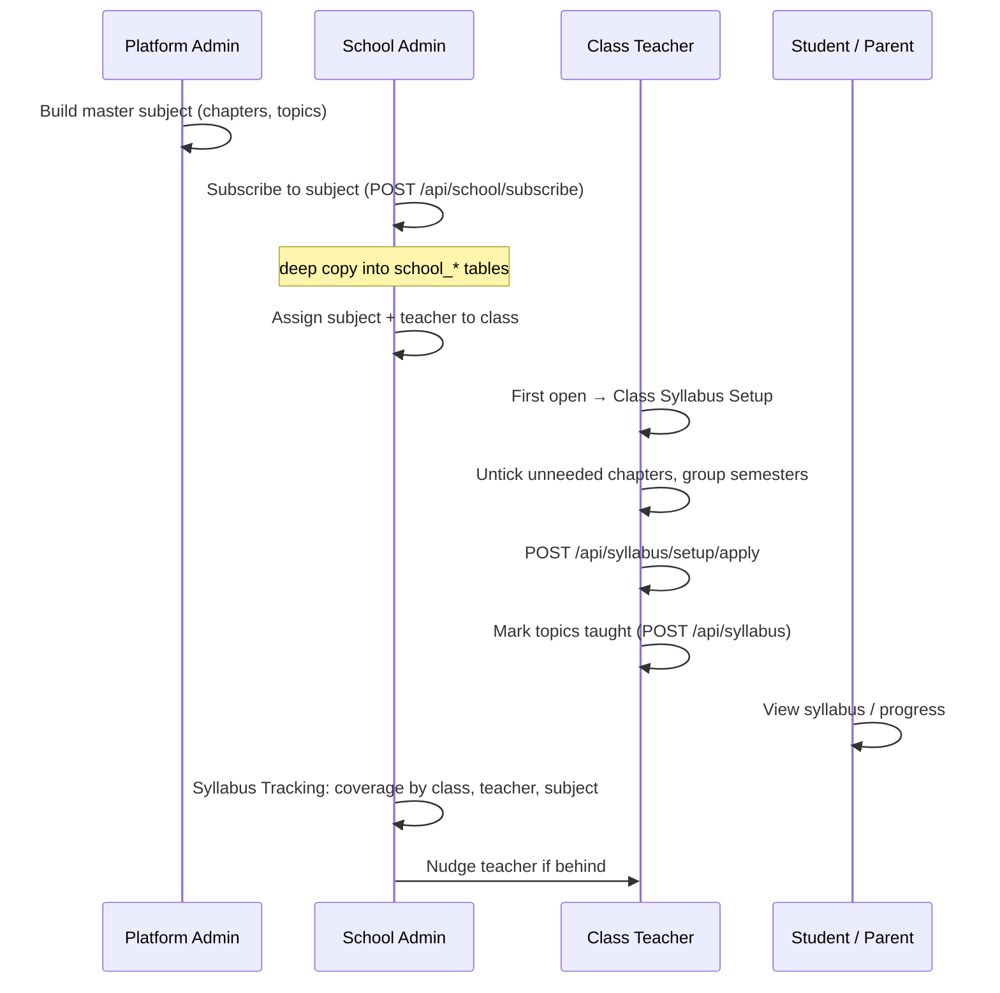
```mermaid
sequenceDiagram
  participant PA as Platform Admin
  participant SA as School Admin
  participant T as Class Teacher
  participant ST as Student / Parent
  PA->>PA: Build master subject (chapters, topics)
  SA->>SA: Subscribe to subject (POST /api/school/subscribe)
  Note over SA: deep copy into school_* tables
  SA->>SA: Assign subject + teacher to class
  T->>T: First open → Class Syllabus Setup
  T->>T: Untick unneeded chapters, group semesters
  T->>T: POST /api/syllabus/setup/apply
  T->>T: Mark topics taught (POST /api/syllabus)
  ST->>ST: View syllabus / progress
  SA->>SA: Syllabus Tracking: coverage by class, teacher, subject
  SA->>T: Nudge teacher if behind
```

**Step by step**
1. **Subscribe** (School Admin → Syllabus Customizer): pick board/grade/subject; the full tree is copied to the school.
2. **Assign** the subject and teacher to a class ([04](04-class-management.md)).
3. **Class Syllabus Setup** (teacher, once per class + subject, re-editable): untick chapters/topics the class will skip, optionally group into Semester 1/2…; if another section of the same grade already did it, **copy from sibling** with one click.
4. **Teach and mark**: the teacher marks topics covered with a date.
5. **Track**: admin opens *Syllabus Tracking* → by class, teacher (one row per class + subject) and subject; trend chart from weekly snapshots.
6. **Nudge**: from a behind-schedule row the admin sends the teacher a notification.
7. **New year**: copy setup from the previous year instead of redoing it.

## 3. Business rules & calculations

| Rule | Detail |
|---|---|
| Copy, not link | Later master edits don't change a school's copy; `POST /api/school/subjects/{id}/resync` can pull new content on demand |
| Absence of a row = active | Class visibility rows are written only by Setup **Apply**; an unchecked item gets an explicit `is_active = false` row |
| Progress is per class | `school_topic_progress` keyed `(class_id, school_topic_id)` — two sections can be at different points |
| **Percent is chapter-weighted with partial credit** | Exact formula in the syllabus README §11; every active chapter counts in the denominator (including zero-topic chapters — a past bug that inflated 47% to 78% was fixed) |
| Zero chapters | `pct = null`, shown as "—" |
| Trend | Weekly **binary** covered/total snapshots (Mondays 02:00 UTC cron) — answers "how is it trending", not "exact progress now" |
| Who edits what | Only the class's own teacher edits Setup; admin sees it read-only (`/api/syllabus/setup/status`) |
| Sibling copy | Same grade only; source must have completed Setup; a one-time clone, not a live link |
| Custom content | `is_custom` flag; teachers can add or rename their own chapters |

## 4. Technical reference (developers)

**Screens:** admin — `CurriculumCustomizer.tsx` (subscribe/customise, ~1,400 lines), `SyllabusTracking.tsx` (analytics, ~630), `AcademicAnalytics.tsx`; teacher — `TeacherSyllabus.tsx`; student — `StudentSyllabus.tsx`; parent — `ParentSyllabus.tsx`.

**API (main groups)**

| Route | Purpose | Guard |
|---|---|---|
| `POST /api/school/subscribe` | Subscribe (deep copy) | school admin |
| `GET/POST /api/syllabus`, `PATCH/DELETE /api/syllabus/{id}`, `POST/PATCH /api/syllabus/chapters` | Tree + mark taught + chapters | `requireSyllabusAccess` / `requireSyllabusWriteAccess` |
| `GET /api/syllabus/setup`, `POST /setup/apply`, `GET /setup/siblings`, `POST /setup/copy-from-sibling`, `GET /setup/status` | Class Syllabus Setup | as above |
| `GET /api/syllabus/analytics`, `/analytics/trend` | Admin coverage analytics | `requireFeeAccess` |
| `POST /api/notifications/nudge-teacher` | Nudge | `requireFeeAccess` + teacher-in-school check |
| `GET /api/school/subjects`, `DELETE /{id}`, `POST /{id}/resync`, `/create-custom`, `/copy-from-year`, `GET /materials` | School subject management | school scoped |
| `POST /api/school/syllabus/bulk-import`, `/bootstrap-chapters` | Teacher bulk outline import | write access |
| `GET/POST/DELETE /api/platform/subjects` | Master catalog | Platform Admin |
| `GET /api/cron/syllabus-coverage-snapshot` | Weekly snapshots | `CRON_SECRET` |
| `GET /api/transliterate` | English → Telugu/Hindi (staff only) | staff session |

**Tables:** master — `master_subjects/chapters/topics/resources/tasks`, `master_subject_materials`; school — `school_subjects/chapters/topics/resources/tasks`, `school_topic_progress`, `school_subscriptions`; class — `class_chapter_visibility`, `class_topic_visibility`, `class_subject_setup_status`, `class_subjects`, `curriculum_assignments`; history — `syllabus_coverage_snapshots`, `academic_year_snapshots`.

**Libraries:** `lib/curricula.ts`, `lib/syllabus/*`, `lib/board-syllabus/*` (board data), `lib/matchTeacher.ts`, `lib/academicYear.ts`.

**Design notes:** teacher access to write routes is resolved from `class_subjects` (assigned teacher only); admin analytics deliberately uses the tenant guard rather than a syllabus guard; the Setup **Apply** runs in one transaction with a per-item ownership check against stale/malformed payloads.

**Tests:** `syllabus-audit.spec.ts`, `workflow-syllabus-audit.spec.ts`, `workflow-syllabus-translate.spec.ts`.

## 5. Pitch kit

**Investor one-liner** — "A board-aligned master syllabus each school can shape per class, with live coverage analytics — curriculum accountability, not paperwork."

**School one-liner** — "Know which classes are behind on which subjects — before the exams — and let parents see what has been taught."

**Slide bullets**
- Master catalog → school copy → per-class setup (three layers).
- Teachers mark topics taught; progress is chapter-weighted.
- Weekly coverage trend by class and by teacher; one-click nudge.
- Telugu/Hindi names typed phonetically in English letters.
- Parents see taught vs. not-yet-taught.

**60-second demo:** subscribe Grade 9 Maths → open as the class teacher, untick two chapters, apply → mark three topics taught → switch to admin: coverage % and trend appear → nudge a teacher.

**Objections → honest answers**
- *"Is it AI?"* — No. Transliteration uses a public Google Input Tools endpoint through our server; no AI generation.
- *"Who supplies the content?"* — The master catalog is maintained by WLYL; coverage of boards/grades is `[TBD – founder]` (state which boards are actually loaded before stating this externally).

## 6. Limits & roadmap

- Master catalog completeness varies by board/grade — verify before promising.
- No lesson planner, no pacing against a timetable (both on branches).
- Roadmap: rebuilt analytics (Class Analytics) and school health score.

---

<!-- SOURCE FILE: docs/product/features/10-exam-schedule-and-marks.md -->

# 10 · Exam Schedule & Marks

| | |
|---|---|
| **Feature key** | `exam-marks` (nav aliases: `exam-schedule`, `my-marks`, `results`, `exams`) |
| **Category** | Scheduling |
| **Portals** | School Admin, Teacher, Student, Parent |
| **Status** | **BUILT** — a single switch governs the whole exam workflow across all four portals |
| **Snapshot** | `dev` @ `29f0e6a`, 2026-09-21 |

---

## 1. Product brief

**The problem.** Exam marks travel on paper and WhatsApp; marks get changed after release; parents say they never saw the result.

**The solution.** A controlled pipeline: the admin **schedules** an exam for many classes at once, subject teachers **enter marks**, the class teacher **reviews**, the admin **releases** — and only then do students and parents see results. Parents can **acknowledge**, and the school sees who has not.

| Stage | Who | What happens |
|---|---|---|
| 1. Schedule | School admin | Create one exam (e.g. Half-Yearly) across many classes; each class's subjects **and subject teachers** are copied from **that class's own** subject list; max marks and pass % set |
| 2. Collect | Subject teachers / class teacher | Marks entry opens automatically **the day after the exam date** (nightly job); each teacher edits only their subject; the class teacher may edit any subject |
| 3. Review | Class teacher | "I've checked every subject" → notifies school admins |
| 4. Release | School admin | Final, irreversible release; **only now** do students/parents see results |
| 5. Acknowledge | Parent | Taps **Acknowledge**; admin sees who hasn't and can **nudge** |

**Extras:** the class teacher can **reopen** a submitted subject to fix a mistake before review; one grading ladder everywhere; results exports (see [17](17-export-and-reports.md)); exam calendar entries.

**Value.** Traceable, tamper-resistant results and an acknowledgement trail; no result is visible before the school says so.

**Where it stops.** No annual multi-exam report card (a per-exam printable one is in Export Center), no rank lists, no question-paper management, no online tests (weekly test removed; on a branch).

## 2. End-to-end flow

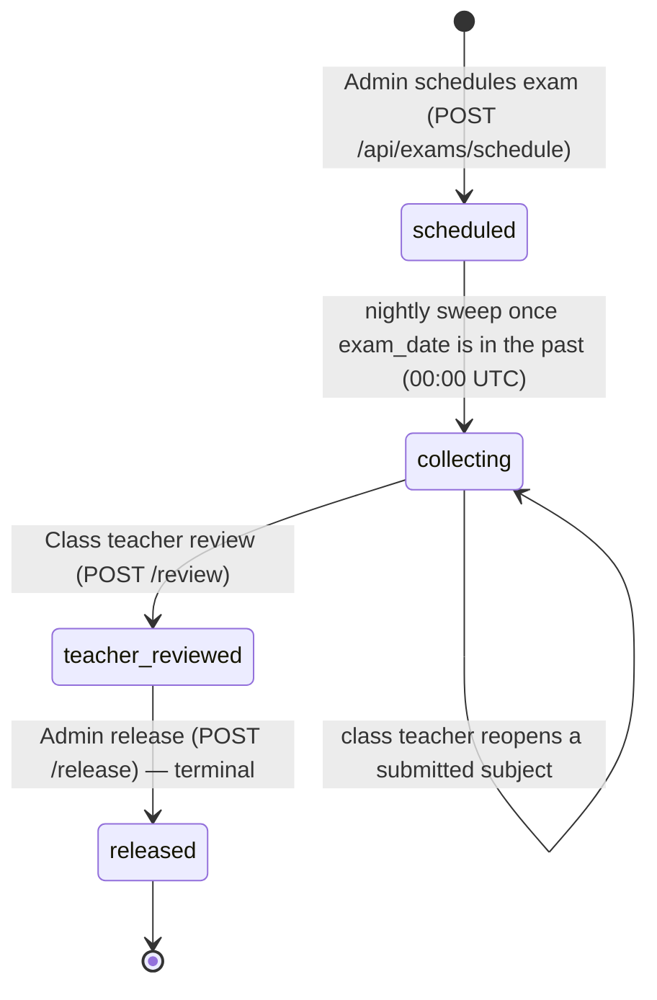
```mermaid
stateDiagram-v2
  [*] --> scheduled: Admin schedules exam (POST /api/exams/schedule)
  scheduled --> collecting: nightly sweep once exam_date is in the past (00:00 UTC)
  collecting --> collecting: teachers enter / submit subject marks
  collecting --> collecting: class teacher reopens a submitted subject
  collecting --> teacher_reviewed: Class teacher review (POST /review)
  teacher_reviewed --> released: Admin release (POST /release) — terminal
  released --> [*]
```

**Step by step**
1. **Admin:** *Exam Schedule* → choose classes, exam name, date, pass %; subjects fill from each class. Creating it stamps one shared `exam_group_id` so all classes can be edited or deleted as one unit, while each class has its own lifecycle.
2. **Status flips** to *collecting* the day after the exam date via the nightly sweep; subject teachers are notified. (There is **no** manual force-open on `dev`.)
3. **Teachers:** *Exam Marks* → enter marks per student (or mark absent) → **Submit** the subject (locks it).
4. **Class teacher:** reviews all subjects → **Review**; every school admin receives a notification.
5. **Admin:** **Release**. Once an exam is `teacher_reviewed`, subjects can no longer be reopened — corrections must be made before the class teacher reviews.
6. **Student/Parent:** results appear; the parent acknowledges.
7. **Admin:** *Acknowledgements* list → **Nudge** parents who haven't.

## 3. Business rules & calculations

| Rule | Detail |
|---|---|
| Grade ladder (`lib/examGrading.ts`) | **A1** ≥91 · **A2** ≥81 · **B1** ≥71 · **B2** ≥61 · **C1** ≥51 · **C2** ≥41 · **D** ≥33 · **E** <33 (on percentage) |
| Pass / fail | Separate from grade: `percentage ≥ exam.passing_pct`. A 33 % score is grade **D** yet a **fail** on an exam with a 50 % pass mark |
| Visibility | Students/parents may read **only `released`** exams and only **their own** marks |
| Permissions | Subject teacher → own subject; class teacher → any subject in their class (and reopen/review); admin → schedule and release |
| Release | Admin-only, irreversible; no edits accepted at release |
| Subject lock | Submitting a subject locks it; only the **class teacher** can reopen it, and only while the exam is still `collecting` |
| Subjects per class | Taken from that class's `class_subjects` — never a shared typed list |
| Notifications | Review notifies school admins; nudge notifies parents |

**Worked example (illustrative).** Maths max 50, Meera scores 39 → 78 % → grade **B1**; exam pass mark 40 % → **pass**.

## 4. Technical reference (developers)

**Screens:** `ExamSchedule.tsx` (admin, ~1,000 lines), `app/teacher/components/ExamMarks.tsx`, `app/student/components/StudentMarks.tsx`, parent results in `app/parent/page.tsx`.

**API**

| Method | Route | Purpose |
|---|---|---|
| POST | `/api/exams/schedule` | Create exam across classes (validates every class belongs to the school) |
| GET | `/api/exams`, `/api/exams/calendar` | Lists; calendar view |
| GET/PUT/DELETE | `/api/exams/{id}` | Exam detail, edit, delete |
| POST | `/api/exams/{id}/subjects`, `/subjects/{sid}/reopen` | Subjects; reopen (class teacher, collecting only) |
| GET/POST | `/api/exams/{id}/marks` | Read (role-scoped) / enter marks + submit subjects |
| POST | `/api/exams/{id}/review` | Class-teacher review → `teacher_reviewed` |
| POST | `/api/exams/{id}/release` | Admin release → `released` (irreversible) |
| GET/POST | `/api/exams/{id}/acknowledgements`, `/acknowledge`, `/nudge-parent` | Parent acknowledgement loop |
| GET | `/api/students/{id}/exams` | Student/parent results |
| GET | `/api/cron/exam-status-sweep` | `scheduled → collecting` |

**Tables:** `exam_records` (status `scheduled | collecting | teacher_reviewed | released`, `exam_group_id`, `passing_pct`), `exam_subjects` (`teacher_id`, max marks, submit lock), `exam_marks` (`marks_obtained`, `is_absent`), `parent_mark_acks`, `parent_mark_ack_nudges`, `notifications`, `class_subjects`.

**Libraries:** `lib/examGrading.ts` (single grade source, used by five places that previously drifted), `lib/examsAuth.ts` (`requireExamsAdmin/Teacher/Access`), `lib/rewards.ts` (legacy), `lib/email.ts`.

**Security:** marks route checks *which* student the caller may see (a former gap where any logged-in user could pass any `student_id` was closed); results gated on `status === 'released'`.

**Tests:** covered by `workflow-portals.spec.ts` and `workflow-full-platform.spec.ts`; **no dedicated exam-marks spec** — worth adding before scale.

## 5. Pitch kit

**Investor one-liner** — "A governed results pipeline — enter, review, release, acknowledge — that removes tampering and 'I never saw it' from school results."

**School one-liner** — "Marks are entered by the right teacher, checked by the class teacher, and released by you — parents see nothing until then, and you can see who has acknowledged."

**Slide bullets**
- Schedule one exam across many classes.
- Subject-level permissions and locks; class-teacher review; admin release.
- One grading ladder everywhere; separate pass mark.
- Parent acknowledgement with nudges.

**60-second demo:** schedule an exam for two classes → teacher enters and submits marks → class teacher reviews → admin releases → parent acknowledges → admin sees the list.

**Objection → honest answer**
- *"Report cards?"* — A per-exam printable report card is in Export Center; a multi-exam annual card with remarks is roadmap.

## 6. Limits & roadmap

- No annual multi-exam report card, ranks or grace-marks logic; no online tests. A **per-exam printable report card** exists in [Export Center](17-export-and-reports.md).
- The legacy `wiki/features/exam-marks.md` described a single "admin review" step — the code implements class-teacher review + admin release (this dossier is correct).

---

<!-- SOURCE FILE: docs/product/features/11-announcement-board.md -->

# 11 · Announcement Board

| | |
|---|---|
| **Feature key** | `announcements` |
| **Category** | Communication |
| **Portals** | School Admin (publish); Teacher, Student, Parent (read on their dashboards) |
| **Status** | **BUILT** — with a **security gap** on the write routes (see §4) |
| **Snapshot** | `dev` @ `29f0e6a`, 2026-09-21 |

---

## 1. Product brief

**The problem.** Circulars go out through paper slips and WhatsApp groups; some parents never see them, and old notices never disappear.

**The solution.** A noticeboard where the admin publishes an announcement to **exactly the audiences that need it**, with a priority and an expiry date.

| Field | Options |
|---|---|
| Type | `general`, `circular`, `event`, `alert` |
| Audience | `all`, or any combination of `teachers`, `students`, `parents` (selecting all three is stored as `all`) |
| Priority | `normal`, `high`, `urgent` — urgent and high sort first |
| Expiry | Optional date; expired notices drop off automatically |
| Author | Recorded name of the admin who posted it |

Portals fetch the notices for their own audience; the admin sees everything.

**Value.** A single, dated, audience-targeted channel — parents see only what is meant for parents.

**Where it stops.** No push, SMS or WhatsApp delivery — announcements are shown **inside** the portals only. No read receipts, attachments or scheduling.

## 2. End-to-end flow

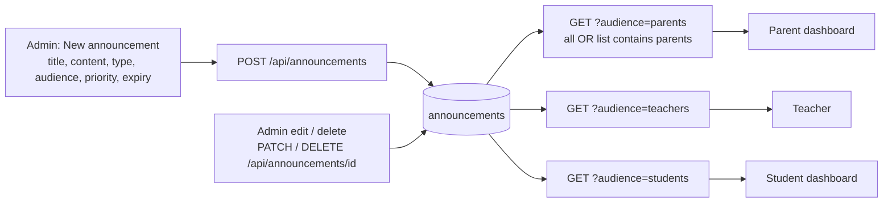
```mermaid
flowchart LR
  A["Admin: New announcement<br/>title, content, type, audience, priority, expiry"] --> B["POST /api/announcements"]
  B --> C[("announcements")]
  C --> D["GET ?audience=parents<br/>all OR list contains parents"]
  C --> E["GET ?audience=teachers"]
  C --> F["GET ?audience=students"]
  D --> G["Parent dashboard"]
  E --> H["Teacher"]
  F --> I["Student dashboard"]
  A2["Admin edit / delete<br/>PATCH / DELETE /api/announcements/id"] --> C
```

**Step by step**
1. *Announcements → New*: write the title and body; tick the audiences; pick type and priority; optionally set an expiry.
2. Publish. It is stored with the school id.
3. Each portal calls the list endpoint with its own audience; the SQL matches `all` **or** a comma-list that contains that audience.
4. Ordering: urgent → high → normal, then newest first, with pagination.
5. Edit or delete from the admin board at any time.

## 3. Business rules & edge cases

| Rule | Detail |
|---|---|
| Audience validation | Every part must be one of `all`, `teachers`, `students`, `parents`; else `400` |
| Normalisation | All three individual audiences → stored as `all` |
| Priority validation | Only `normal`, `high`, `urgent` |
| Type validation | Only `general`, `circular`, `event`, `alert` |
| Expiry | `expires_at` (date); expired items are not returned |
| Read scope | The GET route derives the school from the **session**; a mismatching `school_id` is refused (a previous cross-school read gap was fixed) |

## 4. Technical reference (developers)

**Screens:** `app/school-admin/components/AnnouncementBoard.tsx` (~490 lines); readers in each portal's dashboard.

**API**

| Method | Route | Purpose | Guard today |
|---|---|---|---|
| GET | `/api/announcements?school_id&audience&limit&offset` | Audience-filtered list | `getAnySession()` + session school |
| POST | `/api/announcements` | Create | ⚠ **none** |
| PATCH | `/api/announcements/{id}` | Edit (COALESCE update by id) | ⚠ **none** |
| DELETE | `/api/announcements/{id}` | Delete by id | ⚠ **none** |

**⚠ Known security gap (INTERNAL):** the three write routes perform **no authentication and no school check**; PATCH/DELETE address rows by `id` alone, so anyone who can reach the API could create, edit or delete another school's notices. Fix is a `requireSchoolAdmin()` + `school_id === session.schoolId` (and `WHERE id = $ AND school_id = $`). Tracked in the follow-up task; see [architecture §12.1](00-platform-architecture.md).

**Table:** `announcements` (`school_id`, `title`, `content`, `announcement_type`, `target_audience`, `priority`, `created_by_name`, `expires_at`, `created_at`).

**Libraries:** `lib/auth.ts` (`getAnySession`), `lib/db.ts`.

**Tests:** exercised in `workflow-school-admin.spec.ts` / `workflow-portals.spec.ts`; **no test asserts that anonymous writes are refused** — add one with the fix.

## 5. Pitch kit

**Investor one-liner** — "Targeted school communication in-portal: the right notice to the right audience, with priority and expiry."

**School one-liner** — "Publish a circular once. Teachers, students and parents each see only what's meant for them — and old notices expire on their own."

**Slide bullets**
- Audience targeting (teachers / students / parents / all).
- Priority and expiry; urgent notices rise to the top.
- Same board across all portals.

**60-second demo:** post an *urgent* notice to parents only → show it on the parent portal → confirm the student portal does not show it.

**Objection → honest answer**
- *"Will parents get a WhatsApp message?"* — No. In-portal only today; WhatsApp is on the roadmap.

## 6. Limits & roadmap

- No push/SMS/WhatsApp, attachments, read receipts or scheduling.
- **Do not demo write actions against a shared/production database until the auth guard fix lands.**

---

<!-- SOURCE FILE: docs/product/features/12-feedback-management.md -->

# 12 · Feedback Management (QR-code feedback)

| | |
|---|---|
| **Feature key** | `feedback-management` |
| **Category** | Communication |
| **Portals** | School Admin (manage); **public, no-login form** at `/feedback/<code>` |
| **Status** | **BUILT** |
| **Snapshot** | `dev` @ `29f0e6a`, 2026-09-21 |

---

## 1. Product brief

**The problem.** Schools rarely hear honest feedback: parents won't log in to complain, suggestion boxes are ignored, and problems (dirty toilets, late buses, a rude gatekeeper) never reach the right department.

**The solution.** A **QR poster** on the school wall. Anyone — parent, student, teacher, visitor — scans it, **no login**, picks their role, rates categories with an emoji scale, adds quick tags, text, or a **voice note**, and can stay **anonymous**. Low ratings become **issues** routed to a department and tracked to resolution.

| Piece | What it does |
|---|---|
| Public wizard | Role → optional identity (name/phone) or anonymous → categories → 5-point emoji rating → tags / text / voice → submit |
| Roles | Parent, Student, Teacher, Visitor, Other — each with role-specific default categories |
| Advanced forms | Optional richer form types (`advanced_form_type`) |
| Auto-issues | Rating **1** → high priority, rating **2** → medium; each snapshots the category's **department** for routing |
| Admin tabs | Dashboard (pulse score, mood mix, best/worst categories) · Submissions · **Issue Pipeline** · Categories editor · Settings & QR |
| Issue workflow | open → in progress → resolved / dismissed; priority and department editable |
| QR poster | Downloadable QR + printable poster; **regenerate** the code to invalidate old posters |

**Value.** A safe channel for candid feedback that turns complaints into a **workflow with accountability**, and a live "pulse score" for the owner.

**Where it stops.** Alerts to staff are in-app only (no WhatsApp/SMS). No sentiment AI on text or voice. Voice notes are stored, not transcribed.

## 2. End-to-end flow

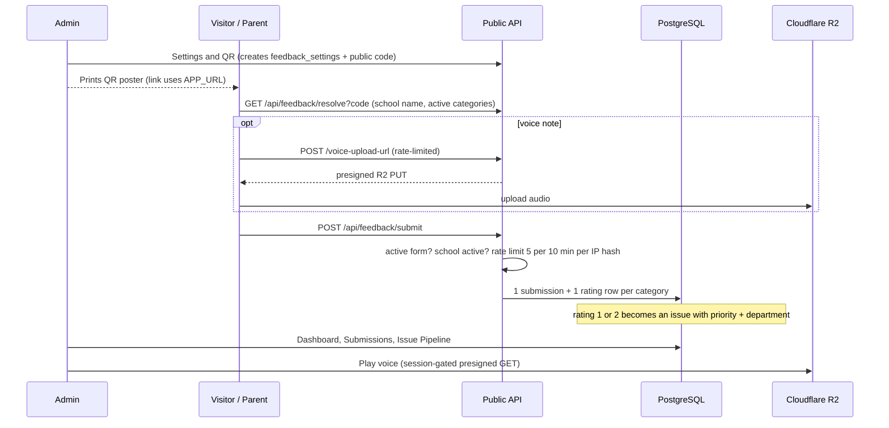
```mermaid
sequenceDiagram
  participant A as Admin
  participant V as Visitor / Parent
  participant API as Public API
  participant DB as PostgreSQL
  participant R2 as Cloudflare R2
  A->>API: Settings and QR (creates feedback_settings + public code)
  A-->>V: Prints QR poster (link uses APP_URL)
  V->>API: GET /api/feedback/resolve?code (school name, active categories)
  opt voice note
    V->>API: POST /voice-upload-url (rate-limited)
    API-->>V: presigned R2 PUT
    V->>R2: upload audio
  end
  V->>API: POST /api/feedback/submit
  API->>API: active form? school active? rate limit 5 per 10 min per IP hash
  API->>DB: 1 submission + 1 rating row per category
  Note over DB: rating 1 or 2 becomes an issue with priority + department
  A->>DB: Dashboard, Submissions, Issue Pipeline
  A->>R2: Play voice (session-gated presigned GET)
```

**Step by step (visitor):** scan → choose *Parent* → (optional name/phone or *anonymous*) → pick categories to rate → tap emojis → add tags/text/voice → **Submit** → thank-you.

**Step by step (admin):** *Feedback Management* → **Settings & QR** (form is created lazily; copy link / download poster) → watch **Dashboard**; open **Issue Pipeline** and move issues open → in progress → resolved; edit **Categories** (per role, with department); regenerate the code if a poster leaks.

## 3. Business rules & edge cases

| Rule | Detail |
|---|---|
| No login | Public routes: resolve, submit, voice-upload-url |
| Rate limit | **5 submissions / 10 minutes** per hashed IP per school (`ip_hash`); voice uploads also rate-limited (`feedback_voice_upload_log`) |
| Validity | Form must be active and school active; categories resolved against the school's live rows so label/department are accurate snapshots; ratings de-duplicated and capped |
| Issue creation | Rating 1 → `high`, 2 → `medium`; only 1–2 create issues |
| Pulse score | `round(avg_rating / 5 × 100)` |
| Anonymity | Anonymous submissions store no name/phone; voice playback is **session-gated** (a recording is personal data even when anonymous) |
| Public code | Independent of `schools.school_code`; freely rotatable without touching login; **URL built from `APP_URL`**, never the request host (the admin subdomain would dead-end) |
| Soft delete | Categories deactivate via `is_active` |

## 4. Technical reference (developers)

**Screens:** public — `app/feedback/[code]/{page,FeedbackWizard}.tsx`, `steps/*` (incl. `AdvancedFormStep`), `roleVisuals.ts`, `advancedFormVisuals.ts`; admin — `FeedbackManagement.tsx` + `feedback/{FeedbackDashboardTab,FeedbackSubmissionsTab,FeedbackIssueTable,FeedbackCategoryEditor,FeedbackQrPoster,useFeedbackFetch}`.

**API**

| Method | Route | Access |
|---|---|---|
| GET | `/api/feedback/resolve?code=` | Public |
| POST | `/api/feedback/voice-upload-url` | Public, rate-limited (presigned R2 PUT) |
| POST | `/api/feedback/submit` | Public, rate-limited |
| GET | `/api/feedback/voice/{id}` | Staff session (presigned GET redirect) |
| GET | `/api/feedback/submissions` (+`/{id}`) | Staff |
| GET / PATCH | `/api/feedback/issues` / `/{id}` | Staff |
| GET | `/api/feedback/stats` | Staff (pulse, mood, best/worst) |
| GET/POST, PATCH | `/api/feedback/categories`, `/{id}` | Staff |
| GET/PATCH, POST | `/api/feedback/settings`, `/regenerate-code` | Staff |
| GET | `/api/feedback/qr` | Staff (PNG) |

**Tables:** `feedback_settings` (code + active toggle, 1 per school), `feedback_categories`, `feedback_submissions` (role, identity, text, `voice_object_key`, `ip_hash`, `advanced_form_*`), `feedback_submission_ratings` (unit of the issue pipeline; partial index on `(school_id, priority, status) WHERE priority IS NOT NULL`), `feedback_voice_upload_log`.

**Libraries:** `lib/feedback-defaults.ts` (seeded + backfilled categories), `lib/validation/feedback.ts` (Zod), `lib/feedback-public-access.ts`, `lib/request-ip.ts`, `lib/r2.ts`, `lib/auth.ts` (`generateFeedbackCode`, `requireFeeAccess` for tenant isolation).

**Known technical gaps:** no server-enforced max size on the presigned voice upload (client caps ~60 s); some duplicated role definitions and fetch hooks across admin tabs (refactor debt).

**Tests:** `workflow-feedback-management.spec.ts`.

## 5. Pitch kit

**Investor one-liner** — "A no-login QR feedback channel that converts complaints into a routed, tracked issue pipeline and a live school pulse score."

**School one-liner** — "Put a QR poster at the gate. Parents speak freely — anonymously if they wish — and every low rating becomes a tracked issue for the right department."

**Slide bullets**
- Scan-and-rate in under a minute, no app, no login; Telugu-friendly emoji scale.
- Anonymous option; voice notes.
- Auto-flagged issues routed by department, with status workflow.
- Pulse score and best/worst categories for the owner.
- QR poster generator; rotate the code any time.

**60-second demo:** scan the poster on a phone → give a 1-star on "Cleanliness" with a voice note → admin Issue Pipeline shows a **high** issue → move it to *in progress* → resolved; show the pulse score change.

**Objections → honest answers**
- *"Can it be spammed?"* — Per-IP rate limits (5 per 10 minutes) and hashed IPs; it is not a full anti-abuse system.
- *"Is voice transcribed?"* — No, stored and played back by staff only.

## 6. Limits & roadmap

- In-app alerts only; no WhatsApp/SMS to department heads.
- No text/voice analysis. Voice size cap enforced only on the client.

---

<!-- SOURCE FILE: docs/product/features/13-fee-management.md -->

# 13 · Fee Management

| | |
|---|---|
| **Feature key** | `fee-management` |
| **Category** | Finance |
| **Portals** | School Admin (full); Parent (read-only ledger via `/api/parent/fees`) |
| **Status** | **BUILT** — the deepest finance module; 109 dedicated e2e cases |
| **Related** | [14 · Online Fee Payments (UPI)](14-online-fee-payments-upi.md), [19 · Year Rollover](19-year-rollover.md) |
| **Snapshot** | `dev` @ `29f0e6a`, 2026-09-21 |

---

## 1. Product brief

**The problem.** Fees are the school's cash flow and its biggest source of errors: paper receipts, half-payments nobody tracks, waivers given verbally, dues lost when the year changes, and cash that doesn't match the register at day end.

**The solution.** One tool for the **whole fee lifecycle**, with an audit trail on every rupee.

| Tab | What it does |
|---|---|
| **Overview** | Billed / collected / waived / unpaid headline, collection %, setup-wizard banner |
| **Fee Plan (Setup)** | Fee categories (fixed per grade, or variable per student), amounts per grade, **generate bills** for all active students, **lock** the plan (later changes need an audited amendment) |
| **Collect** | Daily counter: students with dues, take a payment (full/partial, **FIFO** across selected bills), grant a **waiver**, **Day Close** cash reconciliation, verify online (UPI) payments |
| **Student Passbook** | One student's bills, payments, waivers; **cancel/correct** a payment or revoke a waiver (with reasons, logged) |
| **Reports** | Collection and dues reports, exports, **audit report (Excel)** |
| **Year-End** | Per student: **carry forward**, **write off**, move to **passout ledger**, or leave open; close the year (reopen needs a reason) |
| **Past Records** | Read-only headline for every past academic year; jump into its report/ledger |
| **Leavers & Dues** | Students who left with unpaid balance; the always-open passout ledger |

**Receipts:** configurable school branding (logo, alignment, header blocks), signature block and **dual-copy printing**, also used for passbook reprints and year-end statements.

**Payment modes:** cash, cheque, DD, UPI, online. **Statuses:** bill = pending · partial · paid · overdue · waived; payment = completed · pending_verification.

**Value.** Every receipt numbered, every waiver reasoned, cash reconciled daily, and dues never silently vanish at year end. The principal can answer "how much is outstanding and from whom?" in seconds.

**Where it stops.** **No payment gateway** (online = UPI QR + parent self-report + admin verification). WhatsApp fee reminders are **not** live. No GST invoicing, no fee-head-wise accounting export to Tally.

## 2. End-to-end flow

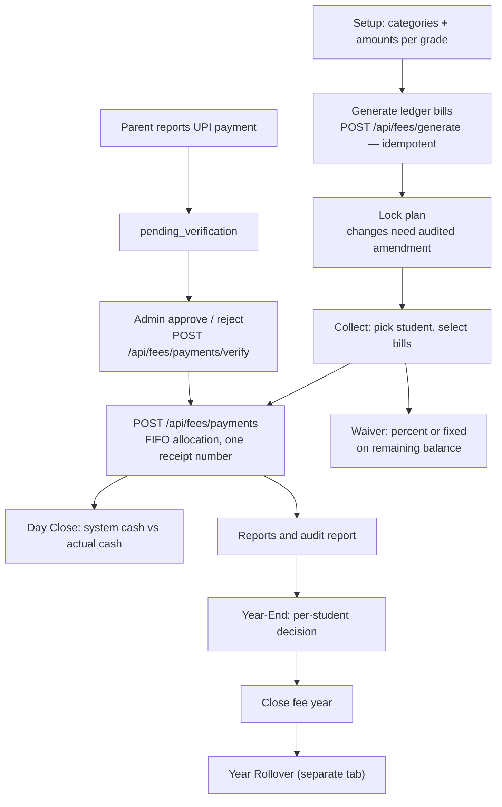
```mermaid
flowchart TD
  S1["Setup: categories + amounts per grade"] --> S2["Generate ledger bills<br/>POST /api/fees/generate — idempotent"]
  S2 --> S3["Lock plan<br/>changes need audited amendment"]
  S3 --> C1["Collect: pick student, select bills"]
  C1 --> C2["POST /api/fees/payments<br/>FIFO allocation, one receipt number"]
  C1 --> C3["Waiver: percent or fixed<br/>on remaining balance"]
  P1["Parent reports UPI payment"] --> P2["pending_verification"]
  P2 --> P3["Admin approve / reject<br/>POST /api/fees/payments/verify"]
  P3 --> C2
  C2 --> D1["Day Close: system cash vs actual cash"]
  C2 --> R1["Reports and audit report"]
  R1 --> Y1["Year-End: per-student decision"]
  Y1 --> Y2["Close fee year"]
  Y2 --> Y3["Year Rollover (separate tab)"]
```

**Step by step**
1. **Setup.** Create fee heads (e.g. Tuition, Transport). Fixed heads take one amount per grade; variable heads are assigned per student (`student_fee_category_assignments`). **Generate** bills — safe to re-run; students who changed grade are re-synced to the new grade's amount (never below what they've already paid). Every bill is **due at the academic year's end date**.
2. **Lock** the plan. After locking, changes go through `structures/amend`, which records who/why in `fee_structure_history`.
3. **Collect.** Search the student, select one or many bills, enter amount and mode. With several bills, the server allocates **oldest first** and issues **one receipt number** for all parts. `collected_by` is mandatory (several staff share one login at the counter).
4. **Waive.** Percent or fixed, computed on the **remaining** balance after existing waivers. Reason required. Revocable from the Passbook.
5. **Day Close.** The system totals the day's cash; the admin enters actual cash and notes; differences are recorded.
6. **Online payments.** See [14](14-online-fee-payments-upi.md).
7. **Year-End.** Decide every unpaid student; apply in batches (resumable); close the year. Carried dues become one **Previous Year Dues** bill in the next year.
8. **Past Records** to browse any prior year.

## 3. Business rules & calculations

| Rule | Detail |
|---|---|
| **Balance** | `amount_due − waiver − amount_paid` |
| **FIFO** | A multi-bill payment fills the oldest selected bill first; all rows share one receipt number |
| **Payment modes** | Whitelisted: `cash`, `cheque`, `dd`, `upi`, `online` (no DB constraint, so the API enforces it — otherwise a typo would fall out of Day Close's cash reconciliation) |
| **Amount** | Must be positive; date cannot be in the future (compared as IST date strings) |
| **Waiver** | On remaining balance; `carry_forward` is a **system-only** waiver type used by year-end bookkeeping and excluded from "discretionary waived" totals; callers cannot set it |
| **Duplicate guard** | Payments and waivers use `lib/idempotency.ts` so a double click or retry cannot post twice |
| **Concurrency** | Row locked `FOR UPDATE` when paying/waiving so a payment and a waiver cannot race |
| **Closed year** | Payments, waivers, generation and re-sync are blocked on a closed year |
| **Plan lock** | Amounts frozen after lock; amendments audited |
| **Year-end apply** | Serialised per `(school, year)` with `pg_advisory_xact_lock`; resumable; close is race-safe |
| **Reopen** | Only with a reason (logged), and **not** once the school has rolled over |
| **Roll number order** | Ledger sorted by grade, section, `school_roll_number` (nulls last), name |

**Worked example (illustrative).** Bills: Term-1 ₹10,000, Term-2 ₹10,000. Parent pays ₹15,000 in one go → Term-1 fully paid (₹10,000), Term-2 gets ₹5,000 → one receipt. A ₹2,000 waiver on Term-2 → remaining ₹3,000.

## 4. Technical reference (developers)

**Screens:** `FeeManagement.tsx` (1,329-line shell that owns cross-tab state and lazy-mounts tabs) + eight tabs in `app/school-admin/components/fee-management/` (Overview, Setup/Applicability, Collect, Passbook, Reports, Year-End, Archive, Leavers). Zustand store `lib/stores/feeStore.ts` holds cross-tab versions/one-shot requests.

**API (`/api/fees/*`, 33 route operations used by the UI)**

| Group | Routes |
|---|---|
| Setup | `categories`, `category-assignments`, `category-changelog`, `structures` (+ `lock`, `amend`), `structure-history`, `setup-status`, `generate` |
| Money | `ledger`, `payments`, `payments/verify`, `payments/cancel`, `waivers`, `day-close`, `passbook`, `stats` |
| Reporting | `reports`, `audit-report` (+ `/excel`), `audit-log`, `export`, `archive` |
| Year | `year-end`, `year-rollover`, `passout`, `removed-students` |
| UPI | `upi-id` (+ `/verify`), `upi-qr` (+ `/info`) |
| Parent | `/api/parent/fees` (GET ledger, POST payment report) |

**Tables:** `fee_categories`, `fee_structures`, `fee_structure_locks`, `fee_structure_amendments`, `fee_structure_history`, `student_fee_category_assignments`, `student_fee_assignment_history`, `student_fee_ledger`, `student_fee_ledger_edits`, `fee_payments`, `fee_payment_corrections`, `fee_waivers`, `fee_day_close`, `fee_year_close`, `fee_category_changelog`, `passout_students`, `academic_years`, `academic_year_snapshots`, `platform_audit_log`.

**Libraries:** `lib/feeRollover.ts` (system categories *Previous Year Dues / Passout Dues*, close-out bill, upsert carry-forward, race-safe year-close claim, remaining-open summary), `lib/feeAuditReport.ts`, `lib/idempotency.ts`, `lib/istDate.ts`, `lib/academicYear.ts`, `lib/auth.ts` (`requireFeeAccess` — the tenant guard used by every fee route).

**Design notes**
- Validation runs **before** a pool connection is acquired (pool is `max: 1` on Vercel).
- `source_academic_year` / `source_ledger_id` on ledger rows trace carry-forward and passout bills to their origin.
- Past Records is a thin read layer over existing data, not a new source of truth.

**Known technical debt (INTERNAL):** the yearly billed/collected/waived/unpaid aggregate exists in three places (`reports`, `feeRollover`, `archive`); `fmt/pct/sanitizeMoney` helpers are duplicated across tab files; year-end/rollover loops run 1–2 queries per bill (fine for a once-a-year admin task); Archive/Leavers do not auto-refresh after a year-end action.

**Tests:** `workflow-fee-management.spec.ts` (109 cases; needs an existing platform-admin in the target DB), `workflow-year-rollover.spec.ts`.

## 5. Pitch kit

**Investor one-liner** — "A complete fee ledger with receipts, waivers, day-close and year-end carry-forward — the system of record for a school's cash."

**School one-liner** — "Every rupee tracked: numbered receipts, reasoned waivers, daily cash match, and dues that carry safely into next year."

**Slide bullets**
- Fee plan per grade, one-click bill generation, plan lock with audited amendments.
- Part-payments allocated oldest-first under one receipt.
- Waivers with reasons; cancel/correct with a trail.
- **Day Close** cash reconciliation; Excel audit report.
- Year-end: carry forward, write off, passout ledger; Past Records for every year.

**60-second demo:** generate bills → take a ₹15,000 payment across two terms (show one receipt) → grant a waiver → Day Close → open Reports → Year-End preview.

**Objections → honest answers**
- *"Payment gateway?"* — Not yet; UPI QR with admin verification. Gateway is roadmap.
- *"WhatsApp fee reminders?"* — Not live.

## 6. Limits & roadmap

- No gateway, no WhatsApp reminders, no Tally/GST exports, no late-fee rules engine.
- Roadmap: payment gateway (needs field-level encryption first), WhatsApp reminders.

---

<!-- SOURCE FILE: docs/product/features/14-online-fee-payments-upi.md -->

# 14 · Online Fee Payments (UPI)

| | |
|---|---|
| **Feature key** | `online-payments` (**overridable per school**) |
| **Category** | Finance |
| **Portals** | School Admin (set up, verify), Parent (pay, report) |
| **Status** | **BUILT as a manual, verified flow. There is NO payment gateway.** |
| **Depends on** | `fee-management` must also be on |
| **Snapshot** | `dev` @ `29f0e6a`, 2026-09-21 |

---

## 1. Product brief

**The problem.** Parents want to pay from their phone; schools want proof before crediting a payment. A full gateway needs merchant onboarding, fees and compliance that early-stage schools don't have.

**The solution.** A pragmatic bridge: the school shows **its own UPI ID / QR**; the parent pays in any UPI app and **reports** the payment; the admin **verifies** it against the bank credit; only then is it posted to the ledger and the parent's receipt appears.

| Step | Who | Screen |
|---|---|---|
| Set the school's UPI ID (locked once saved; changing it needs a fresh unlock) | School admin | Fee Management → Setup |
| See the QR and school info | Parent | Fees → Pay via UPI |
| Pay in any UPI app, then submit "I've paid" with reference | Parent | Fees |
| Approve or reject (with reason) | School admin | Collect → Online |
| Receipt visible after approval | Parent | Fees |

**Value.** Zero gateway cost, works with any bank, and every credit is confirmed by a human — appropriate for budget private schools. Parents get a phone-native payment experience.

**Where it stops (say this out loud).** No order creation, no webhook, **no automatic confirmation**; the admin must match each report with the bank statement. Gateway tables (`school_payment_config`, `payment_transactions`, `payment_webhook_log`) are **schema-only scaffolding**. Cashfree/gateway secrets would need field-level encryption first (`lib/encryption.ts` is not built).

## 2. End-to-end flow

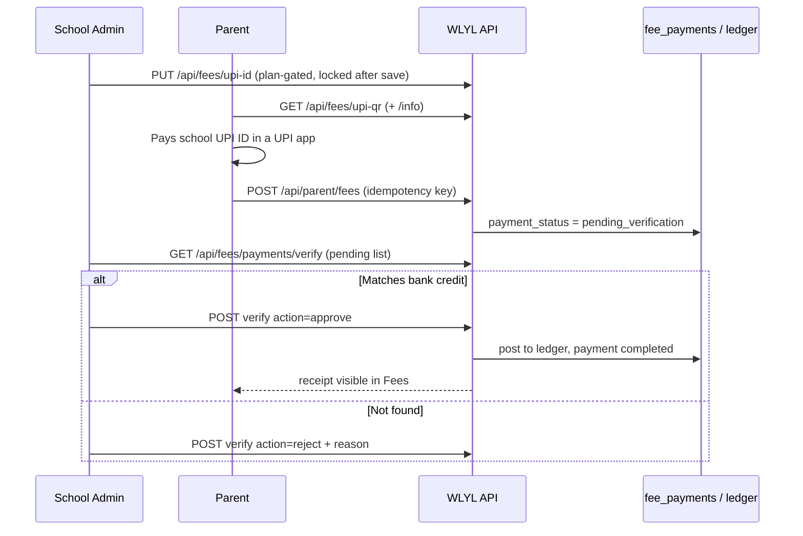
```mermaid
sequenceDiagram
  participant AD as School Admin
  participant PA as Parent
  participant API as WLYL API
  participant DB as fee_payments / ledger
  AD->>API: PUT /api/fees/upi-id (plan-gated, locked after save)
  PA->>API: GET /api/fees/upi-qr (+ /info)
  PA->>PA: Pays school UPI ID in a UPI app
  PA->>API: POST /api/parent/fees (idempotency key)
  API->>DB: payment_status = pending_verification
  AD->>API: GET /api/fees/payments/verify (pending list)
  alt Matches bank credit
    AD->>API: POST verify action=approve
    API->>DB: post to ledger, payment completed
    API-->>PA: receipt visible in Fees
  else Not found
    AD->>API: POST verify action=reject + reason
  end
```

**Step by step**
1. Admin enables the feature (tier or per-school override), sets the UPI ID under **Setup**. The UPI ID **locks**; changing it requires `POST /api/fees/upi-id/verify` to mint an unlock token.
2. Parent opens **Fees**; if `online-payments` is on, the *Pay via UPI* panel shows the QR.
3. After paying, the parent submits the amount and UPI reference; a per-attempt **idempotency key** prevents a retry creating two reports.
4. The payment appears in admin **Collect → Online** as *pending*.
5. Admin **approves** (posts to the ledger exactly like a normal payment) or **rejects** with a reason.

## 3. Business rules & edge cases

| Rule | Detail |
|---|---|
| Server-side plan gate | The UI hides the panel, **and** the API refuses setup without the feature — a direct call cannot enable UPI on an ineligible plan |
| Pending ≠ paid | `pending_verification` payments do **not** reduce the balance or show a receipt |
| Approval | Uses the same ledger update as a counter payment (closed-year guard, receipt); a confirmation **email** goes to the parent (non-blocking). Approve racing reject is guarded |
| Rejection | Stores a `rejection_reason`, returned to the parent in their Fees list |
| Duplicates | Idempotency key on the parent POST |
| Tiers (as seeded) | Basic: off · Standard, Premium: on; per-school override wins |
| Separate switch | A school can have Fee Management **without** Online Payments — the Fees tab still works |

## 4. Technical reference (developers)

**Screens:** `app/school-admin/components/fee-management/FeeCollectTab.tsx` (online verification queue) and Setup tab (UPI ID); parent Fees section in `app/parent/page.tsx`.

**API**

| Method | Route | Purpose |
|---|---|---|
| GET/PUT | `/api/fees/upi-id` | Read (`{upi_id, locked}`) / set (plan-gated) |
| POST | `/api/fees/upi-id/verify` | Mint unlock token to change a locked UPI ID |
| GET | `/api/fees/upi-qr`, `/api/fees/upi-qr/info` | QR and display info (parent) |
| GET/POST | `/api/parent/fees` | Ledger; **payment report** (idempotent) |
| GET/POST | `/api/fees/payments/verify` | Pending list; approve/reject `{payment_id, action, verified_by, rejection_reason?}` |

**Tables:** `fee_payments` (`payment_status` `completed | pending_verification`), `student_fee_ledger`, `schools.upi_id`. **Scaffolding only:** `school_payment_config`, `payment_transactions`, `payment_webhook_log`.

**Libraries:** `lib/idempotency.ts`, `lib/auth.ts` (`schoolHasFeature`), `lib/email.ts`.

**Future design (documented in `verify/route.ts`):** a gateway webhook would insert the payment already `completed`, run the same ledger update, and auto-issue receipts; `verify` remains as the manual/fallback path. **Do not merge gateway/WhatsApp code to `wlylV1_main` without explicit approval.**

**Tests:** `workflow-fee-management.spec.ts`.

## 5. Pitch kit

**Investor one-liner** — "UPI-native fee collection with human verification today — the on-ramp to a full payment gateway once schools are ready."

**School one-liner** — "Parents pay with any UPI app and tell us; you confirm against your bank and the receipt appears — no gateway fees."

**Slide bullets**
- Your own UPI ID/QR, locked against accidental change.
- Parent self-report → admin approval → ledger + receipt.
- Plan-gated and switchable per school.
- Path to gateway already designed.

**Never say:** "automatic payment confirmation", "integrated payment gateway", "Cashfree/Razorpay live".

**60-second demo:** parent submits a payment → admin sees it pending → approve → parent's Fees tab now shows the receipt and lower balance.

**Objection → honest answer**
- *"So someone must check the bank?"* — Yes. That is the trade-off for zero gateway cost; a gateway with automatic confirmation is roadmap.

## 6. Limits & roadmap

- Manual verification only; no refunds flow; no auto-reconciliation with bank statements.
- Roadmap: payment gateway (encryption first), WhatsApp receipts.

---

<!-- SOURCE FILE: docs/product/features/15-expense-tracking.md -->

# 15 · Expense Tracking

| | |
|---|---|
| **Feature key** | `expenses` |
| **Category** | Finance |
| **Portals** | School Admin |
| **Status** | **BUILT** |
| **Snapshot** | `dev` @ `29f0e6a`, 2026-09-21 |

---

## 1. Product brief

**The problem.** Fee income is tracked, but spending lives in notebooks and WhatsApp photos of bills — so the owner can't see net position or who approved what.

**The solution.** A simple expense ledger next to fees: categories, records with **bill attachments**, monthly metrics, CSV export, and an **audit log of every change**.

| Capability | Detail |
|---|---|
| Categories | Create, rename, deactivate/delete school expense categories |
| Record an expense | Title, category, payee, **amount** (must be positive), date, payment mode, transaction reference, notes, recorded-by |
| Attachments | Upload bill/receipt images or PDFs (signed direct upload to Cloudflare R2); delete an attachment |
| Filters | By day, month or date range |
| Metrics | Totals by period and category |
| Export | CSV |
| Audit | Every create/update/delete is written to `expense_audit_log` |

**Value.** Income vs. spend in one platform; bill photos attached to the entry instead of lost in chat; an audit trail against pilferage.

**Where it stops.** No approvals workflow, budgets, vendor master, payroll or GST. It is a ledger, not accounting software; there is no automatic link to fee income in a P&L view.

## 2. End-to-end flow

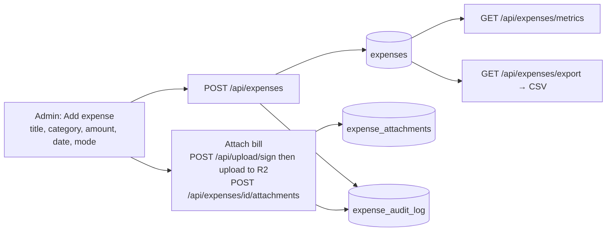
```mermaid
flowchart LR
  A["Admin: Add expense<br/>title, category, amount, date, mode"] --> B["POST /api/expenses"]
  B --> C[("expenses")]
  A --> D["Attach bill<br/>POST /api/upload/sign then upload to R2<br/>POST /api/expenses/id/attachments"]
  D --> E[("expense_attachments")]
  B & D --> L[("expense_audit_log")]
  C --> M["GET /api/expenses/metrics"]
  C --> X["GET /api/expenses/export → CSV"]
```

**Step by step**
1. **Expenses → Categories**: set up heads (Electricity, Stationery, Repairs…).
2. **Add expense**: fill the form; the recorder's name/id is stored.
3. **Attach** a bill: the browser asks `/api/upload/sign` for a signed URL and uploads straight to R2; the record links to it.
4. Filter by month; check **metrics**; **export** CSV for the accountant.
5. Edit or delete with the change recorded in the audit log.

## 3. Business rules & edge cases

| Rule | Detail |
|---|---|
| Required | `school_id`, category, non-empty title, **amount > 0** |
| Tenant | `requireFeeAccess(school_id)` on every route |
| Category in use | Deleting a category referenced by expenses is restricted (`ON DELETE RESTRICT`) — deactivate instead |
| Audit | Every action logged with actor |
| Files | Direct-to-R2 signed upload keeps large files off the app server |

## 4. Technical reference (developers)

**Screen:** `app/school-admin/components/ExpenseManagement.tsx` (~1,100 lines).

**API**

| Method | Route | Purpose |
|---|---|---|
| GET/POST | `/api/expenses` | List (filters `date`, `from`/`to`, `month`) / create |
| GET/PATCH/DELETE | `/api/expenses/{id}` | Read/update/delete |
| POST | `/api/expenses/{id}/attachments` | Register an attachment |
| DELETE | `/api/expenses/attachments/{attachmentId}` | Remove attachment |
| GET/POST/PATCH/DELETE | `/api/expenses/categories` | Category CRUD |
| GET | `/api/expenses/metrics`, `/audit-log`, `/export` | Metrics, audit, CSV |
| POST | `/api/upload/sign` | Signed R2 upload URL |
| GET | `/api/auth/me` | Actor name for "recorded by" |

**Tables:** `expenses` (`school_id`, `category_id` → `expense_categories`, `title`, `payee_name`, `amount`, `expense_date`, `payment_mode`, `transaction_ref`, `notes`, recorder), `expense_categories`, `expense_attachments`, `expense_audit_log`.

**Libraries:** `lib/auth.ts` (`requireFeeAccess`), `lib/r2.ts`.

**Tests:** no dedicated spec; covered indirectly by full-platform flows — add one before scale.

## 5. Pitch kit

**Investor one-liner** — "Money in and money out on one platform: fees today, expenses with bills and audit trail beside them."

**School one-liner** — "Record every expense with the bill attached and see the month's spending by category — with a log of who changed what."

**Slide bullets**
- Categories, records, bill attachments.
- Monthly metrics and CSV export.
- Full audit log.

**60-second demo:** add "Electricity ₹18,400" → attach a bill photo → open metrics → export CSV.

**Objection → honest answer**
- *"Is this accounting?"* — No. It is an expense register with audit; connecting it to a full P&L or Tally is roadmap.

## 6. Limits & roadmap

- No budgets, approvals, recurring expenses or vendor management.
- No profit-and-loss view combining fees and expenses yet.

---

<!-- SOURCE FILE: docs/product/features/16-academic-calendar.md -->

# 16 · Academic Calendar

| | |
|---|---|
| **Feature key** | `calendar` (nav alias `academic-calendar`) |
| **Category** | Administration |
| **Portals** | School Admin (edit) · Teacher, Student, Parent (read-only *School Calendar*) |
| **Status** | **BUILT** |
| **Snapshot** | `dev` @ `29f0e6a`, 2026-09-21 |

---

## 1. Product brief

**The problem.** Holidays are announced on paper; attendance percentages then punish students for days the school was closed; parents and teachers have no shared view of the year.

**The solution.** One calendar the admin owns and everyone reads — and **a holiday actually closes attendance** for those dates.

| Capability | Detail |
|---|---|
| Entry types | `holiday`, `exam`, `event`, `meeting`, `other` (colour-coded) |
| Dates | A single date **or a range up to 366 days** |
| Audience | `everyone` or `staff` only (admin + teachers). **Holidays are always for everyone.** Students/parents never see staff-only entries |
| Weekly off | Weekdays that are never school days (default **Sunday**), configurable |
| Effect on attendance | Holidays and weekly-off days **cannot be marked** and are **excluded from every percentage** |
| Safety | Adding a holiday over days that already have attendance asks for confirmation; deleting it makes those records count again |
| Read-only views | Teacher, student, parent *School Calendar* tab |

**Value.** One truth for the school year; fair attendance numbers; parents can plan around holidays.

**Where it stops.** Whole-school and whole-day only: **no class-specific closures and no half-days** (roadmap). No recurring events, reminders or external calendar sync.

## 2. End-to-end flow

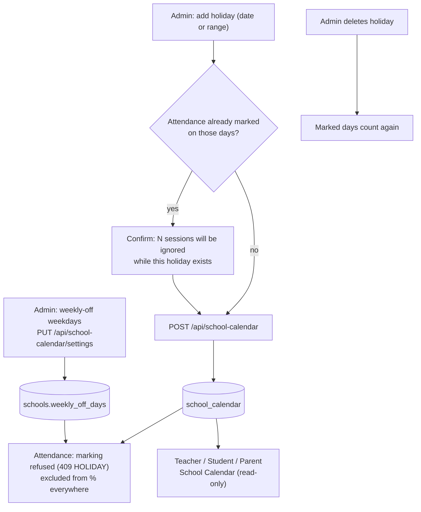
```mermaid
flowchart TD
  A["Admin: add holiday (date or range)"] --> B{"Attendance already marked<br/>on those days?"}
  B -- yes --> C["Confirm: N sessions will be ignored<br/>while this holiday exists"]
  B -- no --> D
  C --> D["POST /api/school-calendar"]
  D --> E[("school_calendar")]
  E --> F["Attendance: marking refused (409 HOLIDAY)<br/>excluded from % everywhere"]
  E --> G["Teacher / Student / Parent<br/>School Calendar (read-only)"]
  H["Admin: weekly-off weekdays<br/>PUT /api/school-calendar/settings"] --> I[("schools.weekly_off_days")]
  I --> F
  J["Admin deletes holiday"] --> K["Marked days count again"]
```

**Step by step**
1. **Academic Calendar** → month grid → *Add*: pick type, title, date or range, audience.
2. For a holiday over already-marked days, confirm the warning.
3. Set **Weekly off** if the school works Saturdays or has a different rest day.
4. Teachers, students and parents open **School Calendar** to view.
5. On the **Overview**, a holiday shows a banner instead of the attendance strip; the attendance *Today* panel has **"Mark today as a holiday"**.

## 3. Business rules & edge cases

| Rule | Detail |
|---|---|
| Who edits | Only the school admin (`getAdminActor`); everyone else reads |
| Range | `MAX_RANGE_DAYS = 366` |
| Named holiday vs weekly off | A named holiday wins in the day map |
| Attendance effect | Server refuses marking on holidays/weekly off (`409 HOLIDAY` / `WEEKLY_OFF`); UI shows why |
| Existing holidays keep working | If the `calendar` feature is switched off later, saved holidays **still close attendance** |
| Validation | Zod (`lib/calendarSchemas.ts`): dates `YYYY-MM-DD`, type and audience enums |
| Time | IST |

## 4. Technical reference (developers)

**Screens:** `app/school-admin/components/AcademicCalendar.tsx`; shared read-only `app/components/SchoolCalendarView.tsx`.

**API**

| Method | Route | Purpose | Guard |
|---|---|---|---|
| GET/POST | `/api/school-calendar` | List (all roles) / create (admin) | read: any school role; write: admin |
| PATCH/DELETE | `/api/school-calendar/{id}` | Edit / delete | admin |
| PUT | `/api/school-calendar/settings` | Weekly-off weekdays | `getAdminActor` (403 otherwise) |

**Tables:** `school_calendar` (`event_type`, `event_date`, `end_date`, `audience`, `created_by_name`, `updated_at`), `schools.weekly_off_days`, and reads `attendance_sessions` for the "already marked" warning.

**Libraries:** `lib/attendanceRules.ts` (`expandNonWorkingDays`), `lib/attendance.ts`, `lib/attendanceAuth.ts`, `lib/calendarSchemas.ts`.

**Tests:** `attendance-rules.spec.ts`, `workflow-attendance.spec.ts` (calendar security, holidays, weekly off).

## 5. Pitch kit

**Investor one-liner** — "The school calendar is wired into the product: mark a holiday and attendance, dashboards and parents all adjust automatically."

**School one-liner** — "Add a holiday once. Attendance closes for that day, percentages stay fair, and every parent and teacher sees it."

**Slide bullets**
- Holidays, exams, events, meetings; date ranges up to a year.
- Holiday closes attendance and is excluded from all percentages.
- Weekly-off configuration; staff-only entries.
- Read-only calendar in teacher, student and parent portals.

**60-second demo:** add a 3-day holiday → try to mark attendance on it (refused with reason) → parent portal shows it → delete it and watch marked days count again.

**Objection → honest answer**
- *"Half-day or class-specific holidays?"* — Not yet.

## 6. Limits & roadmap

- Whole-school, whole-day only; no recurrence or reminders.
- Roadmap: half-day and class-specific holidays.

---

<!-- SOURCE FILE: docs/product/features/17-export-and-reports.md -->

# 17 · Export & Reports (Export Center)

| | |
|---|---|
| **Feature key** | `export` |
| **Category** | Administration |
| **Portals** | School Admin |
| **Status** | **BUILT** |
| **Snapshot** | `dev` @ `29f0e6a`, 2026-09-21 |

---

## 1. Product brief

**The problem.** Schools must hand data to authorities, trustees and parents — attendance registers, marks sheets, report cards — and today they retype it.

**The solution.** An **Export Center** with three tabs:

| Tab | Output |
|---|---|
| **Attendance CSV** | Class register for a date range (Morning & Afternoon per student per day), plus the **daily absentee list** with parent phone numbers |
| **Marks CSV** | Per-student, per-subject marks, totals and result for a chosen exam |
| **Report Cards** | For a chosen exam, a printable per-student report card (subject, max marks, obtained, total, result); **Print All** uses the browser's print (save as PDF) |

Other exports live inside their own features: fee exports and the Excel fee-audit report ([13](13-fee-management.md)), expense CSV ([15](15-expense-tracking.md)), Excel templates for bulk onboarding ([02](02-staff-directory-and-onboarding.md), [03](03-students-list-and-onboarding.md)).

**Value.** Reports in a click; the absentee list lets staff key attendance into the government LEAP app quickly.

**Where it stops.** The report card is a **single-exam, browser-printed sheet** — not a multi-exam, annual, branded report card with remarks and co-scholastic grades. **No direct LEAP integration.** No scheduled/emailed reports.

## 2. End-to-end flow

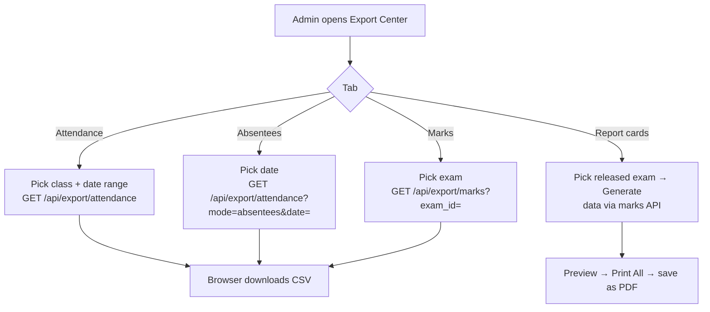
```mermaid
flowchart TD
  A["Admin opens Export Center"] --> B{"Tab"}
  B -- Attendance --> C["Pick class + date range<br/>GET /api/export/attendance"]
  B -- Absentees --> D["Pick date<br/>GET /api/export/attendance?mode=absentees&date="]
  B -- Marks --> E["Pick exam<br/>GET /api/export/marks?exam_id="]
  B -- Report cards --> F["Pick released exam → Generate<br/>data via marks API"]
  C & D & E --> G["Browser downloads CSV"]
  F --> H["Preview → Print All → save as PDF"]
```

**Step by step**
1. **Attendance CSV:** choose class and dates → *Download*. The file name is `attendance_<from>_to_<to>.csv`.
2. **Absentee list:** pick the day → CSV of absent students with parent phone.
3. **Marks CSV:** choose an exam → *Download Marks CSV* (`marks_<exam>.csv`).
4. **Report Cards:** select the exam (published) → **Generate** → review one page per student → **Print All**.

## 3. Business rules & edge cases

| Rule | Detail |
|---|---|
| Excel-safe | Attendance CSV neutralises cells that begin with `=`, `+`, `-`, `@` (formula injection) and is written as UTF-8 **with BOM** so Telugu/Hindi names open correctly in Excel |
| Tenant | Class and school are checked against the login (`requireExamsAdmin` for marks — an earlier gap where an admin could export another school's exam by guessing the id was fixed) |
| Attendance numbers | Use the shared attendance rules; holidays/weekly-off excluded |
| Report card grades | From the shared `examGrading` ladder — same grade as the parent and student see |
| Release | Report cards are meant for released exams; results only appear in parent/student portals after admin release |

## 4. Technical reference (developers)

**Screen:** `app/school-admin/components/ExportCenter.tsx` (~520 lines; client-side download and print, `@media print` page breaks per student).

**API**

| Method | Route | Purpose |
|---|---|---|
| GET | `/api/export/attendance` | `?class_id&from&to` register, or `?mode=absentees&date=` |
| GET | `/api/export/marks?school_id&exam_id` | CSV of per-student per-subject marks |
| GET | `/api/exams`, `/api/exams/{id}/marks` | Exam list and data used by the report card tab |
| GET | `/api/classes` | Class picker |

**Tables read:** `attendance`, `students`, `classes`, `student_parents`, `exam_records`, `exam_subjects`, `exam_marks`, `class_subjects`.

**Libraries:** `lib/examGrading.ts`, `lib/attendanceRules.ts`, `lib/attendanceAuth.ts`, `lib/examsAuth.ts`.

**Tests:** attendance export is covered in `workflow-attendance.spec.ts`; marks/report-card export has **no dedicated test**.

## 5. Pitch kit

**Investor one-liner** — "Every school report — registers, marks, report cards — exported in one click from data that is already clean."

**School one-liner** — "Download the attendance register, marks sheets and printable report cards in seconds — Telugu names included."

**Slide bullets**
- Attendance register and daily absentee list (LEAP-friendly).
- Marks CSV and printable report cards.
- Excel-safe, Telugu/Hindi-safe files.

**Demo:** export today's absentee list → open in Excel (Telugu names intact) → generate report cards for an exam → Print All.

**Objection → honest answer**
- *"Annual multi-exam report card?"* — Not yet; today's card is per exam.
- *"LEAP integration?"* — No public API; we give the list to key in.

## 6. Limits & roadmap

- Per-exam report card only; no multi-term, remarks, or school-branded template designer.
- No scheduled exports or emailed reports.

---

<!-- SOURCE FILE: docs/product/features/18-school-settings.md -->

# 18 · School Settings

| | |
|---|---|
| **Feature key** | `settings` |
| **Category** | Administration |
| **Portals** | School Admin (owner) |
| **Status** | **BUILT** |
| **Snapshot** | `dev` @ `29f0e6a`, 2026-09-21 |

---

## 1. Product brief

**The problem.** A school needs to set itself up (profile, academic year), decide who else can sign in as an administrator, and keep those accounts safe — without sharing one password.

**The solution.** A settings area covering the school profile, academic years, **staff accounts** with per-person logins, and account security.

| Area | Detail |
|---|---|
| School profile | Name, contact details, **logo** (signed upload) with left/centre/right alignment, and configurable **receipt header** blocks used on fee receipts |
| Academic years | Create, set current (first year only), view history and **snapshot export** of a past year |
| **Staff accounts** | Invite principal / vice principal / additional admins **by email**; each gets a **one-time set-password link** (48 h) — no password is ever emailed; **resend** voids earlier links; **deactivate** ends their session immediately |
| My account | Change own password (signs you out elsewhere); **request data export or account closure** (an email to WLYL support) |
| Plan | View the school's plan and enabled features |

**Value.** Every administrator has an **individual, revocable login** — a real audit trail and safe offboarding, which schools (and their trustees) care about.

**Where it stops.** No fine-grained roles inside "school admin" (principal, VP and admin share admin capabilities); no SSO or 2FA; the platform's "Reset password" resets **only the owner** account.

## 2. End-to-end flow

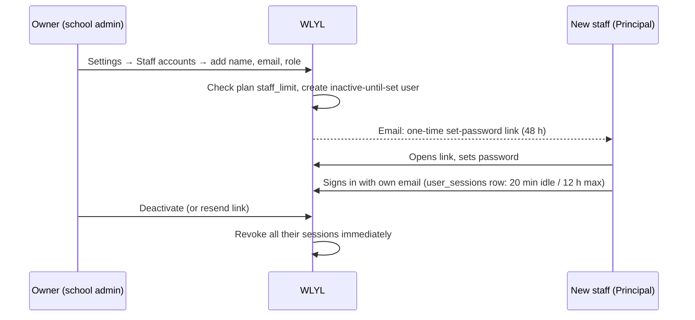
```mermaid
sequenceDiagram
  participant O as Owner (school admin)
  participant SYS as WLYL
  participant P as New staff (Principal)
  O->>SYS: Settings → Staff accounts → add name, email, role
  SYS->>SYS: Check plan staff_limit, create inactive-until-set user
  SYS-->>P: Email: one-time set-password link (48 h)
  P->>SYS: Opens link, sets password
  P->>SYS: Signs in with own email (user_sessions row: 20 min idle / 12 h max)
  O->>SYS: Deactivate (or resend link)
  SYS->>SYS: Revoke all their sessions immediately
```

**Step by step**
1. **Profile:** complete the school profile after first login (`/profile-setup`).
2. **Academic year:** the first year is created here; every later year is created and activated **only** through Year Rollover ([19](19-year-rollover.md)).
3. **Staff accounts:** add a person → they receive a link → they set a password → they sign in with their own email.
4. **Resend / deactivate** as needed; deactivation kills their live session on the next request.
5. **Change password:** signs out other sessions of yours.

## 3. Business rules & edge cases

| Rule | Detail |
|---|---|
| Per-person login | School ID is **not** a login; email + password |
| Sessions | **20 min idle / 12 h max**, browser-session cookie; server-revocable (`user_sessions`) |
| Session ends on | logout · login as someone else in the same browser · deactivation · password change (others) · reset (all) |
| Invite links | One-time, **48 h**, "Resend" voids earlier links; stored as reset tokens (`password_reset_tokens`) |
| Last account hint | Login page remembers the last-used account (name, email, role) in `localStorage` — **never** a password or session |
| Platform reset | Resets **only the owner** (the account with a `school_code`) |
| Plan limit | `staff_limit` enforced on creation |
| Active year | Once a school has a current year it cannot be switched by hand (Settings/API) — only by rollover |
| Idle UX | `IdleSessionGuard` heartbeats while active and redirects to `/login?role=school&reason=timeout` |

## 4. Technical reference (developers)

**Screens:** `app/school-admin/components/SchoolSettings.tsx` (~1,500 lines), `StaffProfile.tsx`, `IdleSessionGuard.tsx` (mounted by `app/school-admin/layout.tsx`), login and reset pages under `app/login`, `app/reset-password`, `app/change-password`, `app/profile-setup`.

**API**

| Method | Route | Purpose |
|---|---|---|
| GET/POST/PATCH/DELETE | `/api/school-admin/staff-accounts` | List / invite / edit / deactivate |
| POST | `/api/school-admin/staff-accounts/resend` | New invite link (voids old) |
| POST | `/api/school-admin/account-request` | Emails WLYL support for a data-export or account-closure request |
| POST | `/api/auth/login`, `/logout`, `/change-password`, `/forgot-password`, `/reset-password`; GET `/api/auth/me`; GET/POST `/api/auth/session` | Staff auth and heartbeat |
| GET/POST/PATCH/PUT | `/api/academic-years`; GET `/{id}/history`, `/{id}/snapshot-export` | Years and history |
| GET/PUT | `/api/schools/{id}`; GET `/api/schools/{id}/subscription` | Profile, plan view |
| GET/POST | `/api/platform/features` | Plan feature list |
| POST | `/api/upload/sign` | Signed upload (logo) |

**Tables:** `schools`, `users`, `user_profiles`, `user_sessions`, `password_reset_tokens`, `school_subscriptions`, `plan_pricing` (`staff_limit`), `plan_features`, `academic_years`, `academic_year_snapshots`, `student_class_history`, `platform_audit_log`.

**Libraries:** `lib/auth.ts` (`createStaffSession`, `revokeSession`, `revokeUserSessions`, `getSession({passive})`, `SESSION_IDLE_MINUTES = 20`, `SESSION_MAX_HOURS = 12`), `lib/staffInvite.ts`, `lib/email.ts`, `lib/features.ts`.

**Design note:** `getSession()` validates the JWT **and** the `user_sessions` row (not revoked, within idle/max, user active). Normal API calls count as activity; pollers pass `{ passive: true }` so a background check cannot keep a session alive forever.

**⚠ INTERNAL security note:** `GET/PUT /api/schools/{id}/subscription` currently has no auth guard (see [architecture §12.1](00-platform-architecture.md)); the plan view here should read it only after that fix.

**Tests:** `workflow-staff-sessions.spec.ts`, `auth-admin.spec.ts`, `workflow-school-admin.spec.ts`.

## 5. Pitch kit

**Investor one-liner** — "Enterprise-grade access control for schools: individual logins, instant revocation, idle timeouts — without an IT department."

**School one-liner** — "Everyone who manages the school has their own login. When someone leaves, their access ends the same minute — and nobody ever shares a password."

**Slide bullets**
- Per-person admin accounts; invite by one-time link.
- 20-minute idle timeout, 12-hour cap, instant revocation.
- Academic-year history and snapshot export.

**60-second demo:** invite a principal → open the link in a second browser → set password → deactivate from the first → the second browser is logged out on its next click.

**Objection → honest answer**
- *"2FA / SSO?"* — Not yet.
- *"Different permissions for principal vs clerk?"* — Not yet; school-admin roles share capabilities.

## 6. Limits & roadmap

- No 2FA, SSO or fine-grained admin roles.
- Roadmap: role-based admin permissions, WhatsApp/OTP sign-in for parents.

---

<!-- SOURCE FILE: docs/product/features/19-year-rollover.md -->

# 19 · Year Rollover

| | |
|---|---|
| **Feature key** | `year-rollover` |
| **Category** | Administration |
| **Portals** | School Admin |
| **Status** | **BUILT** (issues #199, #201) |
| **Snapshot** | `dev` @ `29f0e6a`, 2026-09-21 |

---

## 1. Product brief

**The problem.** Every April the whole school changes at once: students move up a grade, the last grade graduates, some repeat, some change section, dues carry forward, and every module must start on the new year — usually done with a weekend of Excel and errors nobody notices until June.

**The solution.** **One central, guarded, all-or-nothing rollover.** It is the *only* place a school's active academic year advances after the first year is set up.

| Capability | Detail |
|---|---|
| Fee gate | The fee year-end must be **closed first** (Fee Management → Year-End). Otherwise a popup ("Complete the fee year-end first") with a button — and the server also refuses (`409 FEES_NOT_CLOSED`) |
| Preview | Readiness check and promotion preview before running |
| Snapshot | Each active student's grade, section and roll number saved to **class history** (permanent audit trail) |
| Promote | Everyone moves up one grade (numeric 6→7, or Nursery→LKG→UKG→1) |
| Graduate | Final-grade students become `graduated` |
| Exceptions | Per student: **repeat** the year (same grade + section, roll number kept) or **move** to a different existing section of the next grade; final-grade students may repeat instead of graduating |
| New year current | Attendance, exams, syllabus, calendar, fees and all portals follow |
| History | Past years remain in Student 360 through the year switcher |

**Value.** A stressful, error-prone annual chore becomes a checked, reversible-by-design, one-screen operation with a full audit trail — a strong reason to stay on the platform year after year (retention).

**Where it stops.** Not undoable once run. No automatic class re-sectioning/balancing, no timetable rebuild, no automatic new-fee-structure copy beyond what Fee Setup provides.

## 2. End-to-end flow

```mermaid
flowchart TD
  A["Fee Management → Year-End<br/>decide every student's dues"] --> B["Close the fee year"]
  B --> C["Year Rollover tab"]
  C --> D["Create next year<br/>label fixed = year after current"]
  D --> E["Readiness + promotion preview"]
  E --> F["Optional: mark exceptions<br/>repeat / move section"]
  F --> G{"Fee year closed?"}
  G -- no --> H["Popup: Complete the fee year-end first<br/>server 409 FEES_NOT_CLOSED"]
  G -- yes --> I["POST /api/academic-years/rollover<br/>ONE transaction"]
  I --> J["1 Snapshot to student_class_history"]
  J --> K["2 Promote / repeat / move"]
  K --> L["3 Graduate final grade"]
  L --> M["4 Set new year current"]
  M --> N["Result: promoted, repeated, moved, graduated,<br/>roll numbers cleared"]
```

**Step by step**
1. **Year-End (fees):** apply decisions for every student with dues (carry forward → "Previous Year Dues" bill in the next year; write off; passout; leave open). **Close** the year.
2. **Year Rollover tab:** create the next year (label is fixed to the year after the current one, e.g. `2026-27` → `2027-28`).
3. **Review** the preview; mark **exceptions** (repeat / different section).
4. **Run.** Everything happens in a single database transaction; concurrent runs are serialised (the second gets `409`).
5. **Read the result:** counts promoted / repeated / moved / graduated and how many roll numbers were cleared.
6. **Follow-up:** re-assign cleared roll numbers; generate the new year's fee bills.

## 3. Business rules & edge cases

| Rule | Detail |
|---|---|
| Only current → next | Only the **current** year can roll over, only into the year that **follows** it, and **once** |
| Fee gate | Schools **with** Fee Management need a closed (not reopened) fee year; schools **without** it are not gated |
| Atomic | Snapshot + promote + graduate + switch year in one transaction; concurrent runs serialised (race-safe claim) |
| Grade sequence | `grade_sequence` and `final_grade` define promotion order; `nextGradeInSequence` returns none at the end |
| **Roll numbers** | Unique per class. A promoted student keeps their roll number if it is free in the new class; otherwise it is **cleared** and the school reassigns (counted in `roll_numbers_cleared`). Graduates' roll numbers are cleared; the old value stays in class history |
| Exceptions validated up front | Unknown student or missing section is refused **before anything changes** (Zod, max 5,000 exceptions) |
| Outcomes recorded | Each student's outcome — `promoted`, `repeated`, `moved`, `graduated` — stored in `student_class_history` |
| After rollover | The old fee year **cannot be reopened**; the active year cannot be switched by hand |
| Idempotent readiness | `rolled_over` = students have a class-history row for the year |

**Worked example (illustrative).** School has Grades 1–10 with 300 students. 285 promote, 6 repeat (exceptions), 4 move to section B, and 25 in Grade 10 graduate (2 of them chose to repeat instead). Result shows counts; if 12 promoted students' roll numbers clash in the new class, "12 roll numbers cleared" is reported.

## 4. Technical reference (developers)

**Screen:** `app/school-admin/components/YearRollover.tsx` (~600 lines).

**API**

| Method | Route | Purpose |
|---|---|---|
| GET | `/api/academic-years/rollover` | Readiness (`getRolloverReadiness`) and preview |
| POST | `/api/academic-years/rollover` | Run `{school_id, from_year_id, to_year_id, final_grade, grade_sequence, exceptions[]}` |
| GET/POST/PATCH/PUT | `/api/academic-years` | Create the next year (only here after year one) |
| GET/POST | `/api/students/promote` | Promotion support |
| GET | `/api/fees/year-rollover` | Fee-side rollover state |
| GET/POST | `/api/classes`, `/api/students` | Section existence, roster |

**Tables:** `academic_years`, `academic_year_snapshots`, `student_class_history`, `students`, `classes`, `fee_year_close`, `student_fee_ledger`, `fee_categories`, `fee_structures`, `class_subjects`, `curriculum_assignments`, `school_subjects`.

**Libraries:** `lib/yearRollover.ts` (`getRolloverReadiness`, `isFeeYearClosed`, `isYearRolledOver`, `feeGateRequired`, `FEES_NOT_CLOSED`), `lib/feeRollover.ts` (`nextAcademicYearLabel`, `lockYearClose`), `lib/grades.ts`, `lib/academicYear.ts`.

**Design notes:** Fee Year-End no longer creates years or promotes anyone (responsibility separated); readiness is computed by one function used by both the screen and the route so they always agree; the exception schema is a Zod discriminated union (`repeat` | `move`).

**Tests:** `workflow-year-rollover.spec.ts`. **ADR:** `docs/DECISIONS.md` — "One central Year Rollover, gated by fee year-end (#199)".

## 5. Pitch kit

**Investor one-liner** — "The annual reset that other tools leave to Excel: one guarded, atomic operation that promotes, graduates and carries dues — and locks the customer in year after year."

**School one-liner** — "New academic year in one screen: everyone promoted, exceptions handled, dues carried forward — and nothing half-done."

**Slide bullets**
- Fee year-end gate prevents rolling over with unresolved dues.
- One atomic transaction; concurrent-run safe.
- Repeat-year and section-change exceptions.
- Full class history retained; Student 360 year switcher.

**60-second demo:** show the blocked popup ("complete fee year-end first") → close fee year → mark one student to repeat → run → show the result counts and the student's history.

**Objection → honest answer**
- *"Can we undo it?"* — No; the design is to prevent mistakes with the gate, preview and exceptions. Take a backup first (daily R2 backup exists).

## 6. Limits & roadmap

- Irreversible once run; cleared roll numbers need manual reassignment.
- No automatic timetable/section rebalancing.

---

<!-- SOURCE FILE: docs/product/features/20-teacher-portal.md -->

# 20 · Teacher Portal

> Not a Platform-Admin feature switch — it is the workspace where the attendance, syllabus, exam and library features are *used* by teachers. Documented separately because decks need it.

| | |
|---|---|
| **Route** | `/teacher` (login `/teacher/login`) |
| **Cookie / token** | `wlyl-teacher`, JWT 7 days |
| **Signs in with** | Employee id + password (forced change on first login) |
| **Status** | **BUILT** |
| **Snapshot** | `dev` @ `29f0e6a`, 2026-09-21 |

---

## 1. Product brief

**The problem.** Teachers lose teaching time to registers, mark sheets and syllabus reports.

**The solution.** A single workspace organised around **"my classes"**:

| Section | What the teacher does |
|---|---|
| **Overview** (Smart Snapshot) | Today at a glance for their own classes |
| **My Classes** → class view | Per class: attendance, students, syllabus setup and coverage, exams and marks entry |
| **My Students** → student detail | Look up a student in their classes |
| **Attendance** | Class picker (Morning/Afternoon state + who marked) → mark sheet → submit; **History**; **My class** dashboard (class teachers only); Report a mistake |
| **Syllabus** | Class Syllabus Setup, mark topics taught, add/rename custom chapters, bulk-import an outline, English→Telugu/Hindi name conversion |
| **Exams / Marks** | Enter marks for their subjects; class teachers review and forward for release |
| **Digital Library** | Upload textbooks; browse materials for their class subjects |
| **School Calendar** | Read-only |
| **My Profile** | Password, date of birth |

Which sections show follows the school's plan (`attendance`, `curriculum`, `exam-marks`, `library`, `calendar`).

**Value.** Marking attendance is two taps per student; syllabus and marks are done where the teacher already is; the principal gets the data without chasing.

**Where it stops.** No timetable, lesson planner, homework, doubts or leave (all removed from `dev`; timetable is built on a branch awaiting sign-off). No chat with parents.

## 2. End-to-end flow (a teacher's day)

```mermaid
flowchart TD
  L["Login: employee id + password"] --> O["Overview snapshot"]
  O --> A["Attendance: mark Morning<br/>first submit locks"]
  A --> H{"Mistake?"}
  H -- own, same day --> E["Edit"]
  H -- other teacher's --> R["Report a mistake to admin"]
  O --> S["Syllabus: mark topics taught"]
  O --> X["Marks: enter subject marks → submit"]
  X --> V["Class teacher: review → admin releases"]
  O --> B["Library: upload / open textbooks"]
```

## 3. Business rules

| Rule | Detail |
|---|---|
| Attendance | Any class, today and 2 days back; first submit locks; correct own work same day; otherwise report ([08](08-attendance-tracking.md)) |
| Class teacher | Gets *My class* dashboard, reviews exam marks, can reopen a submitted subject before review ([10](10-exam-schedule-and-marks.md)) |
| Subject teacher | Edits marks only for their assigned subjects |
| Syllabus | Only the class's assigned teacher edits its setup and marks topics ([09](09-syllabus-customizer.md)) |
| Deactivation | A deactivated teacher can no longer mark attendance |
| Data scope | Everything is scoped to the teacher's school |

## 4. Technical reference (developers)

**Screens:** `app/teacher/page.tsx` (350 lines, section nav in the URL), `components/`: `SmartSnapshot`, `MyClasses`, `ClassView` (~2,800 lines: attendance, syllabus, exams tabs), `MyStudents`, `StudentDetail`, `Attendance` + `attendance/*`, `ExamMarks`, `TeacherSyllabus`, `TeacherLibrary`, `TeacherProfile`.

**API (teacher-facing)**

| Group | Routes |
|---|---|
| Auth | `/api/teacher-auth/{login,logout,me,change-password}`; `/api/teacher/auth/{login,logout,me,change-password,date-of-birth,forgot-password,reset-password}` |
| Attendance | `/api/attendance` (+ `/overview`, `/dashboard`, `/report`) |
| Exams | `/api/exams`, `/api/exams/{id}/marks`, `/review`, `/subjects/{sid}/reopen` |
| Syllabus | `/api/syllabus`, `/setup/*`, `/api/school/syllabus/{bulk-import,bootstrap-chapters}`, `/api/transliterate` |
| Library | `/api/textbooks`, `/api/school/library`, `/api/teachers/{id}/class-subjects` |
| Notifications | `/api/notifications` (recipient derived from session) |

**Guards:** `getTeacherSession()`, `getStaffActor()` (attendance), `requireExamsTeacher`, `requireSyllabusWriteAccess`.

**Tests:** `auth-teacher.spec.ts`, `staff-teacher-data-flow.spec.ts`, `workflow-attendance.spec.ts`, `workflow-portals.spec.ts`.

## 5. Pitch kit

**Investor one-liner** — "Teachers work from one screen per class — attendance, syllabus, marks — so data is captured at the source, not re-typed later."

**School one-liner** — "Two taps per student for attendance, and syllabus and marks right where you teach."

**Slide bullets**
- Class-centred workspace; offline-tolerant attendance marking.
- Class-teacher dashboard: weekday patterns, students needing attention.
- Marks entry with review-and-release governance.
- Syllabus coverage with one-click sibling copy.

**Demo:** log in as a class teacher → mark attendance → open *My class* dashboard → enter marks for a subject.

## 6. Limits & roadmap

- No timetable / lesson planning / homework / parent chat on `dev`.
- Two parallel teacher-auth route sets exist (`/api/teacher-auth/*` and `/api/teacher/auth/*`) — **INTERNAL** cleanup candidate.

---
