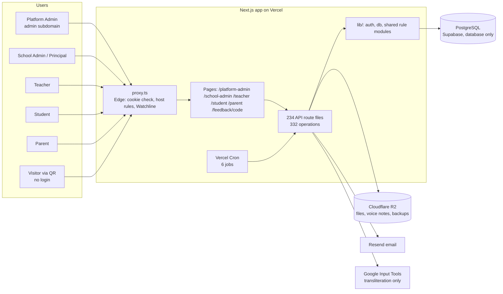
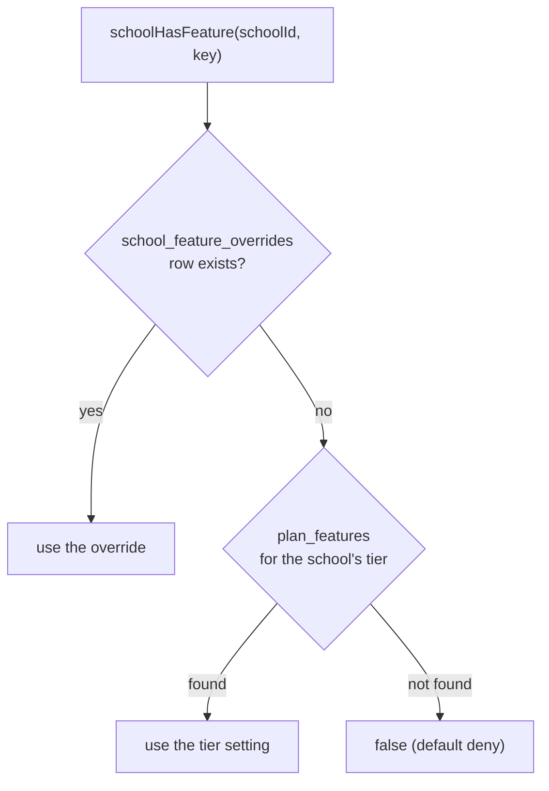

# Platform Architecture — System Architect's Reference

> **Audience:** engineers, technical due-diligence reviewers, the CTO seat of an investor meeting.
> **Snapshot:** `dev` branch, commit `29f0e6a` (2026-09-21). Every statement below was checked against the code, not the older wiki.
> **Label:** the whole document is **INTERNAL / technical**. Strip it before sending to schools; the pitch-safe summary is at the end.

---

## 1. One-paragraph architecture

WLYL is a **single multi-tenant Next.js (App Router) application** that serves **five role-separated portals** (Platform Admin, School Admin, Teacher, Student, Parent) from one codebase and one PostgreSQL database. Tenancy is by `school_id` on every row; the school is decided by the **login**, never by a parameter the browser sends. Features are **switched per plan and per school** through a two-layer flag system, so one deployment can serve a Basic school and a Premium school differently. Business rules that must never disagree between screens (attendance %, exam grade, fee rollover, year rollover) live in **single shared modules** in `lib/`.

## 2. System context

## 3. Technology stack

| Layer | Choice | Notes |
|---|---|---|
| Framework | Next.js App Router, React, TypeScript **strict** (no `any`) | The repo's own guidance warns this Next.js version has breaking changes; the Edge gate is `proxy.ts`, **not** `middleware.ts` |
| Styling / UI | Tailwind + shadcn/ui primitives (`components/ui`) | A shared portal design layer (`app/portal.css`, `components/portal`) is in progress on the working tree |
| Client state | Zustand (used for fee management: `lib/stores/feeStore.ts`); plain `useState` elsewhere | |
| Validation | Zod on the routes that take structured bodies (students, attendance, calendar, feedback, rollover) | Not yet universal — see limits |
| Database | PostgreSQL on Supabase, **used as a database only — never Supabase Auth** | `pg.Pool`, `max: 1` on Vercel (PgBouncer session mode), `max: 10` locally; session time zone forced to `Asia/Kolkata` |
| Auth | Custom JWT cookies per role + server-side revocable sessions for school staff | Section 5 |
| Files | Cloudflare R2 via presigned URLs (`lib/r2.ts`) | Expense attachments, feedback voice notes, materials, backups |
| Email | Resend (`lib/email.ts`), fire-and-forget | Welcome mails, invite links, absence alerts |
| Transliteration | Google Input Tools public endpoint, proxied server-side (`/api/transliterate`, staff only, no key, no SLA) | English letters → Telugu/Hindi script for syllabus names. **Not** AI, not a tutor. A keyed service can be swapped in behind the same route |
| AI helper | `lib/gemini.ts` (Groq client) exists but **no route or screen imports it** | Dead code today; do not cite as a feature |
| Hosting | Vercel (+ Vercel Cron) | |
| Tests | Playwright end-to-end, 26 suites | Section 10 |
| Package manager | pnpm | |

## 4. Repository map

| Path | What lives there |
|---|---|
| `app/<portal>/` | Pages and components per portal (`school-admin`, `teacher`, `student`, `parent`, `platform-admin`) |
| `app/components/` | Screens shared by several portals (attendance calendar/dashboard, library, school calendar view) |
| `app/api/**/route.ts` | 234 route files, 332 operations, grouped by domain (`attendance`, `fees`, `exams`, `students`, `teachers`, `syllabus`, `feedback`, `expenses`, `parent`, `student`, `platform`, `cron`, …) |
| `app/feedback/[code]` | The **public, no-login** feedback wizard |
| `lib/db.ts` | Pool + **all migrations** (`migrations[]`, idempotent, appended at the bottom, auto-run by `initDB()/ensureDB()` on cold start) |
| `lib/auth.ts`, `lib/auth-constants.ts` | JWT, cookies, sessions, tenant guards, `schoolHasFeature()`; constants are Edge-safe and shared with `proxy.ts` |
| `lib/features.ts` | **The** list of plan-gated features (19) and the nav-key alias map |
| `lib/attendance*.ts` | Attendance rules (pure), marking, dashboards, notify, student view |
| `lib/examGrading.ts`, `lib/feeRollover.ts`, `lib/yearRollover.ts`, `lib/academicYear.ts` | Shared rule modules |
| `wiki/features/` | Short living per-feature docs + generated `CATALOG.md` |
| `docs/product/` | The factbook (generated blocks) and the deck prompts; **this folder holds the deep dossiers** |
| `e2e/` | Playwright suites |

## 5. Identity, sessions and tenancy (the security model)

| Portal | Cookie | Login identifier | Token / session |
|---|---|---|---|
| Platform Admin | `wlyl-platform` | email + password | JWT, 7 days; served **only** on the `admin.` subdomain |
| School Admin / Principal / VP | `wlyl-auth` | **own email** + password (no shared school login) | JWT (12 h cap) **plus** a `user_sessions` row: **20 min idle / 12 h max**, browser-session cookie, revocable |
| Teacher | `wlyl-teacher` | employee id + password | JWT, 7 days |
| Student | `wlyl-student` | system student id (`wlyl-stu-…`) + password | JWT, 7 days |
| Parent | `wlyl-parent` | email **or** phone + password | JWT, 7 days |

How the layers cooperate:

1. **`proxy.ts` (Edge)** verifies the cookie with `jose` and redirects unauthenticated page requests. It cannot import `pg` or `jsonwebtoken`; cookie names and the JWT secret come from the dependency-free `lib/auth-constants.ts` so the Edge and Node runtimes cannot drift apart. In production the app **refuses to boot without `JWT_SECRET`** (a fail-closed guard, because the dev fallback is public in the repo).
2. **Most API routes re-check the session in Node** (`requireSchoolAdmin`, `requireFeeAccess`, `getAnySession`, `getTeacherSession`, `getStudentSession`, `getParentSession`, `getStaffActor`). **Not all do — see the security findings in section 12**, because `proxy.ts` deliberately lets every `/api/` path through and relies on each route to guard itself. `requireFeeAccess(school_id)` is the generic **tenant-isolation guard** (despite the name it is used by fees, expenses, feedback, rollover…): the school in the request must equal the school in the session, else **403**.
3. **Staff session revocation:** a session ends on logout, login as someone else in the same browser, deactivation, password change (others) or reset (all). `IdleSessionGuard` heart-beats while active and polls validity every 60 s.
4. **Row-level scoping for family portals:** a parent may read only children linked through `student_parents`; any other id answers "not found". A student sees only themselves.
5. **Public surface** is deliberately tiny: the feedback wizard (`/api/feedback/resolve|submit|voice-upload-url`), rate-limited by hashed IP (5 submissions / 10 min per school).

## 6. Feature flags (two-layer)

- **Tier layer:** `plan_features` (Basic / Standard / Premium), edited in Platform Admin → Feature configuration; changes apply instantly.
- **School layer:** `school_feature_overrides` beats the tier. Overridable keys: `student-portal`, `parent-portal`, `online-payments`, and `api-monitoring` (Watchline — *not* a plan feature; per school only).
- **`lib/features.ts`** is the single source: each feature lists the **portals** it gates, so one flag can hide a tab in the school-admin sidebar *and* the student/parent apps. `PORTAL_NAV_KEY_ALIASES` maps each portal's own nav key (e.g. `my-marks`, `results`, `syllabus`, `fees`) to the canonical key. Every nav filter and `/api/school/enabled-features` resolve through it — a rename happens once.

## 7. Data architecture

- **130 tables**, created and altered only through `migrations[]` in `lib/db.ts`. Rules: idempotent (`IF NOT EXISTS`, `ADD COLUMN IF NOT EXISTS`), append at the bottom, never reorder.
- **Domains** (feature dossiers list the exact tables):

| Domain | Representative tables |
|---|---|
| Tenancy & access | `schools`, `users`, `user_profiles`, `user_sessions`, `password_reset_tokens`, `school_subscriptions`, `plan_pricing`, `plan_features`, `school_feature_overrides`, `platform_audit_log` |
| People | `teachers`, `students`, `parents`, `student_parents`, `student_class_history`, `student_cleanup_log` |
| Academics | `academic_years`, `academic_year_snapshots`, `classes`, `class_subjects`, `master_*`, `school_*` (syllabus), `curriculum_assignments`, `class_*_visibility`, `syllabus_coverage_snapshots` |
| Attendance | `attendance`, `attendance_sessions`, `attendance_issue_reports`, `school_calendar` |
| Exams | `exam_records`, `exam_subjects`, `exam_marks`, `parent_mark_acks`, `parent_mark_ack_nudges` |
| Finance | `fee_categories`, `fee_structures`, `fee_structure_locks/amendments/history`, `student_fee_ledger`, `fee_payments`, `fee_waivers`, `fee_day_close`, `fee_year_close`, `passout_students`, `expense_*`, `expenses` |
| Communication | `announcements`, `notifications`, `feedback_*` |
| Library | `textbook_library`, `textbook_chunks`, `master_subject_materials` |
| Ops | `backup`-related, Watchline log tables, usage tracking |

- **Legacy tables** remain for features that were *removed from `dev`* (for example `doubts`, `leave_requests`, `tasks`, `task_submissions`, `teacher_unavailability`). They are unused by the live product; do not present those capabilities as live.
- **Academic year** is a first-class concept: attendance, exams, syllabus, fees and calendar all key off the school's *current* year; the only way it advances is Year Rollover.
- **IST everywhere:** `todayIST()` for "today", session time zone `Asia/Kolkata`, so a 00:00–05:29 IST request is never mis-dated.

## 8. Shared rule modules (why numbers match on every screen)

| Module | Owns | Consumers |
|---|---|---|
| `lib/attendanceRules.ts` (pure, client-safe) | statuses, sessions, `%` formula, bands (90/75), holiday expansion, IST dates, 2-day teacher back-date window | admin, teacher, parent, student dashboards, exports |
| `lib/attendanceMarking.ts` | first-submit-wins lock, correction rules | attendance API |
| `lib/examGrading.ts` | grade ladder A1…E and pass test | marks route, results, student/teacher UI, exports |
| `lib/feeRollover.ts` | system fee categories, close-out of a bill, carry-forward bill, race-safe year-close claim | year-end, year-rollover |
| `lib/yearRollover.ts` | rollover readiness + fee gate | rollover route + screen |
| `lib/idempotency.ts` | duplicate-submit guard | waivers, payments |

## 9. Background jobs (Vercel Cron, all in `vercel.json`)

| Job | Schedule (UTC) | Purpose |
|---|---|---|
| `/api/cron/backup` | daily 02:30 | Data-only backup to R2 (restore is gap-fill only — see DECISIONS 2026-07-01) |
| `/api/cron/exam-status-sweep` | daily 00:00 | Opens exams for marks entry once the exam date has passed |
| `/api/cron/syllabus-coverage-snapshot` | Mondays 02:00 | Weekly syllabus-coverage snapshots for trend charts |
| `/api/cron/birthday-sweep` | daily 18:30 | Class Circle birthday posts |
| `/api/cron/usage-digest` | Mondays 03:30 | Platform usage digest |
| `/api/internal/log-cleanup` | daily 02:00 | Watchline log retention |

Cron routes authenticate with `Authorization: Bearer <CRON_SECRET>`.

## 10. Quality system

- **26 Playwright suites** in `e2e/`: auth per role, attendance rules and workflow, student/staff onboarding and CSV import, student profile, fee-management (109 cases), feedback, syllabus (audit, translate), year rollover, staff sessions, cross-portal workflows, full-platform, Watchline config.
- **`openapi-coverage.spec.ts`** fails when an API route is missing from the OpenAPI spec (`docs/openapi.json`, served at `/api-docs`).
- **`docs-coverage.spec.ts`** fails when a feature has no doc or the generated catalog/factbook is stale.
- **Process:** every change starts as a GitHub issue → branch with issue number → PR with `Closes #n` → review checklist. Decisions are recorded in `docs/DECISIONS.md`.

## 11. Environments and configuration (names only, never values)

`DATABASE_URL` (or `PGHOST/PGUSER/PGPASSWORD/PGDATABASE/PGPORT`) · `JWT_SECRET` · `APP_URL` · `RESEND_API_KEY`, `EMAIL_FROM`, `SUPPORT_EMAIL` · `R2_ACCOUNT_ID`, `R2_ACCESS_KEY_ID`, `R2_SECRET_ACCESS_KEY`, `R2_BUCKET` · `CRON_SECRET` · `INGEST_SECRET` (Watchline) · `SETUP_SECRET` (first platform-admin setup) · `GROQ_API_KEY` (only read by the unused `lib/gemini.ts`) · `ENCRYPTION_KEY` (**reserved**; nothing uses it yet).

Branches: `dev` (this snapshot) → `wlylV1` (preview) → `wlylV1_main` (production, PR-gated). Online-payments/WhatsApp code must not go to `wlylV1_main` without explicit approval; never auto-push.

## 12. Honest technical limits (do not hide these in due diligence)

### 12.1 Security findings — **fix before external due diligence or a public pilot**

Found by scanning every state-changing API handler for a session/role guard (2026-09-21, `dev` @ `29f0e6a`). These handlers accept a request with **no login and no school check**:

| Route | Methods | What an unauthenticated caller could do |
|---|---|---|
| `/api/schools/{id}/subscription` | GET, **PUT** | Read or **change any school's plan tier** (and trigger the activation email) |
| `/api/announcements` | **POST** | Post an announcement into any school |
| `/api/announcements/{id}` | **PATCH, DELETE** | Edit or delete any school's announcement by id |
| `/api/textbooks` | GET, **POST** | List or **upload** textbooks for any school |
| `/api/textbooks/{id}` | **DELETE** | Delete any school's textbook |
| `/api/platform/tasks` | **POST, DELETE** | Modify platform master-syllabus tasks |
| `/api/platform/stats`, `/api/platform/subjects/{id}/full`, `/api/platform/subjects/{id}/chapters`, `/api/platform/chapters/{id}/topics`, `/api/platform/chapters/{id}/tasks` | GET | Read platform-wide statistics and the master catalog |
| `/api/students/{id}/change-password`, `/api/teachers/{id}/change-password` | POST | Guarded only by knowing the *current* password (no session) — acceptable but inconsistent with the other portals |
| `/api/parent/lookup` | POST | Legacy student-id + phone lookup; no session |
| `/api/init` | GET | Runs `ensureDB()`; harmless but public |
| `/api/usage/heartbeat` | POST | Accepts a usage session id with no auth |

Intentionally public and fine: login / forgot / reset routes, `/api/health`, `/api/openapi`, the three public feedback routes (rate-limited), `/api/materials/file` (presigned pattern), `/api/auth/setup-admin` (protected by `SETUP_SECRET`). Cron routes authenticate with `CRON_SECRET`.

**Recommended fix (small):** add `requirePlatformAdmin()` to the platform and subscription routes, `requireSchoolAdmin()` + `school_id === session.schoolId` to announcements and textbooks (teachers may upload textbooks — use `getAnySession` and role check), then extend `e2e` with an "unauthenticated request is refused" test per route. This was **not** changed as part of the documentation work.

### 12.2 Other limits

| # | Limit | Impact |
|---|---|---|
| 1 | No payment gateway; gateway tables are scaffolding | Online fees are a manual UPI-QR + admin verification flow |
| 2 | WhatsApp is a logging scaffold (`lib/whatsapp.ts`), not a sender | Alerts go by **email** only |
| 3 | `ENCRYPTION_KEY` unused; no `lib/encryption.ts` | Fine today (no secrets stored); required before any gateway keys |
| 4 | Zod not applied to every route | Some routes validate by hand |
| 5 | Pool `max: 1` on Vercel | Large loops inside a transaction (year-end) are sequential; acceptable at once-a-year frequency |
| 6 | Single deployment, shared domain | No white-label / per-school domain |
| 7 | Some duplicated helpers in the fee UI (`fmt`, `pct`) and a third copy of the yearly fee aggregate | Refactor debt, no user impact |
| 8 | Wiki docs older than this dossier may be stale (e.g. the exam review step, the auth "partial" statuses) | Prefer the dossiers |

## 13. Pitch-safe summary (this part may be shown externally)

- One codebase, five portals, one database — **fast to ship, cheap to run, easy to keep consistent**.
- **Per-school feature switches** turn the same product into Basic / Standard / Premium without forks.
- **Tenant isolation, role-separated sessions, revocable staff sessions, audit logs.**
- **Single-source business rules** mean the parent, teacher and principal always see the same number.
- **26 automated end-to-end suites** and an API spec guard against regressions.
- Built for India: IST, 10-digit mobile validation, April–March academic year, UPI QR fee flow, Telugu/Hindi support.
