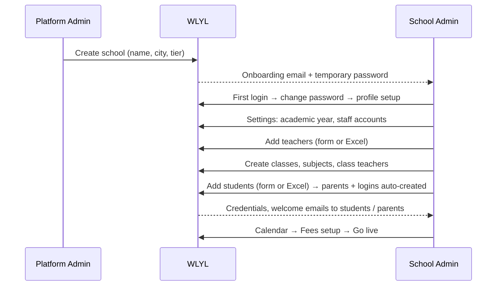

# Roles, Access & Plans

> **Audience:** product, sales, school onboarding, investors.
> **Snapshot:** `dev`, 2026-09-21.

## 1. The five roles

| Role | Portal & route | Signs in with | Owns |
|---|---|---|---|
| **Platform Admin** (WLYL team) | `/platform-admin`, `admin.` subdomain only | email + password | Creating schools, subscriptions, plan/feature switches, audit log, master syllabus and library, usage & monitoring |
| **School Admin** (owner, principal, vice principal, more admins) | `/school-admin` | own email + password | Running the school |
| **Teacher** | `/teacher` | employee id + password | Marking attendance, class dashboard, syllabus coverage, marks entry, library |
| **Student** | `/student` | system student id + password | Own attendance, marks, syllabus, calendar, library, class circle |
| **Parent** | `/parent` | email or phone + password | Own children: attendance, results, fees, announcements, calendar, syllabus, library |
| *Visitor* (no login) | `/feedback/<code>` | scans a QR poster | Submitting feedback only |

Personas, goals and pains (for slides):

| Persona | Goal | Pain today | What WLYL gives |
|---|---|---|---|
| Principal / owner | Know the school's health in 10 seconds | Registers, Excel, calls to teachers | Overview dashboard, attendance & fee visibility, exports |
| Accountant / admin staff | Collect and reconcile fees without errors | Paper receipts, dues lost between years | Ledger, FIFO receipts, waivers, day-close, year-end carry-forward |
| Class teacher | Mark attendance in seconds, know who needs care | Repeated paperwork | Two-tap marking, class dashboard, weekday patterns |
| Parent | Know how my child is doing, pay simply | Finding out late | Own calendar, results, fee ledger, UPI report |
| Student | See own progress | Unclear standing | Attendance ring, marks, syllabus |

## 2. Permission matrix (who can see / do what)

Legend: **E** edit/create · **V** view · **M** mark/enter · **R** request/report · **—** none.

| Capability | Platform Admin | School Admin | Teacher | Student | Parent |
|---|:-:|:-:|:-:|:-:|:-:|
| Create schools, plans, feature switches | E | — | — | — | — |
| School profile, staff accounts, academic years | — | E | — | — | — |
| Add / edit teachers | — | E | — | — | — |
| Add / edit / promote students | — | E | V (own classes) | V (self) | V (own child) |
| Classes, subjects, class teacher | — | E | V | — | — |
| Attendance — mark | — | E (any past day) | M (today + 2 days, any class) | — | — |
| Attendance — view | — | V (whole school) | V (class dashboard for class teacher) | V (self) | V (own child) |
| Attendance — report a mistake | — | resolves | R | — | — |
| Academic calendar | — | E | V | V | V |
| Syllabus — master catalog | E | — | — | — | — |
| Syllabus — customise school copy | — | E | — | — | — |
| Syllabus — mark covered | — | V | M | V | V |
| Exams — create, release | — | E | — | — | — |
| Exams — enter marks, review | — | V | M (own subjects / class teacher) | — | — |
| Exam results | — | V | V | V (released only) | V (released only) + acknowledge |
| Fees — set up, collect, waive, close | — | E | — | — | — |
| Fees — view own ledger | — | V | — | — | V |
| UPI payment | set-up by admin | verify | — | — | R (self-report) |
| Expenses | — | E | — | — | — |
| Announcements | — | E | V | V | V |
| Feedback — manage | — | E | — | — | — |
| Feedback — submit | — | anyone with the QR | | | |
| Exports | — | E | — | — | — |
| Year Rollover | — | E | — | — | — |
| Digital Library | E (master) | E (textbooks) | E (textbooks) / V | V | V |

## 3. Which portals does each feature reach?

From `lib/features.ts` (source of truth):

| Feature (key) | Category | School Admin | Teacher | Student | Parent |
|---|---|:-:|:-:|:-:|:-:|
| Overview Dashboard (`overview`) | Core | ✔ | | | |
| Staff Directory & Onboarding (`staff`) | Core | ✔ | | | |
| Students List & Onboarding (`students`) | Core | ✔ | | | |
| Class Management (`class-management`) | Core | ✔ | | | |
| Student Portal Access (`student-portal`) | Core | ✔ (switch) | | ✔ (the portal) | |
| Parent Portal Access (`parent-portal`) | Core | ✔ (switch) | | | ✔ (the portal) |
| WLYL Digital Library (`library`) | Core | ✔ | ✔ | ✔ | ✔ |
| Attendance Tracking (`attendance`) | Scheduling | ✔ | ✔ | ✔ | ✔ |
| Syllabus Customizer (`curriculum`) | Scheduling | ✔ | ✔ | ✔ | ✔ |
| Exam Schedule & Marks (`exam-marks`) | Scheduling | ✔ | ✔ | ✔ | ✔ |
| Announcement Board (`announcements`) | Communication | ✔ | | | |
| Feedback Management (`feedback-management`) | Communication | ✔ | | | |
| Fee Management (`fee-management`) | Finance | ✔ | | | ✔ |
| Online Fee Payments — UPI (`online-payments`) | Finance | ✔ | | | ✔ |
| Expense Tracking (`expenses`) | Finance | ✔ | | | |
| Academic Calendar (`calendar`) | Administration | ✔ | ✔ | ✔ | ✔ |
| Export & Reports (`export`) | Administration | ✔ | | | |
| School Settings (`settings`) | Administration | ✔ | | | |
| Year Rollover (`year-rollover`) | Administration | ✔ | | | |

## 4. Plans (as seeded in code — **not final pricing**)

| Plan | Seeded monthly price | Included WhatsApp msgs | Overage | Online payments flag | WhatsApp flag |
|---|---|---|---|---|---|
| Basic | 499 | 0 | 0 | false | false |
| Standard | 999 | 1000 | 0.20 | true | true |
| Premium | 1999 | 5000 | 0.20 | true | true |

**Read before quoting anything:** the unit (per school? per student? currency?) is not defined in code; the WhatsApp columns describe a **scaffold, not a working channel**. **`[TBD – founder]`** must confirm real pricing before it appears on any slide. `plan_pricing` also carries a `staff_limit`, enforced when staff accounts are created.

Per-school overrides exist for: `student-portal`, `parent-portal`, `online-payments`, and Watchline (`api-monitoring`, per school only).

## 5. How a school goes live (platform view)

Every tier/feature change by the Platform Admin is written to the **immutable audit log** (actor, entity, before/after).
