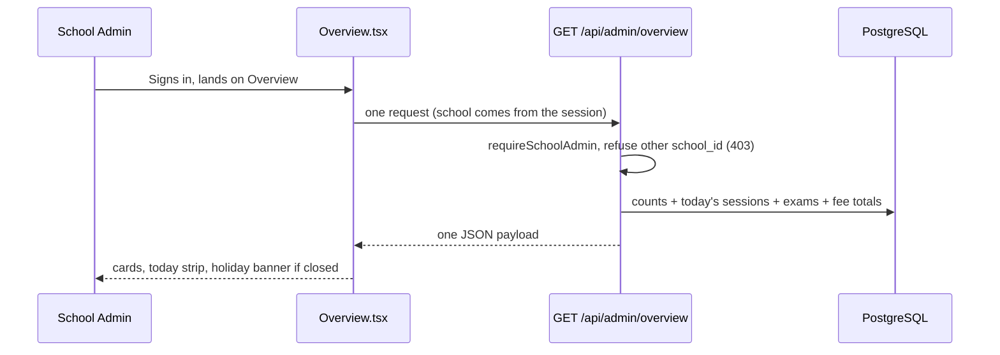

# 01 · Overview Dashboard

| | |
|---|---|
| **Feature key** | `overview` |
| **Category** | Core |
| **Portals** | School Admin |
| **Status** | **BUILT** — works end to end on `dev` |
| **Primary users** | Owner, principal, vice principal |
| **Snapshot** | `dev` @ `29f0e6a`, 2026-09-21 |

---

## 1. Product brief

**The problem.** A principal starts the day not knowing whether every class was marked, how fees are going, or what exams are coming. The answer sits in registers, Excel sheets and phone calls.

**The solution.** The first screen after sign-in is the school on one page: people counts, today's attendance, upcoming exams and fee collection, loaded in **one batched request** so it is fast even on a school-office connection.

**What the admin sees**

| Block | What it tells them |
|---|---|
| Counts | Teachers, students, classes, and the **current academic year** |
| Today's attendance | "Morning marked in N of M classes" — and who has not marked yet |
| Holiday banner | On a holiday or weekly-off day it **replaces** the attendance strip, so a closed day never looks like a problem |
| Upcoming exams | The next scheduled exams |
| Fee collection % | How much of what was billed has been collected |

**Value.** Replaces the morning round of phone calls. It is the screen that makes the platform *feel* like a control room in a demo.

**Where it stops.** It is a summary, not a report. Deep views live in Attendance (school → class → student), Fee Management (reports) and Export. It is school-admin only; teachers have their own snapshot inside the teacher portal.

## 2. End-to-end flow

**Step by step**

1. Admin signs in; the app opens `/school-admin` on Overview.
2. The screen asks for the school's data. The `school_id` is optional and only ever compared to the session — a different school is refused.
3. The server totals teachers, students and classes, checks whether **today (IST)** is a holiday or weekly-off using the shared attendance rules, counts marked sessions against classes, lists upcoming exams and computes fee-collected %.
4. The page renders; if today is non-working it shows the holiday banner instead of the attendance strip.
5. The academic year label comes from `GET /api/academic-year/current`.

## 3. Business rules & edge cases

| Rule | Detail |
|---|---|
| Tenant | School always from the login; another school's id → **403** |
| Attendance figures | Use `lib/attendanceRules.ts` — same numbers as the attendance dashboard |
| Non-working day | Holiday or weekly off → banner, no "unmarked" alarm |
| "Today" | India time, regardless of server time zone |
| No data yet | New school with no classes shows zero counts, not an error |
| Feature gate | Hidden if `overview` is switched off for the school's plan |

## 4. Technical reference (developers)

**Screens**
- `app/school-admin/components/Overview.tsx` (~350 lines; currently being restyled in the working tree by the shared portal design layer)

**API**

| Method | Route | Purpose | Guard |
|---|---|---|---|
| GET | `/api/admin/overview` | Batched dashboard payload | `requireSchoolAdmin`; `school_id` must equal session |
| GET | `/api/academic-year/current` | Current academic year label | session |

**Tables read:** `academic_years`, `attendance`, `attendance_sessions`, `classes`, `exam_records`, `student_fee_ledger`, `students`, `teachers` (read-only; nothing is written).

**Libraries:** `lib/attendanceRules.ts`, `lib/academicYear.ts`, `lib/grades.ts`, `lib/auth.ts`, `lib/db.ts`.

**Design notes**
- One batched endpoint instead of many small ones — fewer round trips, and the pool is `max: 1` on Vercel so each request must be cheap.
- No writes → no idempotency or locking concerns.

**Tests:** exercised by `workflow-school-admin.spec.ts` and `workflow-full-platform.spec.ts`. `e2e/docs-coverage.spec.ts` guarantees this doc and its evidence block stay current.

## 5. Pitch kit

**Investor one-liner** — "The principal opens one screen and knows if every class was marked, how fees stand and what's next — before the first bell."

**School one-liner** — "Your whole school at a glance, the moment you sign in."

**Slide bullets**
- One screen: people, today's attendance, exams, fee collection.
- Holiday-aware: closed days never show false alarms.
- Loads in one request; built for slow school-office internet.

**60-second demo:** sign in → point at today's attendance strip → mark a class in another window → refresh to show it change → click through to the class.

**Objection → honest answer**
- *"Is it customisable?"* — Not yet; the blocks are fixed. Deeper analytics are on the roadmap, not live.

## 6. Limits & roadmap

- No customisable widgets, no school "health score" (roadmap: later).
- Data freshness is per page load; no live push.
