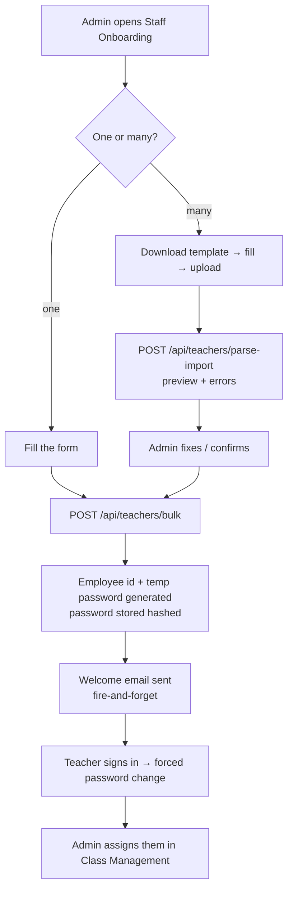

# 02 · Staff Directory & Onboarding

| | |
|---|---|
| **Feature key** | `staff` |
| **Category** | Core |
| **Portals** | School Admin (teachers then use the Teacher portal) |
| **Status** | **BUILT** |
| **Primary users** | School admin |
| **Snapshot** | `dev` @ `29f0e6a`, 2026-09-21 |

---

## 1. Product brief

**The problem.** Schools keep staff lists in Excel and hand out passwords on paper. When a teacher leaves nobody switches their access off.

**The solution.** Add teachers one by one or **by uploading a spreadsheet**. The system issues an **employee id** and a **temporary password**, emails the teacher, forces a password change at first login, and lets the admin search, filter, edit or deactivate.

| Capability | Detail |
|---|---|
| Add a teacher | Form, or upload a CSV/Excel (a template is downloadable) |
| Bulk import preview | The file is parsed and checked **before** anything is saved |
| Identity | Auto **employee id**; the teacher signs in with employee id + password |
| First login | Must change the temporary password |
| Directory | Search, filter by department and staff type, edit profile fields |
| Remove | **Soft delete** — the teacher immediately can no longer mark attendance; history is kept |
| Plan limits | `staff_limit` per plan is enforced when accounts are created |

**Two kinds of staff — do not confuse them**
- **Teachers** (this feature) sign in to the **Teacher portal** with an employee id.
- **School-admin-level staff** (principal, vice principal, extra admins) are invited from **School Settings → Staff accounts** with a one-time set-password link — see [18 · School Settings](18-school-settings.md).

**Value.** Onboarding an entire staff room in minutes instead of days; no password sheets; instant offboarding.

**Where it stops.** No payroll, leave or HR records. (Leave requests and emergency cover existed earlier and were **removed** from `dev`.)

## 2. End-to-end flow

**Step by step (admin)**
1. Open **Staff** → *Add teacher*.
2. Enter name, email, subject, phone, department, qualification, date of joining, staff type and the grades they teach — or upload the filled template.
3. Review the import preview; rows with problems are listed, not silently dropped.
4. Confirm. Each teacher gets an employee id of the form `<school prefix>-<random 5 digits>`; a collision is retried automatically.
5. The teacher receives their id and temporary password by email.
6. On first sign-in the teacher is sent to *change password*.
7. To offboard: open the teacher → delete (soft). Their session can no longer mark attendance.

## 3. Business rules & edge cases

| Rule | Detail |
|---|---|
| Uniqueness | Employee id is unique **per school** (`idx_teachers_school_employee_id_unique`); the insert loops to a new suffix on collision |
| Password | Random temporary password, stored hashed; teacher must change it (`password_changed` flag) |
| Plan cap | `staff_limit` from `plan_pricing` is checked at creation |
| Soft delete | Deactivated teachers cannot mark attendance; records they created remain |
| Tenant | Every query filtered by the admin's `school_id` |
| Subjects | Subject choices come from the school's subject list (`/api/school/subjects`) and the platform catalog |
| Notifications | Welcome email fire-and-forget (never blocks the response). WhatsApp call is a **logging scaffold only** |

## 4. Technical reference (developers)

**Screens**
- `app/school-admin/components/StaffOnboarding.tsx` — add / bulk import
- `app/school-admin/components/TeachersManagement.tsx` — directory, edit, delete
- Teacher portal side: `app/teacher/*`, sign-in via `/api/teacher-auth/login`

**API**

| Method | Route | Purpose |
|---|---|---|
| GET | `/api/teachers` | List/search teachers for the school |
| GET | `/api/teachers/template` | Download the Excel template |
| POST | `/api/teachers/parse-import` | Parse an uploaded file and return a validated preview |
| POST | `/api/teachers/bulk` | Create teachers (used for **both** single and bulk add) |
| GET/PUT/DELETE | `/api/teachers/{id}` | Read, update, soft-delete |
| GET | `/api/school/subjects` | School subjects for the picker |
| GET/POST/DELETE | `/api/platform/subjects` | Platform subject catalog (Platform Admin) |
| GET | `/api/admin/overview` | Counts for the header |

The single-add `POST /api/teachers` was dead code and was removed; onboarding always goes through `/bulk`.

**Tables:** `teachers` (with `employee_id`, `department`, `qualification`, `date_of_joining`, `staff_type`, `teaches_grades`, `password_hash`, `password_changed`), plus reads/cleanups touching `classes`, `class_subjects`, `attendance*`, `notifications`.

**Libraries:** `lib/auth.ts` (`hashPassword`, `generateTempPassword`, `generateEmployeeId`), `lib/email.ts`, `lib/matchTeacher.ts` (teacher ↔ class/subject matching), `lib/nameValidation.ts`, `lib/whatsapp.ts` (scaffold).

**Security:** admin-only routes use `requireSchoolAdmin` / `requireFeeAccess`; a platform-admin path exists for support. The teacher session cookie is `wlyl-teacher` (JWT, 7 days).

**Tests:** `workflow-staff-onboarding.spec.ts`, `staff-teacher-data-flow.spec.ts`, `auth-teacher.spec.ts`.

## 5. Pitch kit

**Investor one-liner** — "Onboard a whole staff room from one spreadsheet; access is issued and revoked in a click."

**School one-liner** — "Upload your staff list once. Every teacher gets their own login — and when someone leaves, their access ends the same minute."

**Slide bullets**
- Excel/CSV bulk import with preview and error report.
- Auto employee id + temporary password; forced first-login change.
- Instant offboarding (soft delete keeps history).
- Plan-aware staff limits.

**60-second demo:** upload the template with 5 teachers → show the preview → confirm → open a second window and sign in as one → forced password change.

**Objection → honest answer**
- *"Can we send passwords by WhatsApp?"* — Not today. Email only; WhatsApp is on the roadmap pending Meta setup.

## 6. Limits & roadmap

- No payroll / HR / leave (removed earlier, preserved on branches).
- WhatsApp delivery of credentials is **not built**.
- Roadmap: bulk deactivate, staff roles beyond teacher, timetable (built on a branch, awaiting sign-off).
