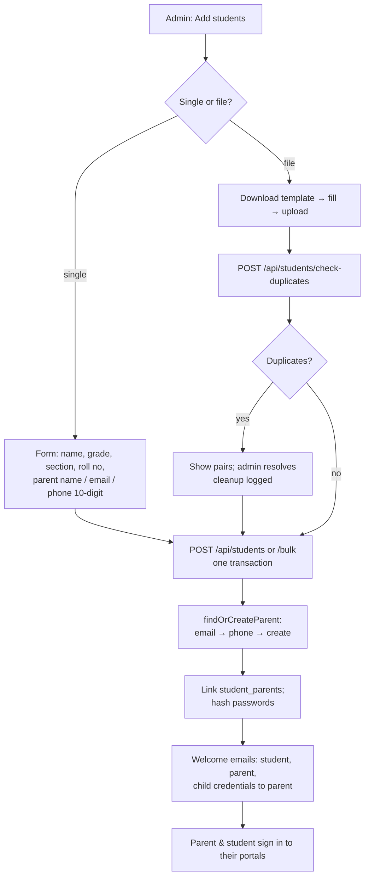

# 03 · Students List & Onboarding (with Student 360)

| | |
|---|---|
| **Feature key** | `students` |
| **Category** | Core |
| **Portals** | School Admin |
| **Status** | **BUILT** |
| **Primary users** | School admin, front-office staff |
| **Snapshot** | `dev` @ `29f0e6a`, 2026-09-21 |

---

## 1. Product brief

**The problem.** Admissions arrive in a rush each April. Data is typed into Excel, parents are duplicated across siblings, and nobody has a single place to see "everything about this child" before a parent meeting.

**The solution.** One place to add students (singly or by spreadsheet), automatically link **parents** and create **logins**, catch **duplicates**, and open a **Student 360 profile** with attendance, marks, fees and talking points.

| Capability | Detail |
|---|---|
| Add one / bulk | Form or CSV/Excel template; bulk runs through duplicate detection first |
| System id | `wlyl-stu-<school>-<5 digits>` — the student's login id |
| Class roll number | `school_roll_number`, **unique per grade + section** (separate from the system id) |
| Parents | Found by email, then phone **within the school**, else created and linked; siblings share one parent |
| Credentials | Student and parent logins issued; welcome / credential emails sent; **reset** on demand |
| Duplicates | Detected before saving (roll number, parent phone, name pairs); a cleanup tool with an audit log |
| Lifecycle | Edit, promote (via Year Rollover), deactivate; graduates flagged `graduated` |
| **Student 360** | Talking points for the parent meeting, contacts, attendance, marks, fees, activity — with a **year switcher** for past years |
| Portal backfill | Create missing portal accounts for students added before a portal was enabled |

**Value.** Admissions day becomes a file upload. The principal walks into a parent meeting with the child's whole picture in one page.

**Where it stops.** No admission-enquiry pipeline, no document/certificate storage, no annual multi-exam report card (a per-exam printable report card exists in Export Center).

## 2. End-to-end flow

**Step by step (admin)**
1. **Students → Add** (or *Bulk upload*). Grade, section and a valid **10-digit Indian mobile** for the parent are required.
2. For a file, the system checks every row against existing students and within the file, and shows the conflicts.
3. On confirm the student row, parent row and link are created **in one transaction**. If the parent-portal feature is off for this school, existing parents are still linked but **no new parent account is created**.
4. Emails go out fire-and-forget: student welcome, parent welcome and the child's credentials to the parent.
5. Later, **click a name** anywhere (Students, Class Management) to open **Student 360**.
6. **Reset credentials** re-issues a password if a family loses it.

**Student 360 (`GET /api/students/{id}/profile`)** — read-only and school-scoped: parent-meeting talking points, contacts, attendance summary, marks, fees, recent activity, and a switcher to previous academic years (from `student_class_history` / snapshots).

## 3. Business rules & edge cases

| Rule | Detail |
|---|---|
| Parent phone | Must be a valid 10-digit Indian mobile; unique per school (`idx_parents_school_phone_unique`) |
| Roll number | Unique within `(school_id, grade, section)`; may be blank after a promotion and reassigned |
| Siblings | A batch cache guarantees two siblings in one upload resolve to **one** parent row, not a race of duplicates |
| Name checks | `nameValidation` rejects obviously bad names |
| Duplicates | Pair detection by roll number and phone; cleanup writes `student_cleanup_log`; nothing is deleted silently |
| Tenant | Every query scoped to the admin's school; profile endpoint is read-only |
| Feature switches | Student/parent account creation follows `student-portal` / `parent-portal` |

## 4. Technical reference (developers)

**Screens**
- `StudentOnboarding.tsx` (add + bulk), `StudentsManagement.tsx` (list, edit, promote, reset), `StudentProfile.tsx` (Student 360) — `app/school-admin/components/` (~2,000 lines total).

**API**

| Method | Route | Purpose |
|---|---|---|
| GET/POST | `/api/students` | List; create one |
| POST | `/api/students/bulk` | Bulk create (transactional, uses batch cache) |
| POST | `/api/students/check-duplicates` | Pre-save conflict check |
| GET | `/api/students/duplicates` | Existing duplicate pairs |
| POST | `/api/students/duplicates/cleanup` | Resolve duplicates (audited) |
| GET | `/api/students/template` | Excel template (ExcelJS) |
| GET/PUT/DELETE | `/api/students/{id}` | Read / update / deactivate |
| GET | `/api/students/{id}/profile` | Student 360 payload |
| POST | `/api/students/{id}/reset-credentials` | Re-issue login |
| GET/POST | `/api/school-admin/students/backfill-portal` | Create missing portal accounts |
| GET/POST/PUT | `/api/attendance` | Used by the profile for attendance |

**Tables:** `students`, `parents`, `student_parents`, `classes`, `student_fee_ledger`, `fee_payments`, `fee_waivers`, `exam_records`, `attendance`, `attendance_sessions`, `student_cleanup_log`, `platform_audit_log`.

**Libraries:** `lib/studentOnboarding.ts` (`generateStudentId`, `findOrCreateParent`, credential emails), `lib/studentProfile.ts`, `lib/nameValidation.ts`, `lib/parseCSV.ts`, `lib/academicYear.ts`, `lib/attendance*`, `lib/email.ts`.

**Validation:** Zod on the create/bulk bodies. **Auth:** `requireSchoolAdmin` / `requireFeeAccess`; family portals read through `student_parents`.

**Design notes**
- `roll_number` (system id, `VARCHAR`) vs `school_roll_number` (`INTEGER`, class roll) are deliberately separate.
- `findOrCreateParent(..., createIfMissing)` keeps portal gating consistent with the feature flags.

**Tests:** `workflow-student-onboarding.spec.ts`, `workflow-student-csv-import.spec.ts`, `workflow-student-profile.spec.ts`, `auth-student.spec.ts`, `auth-parent.spec.ts`.

## 5. Pitch kit

**Investor one-liner** — "Admissions become a spreadsheet upload: students, parents and logins created and linked automatically, duplicates caught."

**School one-liner** — "Upload your admission list and every child and parent gets their own login. Open any child and see everything — in one page."

**Slide bullets**
- Bulk upload with duplicate detection and sibling-aware parent linking.
- Student + parent logins issued and emailed automatically.
- **Student 360:** attendance, marks, fees and talking points for the parent meeting.
- Full history across academic years.

**60-second demo:** upload 20 students (two siblings) → show one parent for both → open Student 360 → flip the year switcher.

**Objection → honest answer**
- *"Can we import from our old software?"* — Any CSV/Excel that matches the template; there is no direct integration with other school software.

## 6. Limits & roadmap

- No enquiry/admission pipeline, no document uploads, no annual multi-exam report card.
- Credentials go by **email** only.
- Roll numbers cleared on promotion when they collide need re-assigning by the school (the rollover screen reports how many).
