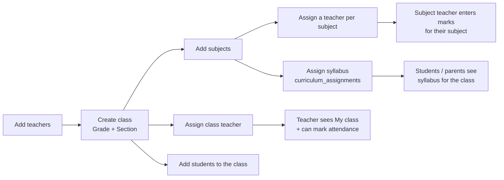

# 04 · Class Management

| | |
|---|---|
| **Feature key** | `class-management` |
| **Category** | Core |
| **Portals** | School Admin |
| **Status** | **BUILT** |
| **Primary users** | School admin |
| **Snapshot** | `dev` @ `29f0e6a`, 2026-09-21 |

---

## 1. Product brief

**The problem.** Everything in a school hangs off the class — who teaches it, what subjects, which students, who marks attendance — and it usually lives in someone's head.

**The solution.** Create each class (**grade + section**), name its **class teacher**, attach **subjects with a teacher each**, and assign the syllabus. This is the wiring diagram every other feature reads.

| Capability | Detail |
|---|---|
| Create / edit class | Grade + section; unique per school |
| Class teacher | Gets the **My class** attendance dashboard and is the reviewer of exam marks |
| Subjects | Add subjects to a class and assign a teacher to each |
| Syllabus | Assign the syllabus (from the school's own copy) to the class |
| Students tab | Roster of the class; click a name for Student 360 |
| Overview tab | Recent attendance for the class |
| Soft delete | A class can be removed without destroying history |

**Why it matters for the platform.** Attendance marking, exam creation (a class's exam subjects come from *that class's own subjects*), teacher screens, syllabus visibility and year rollover all depend on this setup.

**Where it stops.** No timetable (built on a separate branch, awaiting sign-off) and no room/period scheduling.

## 2. End-to-end flow

**Step by step**
1. Ensure teachers exist ([02](02-staff-directory-and-onboarding.md)).
2. **Class Management → New class**: grade and section.
3. Pick the **class teacher**.
4. **Subjects tab**: add subjects; assign a teacher to each; assign the syllabus.
5. **Students tab**: add or move students; open any name for Student 360.
6. Open **Overview** to see recent attendance for the class.

## 3. Business rules & edge cases

| Rule | Detail |
|---|---|
| Ownership | A class belongs to exactly one school; classes are soft-deleted |
| Class teacher | Drives access to the class attendance dashboard (`class_teacher_grade` mapping) and exam review |
| Subject list per class | Exams take each class's **own** `class_subjects` — a class never gets a subject it doesn't teach |
| Syllabus source | `curriculum_assignments` links class + subject to the school's syllabus copy |
| Year | Class structure is per school; students move between classes through Year Rollover |
| Tenant | Guarded by `requireSchoolAdmin` / `getAnySession` |

## 4. Technical reference (developers)

**Screens:** `app/school-admin/components/ClassManagement.tsx` (~970 lines).

**API**

| Method | Route | Purpose |
|---|---|---|
| GET/POST | `/api/classes` | List / create |
| GET/PUT/DELETE | `/api/classes/{id}` | Read / edit / soft-delete |
| GET/POST/PATCH/DELETE | `/api/classes/{id}/subjects` | Class subjects and their teachers |
| GET | `/api/school/subjects` | Subject list for the school |
| GET | `/api/teachers` | Teacher picker |
| GET/POST | `/api/students` | Roster |
| GET/POST/PUT | `/api/attendance` | Recent attendance on the Overview tab |

**Tables:** `classes`, `class_subjects`, `curriculum_assignments`, `school_subjects`, `school_chapters`, `school_topics`, `school_tasks`, `school_resources`, `school_topic_progress`, `students`, `teachers`, `attendance`, `attendance_sessions`.

**Libraries:** `lib/curricula.ts`, `lib/matchTeacher.ts`, `lib/grades.ts` (grade ordering, used by rollover), `lib/attendance*`.

**Design notes**
- Grade values may be numeric or named (`Nursery`, `LKG`, `UKG`) — `lib/grades.ts` owns ordering, which Year Rollover uses to promote.
- Subject-teacher permission checks for marks entry use `class_subjects` / `exam_subjects.teacher_id`.

**Tests:** `workflow-school-admin.spec.ts`, `workflow-portals.spec.ts`, `staff-teacher-data-flow.spec.ts`.

## 5. Pitch kit

**Investor one-liner** — "The class is the spine of the product: define it once and attendance, marks, syllabus and rollover all follow."

**School one-liner** — "Set up each class once — teacher, subjects, students — and the whole school runs from it."

**Slide bullets**
- Grade + section, class teacher, subject teachers in one screen.
- Roster with one-click Student 360.
- Feeds attendance, exams, syllabus and year rollover automatically.

**60-second demo:** create "Grade 6-A" → set class teacher → add Maths + Telugu with teachers → show the teacher's portal now lists the class.

**Objection → honest answer**
- *"Do you do the timetable?"* — Not on `dev`. A timetable workflow is built on its own branch and awaiting sign-off.

## 6. Limits & roadmap

- No timetable/periods on `dev`.
- No capacity limits, house/club groupings, or multi-section merging.
