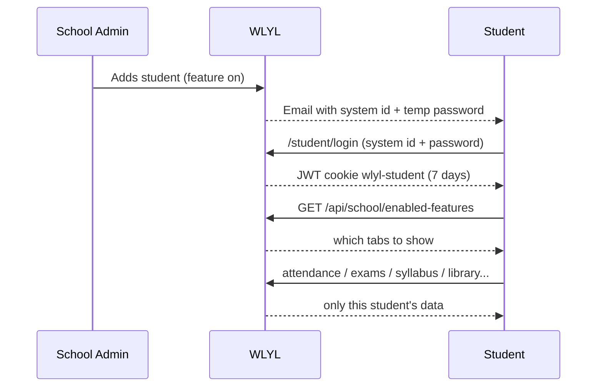

# 05 · Student Portal Access

| | |
|---|---|
| **Feature key** | `student-portal` (switch lives in School Admin; the portal itself is `/student`) |
| **Category** | Core |
| **Portals** | Student (delivery), School Admin (switch) |
| **Status** | **BUILT** |
| **Primary users** | Students |
| **Overridable per school** | **Yes** (`school_feature_overrides`) |
| **Snapshot** | `dev` @ `29f0e6a`, 2026-09-21 |

---

## 1. Product brief

**The problem.** Students learn their attendance and marks late, secondhand, or not at all.

**The solution.** A personal portal at `/student` where each child sees **only their own** school life.

| Tab | What the student gets |
|---|---|
| Dashboard | Attendance ring, recent marks, announcements |
| My Attendance | Own colour calendar, month/year %, six-month trend, upcoming holidays |
| My Marks | Released exam results with grades |
| Syllabus | Progress through the subjects (read-only) |
| Digital Library | Materials for their class's subjects |
| School Calendar | Holidays, exams, events (read-only) |
| Class Circle | Classmates' birthdays; send a wish |
| AI Hub | A page of **links** to external assistants (Gemini, Claude, ChatGPT) — **only** for schools with AI access switched on. It is **not** a built-in tutor |
| Profile | Change password, add date of birth |

Which tabs show is decided by the school's plan through the feature switches (`attendance`, `exam-marks`, `curriculum`, `library`, `calendar`).

**Value for the school.** Students and parents see the same numbers (shared rule modules) so there are fewer arguments; the school looks modern.

**Where it stops.** Removed from `dev` and preserved on branches: Learning Hub & Daily Knowledge, weekly test, rewards marketplace. There is no homework, doubts or leave feature in the live product.

## 2. End-to-end flow

**Step by step (student)**
1. Sign in at `/student/login` with the system id (`wlyl-stu-…`) and password; change the password when prompted.
2. First time: add a date of birth (`/student/add-birthday`) — used by Class Circle.
3. Land on the Dashboard; the sidebar shows only the tabs the school's plan includes.
4. **My Marks** lists an exam **only after the admin releases it**.
5. **Class Circle** shows classmates with birthdays coming up; a wish is one tap.

**Admin side:** turn the portal on/off per school (Platform Admin → school → overrides, or the tier); credentials for students added earlier are created with *Backfill portal accounts* ([03](03-students-list-and-onboarding.md)).

## 3. Business rules & edge cases

| Rule | Detail |
|---|---|
| Own data only | Every student endpoint derives the student from the session, never from a parameter; class-level attendance is never exposed |
| Marks visibility | Only exams with status `released` |
| Feature gating | Tabs from `/api/school/enabled-features`; `PORTAL_NAV_KEY_ALIASES` maps `my-marks` → `exam-marks`, `syllabus` → `curriculum` |
| AI Hub | Visible only when `school_ai_access` says so; external links only |
| Birthdays | Cron `birthday-sweep` (daily 18:30 UTC) creates birthday posts; wishes stored in `birthday_wishes` |
| Sessions | JWT 7 days, cookie `wlyl-student`; logout clears it |

## 4. Technical reference (developers)

**Screens:** `app/student/page.tsx` and `app/student/components/` — `StudentDashboard`, `StudentSyllabus`, `StudentMarks`, `StudentClassCircle`, `StudentAiHub`, `StudentProfile`; shared `app/components/AttendanceCalendar.tsx`, `SchoolCalendarView.tsx`, `library/DigitalLibrary.tsx`.

**API**

| Method | Route | Purpose |
|---|---|---|
| POST | `/api/student/auth/login` | Sign in (system id, case-insensitive) |
| GET | `/api/student/auth/me` | Session + profile |
| POST | `/api/student/auth/change-password`, `/logout`, `/forgot-password`, `/reset-password` | Account |
| PUT | `/api/student/auth/date-of-birth` | Add DOB |
| GET | `/api/student/attendance?month=` | Own attendance (shared rules) |
| GET | `/api/students/{id}/exams` | Own released results |
| GET | `/api/student/class-circle`, POST `/class-circle/wish` | Birthdays |
| GET | `/api/school/enabled-features` | Nav gating |
| GET | `/api/school/library`, `/api/school/subjects/materials`, `/api/syllabus` | Library, syllabus |
| GET | `/api/announcements` | Announcements for the student audience |
| GET/PUT | `/api/schools/{id}/ai-access` | AI Hub switch |

**Tables:** `students`, `student_parents`, `classes`, `attendance*`, `exam_records/subjects/marks`, `parent_mark_acks`, `announcements`, `birthday_posts`, `birthday_wishes`, `class_circles`, `school_ai_access`, syllabus tables (`school_*`, `class_*_visibility`), `master_subject_materials`.

**Libraries:** `lib/attendanceStudentView.ts`, `lib/examGrading.ts`, `lib/birthday.ts`, `lib/classCircle.ts`, `lib/features-context.tsx`, `lib/usageTracking.ts`.

**Security:** `getStudentSession()`; the token payload carries the student id and school id.

**Tests:** `auth-student.spec.ts`, `workflow-portals.spec.ts`, `workflow-attendance.spec.ts` (identical numbers in all four portals).

## 5. Pitch kit

**Investor one-liner** — "Every student gets a personal window into their school life, on the same data the teachers use."

**School one-liner** — "Your students see their own attendance, marks and syllabus — accurate, simple, and only theirs."

**Slide bullets**
- Attendance ring, marks with grades, syllabus progress, library, calendar.
- Same numbers as the parent and teacher (single rule module).
- Plan-controlled: schools switch it on when ready.

**60-second demo:** sign in as a student → show the ring → open My Marks (only released exams) → Class Circle wish.

**Objection → honest answer**
- *"Is there an AI tutor?"* — No. The AI Hub only links out to external assistants. We do not market the product as AI-powered.

## 6. Limits & roadmap

- No homework/tasks, doubts, leave requests, rewards or weekly tests (removed; on branches).
- No push notifications; email only.
- Roadmap: parent/student report-card view, rebuilt analytics (Year-in-Review).
