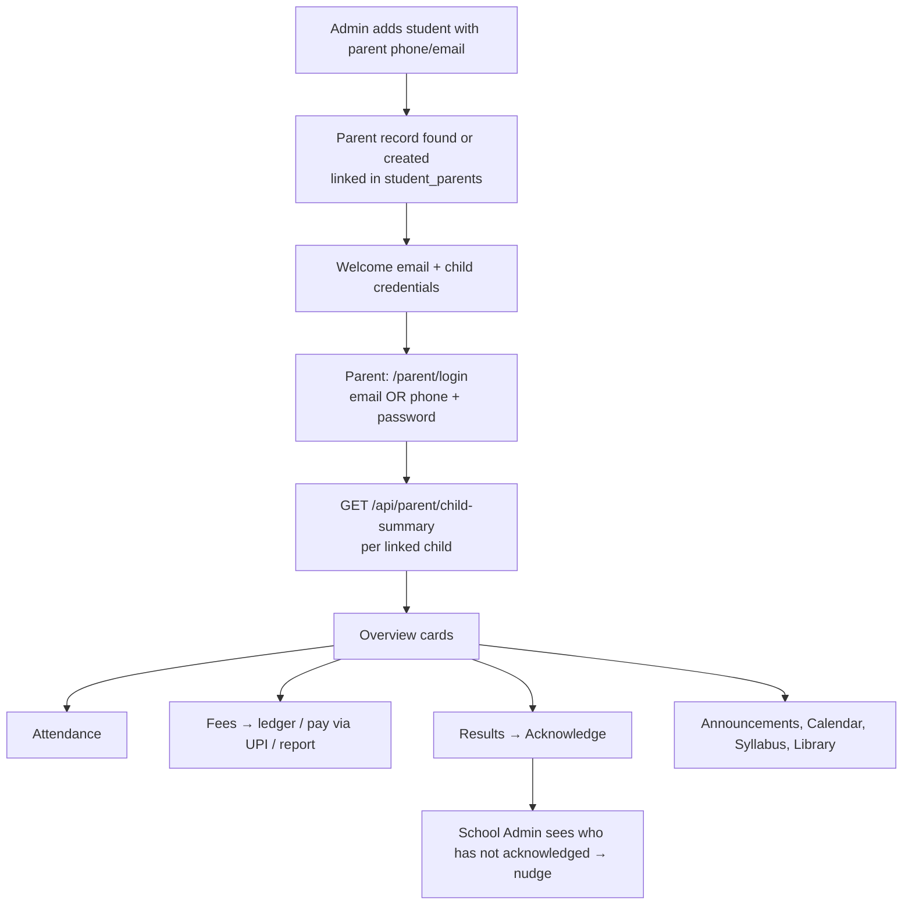

# 06 · Parent Portal Access

| | |
|---|---|
| **Feature key** | `parent-portal` (switch in School Admin; portal at `/parent`) |
| **Category** | Core |
| **Portals** | Parent (delivery), School Admin (switch) |
| **Status** | **BUILT** |
| **Primary users** | Parents / guardians |
| **Overridable per school** | **Yes** |
| **Snapshot** | `dev` @ `29f0e6a`, 2026-09-21 |

---

## 1. Product brief

**The problem.** Parents find out about absences, results and dues late — usually by phone, or when a child is already behind.

**The solution.** A parent portal at `/parent` showing **their own children only**: attendance, results, fees, exams, announcements, calendar, syllabus and the library — in **English or Telugu**.

| Area | What the parent gets |
|---|---|
| Child summary | Attendance %, upcoming exams, results waiting acknowledgement, fee status — per child |
| Attendance | Colour calendar, month/year %, days absent, **streak of full days**, six-month trend, upcoming holidays |
| Fees | Ledger, waivers, payment history and receipts; **report a UPI payment** (see [14](14-online-fee-payments-upi.md)) |
| Exams & results | Exam calendar; released results with grades; **Acknowledge** button |
| Announcements / Calendar | Audience-filtered notices; read-only school calendar |
| Syllabus / Library | What has been covered; class materials |
| Multiple children | Switch between siblings under one login |
| Language | English and Telugu (`app/parent/translations.ts`) |

**Value.** Fewer phone calls to the school office, earlier awareness of absence and dues, and an acknowledged-results trail for the school.

**Where it stops.** Read-mostly: parents cannot change data except acknowledging results and reporting a payment. **WhatsApp OTP sign-in is *not* live** (draft PR #155 pending Meta setup) — forgot-password goes by **email**. No chat, no leave requests.

## 2. End-to-end flow

**Step by step (parent)**
1. Sign in with the email **or** phone the school has on record; change the password on first login; optionally add a date of birth.
2. Overview shows a card per child with four numbers: attendance %, upcoming exams, results to acknowledge, overdue fees.
3. **Attendance** → tap a day for its detail; the streak counts full days in a row.
4. **Fees** → see each bill, waivers and payments; if Online Payments is enabled, pay through any UPI app and press *I've paid* to report it.
5. **Results** → after release, open the result and press **Acknowledge**.
6. Forgot password → reset link by email.

## 3. Business rules & edge cases

| Rule | Detail |
|---|---|
| Own children only | Reads go through `student_parents`; any other student id is answered **"not found"** (not "forbidden") |
| Phone uniqueness | A school cannot have two parent rows with the same phone (`idx_parents_school_phone_unique`) — so phone login is safe |
| Sign-in | Email or phone in one field; per-school lookup |
| Fees tab vs. UPI | Fees tab needs `fee-management`; the "Pay via UPI" sub-flow needs `online-payments` too |
| Duplicate submit | A per-attempt idempotency key stops a flaky connection creating two payment reports (`lib/idempotency.ts`) |
| Results | Visible only once the exam is `released`; acknowledgement recorded in `parent_mark_acks` |
| Feature gating | `results`/`exams` → `exam-marks`, `fees` → `fee-management`, `syllabus` → `curriculum` via the alias map |
| Password reset | Email link; a WhatsApp send call exists only as a logging scaffold |

## 4. Technical reference (developers)

**Screens:** `app/parent/page.tsx` (~1,650 lines incl. nav, overview, fees), `components/ParentProfile.tsx`, `components/ParentSyllabus.tsx`, shared attendance calendar and school calendar view, `translations.ts`. Section navigation is URL-driven via the `tab` query parameter.

**API**

| Method | Route | Purpose |
|---|---|---|
| POST | `/api/parent/auth/login`, `/logout`, `/change-password`, `/forgot-password`, `/reset-password` | Account |
| GET | `/api/parent/auth/me` | Session + linked children |
| PUT | `/api/parent/auth/date-of-birth` | DOB |
| GET | `/api/parent/child-summary` | Per-child overview numbers |
| GET | `/api/parent/attendance?student_id&month` | Child attendance (shared rules) |
| GET/POST | `/api/parent/fees` | Fee ledger (read) and payment report (write, idempotent) |
| GET | `/api/fees/upi-qr`, `/api/fees/upi-qr/info` | School UPI QR/info |
| POST | `/api/exams/{id}/acknowledge` | Acknowledge a result |
| GET | `/api/academic-years`, `/api/academic-year/current` | Year switcher |
| GET | `/api/school/enabled-features`, `/api/school/library`, `/api/syllabus`, `/api/announcements`, `/api/classes` | Gated content |

**Tables:** `parents`, `student_parents`, `students`, `student_fee_ledger`, `fee_payments`, `fee_waivers`, `fee_structures`, `fee_categories`, `exam_records/subjects/marks`, `parent_mark_acks`, `announcements`, `notifications`, `student_class_history`, `academic_year_snapshots`, syllabus and library tables.

**Libraries:** `lib/attendanceStudentView.ts`, `lib/idempotency.ts`, `lib/examsAuth.ts`, `lib/features-context.tsx`, `lib/usageTracking.ts`.

**Security:** `getParentSession()`; cookie `wlyl-parent`, JWT 7 days; every child-scoped query joins `student_parents`.

**Tests:** `auth-parent.spec.ts`, `workflow-portals.spec.ts`, `workflow-attendance.spec.ts`, `workflow-fee-management.spec.ts`.

## 5. Pitch kit

**Investor one-liner** — "The parent app that turns a school from a black box into a transparent partner: attendance, results and fees in the parent's language."

**School one-liner** — "Parents see attendance, results and fees for their own child — in English or Telugu — without calling the office."

**Slide bullets**
- Child summary, colour attendance calendar with streaks.
- Fee ledger + UPI payment reporting.
- Result **acknowledgement** with an admin follow-up list.
- Multi-child, English/Telugu.

**60-second demo:** sign in with a phone number → two children → show the attendance calendar → open a released result and acknowledge → back in admin show the acknowledgement list.

**Objection → honest answer**
- *"Do parents get WhatsApp alerts?"* — No. Absence alerts go by **email**. WhatsApp is on the roadmap pending Meta approval; we do not claim it today.

## 6. Limits & roadmap

- No WhatsApp OTP / alerts, no push, no chat.
- Roadmap: WhatsApp (Meta) + OTP sign-in, parent-facing report-card view, Parent Engagement analytics (built on a branch).
