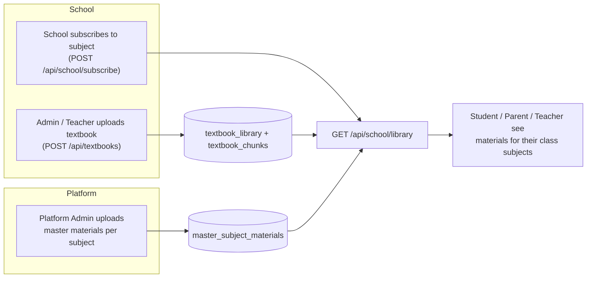

# 07 · WLYL Digital Library

| | |
|---|---|
| **Feature key** | `library` |
| **Category** | Core |
| **Portals** | School Admin, Teacher, Student, Parent |
| **Status** | **BUILT** (content delivery). Text chunks are stored for future search — **no AI tutor uses them yet** |
| **Snapshot** | `dev` @ `29f0e6a`, 2026-09-21 |

---

## 1. Product brief

**The problem.** Study material is scattered across WhatsApp groups and pen-drives. Schools cannot share books with the right class, and teachers upload the same PDF ten times.

**The solution.** Two layers of learning content, both delivered inside the same screen:

1. **Platform master library** — WLYL maintains materials per subject; a school that subscribes to a subject gets that subject's materials for its classes.
2. **School textbook library** — the school admin or a teacher uploads the school's own textbooks; they are school-scoped.

| Role | What they do |
|---|---|
| Platform admin | Maintains master materials per subject |
| School admin / Teacher | Uploads and deletes school textbooks; picks class + subject |
| Student / Parent | Browse the materials for their class's subjects (read-only) |

**Value.** One trusted place for class material; visibility follows the class's subjects and the school's plan.

**Where it stops.** No search UI, no AI Q&A, no offline downloads management. Text extracted from uploaded textbooks is chunked into `textbook_chunks` **as groundwork only**.

## 2. End-to-end flow

**Step by step**
1. Platform admin adds materials to a master subject.
2. The school subscribes to the subject ([09](09-syllabus-customizer.md)); the class gets that subject through Class Management.
3. A teacher opens **Digital Library**, chooses class + subject and uploads a textbook; it is stored school-scoped and split into text chunks.
4. Students and parents open **Digital Library**; the API returns only materials for **their class's subjects**.
5. Deleting a textbook (`DELETE /api/textbooks/{id}`) removes it for everyone in the school.

## 3. Business rules & edge cases

| Rule | Detail |
|---|---|
| Scope | Textbooks are per school; master materials are global but visible only to subscribing schools |
| Visibility | Follows `class_subjects` / `curriculum_assignments` and the plan's `library` switch |
| Roles | Students and parents are read-only; teachers see the classes/subjects they teach (`/api/teachers/{id}/class-subjects`) |
| Storage | Files go to Cloudflare R2 via presigned URLs; download links are presigned |
| Nav gating | `library` gates all four portals through `lib/features.ts` |

## 4. Technical reference (developers)

**Screens:** `app/components/library/DigitalLibrary.tsx` (shared by all portals), `app/school-admin/components/TextbookLibrary.tsx`, `app/teacher/components/TeacherLibrary.tsx`.

**API**

| Method | Route | Purpose |
|---|---|---|
| GET | `/api/school/library` | Materials visible to the caller (role-aware) |
| GET/POST | `/api/textbooks` | List / upload school textbooks |
| DELETE | `/api/textbooks/{id}` | Remove a textbook |
| GET | `/api/teachers/{id}/class-subjects` | Teacher's class/subject scope |
| GET/POST | `/api/classes` | Class picker |
| GET | `/api/school/subjects/materials` | Subject materials (used by student/parent) |

**Tables:** `master_subject_materials`, `textbook_library`, `textbook_chunks`, `school_subjects`, `class_subjects`, `curriculum_assignments`, `classes`, `student_parents`, `students`, `teachers`.

**Libraries:** `lib/r2.ts`, `lib/curricula.ts`, `lib/responseCache.ts`, `lib/auth.ts` (`getAnySession`, `getStudentSession`, `getParentSession`, `getTeacherSession`).

**Design notes:** the response is cached (`responseCache`) because the library is read-heavy and changes rarely.

**Tests:** covered indirectly by `workflow-portals.spec.ts` and the syllabus suites; no dedicated library spec.

## 5. Pitch kit

**Investor one-liner** — "A subject-aware content layer: WLYL's master library plus each school's own books, delivered to the right class."

**School one-liner** — "Upload your textbooks once; every student in that class can open them — and WLYL's own material is included."

**Slide bullets**
- Master library by subject + the school's own uploads.
- Delivered only to the classes that study the subject.
- One screen for admin, teacher, student, parent.
- Groundwork laid (text chunks) for future search.

**60-second demo:** teacher uploads a Maths textbook to Grade 6 → student in Grade 6 opens it → a Grade 7 student does not see it.

**Objection → honest answer**
- *"Can students ask questions of the book?"* — Not yet. Text is stored for future search but there is no AI tutor.

## 6. Limits & roadmap

- No in-book search or AI Q&A. No per-user progress or bookmarks.
- Content licensing of the master library is a business matter, not a code one — **`[TBD – founder]`**.
