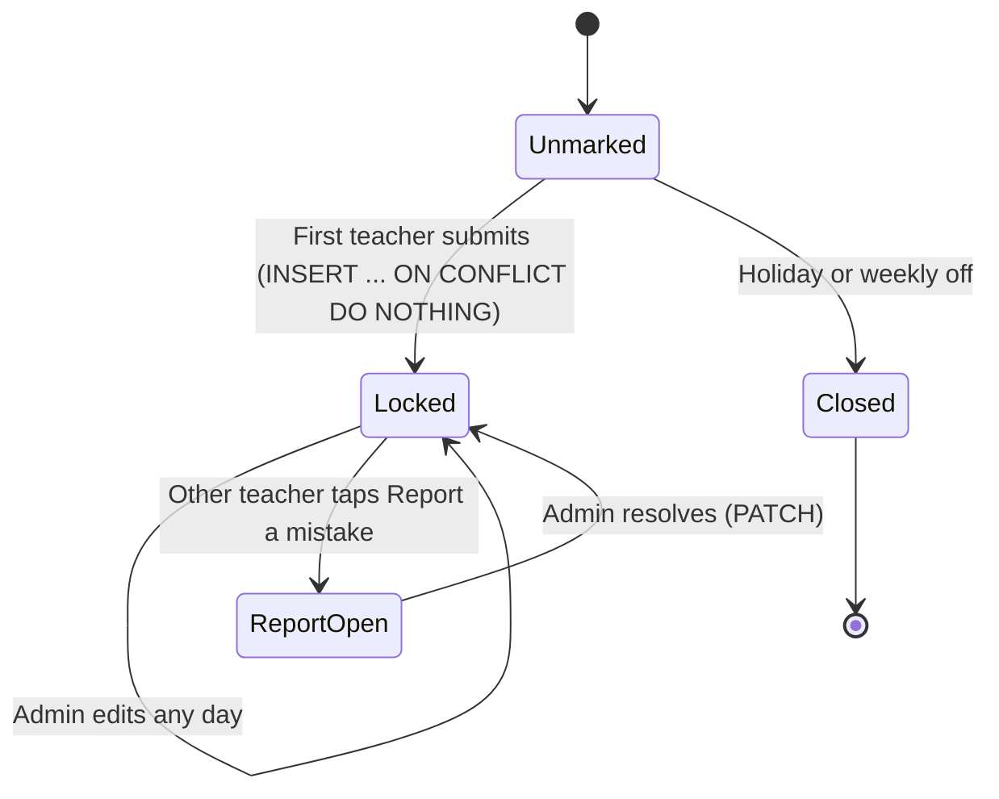
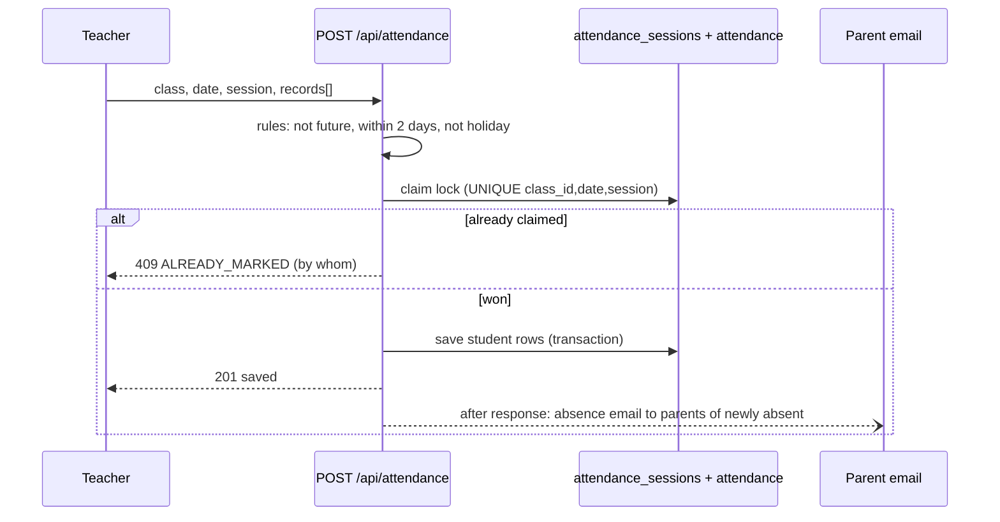

# 08 · Attendance Tracking (the showcase module)

| | |
|---|---|
| **Feature key** | `attendance` |
| **Category** | Scheduling |
| **Portals** | School Admin, Teacher, Student, Parent |
| **Status** | **BUILT** — the most developed module; use it as the demo centrepiece |
| **Deep reference** | [`docs/ATTENDANCE.md`](../../ATTENDANCE.md) (verified accurate against the code) |
| **Snapshot** | `dev` @ `29f0e6a`, 2026-09-21 |

---

## 1. Product brief

**The problem.** Attendance is the daily heartbeat of a school, yet registers get lost, two teachers mark the same class, holidays distort percentages, and each report shows a different number.

**The solution.** Two-session daily attendance (Morning, Afternoon) with **locking, holiday awareness, role-specific dashboards and one formula everywhere**.

| Capability | Detail |
|---|---|
| Marking | **Any teacher** can mark **any class**, Morning or Afternoon; two taps per student, review, submit |
| Locking | The **first submit locks** that class + date + session, database-enforced; others see "Already marked by …" |
| Corrections | The marking teacher **same day**; the **admin any time**; other teachers use **Report a mistake** |
| Holidays | Holidays and weekly-off days can't be marked and are **excluded from every percentage** |
| Offline | Teacher screen queues marking offline with clear "not saved because…" messages |
| Alerts | Parents of a student **newly marked absent today** get an **email** |
| Exports | Class register CSV, daily absentee list (for keying into LEAP manually) |
| Dashboards | Admin: school → class → student; class teacher: **My class**; parent/student: personal calendar |

**Dashboards by role**

| Role | Question answered | On screen |
|---|---|---|
| School admin (Overview) | "How is the school doing, where do I act?" | Period switch (7 days / month / school year), school %, students below 75%, today strip (classes marked, who hasn't), mistake-report alert, trend, class ranking, needs-attention list, student search |
| Class teacher (My class) | "Which of my students need help?" | Class %, need-attention count, absent today, trend, **weekday pattern**, filterable student list |
| Parent / student | "How am I / is my child doing?" | Calendar, month + year %, streak, trend, upcoming holidays |

**Value.** Accurate, trusted numbers; early intervention (students below 75% or absent 3+ days in a row); fewer disputes because every screen shows the same figure.

**Where it stops.** Whole-school holidays only (no class-specific or half-day closures). **No direct LEAP integration**; **no WhatsApp alerts** (email only). No biometric/RFID capture.

## 2. End-to-end flow

**Step by step**
- **Teacher:** *Attendance* → class picker (each class shows Morning/Afternoon state and who marked) → mark sheet → review → **Submit**. If someone already marked it, the sheet is read-only.
- **Class teacher:** *My class* shows the dashboard for their own class only.
- **Admin:** *Attendance → Overview* for the whole school; *Today* panel to chase unmarked classes, mark a day as a holiday, review mistake reports; *Academic Calendar* for holidays and weekly off ([16](16-academic-calendar.md)).
- **Parent / student:** *Attendance* tab.

## 3. Business rules & calculations

| Rule | Value |
|---|---|
| Statuses | Present, Absent, **Late — counts as attended** |
| Sessions | Morning, Afternoon; each marked session counts equally |
| **Attendance %** | `(present + late) ÷ marked sessions`, rounded to a whole number; `—` when nothing marked |
| Bands | **90%+ good · 75–89% needs care · below 75% low** |
| Minimum data | A dashboard needs **4 marked sessions** before labelling anyone ("too early to tell") |
| Needs attention | Below 75% (with enough sessions) **or** absent 3+ school days in a row |
| Working day | Not a holiday, not a weekly-off weekday |
| Unmarked working day | A gap to chase — **not** an absence, left out of the % |
| Joined mid-year | Counted from joining date only |
| Marking window | Teachers: today and 2 days back; admin: any past day; nobody: future |
| "Today" | India time (IST) |
| Day colour | both present = green · any late = amber · one session absent = half · all absent = red |

**Worked example (illustrative numbers).** A student has 20 marked sessions: 15 present, 3 late, 2 absent → attended 18 → 18 ÷ 20 = **90 %** → band **good**. If 2 more absences follow, 18 ÷ 22 = 82 % → **needs care**.

**Error codes returned by marking:** `CLASS_NOT_FOUND`, `FUTURE`, `TOO_OLD`, `HOLIDAY`, `WEEKLY_OFF`, `NO_STUDENTS`, `INVALID_RECORDS`, `ALREADY_MARKED`, `NOT_MARKED`, `LOCKED`.

## 4. Technical reference (developers)

**Screens:** teacher — `app/teacher/components/Attendance.tsx` + `attendance/{ClassPicker,MarkSheet,HistoryView,types}`; admin — `AttendanceDashboard.tsx`, `AttendanceOverviewDashboard.tsx`, `AttendanceTodayPanel.tsx`; shared — `app/components/AttendanceCalendar.tsx`, `app/components/attendance-dashboard/{ClassDashboard,StudentModal,parts}`.

**API**

| Method | Route | Purpose |
|---|---|---|
| GET | `/api/attendance/overview?date=` | Every class's Morning/Afternoon state, holiday, can-mark |
| GET | `/api/attendance?view=sheet|student|class-month` | Roster + lock + permissions; per-student numbers |
| POST | `/api/attendance` | Claim lock + save → `201`; `409 ALREADY_MARKED/HOLIDAY/WEEKLY_OFF`; `403 TOO_OLD`; `400 FUTURE/INVALID_RECORDS` |
| PUT | `/api/attendance` | Correct a session; `403 LOCKED` otherwise |
| GET | `/api/attendance/dashboard?scope=school|class|my-classes|find&range=week|month|year` | Dashboards (admin; class teacher for own class) |
| GET | `/api/attendance/analytics` | Older rolling analytics kept for reports |
| POST/GET/PATCH | `/api/attendance/report` | Report a mistake / list / resolve |
| GET | `/api/parent/attendance`, `/api/student/attendance` | Family views (own data only) |
| GET | `/api/export/attendance` | Register CSV or `?mode=absentees&date=` |

**Tables:** `attendance` (one row per student/date/class/session, `status IN (present, absent, late)`), `attendance_sessions` (the **lock**: unique `(class_id, date, session)`, who/when/edit count), `attendance_issue_reports`, `school_calendar`, `schools.weekly_off_days`.

**Libraries (single source of truth):**
`lib/attendanceRules.ts` (pure, client-safe) · `lib/attendance.ts` (queries) · `lib/attendanceAuth.ts` (who is calling) · `lib/attendanceMarking.ts` (claim/save/edit) · `lib/attendanceDashboard.ts` · `lib/attendanceStudentView.ts` · `lib/attendanceNotify.ts` (absence email, after the response) · `lib/calendarSchemas.ts`.

**Concurrency & integrity**
- The lock is a **database unique key** and the claim is `INSERT … ON CONFLICT DO NOTHING`, so two teachers submitting at the same instant cannot both win — one gets `409`.
- Edits take `SELECT … FOR UPDATE` on the session row, read the "before" picture, then write.
- Absence email runs **after** the response so a slow mail server never blocks marking, and only for **newly** absent students so re-saves do not spam parents.
- Identity always comes from the session; students/parents can never write or read class-level data.

**Tests:** `attendance-rules.spec.ts` (pure rules, no server) and `workflow-attendance.spec.ts` (34 tests: permissions, isolation, simultaneous-submit race, corrections, reports, calendar security, holidays, identical numbers across four portals, exports, real-browser checks at phone width). Run against a **throwaway** database only.

## 5. Pitch kit

**Investor one-liner** — "Attendance that is locked, holiday-aware and identical on every screen — the daily habit that anchors every school on our platform."

**School one-liner** — "Two taps per class. Parents know the same day. Every number matches — for the principal, the teacher and the parent."

**Slide bullets**
- First submit locks the session — no double marking, even if two teachers tap at once.
- Holiday & weekly-off aware; percentages never punish a closed day.
- Dashboards per role: school, class, student, parent.
- Early-warning: below 75% or 3+ days absent, weekday patterns.
- Absence email to parents the same day; CSV exports.

**Demo (2 minutes):** mark Grade 6-A Morning → try marking it from a second teacher (see the lock) → admin Overview updates → add a holiday and watch percentages ignore it → parent app shows the same %.

**Objections → honest answers**
- *"Do parents get WhatsApp?"* — Email today; WhatsApp is roadmap.
- *"LEAP integration?"* — No public API exists; we export the absentee list to key in.
- *"Half-day / class-specific holidays?"* — Not yet.

## 6. Limits & roadmap

- Whole-school, whole-day holidays only; no LEAP; email-only alerts.
- Roadmap: half-day and class-specific holidays, WhatsApp alerts, school health score.
