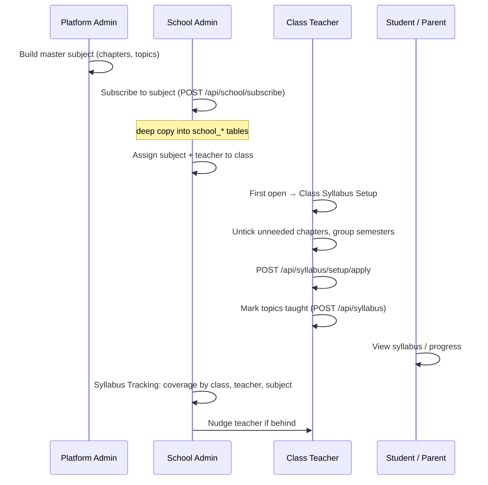

# 09 · Syllabus Customizer (Curriculum)

| | |
|---|---|
| **Feature key** | `curriculum` (portal nav aliases: `syllabus`, `syllabus-tracking`) |
| **Category** | Scheduling |
| **Portals** | School Admin, Teacher, Student, Parent |
| **Status** | **BUILT** |
| **Deep reference** | [`docs/SYLLABUS-FEATURE-README.md`](../../SYLLABUS-FEATURE-README.md) (long, schema-level) |
| **Snapshot** | `dev` @ `29f0e6a`, 2026-09-21 |

---

## 1. Product brief

**The problem.** Every school teaches a board syllabus (CBSE, State, etc.) but tracks it on paper. Nobody knows, mid-term, whether Grade 9-A is behind on Maths, and parents can't see what has been taught.

**The solution.** A three-layer system that keeps a professional master syllabus at platform level and lets each school and each class shape it:

```
MASTER CATALOG (platform, shared)   board → grade → subject → chapter → topic
        │  school subscribes → deep COPY (not a live link)
SCHOOL COPY (per school)            editable; custom chapters allowed
        │  each class's teacher runs one-time Class Syllabus Setup
CLASS SETUP (per class-section)     which chapters/topics this class needs, semester groups
        │  teacher marks topics taught
PROGRESS (per class)                drives % everywhere
```

| Role | What they do |
|---|---|
| Platform admin | Builds and maintains the master catalog (subjects → chapters → topics → tasks, resources, PDFs) |
| School admin | **Subscribes** to subjects, customises the school copy, sees each class's setup, watches **coverage analytics**, **nudges** a teacher who is behind |
| Teacher | Runs **Class Syllabus Setup** (deselect what the class won't do, group into semesters, copy from a sibling section), marks topics **taught** with a date; adds custom chapters; can bulk-import an outline |
| Student | Sees the syllabus for their class (what is unlocked) |
| Parent | Sees the full syllabus: taught vs not yet taught |

**Highlights**
- **Per-class overlay:** 9-A and 9-B can keep different chapters and semester groupings — nothing is destructively deleted.
- **Chapter-weighted progress** with partial credit (not a naïve topic ratio).
- **Weekly coverage trend** charts by class or teacher.
- **Telugu/Hindi names:** teachers type in English letters and convert in place (server-side transliteration).
- **Year-to-year:** copy a subject's setup from a previous year.

**Value.** Curriculum accountability without spreadsheets; principals see who is behind *before* exams; parents see the syllabus is being taught.

**Where it stops.** No lesson planner (removed; on a branch), no timetable-linked pacing. Homework/task templates exist in the catalog schema but are **not** a homework feature.

## 2. End-to-end flow



**Step by step**
1. **Subscribe** (School Admin → Syllabus Customizer): pick board/grade/subject; the full tree is copied to the school.
2. **Assign** the subject and teacher to a class ([04](04-class-management.md)).
3. **Class Syllabus Setup** (teacher, once per class + subject, re-editable): untick chapters/topics the class will skip, optionally group into Semester 1/2…; if another section of the same grade already did it, **copy from sibling** with one click.
4. **Teach and mark**: the teacher marks topics covered with a date.
5. **Track**: admin opens *Syllabus Tracking* → by class, teacher (one row per class + subject) and subject; trend chart from weekly snapshots.
6. **Nudge**: from a behind-schedule row the admin sends the teacher a notification.
7. **New year**: copy setup from the previous year instead of redoing it.

## 3. Business rules & calculations

| Rule | Detail |
|---|---|
| Copy, not link | Later master edits don't change a school's copy; `POST /api/school/subjects/{id}/resync` can pull new content on demand |
| Absence of a row = active | Class visibility rows are written only by Setup **Apply**; an unchecked item gets an explicit `is_active = false` row |
| Progress is per class | `school_topic_progress` keyed `(class_id, school_topic_id)` — two sections can be at different points |
| **Percent is chapter-weighted with partial credit** | Exact formula in the syllabus README §11; every active chapter counts in the denominator (including zero-topic chapters — a past bug that inflated 47% to 78% was fixed) |
| Zero chapters | `pct = null`, shown as "—" |
| Trend | Weekly **binary** covered/total snapshots (Mondays 02:00 UTC cron) — answers "how is it trending", not "exact progress now" |
| Who edits what | Only the class's own teacher edits Setup; admin sees it read-only (`/api/syllabus/setup/status`) |
| Sibling copy | Same grade only; source must have completed Setup; a one-time clone, not a live link |
| Custom content | `is_custom` flag; teachers can add or rename their own chapters |

## 4. Technical reference (developers)

**Screens:** admin — `CurriculumCustomizer.tsx` (subscribe/customise, ~1,400 lines), `SyllabusTracking.tsx` (analytics, ~630), `AcademicAnalytics.tsx`; teacher — `TeacherSyllabus.tsx`; student — `StudentSyllabus.tsx`; parent — `ParentSyllabus.tsx`.

**API (main groups)**

| Route | Purpose | Guard |
|---|---|---|
| `POST /api/school/subscribe` | Subscribe (deep copy) | school admin |
| `GET/POST /api/syllabus`, `PATCH/DELETE /api/syllabus/{id}`, `POST/PATCH /api/syllabus/chapters` | Tree + mark taught + chapters | `requireSyllabusAccess` / `requireSyllabusWriteAccess` |
| `GET /api/syllabus/setup`, `POST /setup/apply`, `GET /setup/siblings`, `POST /setup/copy-from-sibling`, `GET /setup/status` | Class Syllabus Setup | as above |
| `GET /api/syllabus/analytics`, `/analytics/trend` | Admin coverage analytics | `requireFeeAccess` |
| `POST /api/notifications/nudge-teacher` | Nudge | `requireFeeAccess` + teacher-in-school check |
| `GET /api/school/subjects`, `DELETE /{id}`, `POST /{id}/resync`, `/create-custom`, `/copy-from-year`, `GET /materials` | School subject management | school scoped |
| `POST /api/school/syllabus/bulk-import`, `/bootstrap-chapters` | Teacher bulk outline import | write access |
| `GET/POST/DELETE /api/platform/subjects` | Master catalog | Platform Admin |
| `GET /api/cron/syllabus-coverage-snapshot` | Weekly snapshots | `CRON_SECRET` |
| `GET /api/transliterate` | English → Telugu/Hindi (staff only) | staff session |

**Tables:** master — `master_subjects/chapters/topics/resources/tasks`, `master_subject_materials`; school — `school_subjects/chapters/topics/resources/tasks`, `school_topic_progress`, `school_subscriptions`; class — `class_chapter_visibility`, `class_topic_visibility`, `class_subject_setup_status`, `class_subjects`, `curriculum_assignments`; history — `syllabus_coverage_snapshots`, `academic_year_snapshots`.

**Libraries:** `lib/curricula.ts`, `lib/syllabus/*`, `lib/board-syllabus/*` (board data), `lib/matchTeacher.ts`, `lib/academicYear.ts`.

**Design notes:** teacher access to write routes is resolved from `class_subjects` (assigned teacher only); admin analytics deliberately uses the tenant guard rather than a syllabus guard; the Setup **Apply** runs in one transaction with a per-item ownership check against stale/malformed payloads.

**Tests:** `syllabus-audit.spec.ts`, `workflow-syllabus-audit.spec.ts`, `workflow-syllabus-translate.spec.ts`.

## 5. Pitch kit

**Investor one-liner** — "A board-aligned master syllabus each school can shape per class, with live coverage analytics — curriculum accountability, not paperwork."

**School one-liner** — "Know which classes are behind on which subjects — before the exams — and let parents see what has been taught."

**Slide bullets**
- Master catalog → school copy → per-class setup (three layers).
- Teachers mark topics taught; progress is chapter-weighted.
- Weekly coverage trend by class and by teacher; one-click nudge.
- Telugu/Hindi names typed phonetically in English letters.
- Parents see taught vs. not-yet-taught.

**60-second demo:** subscribe Grade 9 Maths → open as the class teacher, untick two chapters, apply → mark three topics taught → switch to admin: coverage % and trend appear → nudge a teacher.

**Objections → honest answers**
- *"Is it AI?"* — No. Transliteration uses a public Google Input Tools endpoint through our server; no AI generation.
- *"Who supplies the content?"* — The master catalog is maintained by WLYL; coverage of boards/grades is `[TBD – founder]` (state which boards are actually loaded before stating this externally).

## 6. Limits & roadmap

- Master catalog completeness varies by board/grade — verify before promising.
- No lesson planner, no pacing against a timetable (both on branches).
- Roadmap: rebuilt analytics (Class Analytics) and school health score.
