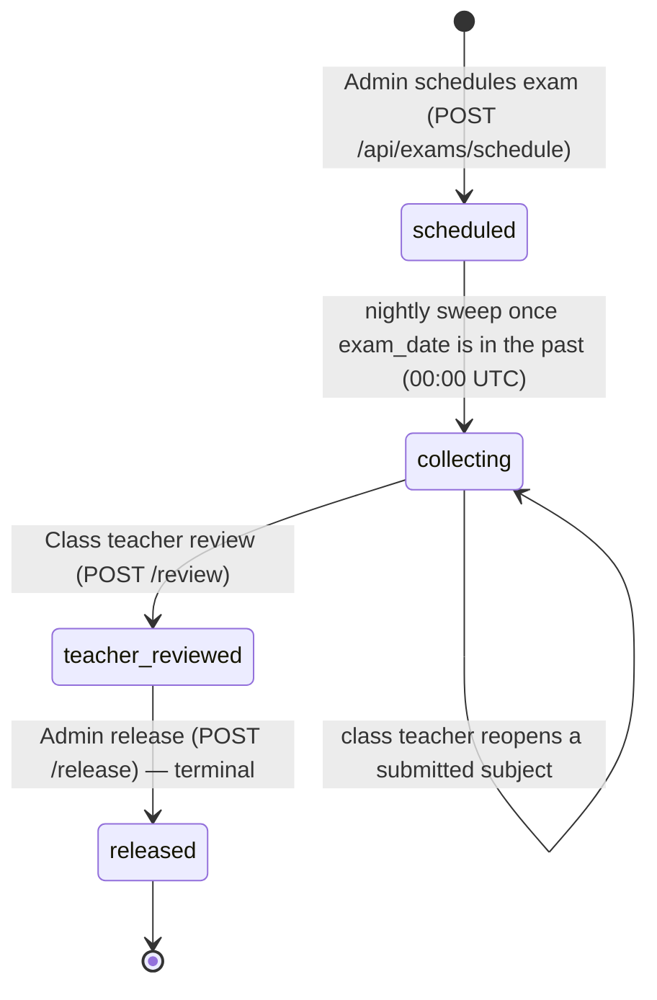

# 10 · Exam Schedule & Marks

| | |
|---|---|
| **Feature key** | `exam-marks` (nav aliases: `exam-schedule`, `my-marks`, `results`, `exams`) |
| **Category** | Scheduling |
| **Portals** | School Admin, Teacher, Student, Parent |
| **Status** | **BUILT** — a single switch governs the whole exam workflow across all four portals |
| **Snapshot** | `dev` @ `29f0e6a`, 2026-09-21 |

---

## 1. Product brief

**The problem.** Exam marks travel on paper and WhatsApp; marks get changed after release; parents say they never saw the result.

**The solution.** A controlled pipeline: the admin **schedules** an exam for many classes at once, subject teachers **enter marks**, the class teacher **reviews**, the admin **releases** — and only then do students and parents see results. Parents can **acknowledge**, and the school sees who has not.

| Stage | Who | What happens |
|---|---|---|
| 1. Schedule | School admin | Create one exam (e.g. Half-Yearly) across many classes; each class's subjects **and subject teachers** are copied from **that class's own** subject list; max marks and pass % set |
| 2. Collect | Subject teachers / class teacher | Marks entry opens automatically **the day after the exam date** (nightly job); each teacher edits only their subject; the class teacher may edit any subject |
| 3. Review | Class teacher | "I've checked every subject" → notifies school admins |
| 4. Release | School admin | Final, irreversible release; **only now** do students/parents see results |
| 5. Acknowledge | Parent | Taps **Acknowledge**; admin sees who hasn't and can **nudge** |

**Extras:** the class teacher can **reopen** a submitted subject to fix a mistake before review; one grading ladder everywhere; results exports (see [17](17-export-and-reports.md)); exam calendar entries.

**Value.** Traceable, tamper-resistant results and an acknowledgement trail; no result is visible before the school says so.

**Where it stops.** No annual multi-exam report card (a per-exam printable one is in Export Center), no rank lists, no question-paper management, no online tests (weekly test removed; on a branch).

## 2. End-to-end flow

**Step by step**
1. **Admin:** *Exam Schedule* → choose classes, exam name, date, pass %; subjects fill from each class. Creating it stamps one shared `exam_group_id` so all classes can be edited or deleted as one unit, while each class has its own lifecycle.
2. **Status flips** to *collecting* the day after the exam date via the nightly sweep; subject teachers are notified. (There is **no** manual force-open on `dev`.)
3. **Teachers:** *Exam Marks* → enter marks per student (or mark absent) → **Submit** the subject (locks it).
4. **Class teacher:** reviews all subjects → **Review**; every school admin receives a notification.
5. **Admin:** **Release**. Once an exam is `teacher_reviewed`, subjects can no longer be reopened — corrections must be made before the class teacher reviews.
6. **Student/Parent:** results appear; the parent acknowledges.
7. **Admin:** *Acknowledgements* list → **Nudge** parents who haven't.

## 3. Business rules & calculations

| Rule | Detail |
|---|---|
| Grade ladder (`lib/examGrading.ts`) | **A1** ≥91 · **A2** ≥81 · **B1** ≥71 · **B2** ≥61 · **C1** ≥51 · **C2** ≥41 · **D** ≥33 · **E** <33 (on percentage) |
| Pass / fail | Separate from grade: `percentage ≥ exam.passing_pct`. A 33 % score is grade **D** yet a **fail** on an exam with a 50 % pass mark |
| Visibility | Students/parents may read **only `released`** exams and only **their own** marks |
| Permissions | Subject teacher → own subject; class teacher → any subject in their class (and reopen/review); admin → schedule and release |
| Release | Admin-only, irreversible; no edits accepted at release |
| Subject lock | Submitting a subject locks it; only the **class teacher** can reopen it, and only while the exam is still `collecting` |
| Subjects per class | Taken from that class's `class_subjects` — never a shared typed list |
| Notifications | Review notifies school admins; nudge notifies parents |

**Worked example (illustrative).** Maths max 50, Meera scores 39 → 78 % → grade **B1**; exam pass mark 40 % → **pass**.

## 4. Technical reference (developers)

**Screens:** `ExamSchedule.tsx` (admin, ~1,000 lines), `app/teacher/components/ExamMarks.tsx`, `app/student/components/StudentMarks.tsx`, parent results in `app/parent/page.tsx`.

**API**

| Method | Route | Purpose |
|---|---|---|
| POST | `/api/exams/schedule` | Create exam across classes (validates every class belongs to the school) |
| GET | `/api/exams`, `/api/exams/calendar` | Lists; calendar view |
| GET/PUT/DELETE | `/api/exams/{id}` | Exam detail, edit, delete |
| POST | `/api/exams/{id}/subjects`, `/subjects/{sid}/reopen` | Subjects; reopen (class teacher, collecting only) |
| GET/POST | `/api/exams/{id}/marks` | Read (role-scoped) / enter marks + submit subjects |
| POST | `/api/exams/{id}/review` | Class-teacher review → `teacher_reviewed` |
| POST | `/api/exams/{id}/release` | Admin release → `released` (irreversible) |
| GET/POST | `/api/exams/{id}/acknowledgements`, `/acknowledge`, `/nudge-parent` | Parent acknowledgement loop |
| GET | `/api/students/{id}/exams` | Student/parent results |
| GET | `/api/cron/exam-status-sweep` | `scheduled → collecting` |

**Tables:** `exam_records` (status `scheduled | collecting | teacher_reviewed | released`, `exam_group_id`, `passing_pct`), `exam_subjects` (`teacher_id`, max marks, submit lock), `exam_marks` (`marks_obtained`, `is_absent`), `parent_mark_acks`, `parent_mark_ack_nudges`, `notifications`, `class_subjects`.

**Libraries:** `lib/examGrading.ts` (single grade source, used by five places that previously drifted), `lib/examsAuth.ts` (`requireExamsAdmin/Teacher/Access`), `lib/rewards.ts` (legacy), `lib/email.ts`.

**Security:** marks route checks *which* student the caller may see (a former gap where any logged-in user could pass any `student_id` was closed); results gated on `status === 'released'`.

**Tests:** covered by `workflow-portals.spec.ts` and `workflow-full-platform.spec.ts`; **no dedicated exam-marks spec** — worth adding before scale.

## 5. Pitch kit

**Investor one-liner** — "A governed results pipeline — enter, review, release, acknowledge — that removes tampering and 'I never saw it' from school results."

**School one-liner** — "Marks are entered by the right teacher, checked by the class teacher, and released by you — parents see nothing until then, and you can see who has acknowledged."

**Slide bullets**
- Schedule one exam across many classes.
- Subject-level permissions and locks; class-teacher review; admin release.
- One grading ladder everywhere; separate pass mark.
- Parent acknowledgement with nudges.

**60-second demo:** schedule an exam for two classes → teacher enters and submits marks → class teacher reviews → admin releases → parent acknowledges → admin sees the list.

**Objection → honest answer**
- *"Report cards?"* — A per-exam printable report card is in Export Center; a multi-exam annual card with remarks is roadmap.

## 6. Limits & roadmap

- No annual multi-exam report card, ranks or grace-marks logic; no online tests. A **per-exam printable report card** exists in [Export Center](17-export-and-reports.md).
- The legacy `wiki/features/exam-marks.md` described a single "admin review" step — the code implements class-teacher review + admin release (this dossier is correct).
