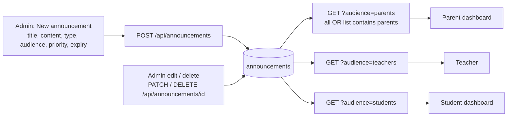

# 11 · Announcement Board

| | |
|---|---|
| **Feature key** | `announcements` |
| **Category** | Communication |
| **Portals** | School Admin (publish); Teacher, Student, Parent (read on their dashboards) |
| **Status** | **BUILT** — with a **security gap** on the write routes (see §4) |
| **Snapshot** | `dev` @ `29f0e6a`, 2026-09-21 |

---

## 1. Product brief

**The problem.** Circulars go out through paper slips and WhatsApp groups; some parents never see them, and old notices never disappear.

**The solution.** A noticeboard where the admin publishes an announcement to **exactly the audiences that need it**, with a priority and an expiry date.

| Field | Options |
|---|---|
| Type | `general`, `circular`, `event`, `alert` |
| Audience | `all`, or any combination of `teachers`, `students`, `parents` (selecting all three is stored as `all`) |
| Priority | `normal`, `high`, `urgent` — urgent and high sort first |
| Expiry | Optional date; expired notices drop off automatically |
| Author | Recorded name of the admin who posted it |

Portals fetch the notices for their own audience; the admin sees everything.

**Value.** A single, dated, audience-targeted channel — parents see only what is meant for parents.

**Where it stops.** No push, SMS or WhatsApp delivery — announcements are shown **inside** the portals only. No read receipts, attachments or scheduling.

## 2. End-to-end flow

**Step by step**
1. *Announcements → New*: write the title and body; tick the audiences; pick type and priority; optionally set an expiry.
2. Publish. It is stored with the school id.
3. Each portal calls the list endpoint with its own audience; the SQL matches `all` **or** a comma-list that contains that audience.
4. Ordering: urgent → high → normal, then newest first, with pagination.
5. Edit or delete from the admin board at any time.

## 3. Business rules & edge cases

| Rule | Detail |
|---|---|
| Audience validation | Every part must be one of `all`, `teachers`, `students`, `parents`; else `400` |
| Normalisation | All three individual audiences → stored as `all` |
| Priority validation | Only `normal`, `high`, `urgent` |
| Type validation | Only `general`, `circular`, `event`, `alert` |
| Expiry | `expires_at` (date); expired items are not returned |
| Read scope | The GET route derives the school from the **session**; a mismatching `school_id` is refused (a previous cross-school read gap was fixed) |

## 4. Technical reference (developers)

**Screens:** `app/school-admin/components/AnnouncementBoard.tsx` (~490 lines); readers in each portal's dashboard.

**API**

| Method | Route | Purpose | Guard today |
|---|---|---|---|
| GET | `/api/announcements?school_id&audience&limit&offset` | Audience-filtered list | `getAnySession()` + session school |
| POST | `/api/announcements` | Create | ⚠ **none** |
| PATCH | `/api/announcements/{id}` | Edit (COALESCE update by id) | ⚠ **none** |
| DELETE | `/api/announcements/{id}` | Delete by id | ⚠ **none** |

**⚠ Known security gap (INTERNAL):** the three write routes perform **no authentication and no school check**; PATCH/DELETE address rows by `id` alone, so anyone who can reach the API could create, edit or delete another school's notices. Fix is a `requireSchoolAdmin()` + `school_id === session.schoolId` (and `WHERE id = $ AND school_id = $`). Tracked in the follow-up task; see [architecture §12.1](00-platform-architecture.md).

**Table:** `announcements` (`school_id`, `title`, `content`, `announcement_type`, `target_audience`, `priority`, `created_by_name`, `expires_at`, `created_at`).

**Libraries:** `lib/auth.ts` (`getAnySession`), `lib/db.ts`.

**Tests:** exercised in `workflow-school-admin.spec.ts` / `workflow-portals.spec.ts`; **no test asserts that anonymous writes are refused** — add one with the fix.

## 5. Pitch kit

**Investor one-liner** — "Targeted school communication in-portal: the right notice to the right audience, with priority and expiry."

**School one-liner** — "Publish a circular once. Teachers, students and parents each see only what's meant for them — and old notices expire on their own."

**Slide bullets**
- Audience targeting (teachers / students / parents / all).
- Priority and expiry; urgent notices rise to the top.
- Same board across all portals.

**60-second demo:** post an *urgent* notice to parents only → show it on the parent portal → confirm the student portal does not show it.

**Objection → honest answer**
- *"Will parents get a WhatsApp message?"* — No. In-portal only today; WhatsApp is on the roadmap.

## 6. Limits & roadmap

- No push/SMS/WhatsApp, attachments, read receipts or scheduling.
- **Do not demo write actions against a shared/production database until the auth guard fix lands.**
