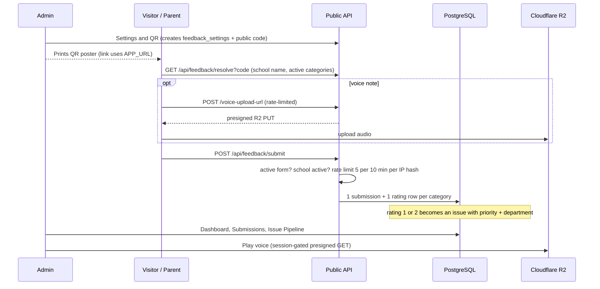

# 12 · Feedback Management (QR-code feedback)

| | |
|---|---|
| **Feature key** | `feedback-management` |
| **Category** | Communication |
| **Portals** | School Admin (manage); **public, no-login form** at `/feedback/<code>` |
| **Status** | **BUILT** |
| **Snapshot** | `dev` @ `29f0e6a`, 2026-09-21 |

---

## 1. Product brief

**The problem.** Schools rarely hear honest feedback: parents won't log in to complain, suggestion boxes are ignored, and problems (dirty toilets, late buses, a rude gatekeeper) never reach the right department.

**The solution.** A **QR poster** on the school wall. Anyone — parent, student, teacher, visitor — scans it, **no login**, picks their role, rates categories with an emoji scale, adds quick tags, text, or a **voice note**, and can stay **anonymous**. Low ratings become **issues** routed to a department and tracked to resolution.

| Piece | What it does |
|---|---|
| Public wizard | Role → optional identity (name/phone) or anonymous → categories → 5-point emoji rating → tags / text / voice → submit |
| Roles | Parent, Student, Teacher, Visitor, Other — each with role-specific default categories |
| Advanced forms | Optional richer form types (`advanced_form_type`) |
| Auto-issues | Rating **1** → high priority, rating **2** → medium; each snapshots the category's **department** for routing |
| Admin tabs | Dashboard (pulse score, mood mix, best/worst categories) · Submissions · **Issue Pipeline** · Categories editor · Settings & QR |
| Issue workflow | open → in progress → resolved / dismissed; priority and department editable |
| QR poster | Downloadable QR + printable poster; **regenerate** the code to invalidate old posters |

**Value.** A safe channel for candid feedback that turns complaints into a **workflow with accountability**, and a live "pulse score" for the owner.

**Where it stops.** Alerts to staff are in-app only (no WhatsApp/SMS). No sentiment AI on text or voice. Voice notes are stored, not transcribed.

## 2. End-to-end flow

**Step by step (visitor):** scan → choose *Parent* → (optional name/phone or *anonymous*) → pick categories to rate → tap emojis → add tags/text/voice → **Submit** → thank-you.

**Step by step (admin):** *Feedback Management* → **Settings & QR** (form is created lazily; copy link / download poster) → watch **Dashboard**; open **Issue Pipeline** and move issues open → in progress → resolved; edit **Categories** (per role, with department); regenerate the code if a poster leaks.

## 3. Business rules & edge cases

| Rule | Detail |
|---|---|
| No login | Public routes: resolve, submit, voice-upload-url |
| Rate limit | **5 submissions / 10 minutes** per hashed IP per school (`ip_hash`); voice uploads also rate-limited (`feedback_voice_upload_log`) |
| Validity | Form must be active and school active; categories resolved against the school's live rows so label/department are accurate snapshots; ratings de-duplicated and capped |
| Issue creation | Rating 1 → `high`, 2 → `medium`; only 1–2 create issues |
| Pulse score | `round(avg_rating / 5 × 100)` |
| Anonymity | Anonymous submissions store no name/phone; voice playback is **session-gated** (a recording is personal data even when anonymous) |
| Public code | Independent of `schools.school_code`; freely rotatable without touching login; **URL built from `APP_URL`**, never the request host (the admin subdomain would dead-end) |
| Soft delete | Categories deactivate via `is_active` |

## 4. Technical reference (developers)

**Screens:** public — `app/feedback/[code]/{page,FeedbackWizard}.tsx`, `steps/*` (incl. `AdvancedFormStep`), `roleVisuals.ts`, `advancedFormVisuals.ts`; admin — `FeedbackManagement.tsx` + `feedback/{FeedbackDashboardTab,FeedbackSubmissionsTab,FeedbackIssueTable,FeedbackCategoryEditor,FeedbackQrPoster,useFeedbackFetch}`.

**API**

| Method | Route | Access |
|---|---|---|
| GET | `/api/feedback/resolve?code=` | Public |
| POST | `/api/feedback/voice-upload-url` | Public, rate-limited (presigned R2 PUT) |
| POST | `/api/feedback/submit` | Public, rate-limited |
| GET | `/api/feedback/voice/{id}` | Staff session (presigned GET redirect) |
| GET | `/api/feedback/submissions` (+`/{id}`) | Staff |
| GET / PATCH | `/api/feedback/issues` / `/{id}` | Staff |
| GET | `/api/feedback/stats` | Staff (pulse, mood, best/worst) |
| GET/POST, PATCH | `/api/feedback/categories`, `/{id}` | Staff |
| GET/PATCH, POST | `/api/feedback/settings`, `/regenerate-code` | Staff |
| GET | `/api/feedback/qr` | Staff (PNG) |

**Tables:** `feedback_settings` (code + active toggle, 1 per school), `feedback_categories`, `feedback_submissions` (role, identity, text, `voice_object_key`, `ip_hash`, `advanced_form_*`), `feedback_submission_ratings` (unit of the issue pipeline; partial index on `(school_id, priority, status) WHERE priority IS NOT NULL`), `feedback_voice_upload_log`.

**Libraries:** `lib/feedback-defaults.ts` (seeded + backfilled categories), `lib/validation/feedback.ts` (Zod), `lib/feedback-public-access.ts`, `lib/request-ip.ts`, `lib/r2.ts`, `lib/auth.ts` (`generateFeedbackCode`, `requireFeeAccess` for tenant isolation).

**Known technical gaps:** no server-enforced max size on the presigned voice upload (client caps ~60 s); some duplicated role definitions and fetch hooks across admin tabs (refactor debt).

**Tests:** `workflow-feedback-management.spec.ts`.

## 5. Pitch kit

**Investor one-liner** — "A no-login QR feedback channel that converts complaints into a routed, tracked issue pipeline and a live school pulse score."

**School one-liner** — "Put a QR poster at the gate. Parents speak freely — anonymously if they wish — and every low rating becomes a tracked issue for the right department."

**Slide bullets**
- Scan-and-rate in under a minute, no app, no login; Telugu-friendly emoji scale.
- Anonymous option; voice notes.
- Auto-flagged issues routed by department, with status workflow.
- Pulse score and best/worst categories for the owner.
- QR poster generator; rotate the code any time.

**60-second demo:** scan the poster on a phone → give a 1-star on "Cleanliness" with a voice note → admin Issue Pipeline shows a **high** issue → move it to *in progress* → resolved; show the pulse score change.

**Objections → honest answers**
- *"Can it be spammed?"* — Per-IP rate limits (5 per 10 minutes) and hashed IPs; it is not a full anti-abuse system.
- *"Is voice transcribed?"* — No, stored and played back by staff only.

## 6. Limits & roadmap

- In-app alerts only; no WhatsApp/SMS to department heads.
- No text/voice analysis. Voice size cap enforced only on the client.
