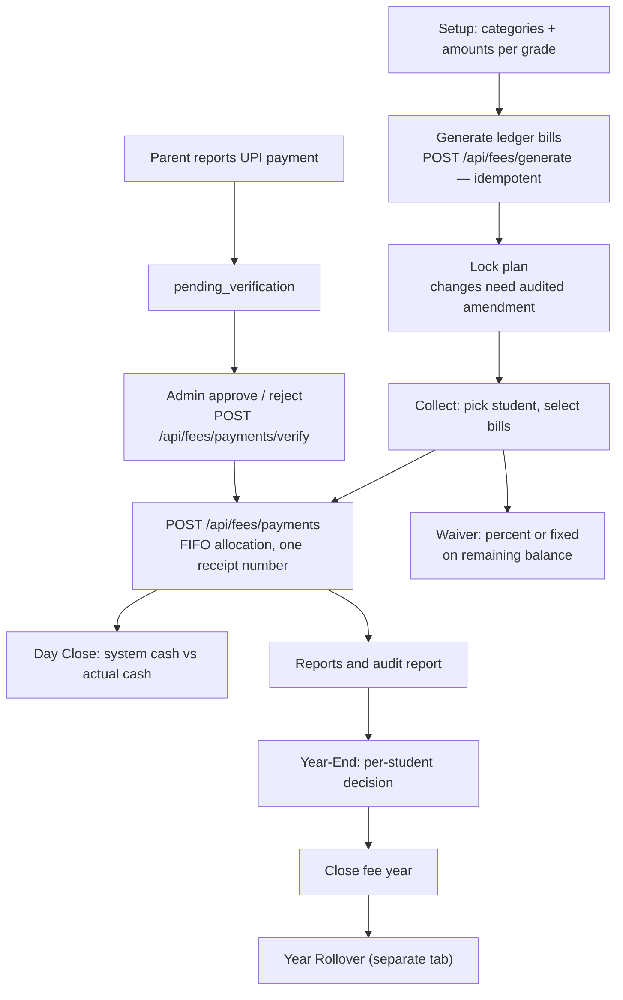

# 13 · Fee Management

| | |
|---|---|
| **Feature key** | `fee-management` |
| **Category** | Finance |
| **Portals** | School Admin (full); Parent (read-only ledger via `/api/parent/fees`) |
| **Status** | **BUILT** — the deepest finance module; 109 dedicated e2e cases |
| **Related** | [14 · Online Fee Payments (UPI)](14-online-fee-payments-upi.md), [19 · Year Rollover](19-year-rollover.md) |
| **Snapshot** | `dev` @ `29f0e6a`, 2026-09-21 |

---

## 1. Product brief

**The problem.** Fees are the school's cash flow and its biggest source of errors: paper receipts, half-payments nobody tracks, waivers given verbally, dues lost when the year changes, and cash that doesn't match the register at day end.

**The solution.** One tool for the **whole fee lifecycle**, with an audit trail on every rupee.

| Tab | What it does |
|---|---|
| **Overview** | Billed / collected / waived / unpaid headline, collection %, setup-wizard banner |
| **Fee Plan (Setup)** | Fee categories (fixed per grade, or variable per student), amounts per grade, **generate bills** for all active students, **lock** the plan (later changes need an audited amendment) |
| **Collect** | Daily counter: students with dues, take a payment (full/partial, **FIFO** across selected bills), grant a **waiver**, **Day Close** cash reconciliation, verify online (UPI) payments |
| **Student Passbook** | One student's bills, payments, waivers; **cancel/correct** a payment or revoke a waiver (with reasons, logged) |
| **Reports** | Collection and dues reports, exports, **audit report (Excel)** |
| **Year-End** | Per student: **carry forward**, **write off**, move to **passout ledger**, or leave open; close the year (reopen needs a reason) |
| **Past Records** | Read-only headline for every past academic year; jump into its report/ledger |
| **Leavers & Dues** | Students who left with unpaid balance; the always-open passout ledger |

**Receipts:** configurable school branding (logo, alignment, header blocks), signature block and **dual-copy printing**, also used for passbook reprints and year-end statements.

**Payment modes:** cash, cheque, DD, UPI, online. **Statuses:** bill = pending · partial · paid · overdue · waived; payment = completed · pending_verification.

**Value.** Every receipt numbered, every waiver reasoned, cash reconciled daily, and dues never silently vanish at year end. The principal can answer "how much is outstanding and from whom?" in seconds.

**Where it stops.** **No payment gateway** (online = UPI QR + parent self-report + admin verification). WhatsApp fee reminders are **not** live. No GST invoicing, no fee-head-wise accounting export to Tally.

## 2. End-to-end flow

**Step by step**
1. **Setup.** Create fee heads (e.g. Tuition, Transport). Fixed heads take one amount per grade; variable heads are assigned per student (`student_fee_category_assignments`). **Generate** bills — safe to re-run; students who changed grade are re-synced to the new grade's amount (never below what they've already paid). Every bill is **due at the academic year's end date**.
2. **Lock** the plan. After locking, changes go through `structures/amend`, which records who/why in `fee_structure_history`.
3. **Collect.** Search the student, select one or many bills, enter amount and mode. With several bills, the server allocates **oldest first** and issues **one receipt number** for all parts. `collected_by` is mandatory (several staff share one login at the counter).
4. **Waive.** Percent or fixed, computed on the **remaining** balance after existing waivers. Reason required. Revocable from the Passbook.
5. **Day Close.** The system totals the day's cash; the admin enters actual cash and notes; differences are recorded.
6. **Online payments.** See [14](14-online-fee-payments-upi.md).
7. **Year-End.** Decide every unpaid student; apply in batches (resumable); close the year. Carried dues become one **Previous Year Dues** bill in the next year.
8. **Past Records** to browse any prior year.

## 3. Business rules & calculations

| Rule | Detail |
|---|---|
| **Balance** | `amount_due − waiver − amount_paid` |
| **FIFO** | A multi-bill payment fills the oldest selected bill first; all rows share one receipt number |
| **Payment modes** | Whitelisted: `cash`, `cheque`, `dd`, `upi`, `online` (no DB constraint, so the API enforces it — otherwise a typo would fall out of Day Close's cash reconciliation) |
| **Amount** | Must be positive; date cannot be in the future (compared as IST date strings) |
| **Waiver** | On remaining balance; `carry_forward` is a **system-only** waiver type used by year-end bookkeeping and excluded from "discretionary waived" totals; callers cannot set it |
| **Duplicate guard** | Payments and waivers use `lib/idempotency.ts` so a double click or retry cannot post twice |
| **Concurrency** | Row locked `FOR UPDATE` when paying/waiving so a payment and a waiver cannot race |
| **Closed year** | Payments, waivers, generation and re-sync are blocked on a closed year |
| **Plan lock** | Amounts frozen after lock; amendments audited |
| **Year-end apply** | Serialised per `(school, year)` with `pg_advisory_xact_lock`; resumable; close is race-safe |
| **Reopen** | Only with a reason (logged), and **not** once the school has rolled over |
| **Roll number order** | Ledger sorted by grade, section, `school_roll_number` (nulls last), name |

**Worked example (illustrative).** Bills: Term-1 ₹10,000, Term-2 ₹10,000. Parent pays ₹15,000 in one go → Term-1 fully paid (₹10,000), Term-2 gets ₹5,000 → one receipt. A ₹2,000 waiver on Term-2 → remaining ₹3,000.

## 4. Technical reference (developers)

**Screens:** `FeeManagement.tsx` (1,329-line shell that owns cross-tab state and lazy-mounts tabs) + eight tabs in `app/school-admin/components/fee-management/` (Overview, Setup/Applicability, Collect, Passbook, Reports, Year-End, Archive, Leavers). Zustand store `lib/stores/feeStore.ts` holds cross-tab versions/one-shot requests.

**API (`/api/fees/*`, 33 route operations used by the UI)**

| Group | Routes |
|---|---|
| Setup | `categories`, `category-assignments`, `category-changelog`, `structures` (+ `lock`, `amend`), `structure-history`, `setup-status`, `generate` |
| Money | `ledger`, `payments`, `payments/verify`, `payments/cancel`, `waivers`, `day-close`, `passbook`, `stats` |
| Reporting | `reports`, `audit-report` (+ `/excel`), `audit-log`, `export`, `archive` |
| Year | `year-end`, `year-rollover`, `passout`, `removed-students` |
| UPI | `upi-id` (+ `/verify`), `upi-qr` (+ `/info`) |
| Parent | `/api/parent/fees` (GET ledger, POST payment report) |

**Tables:** `fee_categories`, `fee_structures`, `fee_structure_locks`, `fee_structure_amendments`, `fee_structure_history`, `student_fee_category_assignments`, `student_fee_assignment_history`, `student_fee_ledger`, `student_fee_ledger_edits`, `fee_payments`, `fee_payment_corrections`, `fee_waivers`, `fee_day_close`, `fee_year_close`, `fee_category_changelog`, `passout_students`, `academic_years`, `academic_year_snapshots`, `platform_audit_log`.

**Libraries:** `lib/feeRollover.ts` (system categories *Previous Year Dues / Passout Dues*, close-out bill, upsert carry-forward, race-safe year-close claim, remaining-open summary), `lib/feeAuditReport.ts`, `lib/idempotency.ts`, `lib/istDate.ts`, `lib/academicYear.ts`, `lib/auth.ts` (`requireFeeAccess` — the tenant guard used by every fee route).

**Design notes**
- Validation runs **before** a pool connection is acquired (pool is `max: 1` on Vercel).
- `source_academic_year` / `source_ledger_id` on ledger rows trace carry-forward and passout bills to their origin.
- Past Records is a thin read layer over existing data, not a new source of truth.

**Known technical debt (INTERNAL):** the yearly billed/collected/waived/unpaid aggregate exists in three places (`reports`, `feeRollover`, `archive`); `fmt/pct/sanitizeMoney` helpers are duplicated across tab files; year-end/rollover loops run 1–2 queries per bill (fine for a once-a-year admin task); Archive/Leavers do not auto-refresh after a year-end action.

**Tests:** `workflow-fee-management.spec.ts` (109 cases; needs an existing platform-admin in the target DB), `workflow-year-rollover.spec.ts`.

## 5. Pitch kit

**Investor one-liner** — "A complete fee ledger with receipts, waivers, day-close and year-end carry-forward — the system of record for a school's cash."

**School one-liner** — "Every rupee tracked: numbered receipts, reasoned waivers, daily cash match, and dues that carry safely into next year."

**Slide bullets**
- Fee plan per grade, one-click bill generation, plan lock with audited amendments.
- Part-payments allocated oldest-first under one receipt.
- Waivers with reasons; cancel/correct with a trail.
- **Day Close** cash reconciliation; Excel audit report.
- Year-end: carry forward, write off, passout ledger; Past Records for every year.

**60-second demo:** generate bills → take a ₹15,000 payment across two terms (show one receipt) → grant a waiver → Day Close → open Reports → Year-End preview.

**Objections → honest answers**
- *"Payment gateway?"* — Not yet; UPI QR with admin verification. Gateway is roadmap.
- *"WhatsApp fee reminders?"* — Not live.

## 6. Limits & roadmap

- No gateway, no WhatsApp reminders, no Tally/GST exports, no late-fee rules engine.
- Roadmap: payment gateway (needs field-level encryption first), WhatsApp reminders.
