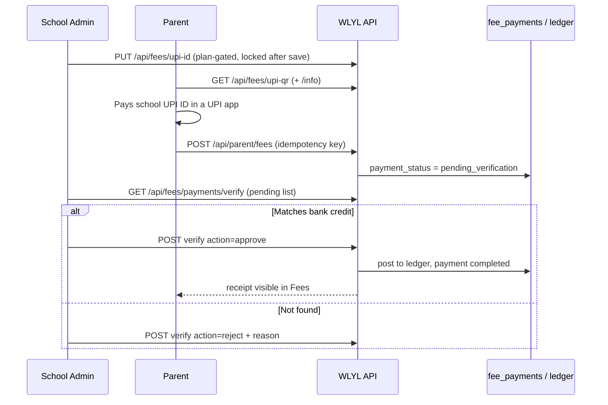

# 14 · Online Fee Payments (UPI)

| | |
|---|---|
| **Feature key** | `online-payments` (**overridable per school**) |
| **Category** | Finance |
| **Portals** | School Admin (set up, verify), Parent (pay, report) |
| **Status** | **BUILT as a manual, verified flow. There is NO payment gateway.** |
| **Depends on** | `fee-management` must also be on |
| **Snapshot** | `dev` @ `29f0e6a`, 2026-09-21 |

---

## 1. Product brief

**The problem.** Parents want to pay from their phone; schools want proof before crediting a payment. A full gateway needs merchant onboarding, fees and compliance that early-stage schools don't have.

**The solution.** A pragmatic bridge: the school shows **its own UPI ID / QR**; the parent pays in any UPI app and **reports** the payment; the admin **verifies** it against the bank credit; only then is it posted to the ledger and the parent's receipt appears.

| Step | Who | Screen |
|---|---|---|
| Set the school's UPI ID (locked once saved; changing it needs a fresh unlock) | School admin | Fee Management → Setup |
| See the QR and school info | Parent | Fees → Pay via UPI |
| Pay in any UPI app, then submit "I've paid" with reference | Parent | Fees |
| Approve or reject (with reason) | School admin | Collect → Online |
| Receipt visible after approval | Parent | Fees |

**Value.** Zero gateway cost, works with any bank, and every credit is confirmed by a human — appropriate for budget private schools. Parents get a phone-native payment experience.

**Where it stops (say this out loud).** No order creation, no webhook, **no automatic confirmation**; the admin must match each report with the bank statement. Gateway tables (`school_payment_config`, `payment_transactions`, `payment_webhook_log`) are **schema-only scaffolding**. Cashfree/gateway secrets would need field-level encryption first (`lib/encryption.ts` is not built).

## 2. End-to-end flow

**Step by step**
1. Admin enables the feature (tier or per-school override), sets the UPI ID under **Setup**. The UPI ID **locks**; changing it requires `POST /api/fees/upi-id/verify` to mint an unlock token.
2. Parent opens **Fees**; if `online-payments` is on, the *Pay via UPI* panel shows the QR.
3. After paying, the parent submits the amount and UPI reference; a per-attempt **idempotency key** prevents a retry creating two reports.
4. The payment appears in admin **Collect → Online** as *pending*.
5. Admin **approves** (posts to the ledger exactly like a normal payment) or **rejects** with a reason.

## 3. Business rules & edge cases

| Rule | Detail |
|---|---|
| Server-side plan gate | The UI hides the panel, **and** the API refuses setup without the feature — a direct call cannot enable UPI on an ineligible plan |
| Pending ≠ paid | `pending_verification` payments do **not** reduce the balance or show a receipt |
| Approval | Uses the same ledger update as a counter payment (closed-year guard, receipt); a confirmation **email** goes to the parent (non-blocking). Approve racing reject is guarded |
| Rejection | Stores a `rejection_reason`, returned to the parent in their Fees list |
| Duplicates | Idempotency key on the parent POST |
| Tiers (as seeded) | Basic: off · Standard, Premium: on; per-school override wins |
| Separate switch | A school can have Fee Management **without** Online Payments — the Fees tab still works |

## 4. Technical reference (developers)

**Screens:** `app/school-admin/components/fee-management/FeeCollectTab.tsx` (online verification queue) and Setup tab (UPI ID); parent Fees section in `app/parent/page.tsx`.

**API**

| Method | Route | Purpose |
|---|---|---|
| GET/PUT | `/api/fees/upi-id` | Read (`{upi_id, locked}`) / set (plan-gated) |
| POST | `/api/fees/upi-id/verify` | Mint unlock token to change a locked UPI ID |
| GET | `/api/fees/upi-qr`, `/api/fees/upi-qr/info` | QR and display info (parent) |
| GET/POST | `/api/parent/fees` | Ledger; **payment report** (idempotent) |
| GET/POST | `/api/fees/payments/verify` | Pending list; approve/reject `{payment_id, action, verified_by, rejection_reason?}` |

**Tables:** `fee_payments` (`payment_status` `completed | pending_verification`), `student_fee_ledger`, `schools.upi_id`. **Scaffolding only:** `school_payment_config`, `payment_transactions`, `payment_webhook_log`.

**Libraries:** `lib/idempotency.ts`, `lib/auth.ts` (`schoolHasFeature`), `lib/email.ts`.

**Future design (documented in `verify/route.ts`):** a gateway webhook would insert the payment already `completed`, run the same ledger update, and auto-issue receipts; `verify` remains as the manual/fallback path. **Do not merge gateway/WhatsApp code to `wlylV1_main` without explicit approval.**

**Tests:** `workflow-fee-management.spec.ts`.

## 5. Pitch kit

**Investor one-liner** — "UPI-native fee collection with human verification today — the on-ramp to a full payment gateway once schools are ready."

**School one-liner** — "Parents pay with any UPI app and tell us; you confirm against your bank and the receipt appears — no gateway fees."

**Slide bullets**
- Your own UPI ID/QR, locked against accidental change.
- Parent self-report → admin approval → ledger + receipt.
- Plan-gated and switchable per school.
- Path to gateway already designed.

**Never say:** "automatic payment confirmation", "integrated payment gateway", "Cashfree/Razorpay live".

**60-second demo:** parent submits a payment → admin sees it pending → approve → parent's Fees tab now shows the receipt and lower balance.

**Objection → honest answer**
- *"So someone must check the bank?"* — Yes. That is the trade-off for zero gateway cost; a gateway with automatic confirmation is roadmap.

## 6. Limits & roadmap

- Manual verification only; no refunds flow; no auto-reconciliation with bank statements.
- Roadmap: payment gateway (encryption first), WhatsApp receipts.
