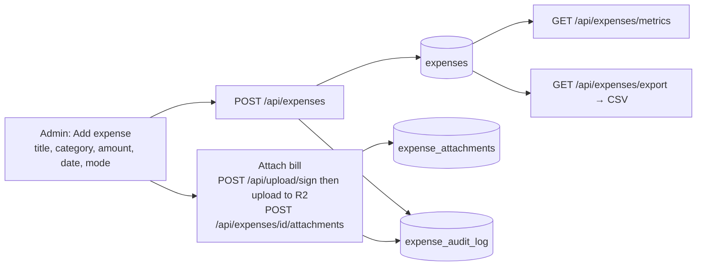

# 15 · Expense Tracking

| | |
|---|---|
| **Feature key** | `expenses` |
| **Category** | Finance |
| **Portals** | School Admin |
| **Status** | **BUILT** |
| **Snapshot** | `dev` @ `29f0e6a`, 2026-09-21 |

---

## 1. Product brief

**The problem.** Fee income is tracked, but spending lives in notebooks and WhatsApp photos of bills — so the owner can't see net position or who approved what.

**The solution.** A simple expense ledger next to fees: categories, records with **bill attachments**, monthly metrics, CSV export, and an **audit log of every change**.

| Capability | Detail |
|---|---|
| Categories | Create, rename, deactivate/delete school expense categories |
| Record an expense | Title, category, payee, **amount** (must be positive), date, payment mode, transaction reference, notes, recorded-by |
| Attachments | Upload bill/receipt images or PDFs (signed direct upload to Cloudflare R2); delete an attachment |
| Filters | By day, month or date range |
| Metrics | Totals by period and category |
| Export | CSV |
| Audit | Every create/update/delete is written to `expense_audit_log` |

**Value.** Income vs. spend in one platform; bill photos attached to the entry instead of lost in chat; an audit trail against pilferage.

**Where it stops.** No approvals workflow, budgets, vendor master, payroll or GST. It is a ledger, not accounting software; there is no automatic link to fee income in a P&L view.

## 2. End-to-end flow

**Step by step**
1. **Expenses → Categories**: set up heads (Electricity, Stationery, Repairs…).
2. **Add expense**: fill the form; the recorder's name/id is stored.
3. **Attach** a bill: the browser asks `/api/upload/sign` for a signed URL and uploads straight to R2; the record links to it.
4. Filter by month; check **metrics**; **export** CSV for the accountant.
5. Edit or delete with the change recorded in the audit log.

## 3. Business rules & edge cases

| Rule | Detail |
|---|---|
| Required | `school_id`, category, non-empty title, **amount > 0** |
| Tenant | `requireFeeAccess(school_id)` on every route |
| Category in use | Deleting a category referenced by expenses is restricted (`ON DELETE RESTRICT`) — deactivate instead |
| Audit | Every action logged with actor |
| Files | Direct-to-R2 signed upload keeps large files off the app server |

## 4. Technical reference (developers)

**Screen:** `app/school-admin/components/ExpenseManagement.tsx` (~1,100 lines).

**API**

| Method | Route | Purpose |
|---|---|---|
| GET/POST | `/api/expenses` | List (filters `date`, `from`/`to`, `month`) / create |
| GET/PATCH/DELETE | `/api/expenses/{id}` | Read/update/delete |
| POST | `/api/expenses/{id}/attachments` | Register an attachment |
| DELETE | `/api/expenses/attachments/{attachmentId}` | Remove attachment |
| GET/POST/PATCH/DELETE | `/api/expenses/categories` | Category CRUD |
| GET | `/api/expenses/metrics`, `/audit-log`, `/export` | Metrics, audit, CSV |
| POST | `/api/upload/sign` | Signed R2 upload URL |
| GET | `/api/auth/me` | Actor name for "recorded by" |

**Tables:** `expenses` (`school_id`, `category_id` → `expense_categories`, `title`, `payee_name`, `amount`, `expense_date`, `payment_mode`, `transaction_ref`, `notes`, recorder), `expense_categories`, `expense_attachments`, `expense_audit_log`.

**Libraries:** `lib/auth.ts` (`requireFeeAccess`), `lib/r2.ts`.

**Tests:** no dedicated spec; covered indirectly by full-platform flows — add one before scale.

## 5. Pitch kit

**Investor one-liner** — "Money in and money out on one platform: fees today, expenses with bills and audit trail beside them."

**School one-liner** — "Record every expense with the bill attached and see the month's spending by category — with a log of who changed what."

**Slide bullets**
- Categories, records, bill attachments.
- Monthly metrics and CSV export.
- Full audit log.

**60-second demo:** add "Electricity ₹18,400" → attach a bill photo → open metrics → export CSV.

**Objection → honest answer**
- *"Is this accounting?"* — No. It is an expense register with audit; connecting it to a full P&L or Tally is roadmap.

## 6. Limits & roadmap

- No budgets, approvals, recurring expenses or vendor management.
- No profit-and-loss view combining fees and expenses yet.
