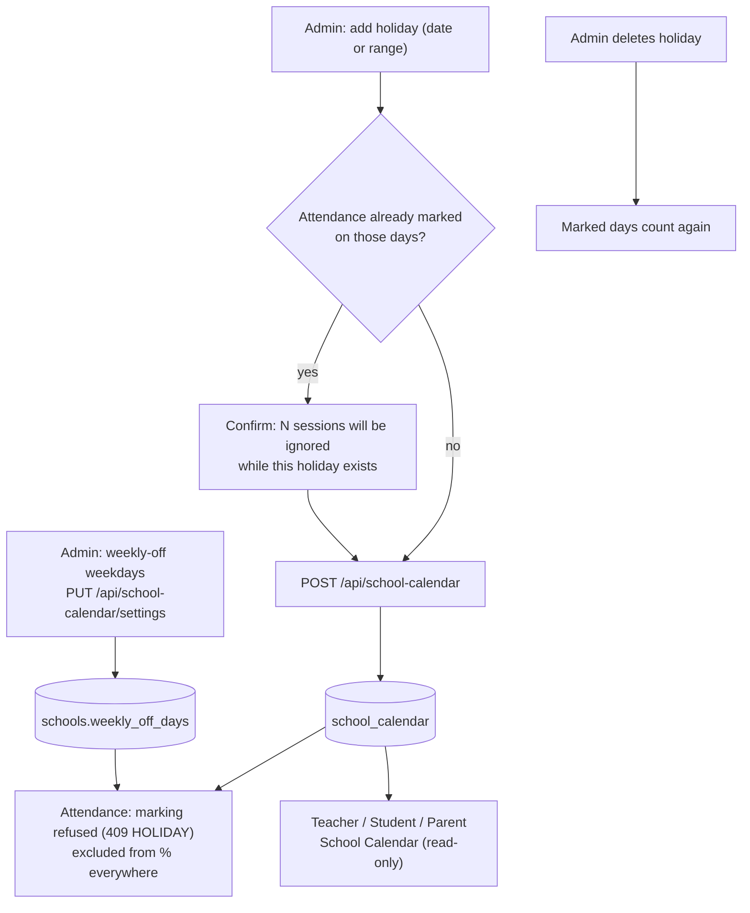

# 16 · Academic Calendar

| | |
|---|---|
| **Feature key** | `calendar` (nav alias `academic-calendar`) |
| **Category** | Administration |
| **Portals** | School Admin (edit) · Teacher, Student, Parent (read-only *School Calendar*) |
| **Status** | **BUILT** |
| **Snapshot** | `dev` @ `29f0e6a`, 2026-09-21 |

---

## 1. Product brief

**The problem.** Holidays are announced on paper; attendance percentages then punish students for days the school was closed; parents and teachers have no shared view of the year.

**The solution.** One calendar the admin owns and everyone reads — and **a holiday actually closes attendance** for those dates.

| Capability | Detail |
|---|---|
| Entry types | `holiday`, `exam`, `event`, `meeting`, `other` (colour-coded) |
| Dates | A single date **or a range up to 366 days** |
| Audience | `everyone` or `staff` only (admin + teachers). **Holidays are always for everyone.** Students/parents never see staff-only entries |
| Weekly off | Weekdays that are never school days (default **Sunday**), configurable |
| Effect on attendance | Holidays and weekly-off days **cannot be marked** and are **excluded from every percentage** |
| Safety | Adding a holiday over days that already have attendance asks for confirmation; deleting it makes those records count again |
| Read-only views | Teacher, student, parent *School Calendar* tab |

**Value.** One truth for the school year; fair attendance numbers; parents can plan around holidays.

**Where it stops.** Whole-school and whole-day only: **no class-specific closures and no half-days** (roadmap). No recurring events, reminders or external calendar sync.

## 2. End-to-end flow

**Step by step**
1. **Academic Calendar** → month grid → *Add*: pick type, title, date or range, audience.
2. For a holiday over already-marked days, confirm the warning.
3. Set **Weekly off** if the school works Saturdays or has a different rest day.
4. Teachers, students and parents open **School Calendar** to view.
5. On the **Overview**, a holiday shows a banner instead of the attendance strip; the attendance *Today* panel has **"Mark today as a holiday"**.

## 3. Business rules & edge cases

| Rule | Detail |
|---|---|
| Who edits | Only the school admin (`getAdminActor`); everyone else reads |
| Range | `MAX_RANGE_DAYS = 366` |
| Named holiday vs weekly off | A named holiday wins in the day map |
| Attendance effect | Server refuses marking on holidays/weekly off (`409 HOLIDAY` / `WEEKLY_OFF`); UI shows why |
| Existing holidays keep working | If the `calendar` feature is switched off later, saved holidays **still close attendance** |
| Validation | Zod (`lib/calendarSchemas.ts`): dates `YYYY-MM-DD`, type and audience enums |
| Time | IST |

## 4. Technical reference (developers)

**Screens:** `app/school-admin/components/AcademicCalendar.tsx`; shared read-only `app/components/SchoolCalendarView.tsx`.

**API**

| Method | Route | Purpose | Guard |
|---|---|---|---|
| GET/POST | `/api/school-calendar` | List (all roles) / create (admin) | read: any school role; write: admin |
| PATCH/DELETE | `/api/school-calendar/{id}` | Edit / delete | admin |
| PUT | `/api/school-calendar/settings` | Weekly-off weekdays | `getAdminActor` (403 otherwise) |

**Tables:** `school_calendar` (`event_type`, `event_date`, `end_date`, `audience`, `created_by_name`, `updated_at`), `schools.weekly_off_days`, and reads `attendance_sessions` for the "already marked" warning.

**Libraries:** `lib/attendanceRules.ts` (`expandNonWorkingDays`), `lib/attendance.ts`, `lib/attendanceAuth.ts`, `lib/calendarSchemas.ts`.

**Tests:** `attendance-rules.spec.ts`, `workflow-attendance.spec.ts` (calendar security, holidays, weekly off).

## 5. Pitch kit

**Investor one-liner** — "The school calendar is wired into the product: mark a holiday and attendance, dashboards and parents all adjust automatically."

**School one-liner** — "Add a holiday once. Attendance closes for that day, percentages stay fair, and every parent and teacher sees it."

**Slide bullets**
- Holidays, exams, events, meetings; date ranges up to a year.
- Holiday closes attendance and is excluded from all percentages.
- Weekly-off configuration; staff-only entries.
- Read-only calendar in teacher, student and parent portals.

**60-second demo:** add a 3-day holiday → try to mark attendance on it (refused with reason) → parent portal shows it → delete it and watch marked days count again.

**Objection → honest answer**
- *"Half-day or class-specific holidays?"* — Not yet.

## 6. Limits & roadmap

- Whole-school, whole-day only; no recurrence or reminders.
- Roadmap: half-day and class-specific holidays.
