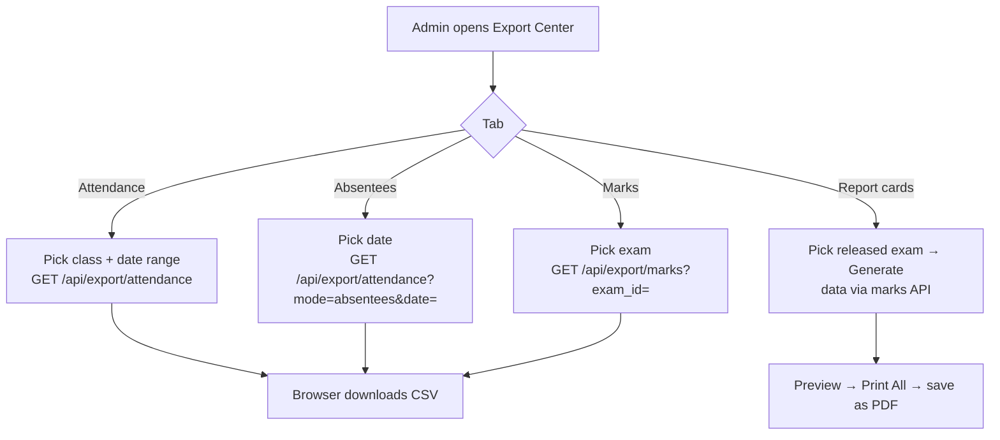

# 17 · Export & Reports (Export Center)

| | |
|---|---|
| **Feature key** | `export` |
| **Category** | Administration |
| **Portals** | School Admin |
| **Status** | **BUILT** |
| **Snapshot** | `dev` @ `29f0e6a`, 2026-09-21 |

---

## 1. Product brief

**The problem.** Schools must hand data to authorities, trustees and parents — attendance registers, marks sheets, report cards — and today they retype it.

**The solution.** An **Export Center** with three tabs:

| Tab | Output |
|---|---|
| **Attendance CSV** | Class register for a date range (Morning & Afternoon per student per day), plus the **daily absentee list** with parent phone numbers |
| **Marks CSV** | Per-student, per-subject marks, totals and result for a chosen exam |
| **Report Cards** | For a chosen exam, a printable per-student report card (subject, max marks, obtained, total, result); **Print All** uses the browser's print (save as PDF) |

Other exports live inside their own features: fee exports and the Excel fee-audit report ([13](13-fee-management.md)), expense CSV ([15](15-expense-tracking.md)), Excel templates for bulk onboarding ([02](02-staff-directory-and-onboarding.md), [03](03-students-list-and-onboarding.md)).

**Value.** Reports in a click; the absentee list lets staff key attendance into the government LEAP app quickly.

**Where it stops.** The report card is a **single-exam, browser-printed sheet** — not a multi-exam, annual, branded report card with remarks and co-scholastic grades. **No direct LEAP integration.** No scheduled/emailed reports.

## 2. End-to-end flow

**Step by step**
1. **Attendance CSV:** choose class and dates → *Download*. The file name is `attendance_<from>_to_<to>.csv`.
2. **Absentee list:** pick the day → CSV of absent students with parent phone.
3. **Marks CSV:** choose an exam → *Download Marks CSV* (`marks_<exam>.csv`).
4. **Report Cards:** select the exam (published) → **Generate** → review one page per student → **Print All**.

## 3. Business rules & edge cases

| Rule | Detail |
|---|---|
| Excel-safe | Attendance CSV neutralises cells that begin with `=`, `+`, `-`, `@` (formula injection) and is written as UTF-8 **with BOM** so Telugu/Hindi names open correctly in Excel |
| Tenant | Class and school are checked against the login (`requireExamsAdmin` for marks — an earlier gap where an admin could export another school's exam by guessing the id was fixed) |
| Attendance numbers | Use the shared attendance rules; holidays/weekly-off excluded |
| Report card grades | From the shared `examGrading` ladder — same grade as the parent and student see |
| Release | Report cards are meant for released exams; results only appear in parent/student portals after admin release |

## 4. Technical reference (developers)

**Screen:** `app/school-admin/components/ExportCenter.tsx` (~520 lines; client-side download and print, `@media print` page breaks per student).

**API**

| Method | Route | Purpose |
|---|---|---|
| GET | `/api/export/attendance` | `?class_id&from&to` register, or `?mode=absentees&date=` |
| GET | `/api/export/marks?school_id&exam_id` | CSV of per-student per-subject marks |
| GET | `/api/exams`, `/api/exams/{id}/marks` | Exam list and data used by the report card tab |
| GET | `/api/classes` | Class picker |

**Tables read:** `attendance`, `students`, `classes`, `student_parents`, `exam_records`, `exam_subjects`, `exam_marks`, `class_subjects`.

**Libraries:** `lib/examGrading.ts`, `lib/attendanceRules.ts`, `lib/attendanceAuth.ts`, `lib/examsAuth.ts`.

**Tests:** attendance export is covered in `workflow-attendance.spec.ts`; marks/report-card export has **no dedicated test**.

## 5. Pitch kit

**Investor one-liner** — "Every school report — registers, marks, report cards — exported in one click from data that is already clean."

**School one-liner** — "Download the attendance register, marks sheets and printable report cards in seconds — Telugu names included."

**Slide bullets**
- Attendance register and daily absentee list (LEAP-friendly).
- Marks CSV and printable report cards.
- Excel-safe, Telugu/Hindi-safe files.

**Demo:** export today's absentee list → open in Excel (Telugu names intact) → generate report cards for an exam → Print All.

**Objection → honest answer**
- *"Annual multi-exam report card?"* — Not yet; today's card is per exam.
- *"LEAP integration?"* — No public API; we give the list to key in.

## 6. Limits & roadmap

- Per-exam report card only; no multi-term, remarks, or school-branded template designer.
- No scheduled exports or emailed reports.
