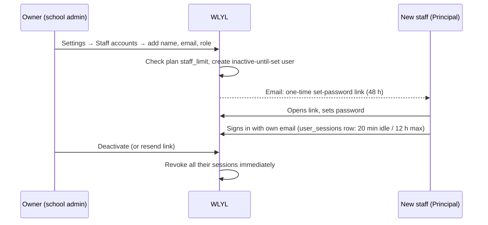

# 18 · School Settings

| | |
|---|---|
| **Feature key** | `settings` |
| **Category** | Administration |
| **Portals** | School Admin (owner) |
| **Status** | **BUILT** |
| **Snapshot** | `dev` @ `29f0e6a`, 2026-09-21 |

---

## 1. Product brief

**The problem.** A school needs to set itself up (profile, academic year), decide who else can sign in as an administrator, and keep those accounts safe — without sharing one password.

**The solution.** A settings area covering the school profile, academic years, **staff accounts** with per-person logins, and account security.

| Area | Detail |
|---|---|
| School profile | Name, contact details, **logo** (signed upload) with left/centre/right alignment, and configurable **receipt header** blocks used on fee receipts |
| Academic years | Create, set current (first year only), view history and **snapshot export** of a past year |
| **Staff accounts** | Invite principal / vice principal / additional admins **by email**; each gets a **one-time set-password link** (48 h) — no password is ever emailed; **resend** voids earlier links; **deactivate** ends their session immediately |
| My account | Change own password (signs you out elsewhere); **request data export or account closure** (an email to WLYL support) |
| Plan | View the school's plan and enabled features |

**Value.** Every administrator has an **individual, revocable login** — a real audit trail and safe offboarding, which schools (and their trustees) care about.

**Where it stops.** No fine-grained roles inside "school admin" (principal, VP and admin share admin capabilities); no SSO or 2FA; the platform's "Reset password" resets **only the owner** account.

## 2. End-to-end flow

**Step by step**
1. **Profile:** complete the school profile after first login (`/profile-setup`).
2. **Academic year:** the first year is created here; every later year is created and activated **only** through Year Rollover ([19](19-year-rollover.md)).
3. **Staff accounts:** add a person → they receive a link → they set a password → they sign in with their own email.
4. **Resend / deactivate** as needed; deactivation kills their live session on the next request.
5. **Change password:** signs out other sessions of yours.

## 3. Business rules & edge cases

| Rule | Detail |
|---|---|
| Per-person login | School ID is **not** a login; email + password |
| Sessions | **20 min idle / 12 h max**, browser-session cookie; server-revocable (`user_sessions`) |
| Session ends on | logout · login as someone else in the same browser · deactivation · password change (others) · reset (all) |
| Invite links | One-time, **48 h**, "Resend" voids earlier links; stored as reset tokens (`password_reset_tokens`) |
| Last account hint | Login page remembers the last-used account (name, email, role) in `localStorage` — **never** a password or session |
| Platform reset | Resets **only the owner** (the account with a `school_code`) |
| Plan limit | `staff_limit` enforced on creation |
| Active year | Once a school has a current year it cannot be switched by hand (Settings/API) — only by rollover |
| Idle UX | `IdleSessionGuard` heartbeats while active and redirects to `/login?role=school&reason=timeout` |

## 4. Technical reference (developers)

**Screens:** `app/school-admin/components/SchoolSettings.tsx` (~1,500 lines), `StaffProfile.tsx`, `IdleSessionGuard.tsx` (mounted by `app/school-admin/layout.tsx`), login and reset pages under `app/login`, `app/reset-password`, `app/change-password`, `app/profile-setup`.

**API**

| Method | Route | Purpose |
|---|---|---|
| GET/POST/PATCH/DELETE | `/api/school-admin/staff-accounts` | List / invite / edit / deactivate |
| POST | `/api/school-admin/staff-accounts/resend` | New invite link (voids old) |
| POST | `/api/school-admin/account-request` | Emails WLYL support for a data-export or account-closure request |
| POST | `/api/auth/login`, `/logout`, `/change-password`, `/forgot-password`, `/reset-password`; GET `/api/auth/me`; GET/POST `/api/auth/session` | Staff auth and heartbeat |
| GET/POST/PATCH/PUT | `/api/academic-years`; GET `/{id}/history`, `/{id}/snapshot-export` | Years and history |
| GET/PUT | `/api/schools/{id}`; GET `/api/schools/{id}/subscription` | Profile, plan view |
| GET/POST | `/api/platform/features` | Plan feature list |
| POST | `/api/upload/sign` | Signed upload (logo) |

**Tables:** `schools`, `users`, `user_profiles`, `user_sessions`, `password_reset_tokens`, `school_subscriptions`, `plan_pricing` (`staff_limit`), `plan_features`, `academic_years`, `academic_year_snapshots`, `student_class_history`, `platform_audit_log`.

**Libraries:** `lib/auth.ts` (`createStaffSession`, `revokeSession`, `revokeUserSessions`, `getSession({passive})`, `SESSION_IDLE_MINUTES = 20`, `SESSION_MAX_HOURS = 12`), `lib/staffInvite.ts`, `lib/email.ts`, `lib/features.ts`.

**Design note:** `getSession()` validates the JWT **and** the `user_sessions` row (not revoked, within idle/max, user active). Normal API calls count as activity; pollers pass `{ passive: true }` so a background check cannot keep a session alive forever.

**⚠ INTERNAL security note:** `GET/PUT /api/schools/{id}/subscription` currently has no auth guard (see [architecture §12.1](00-platform-architecture.md)); the plan view here should read it only after that fix.

**Tests:** `workflow-staff-sessions.spec.ts`, `auth-admin.spec.ts`, `workflow-school-admin.spec.ts`.

## 5. Pitch kit

**Investor one-liner** — "Enterprise-grade access control for schools: individual logins, instant revocation, idle timeouts — without an IT department."

**School one-liner** — "Everyone who manages the school has their own login. When someone leaves, their access ends the same minute — and nobody ever shares a password."

**Slide bullets**
- Per-person admin accounts; invite by one-time link.
- 20-minute idle timeout, 12-hour cap, instant revocation.
- Academic-year history and snapshot export.

**60-second demo:** invite a principal → open the link in a second browser → set password → deactivate from the first → the second browser is logged out on its next click.

**Objection → honest answer**
- *"2FA / SSO?"* — Not yet.
- *"Different permissions for principal vs clerk?"* — Not yet; school-admin roles share capabilities.

## 6. Limits & roadmap

- No 2FA, SSO or fine-grained admin roles.
- Roadmap: role-based admin permissions, WhatsApp/OTP sign-in for parents.
