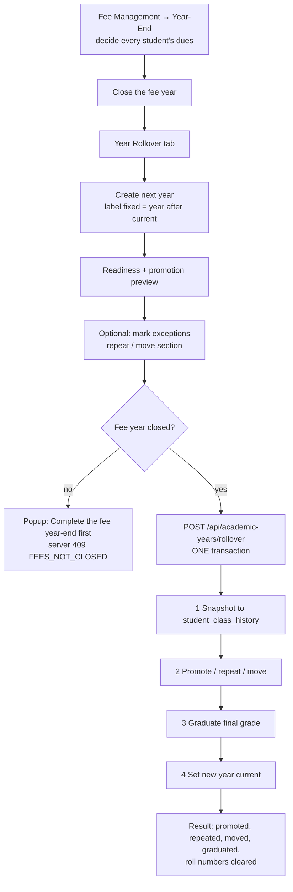

# 19 · Year Rollover

| | |
|---|---|
| **Feature key** | `year-rollover` |
| **Category** | Administration |
| **Portals** | School Admin |
| **Status** | **BUILT** (issues #199, #201) |
| **Snapshot** | `dev` @ `29f0e6a`, 2026-09-21 |

---

## 1. Product brief

**The problem.** Every April the whole school changes at once: students move up a grade, the last grade graduates, some repeat, some change section, dues carry forward, and every module must start on the new year — usually done with a weekend of Excel and errors nobody notices until June.

**The solution.** **One central, guarded, all-or-nothing rollover.** It is the *only* place a school's active academic year advances after the first year is set up.

| Capability | Detail |
|---|---|
| Fee gate | The fee year-end must be **closed first** (Fee Management → Year-End). Otherwise a popup ("Complete the fee year-end first") with a button — and the server also refuses (`409 FEES_NOT_CLOSED`) |
| Preview | Readiness check and promotion preview before running |
| Snapshot | Each active student's grade, section and roll number saved to **class history** (permanent audit trail) |
| Promote | Everyone moves up one grade (numeric 6→7, or Nursery→LKG→UKG→1) |
| Graduate | Final-grade students become `graduated` |
| Exceptions | Per student: **repeat** the year (same grade + section, roll number kept) or **move** to a different existing section of the next grade; final-grade students may repeat instead of graduating |
| New year current | Attendance, exams, syllabus, calendar, fees and all portals follow |
| History | Past years remain in Student 360 through the year switcher |

**Value.** A stressful, error-prone annual chore becomes a checked, reversible-by-design, one-screen operation with a full audit trail — a strong reason to stay on the platform year after year (retention).

**Where it stops.** Not undoable once run. No automatic class re-sectioning/balancing, no timetable rebuild, no automatic new-fee-structure copy beyond what Fee Setup provides.

## 2. End-to-end flow

**Step by step**
1. **Year-End (fees):** apply decisions for every student with dues (carry forward → "Previous Year Dues" bill in the next year; write off; passout; leave open). **Close** the year.
2. **Year Rollover tab:** create the next year (label is fixed to the year after the current one, e.g. `2026-27` → `2027-28`).
3. **Review** the preview; mark **exceptions** (repeat / different section).
4. **Run.** Everything happens in a single database transaction; concurrent runs are serialised (the second gets `409`).
5. **Read the result:** counts promoted / repeated / moved / graduated and how many roll numbers were cleared.
6. **Follow-up:** re-assign cleared roll numbers; generate the new year's fee bills.

## 3. Business rules & edge cases

| Rule | Detail |
|---|---|
| Only current → next | Only the **current** year can roll over, only into the year that **follows** it, and **once** |
| Fee gate | Schools **with** Fee Management need a closed (not reopened) fee year; schools **without** it are not gated |
| Atomic | Snapshot + promote + graduate + switch year in one transaction; concurrent runs serialised (race-safe claim) |
| Grade sequence | `grade_sequence` and `final_grade` define promotion order; `nextGradeInSequence` returns none at the end |
| **Roll numbers** | Unique per class. A promoted student keeps their roll number if it is free in the new class; otherwise it is **cleared** and the school reassigns (counted in `roll_numbers_cleared`). Graduates' roll numbers are cleared; the old value stays in class history |
| Exceptions validated up front | Unknown student or missing section is refused **before anything changes** (Zod, max 5,000 exceptions) |
| Outcomes recorded | Each student's outcome — `promoted`, `repeated`, `moved`, `graduated` — stored in `student_class_history` |
| After rollover | The old fee year **cannot be reopened**; the active year cannot be switched by hand |
| Idempotent readiness | `rolled_over` = students have a class-history row for the year |

**Worked example (illustrative).** School has Grades 1–10 with 300 students. 285 promote, 6 repeat (exceptions), 4 move to section B, and 25 in Grade 10 graduate (2 of them chose to repeat instead). Result shows counts; if 12 promoted students' roll numbers clash in the new class, "12 roll numbers cleared" is reported.

## 4. Technical reference (developers)

**Screen:** `app/school-admin/components/YearRollover.tsx` (~600 lines).

**API**

| Method | Route | Purpose |
|---|---|---|
| GET | `/api/academic-years/rollover` | Readiness (`getRolloverReadiness`) and preview |
| POST | `/api/academic-years/rollover` | Run `{school_id, from_year_id, to_year_id, final_grade, grade_sequence, exceptions[]}` |
| GET/POST/PATCH/PUT | `/api/academic-years` | Create the next year (only here after year one) |
| GET/POST | `/api/students/promote` | Promotion support |
| GET | `/api/fees/year-rollover` | Fee-side rollover state |
| GET/POST | `/api/classes`, `/api/students` | Section existence, roster |

**Tables:** `academic_years`, `academic_year_snapshots`, `student_class_history`, `students`, `classes`, `fee_year_close`, `student_fee_ledger`, `fee_categories`, `fee_structures`, `class_subjects`, `curriculum_assignments`, `school_subjects`.

**Libraries:** `lib/yearRollover.ts` (`getRolloverReadiness`, `isFeeYearClosed`, `isYearRolledOver`, `feeGateRequired`, `FEES_NOT_CLOSED`), `lib/feeRollover.ts` (`nextAcademicYearLabel`, `lockYearClose`), `lib/grades.ts`, `lib/academicYear.ts`.

**Design notes:** Fee Year-End no longer creates years or promotes anyone (responsibility separated); readiness is computed by one function used by both the screen and the route so they always agree; the exception schema is a Zod discriminated union (`repeat` | `move`).

**Tests:** `workflow-year-rollover.spec.ts`. **ADR:** `docs/DECISIONS.md` — "One central Year Rollover, gated by fee year-end (#199)".

## 5. Pitch kit

**Investor one-liner** — "The annual reset that other tools leave to Excel: one guarded, atomic operation that promotes, graduates and carries dues — and locks the customer in year after year."

**School one-liner** — "New academic year in one screen: everyone promoted, exceptions handled, dues carried forward — and nothing half-done."

**Slide bullets**
- Fee year-end gate prevents rolling over with unresolved dues.
- One atomic transaction; concurrent-run safe.
- Repeat-year and section-change exceptions.
- Full class history retained; Student 360 year switcher.

**60-second demo:** show the blocked popup ("complete fee year-end first") → close fee year → mark one student to repeat → run → show the result counts and the student's history.

**Objection → honest answer**
- *"Can we undo it?"* — No; the design is to prevent mistakes with the gate, preview and exceptions. Take a backup first (daily R2 backup exists).

## 6. Limits & roadmap

- Irreversible once run; cleared roll numbers need manual reassignment.
- No automatic timetable/section rebalancing.
