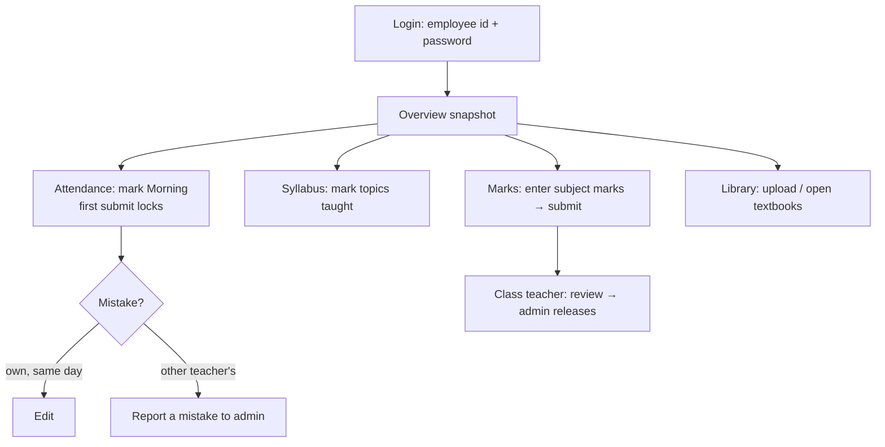

# 20 · Teacher Portal

> Not a Platform-Admin feature switch — it is the workspace where the attendance, syllabus, exam and library features are *used* by teachers. Documented separately because decks need it.

| | |
|---|---|
| **Route** | `/teacher` (login `/teacher/login`) |
| **Cookie / token** | `wlyl-teacher`, JWT 7 days |
| **Signs in with** | Employee id + password (forced change on first login) |
| **Status** | **BUILT** |
| **Snapshot** | `dev` @ `29f0e6a`, 2026-09-21 |

---

## 1. Product brief

**The problem.** Teachers lose teaching time to registers, mark sheets and syllabus reports.

**The solution.** A single workspace organised around **"my classes"**:

| Section | What the teacher does |
|---|---|
| **Overview** (Smart Snapshot) | Today at a glance for their own classes |
| **My Classes** → class view | Per class: attendance, students, syllabus setup and coverage, exams and marks entry |
| **My Students** → student detail | Look up a student in their classes |
| **Attendance** | Class picker (Morning/Afternoon state + who marked) → mark sheet → submit; **History**; **My class** dashboard (class teachers only); Report a mistake |
| **Syllabus** | Class Syllabus Setup, mark topics taught, add/rename custom chapters, bulk-import an outline, English→Telugu/Hindi name conversion |
| **Exams / Marks** | Enter marks for their subjects; class teachers review and forward for release |
| **Digital Library** | Upload textbooks; browse materials for their class subjects |
| **School Calendar** | Read-only |
| **My Profile** | Password, date of birth |

Which sections show follows the school's plan (`attendance`, `curriculum`, `exam-marks`, `library`, `calendar`).

**Value.** Marking attendance is two taps per student; syllabus and marks are done where the teacher already is; the principal gets the data without chasing.

**Where it stops.** No timetable, lesson planner, homework, doubts or leave (all removed from `dev`; timetable is built on a branch awaiting sign-off). No chat with parents.

## 2. End-to-end flow (a teacher's day)

## 3. Business rules

| Rule | Detail |
|---|---|
| Attendance | Any class, today and 2 days back; first submit locks; correct own work same day; otherwise report ([08](08-attendance-tracking.md)) |
| Class teacher | Gets *My class* dashboard, reviews exam marks, can reopen a submitted subject before review ([10](10-exam-schedule-and-marks.md)) |
| Subject teacher | Edits marks only for their assigned subjects |
| Syllabus | Only the class's assigned teacher edits its setup and marks topics ([09](09-syllabus-customizer.md)) |
| Deactivation | A deactivated teacher can no longer mark attendance |
| Data scope | Everything is scoped to the teacher's school |

## 4. Technical reference (developers)

**Screens:** `app/teacher/page.tsx` (350 lines, section nav in the URL), `components/`: `SmartSnapshot`, `MyClasses`, `ClassView` (~2,800 lines: attendance, syllabus, exams tabs), `MyStudents`, `StudentDetail`, `Attendance` + `attendance/*`, `ExamMarks`, `TeacherSyllabus`, `TeacherLibrary`, `TeacherProfile`.

**API (teacher-facing)**

| Group | Routes |
|---|---|
| Auth | `/api/teacher-auth/{login,logout,me,change-password}`; `/api/teacher/auth/{login,logout,me,change-password,date-of-birth,forgot-password,reset-password}` |
| Attendance | `/api/attendance` (+ `/overview`, `/dashboard`, `/report`) |
| Exams | `/api/exams`, `/api/exams/{id}/marks`, `/review`, `/subjects/{sid}/reopen` |
| Syllabus | `/api/syllabus`, `/setup/*`, `/api/school/syllabus/{bulk-import,bootstrap-chapters}`, `/api/transliterate` |
| Library | `/api/textbooks`, `/api/school/library`, `/api/teachers/{id}/class-subjects` |
| Notifications | `/api/notifications` (recipient derived from session) |

**Guards:** `getTeacherSession()`, `getStaffActor()` (attendance), `requireExamsTeacher`, `requireSyllabusWriteAccess`.

**Tests:** `auth-teacher.spec.ts`, `staff-teacher-data-flow.spec.ts`, `workflow-attendance.spec.ts`, `workflow-portals.spec.ts`.

## 5. Pitch kit

**Investor one-liner** — "Teachers work from one screen per class — attendance, syllabus, marks — so data is captured at the source, not re-typed later."

**School one-liner** — "Two taps per student for attendance, and syllabus and marks right where you teach."

**Slide bullets**
- Class-centred workspace; offline-tolerant attendance marking.
- Class-teacher dashboard: weekday patterns, students needing attention.
- Marks entry with review-and-release governance.
- Syllabus coverage with one-click sibling copy.

**Demo:** log in as a class teacher → mark attendance → open *My class* dashboard → enter marks for a subject.

## 6. Limits & roadmap

- No timetable / lesson planning / homework / parent chat on `dev`.
- Two parallel teacher-auth route sets exist (`/api/teacher-auth/*` and `/api/teacher/auth/*`) — **INTERNAL** cleanup candidate.
