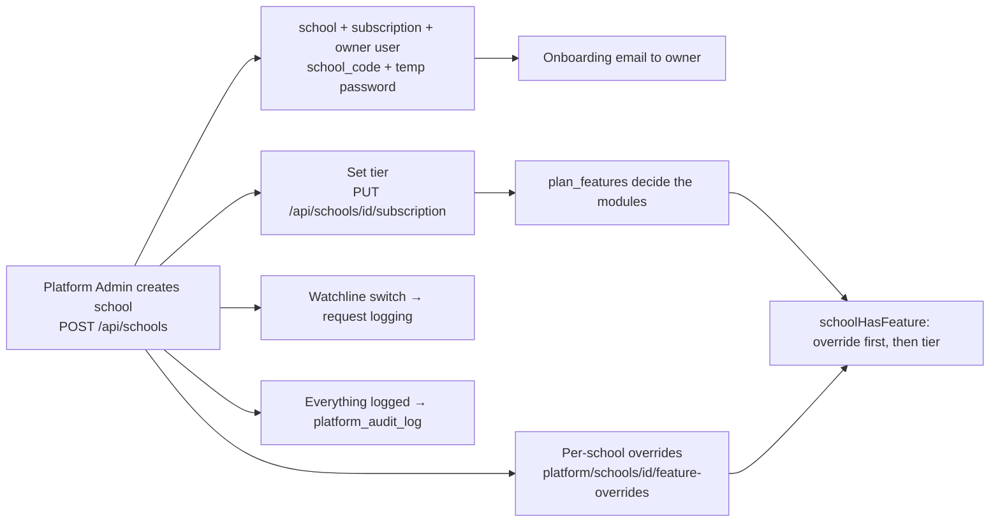

# 21 · Platform Admin Portal (the business engine)

> The WLYL team's control room. Not sold to schools, but it is **how the SaaS business runs** — important for investor decks (multi-tenant control, plans, monitoring).

| | |
|---|---|
| **Route** | `/platform-admin` — served **only** on the `admin.` subdomain (blocked on the main domain by `proxy.ts`) |
| **Cookie / token** | `wlyl-platform`, JWT 7 days; role `platform_admin` |
| **Signs in with** | Email + password (first admin created via `/api/auth/setup-admin`, protected by `SETUP_SECRET`) |
| **Status** | **BUILT** |
| **Snapshot** | `dev` @ `29f0e6a`, 2026-09-21 |

---

## 1. Product brief

**The problem.** A SaaS serving many schools needs one place to onboard schools, control what each can use, watch health and keep an audit trail — without engineers touching the database.

**The solution.** A left-nav console:

| Section | What it does |
|---|---|
| **Schools** | Directory (search by name/city/code; filter by tier; active/inactive/deleted). **Create school** → auto school code + temporary admin password + onboarding email. School detail: subscription tier and dates, per-school **feature overrides** (student portal, parent portal, online payments), **AI access** switch, **Watchline** switch, reset the owner's password |
| **Master Syllabus** | Build the master catalog: subjects → chapters → topics → tasks/resources; bulk import; gap detection; bulk delete |
| **Digital Library** | Master materials per subject (signed uploads to R2) |
| **Feature Plans** | Turn each of the 19 features on/off **per tier** (Basic / Standard / Premium); changes apply instantly |
| **Usage Analytics** | Growth, feature adoption, per-school health |
| **Watchline** | Per-school API monitoring (request logs and health), enabled school by school |
| **Audit Log** | Immutable record: school created, subscription changed, school deleted, password reset — with actor and before/after |
| **Admins** | Manage platform admins and reset their passwords; send a test email |

**Value.** Onboard a school in minutes; sell tiers by switching features; see which schools actually use what; every sensitive action is on record.

**Where it stops.** No self-serve school sign-up or billing/payment collection from schools in code (subscription amounts are recorded, not charged). Seeded plan prices are **not final** — `[TBD – founder]`.

## 2. End-to-end flow

## 3. Business rules

| Rule | Detail |
|---|---|
| Two-layer flags | Tier setting, overridden per school; overridable keys: `student-portal`, `parent-portal`, `online-payments`, `api-monitoring` |
| Watchline | Not a plan feature; per school only; the Edge middleware caches the monitored-school list for 60 s and logs monitored requests fire-and-forget |
| Domain | Platform admin is reachable only on `admin.` — the main domain blocks it |
| Reset password | For a school it resets **only the owner** account |
| Audit | Immutable; captures actor, entity, before/after |
| Plans (seeded) | Basic 499 · Standard 999 · Premium 1999 (unit and currency undefined) with WhatsApp/online-payment flags — **do not quote** |

## 4. Technical reference (developers)

**Screens:** `app/platform-admin/page.tsx` (schools), `schools/[id]`, `curriculum`, `library`, `features`, `usage-analytics`, `logs` (Watchline), `audit`, shell in `components/PlatformAdminShell.tsx`.

**API groups**

| Group | Routes |
|---|---|
| Schools | `/api/schools`, `/api/schools/{id}`, `/{id}/subscription`, `/{id}/ai-access`, `/api/platform/schools/{id}/feature-overrides`, `/api/platform/schools/reset-password` |
| Plans | `/api/platform/features` |
| Catalog | `/api/platform/subjects`(+ `/{id}`, `/chapters`, `/full`, `/materials`, `/bulk-delete`, `/gaps`), `/chapters/{id}/topics|tasks`, `/topics`, `/tasks`, `/syllabus/bulk-import`, `/materials/*`, `/library` |
| Monitoring | `/api/platform/usage-analytics` (+ growth, feature-adoption, school-health, per school), `/api/platform/watchline` (+ health), `/api/internal/{log-ingest,log-cleanup,watchline-flags}` (secret-protected) |
| Admin | `/api/platform/admins`, `/admins/{id}/reset`, `/api/platform/audit`, `/api/platform/stats`, `/api/platform/test-email`, `/api/auth/setup-admin` |

**Tables:** `schools`, `users`, `school_subscriptions`, `plan_pricing`, `plan_features`, `school_feature_overrides`, `school_ai_access`, `platform_audit_log`, usage/Watchline log tables, `master_*`.

**Libraries:** `lib/auth.ts` (`requirePlatformAdmin`, `schoolHasFeature`), `lib/features.ts`, `lib/watchline.ts`, `lib/usageTracking.ts`, `proxy.ts`.

**⚠ INTERNAL security finding:** several `/api/platform/*` routes and `/api/schools/{id}/subscription` **have no auth guard** (details and fix in [architecture §12.1](00-platform-architecture.md)). Fix before any pilot with real data.

**Tests:** `auth-admin.spec.ts`, `watchline-config.spec.ts`, `workflow-full-platform.spec.ts`.

## 5. Pitch kit

**Investor one-liner** — "One control room runs every school: onboard in minutes, sell Basic/Standard/Premium by flipping switches, and see real usage per school."

**Slide bullets**
- Multi-tenant SaaS: schools, tiers, per-school overrides.
- Feature plans switch modules instantly; no code fork per customer.
- Usage analytics and per-school monitoring (Watchline).
- Immutable audit log.

**Never say:** automated billing/collection from schools (not built), or final prices.

## 6. Limits & roadmap

- No automated billing or self-serve sign-up. Roadmap: payment gateway (first for school fees, later possibly SaaS billing).
