# Academics: Exams, Marks, Tasks, Doubts & Syllabus

This diagram covers the academic domain: exam management, student marks, homework/task assignments, student doubt Q&A, syllabus tracking, weekly tests, report cards, and textbook resources.

## Tables

| Table | Purpose |
|---|---|
| **exam_records** | An exam event (Unit Test 1, Mid Term, etc.) for a specific class. Created by a teacher, flows through draft -> collecting -> published. |
| **exam_subjects** | Subjects included in an exam, with max marks and the teacher responsible for entering marks. |
| **exam_marks** | Individual student marks per subject per exam. Includes absent tracking. |
| **parent_mark_acks** | Parent acknowledgement that they have seen their child's exam results. |
| **report_card_config** | 1:1 per school. Configures what appears on report cards (attendance, rank, grading scheme). |
| **report_card_remarks** | Per-student per-exam remarks from the class teacher (conduct, advice, etc.). |
| **tasks** | Homework, practice, or test assignments created by a teacher for a class. Has due date/time. |
| **task_submissions** | Student submissions for a task. Includes file upload, score, feedback, resubmission flow. |
| **task_reminders** | Records of reminder notifications sent by teachers for pending task submissions. |
| **doubts** | Student questions about a subject or task. Can be answered by AI or teacher. Supports FAQ marking and upvotes. |
| **doubt_messages** | Live chat messages within a doubt thread between student and teacher. |
| **doubt_upvotes** | Peer upvoting of doubts by other students. |
| **syllabus_topics** | Chapter and topic tracking per class per subject. Teachers mark coverage, HODs review progress. |
| **weekly_tests** | AI-generated MCQ tests per student per week, based on covered syllabus. |
| **textbook_library** | Uploaded textbook PDFs per school/grade/subject. Text is extracted for AI context. |
| **textbook_chunks** | Extracted text chunks from textbooks, indexed for full-text search. |
| **ai_chat_sessions** | Student AI chat history (floating assistant). Visible to parents. |
| **teacher_ai_sessions** | Teacher AI chat history (professional assistant). Not parent-visible. |

## Entity Relationship Diagram

```mermaid
erDiagram
    classes {
        SERIAL id PK
        VARCHAR grade
        VARCHAR section
    }

    teachers {
        SERIAL id PK
        VARCHAR name
    }

    students {
        SERIAL id PK
        VARCHAR name
    }

    schools {
        SERIAL id PK
        VARCHAR name
    }

    exam_records {
        SERIAL id PK
        INTEGER school_id FK
        INTEGER class_id FK
        INTEGER created_by FK
        VARCHAR exam_name
        VARCHAR exam_type
        DATE exam_date
        INTEGER passing_pct
        VARCHAR status
        TIMESTAMPTZ published_at
    }

    exam_subjects {
        SERIAL id PK
        INTEGER exam_id FK
        INTEGER school_id
        VARCHAR subject_name
        INTEGER teacher_id FK
        VARCHAR teacher_name
        INTEGER max_marks
        VARCHAR status
        INTEGER submitted_by FK
    }

    exam_marks {
        SERIAL id PK
        INTEGER exam_id FK
        INTEGER school_id
        INTEGER student_id FK
        VARCHAR subject_name
        NUMERIC marks_obtained
        BOOLEAN is_absent
        INTEGER entered_by FK
    }

    parent_mark_acks {
        SERIAL id PK
        INTEGER exam_id FK
        INTEGER student_id FK
        INTEGER school_id
        VARCHAR parent_name
        TIMESTAMPTZ acknowledged_at
    }

    report_card_config {
        SERIAL id PK
        INTEGER school_id FK, UK
        BOOLEAN show_attendance
        BOOLEAN show_rank
        BOOLEAN show_remarks
        JSONB grading_scheme
        TEXT header_text
    }

    report_card_remarks {
        SERIAL id PK
        INTEGER school_id FK
        INTEGER student_id FK
        INTEGER exam_id FK
        TEXT class_teacher_remark
        VARCHAR conduct
        TEXT next_term_advice
    }

    tasks {
        SERIAL id PK
        INTEGER school_id FK
        INTEGER class_id FK
        INTEGER teacher_id FK
        VARCHAR title
        VARCHAR subject
        VARCHAR task_type
        INTEGER max_marks
        TEXT instructions
        VARCHAR status
        DATE due_date
        TIME due_time
    }

    task_submissions {
        SERIAL id PK
        INTEGER task_id FK
        INTEGER student_id FK
        INTEGER school_id FK
        TIMESTAMPTZ submitted_at
        TEXT submission_text
        VARCHAR file_url
        NUMERIC score
        TEXT feedback
        VARCHAR status
        INTEGER reviewed_by FK
    }

    task_reminders {
        SERIAL id PK
        INTEGER task_id FK
        INTEGER school_id FK
        INTEGER sent_by FK
        VARCHAR target_type
        INTEGER student_count
    }

    doubts {
        SERIAL id PK
        INTEGER school_id FK
        INTEGER class_id FK
        INTEGER student_id FK
        VARCHAR subject
        TEXT question
        INTEGER task_id FK
        TEXT ai_answer
        INTEGER answered_by FK
        VARCHAR status
        BOOLEAN is_class_faq
        INTEGER upvote_count
        INTEGER message_count
    }

    doubt_messages {
        SERIAL id PK
        INTEGER doubt_id FK
        INTEGER school_id
        VARCHAR sender_type
        INTEGER sender_id
        VARCHAR sender_name
        TEXT message
        BOOLEAN is_final_answer
    }

    doubt_upvotes {
        SERIAL id PK
        INTEGER doubt_id FK
        INTEGER student_id FK
        INTEGER school_id
    }

    syllabus_topics {
        SERIAL id PK
        INTEGER school_id FK
        INTEGER class_id FK
        VARCHAR subject
        VARCHAR chapter_name
        INTEGER chapter_order
        VARCHAR topic_name
        INTEGER topic_order
        VARCHAR status
        DATE covered_date
        INTEGER covered_by FK
        DATE target_date
        TEXT delay_reason
        TEXT hod_remark
        BOOLEAN published
    }

    weekly_tests {
        SERIAL id PK
        INTEGER school_id FK
        INTEGER class_id FK
        INTEGER student_id FK
        DATE week_start
        JSONB questions
        JSONB student_answers
        INTEGER score
        VARCHAR status
    }

    textbook_library {
        SERIAL id PK
        INTEGER school_id FK
        VARCHAR grade
        VARCHAR subject
        VARCHAR book_title
        VARCHAR file_name
        INTEGER total_chunks
    }

    textbook_chunks {
        SERIAL id PK
        INTEGER textbook_id FK
        INTEGER school_id
        VARCHAR grade
        VARCHAR subject
        INTEGER chunk_index
        TEXT content
    }

    ai_chat_sessions {
        SERIAL id PK
        INTEGER school_id FK
        INTEGER student_id FK
        VARCHAR subject
        JSONB messages
    }

    teacher_ai_sessions {
        SERIAL id PK
        INTEGER school_id FK
        INTEGER teacher_id FK
        VARCHAR context
        JSONB messages
    }

    schools ||--o{ exam_records : "has exams"
    schools ||--o| report_card_config : "has config"
    schools ||--o{ tasks : "has tasks"
    schools ||--o{ doubts : "has doubts"
    schools ||--o{ syllabus_topics : "has syllabus"
    schools ||--o{ weekly_tests : "has tests"
    schools ||--o{ textbook_library : "has textbooks"
    classes ||--o{ exam_records : "has exams"
    classes ||--o{ tasks : "assigned to"
    classes ||--o{ doubts : "raised in"
    classes ||--o{ syllabus_topics : "covers"
    classes ||--o{ weekly_tests : "generates for"
    teachers ||--o{ exam_records : "creates"
    teachers ||--o{ exam_subjects : "enters marks"
    teachers ||--o{ exam_marks : "entered by"
    teachers ||--o{ tasks : "assigns"
    teachers ||--o{ task_submissions : "reviews"
    teachers ||--o{ task_reminders : "sends"
    teachers ||--o{ doubts : "answers"
    teachers ||--o{ syllabus_topics : "covers topic"
    teachers ||--o{ teacher_ai_sessions : "chats with AI"
    students ||--o{ exam_marks : "receives marks"
    students ||--o{ parent_mark_acks : "marks acknowledged"
    students ||--o{ report_card_remarks : "has remarks"
    students ||--o{ task_submissions : "submits"
    students ||--o{ doubts : "asks"
    students ||--o{ doubt_upvotes : "upvotes"
    students ||--o{ weekly_tests : "takes"
    students ||--o{ ai_chat_sessions : "chats with AI"
    exam_records ||--o{ exam_subjects : "has subjects"
    exam_records ||--o{ exam_marks : "has marks"
    exam_records ||--o{ parent_mark_acks : "acknowledged by"
    exam_records ||--o{ report_card_remarks : "has remarks"
    tasks ||--o{ task_submissions : "receives"
    tasks ||--o{ task_reminders : "sends reminders"
    tasks ||--o{ doubts : "doubt about"
    doubts ||--o{ doubt_messages : "has chat"
    doubts ||--o{ doubt_upvotes : "has upvotes"
    textbook_library ||--o{ textbook_chunks : "split into"
```

