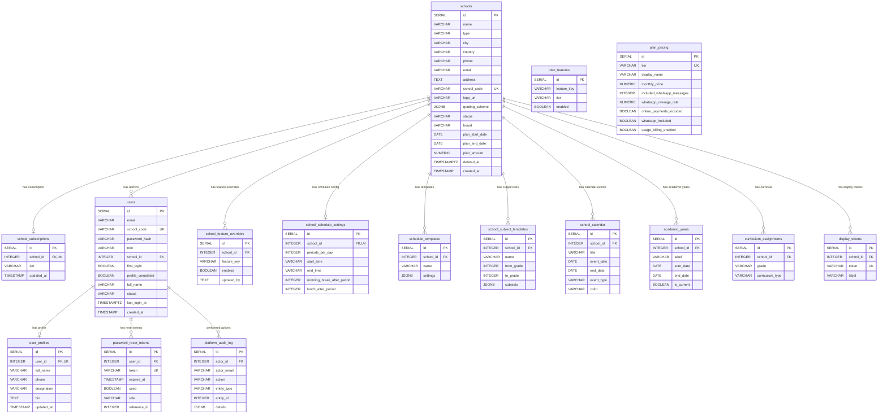

# Core: Schools, Users & Configuration

This diagram covers the foundational entities: schools, their subscriptions, admin users, platform-level configuration, and school-level settings.

## Tables

| Table | Purpose |
|---|---|
| **schools** | Central entity. Every record in the system belongs to a school. Holds contact info, branding, plan dates, soft-delete. |
| **school_subscriptions** | 1:1 with school. Tracks the subscription tier (none/basic/standard/premium). |
| **users** | School admins and platform admins. School admins log in via school_code, platform admins via email. |
| **user_profiles** | 1:1 extension of users with full name, phone, designation, bio. |
| **password_reset_tokens** | Time-limited tokens for password recovery across all roles. |
| **plan_features** | Feature-flag matrix: which features are enabled for each subscription tier. |
| **plan_pricing** | Pricing, quotas, and capability flags per tier. |
| **school_feature_overrides** | Per-school overrides on top of tier-level plan_features. |
| **school_schedule_settings** | 1:1. Configures periods per day, break timings, start/end times. |
| **schedule_templates** | Named saved schedule configurations (Full Day, Half Day, Exam Day). |
| **school_subject_templates** | Default subject sets per grade range, auto-applied when creating classes. |
| **school_calendar** | Academic calendar: holidays, events, meetings. |
| **academic_years** | Tracks academic year labels (e.g. "2024-25") with start/end dates and current flag. |
| **curriculum_assignments** | Maps which curriculum (CBSE/APSSC) a school uses per grade. |
| **display_tokens** | Authentication tokens for TV/kiosk display screens. |
| **platform_audit_log** | Immutable log of every platform admin action (create, update, delete). |
| **app_bootstrap_state** | Internal: tracks whether schema bootstrap has completed. |

## Entity Relationship Diagram

