# Engagement: Announcements, Notifications, Rewards & Daily Content

This diagram covers the engagement and communication domain: announcements, notifications, student gamification (points, badges, streaks), daily knowledge content, the student marketplace, portal activity tracking, and WhatsApp/SaaS billing.

## Tables

| Table | Purpose |
|---|---|
| **announcements** | School-wide circulars. Targeted to all/teachers/students/parents. Has priority levels and expiration dates. |
| **notifications** | In-app notifications. Can target a teacher, student, or school-wide. Sent by teachers or system-generated. |
| **student_points** | Point transaction log. Students earn points for tasks, doubts, reading, quizzes, streaks. |
| **student_badges** | Badge awards (first_task, task_10, high_scorer, streak_7, etc.). One of each badge per student. |
| **student_streaks** | Current and longest activity streaks per student. One row per student. |
| **daily_newspapers** | Pre-written educational articles rotated by date. One per school per day. Includes quiz questions. |
| **student_newspaper_reads** | Tracks which students have read each daily newspaper article. Awards points. |
| **hub_daily_content** | AI-generated daily knowledge hub content: GK questions, word of the day, riddles, debates, challenges, reading/writing/speaking prompts. |
| **student_hub_completions** | Tracks student completion of daily hub activities with scores and points earned. |
| **marketplace_items** | Reward shop items students can purchase with earned points. |
| **marketplace_orders** | Purchase orders when students redeem points for marketplace items. |
| **student_portal_sessions** | Session tracking for student portal logins (start time, end time, duration). |
| **student_portal_activity** | Granular activity log within each session (page views, task views, submissions, etc.). |
| **school_whatsapp_config** | Per-school WhatsApp Business API configuration (Meta provider). |
| **whatsapp_messages** | Audit trail of all WhatsApp messages sent, with delivery tracking. |
| **whatsapp_usage_summary** | Monthly rollup of WhatsApp message counts per type, for billing. |
| **billing_cycles** | SaaS billing cycles for schools paying the platform. Monthly cycle with plan fee and overages. |
| **usage_ledger** | Per-event billable usage records within a billing cycle. |
| **saas_invoices** | Generated invoices for platform billing. Includes plan fee + WhatsApp overage charges. |
| **saas_invoice_items** | Line items on each invoice (plan fee, overage, etc.). |
| **saas_payments** | Payment records when schools pay platform invoices. |

## Entity Relationship Diagram

```mermaid
erDiagram
    schools {
        SERIAL id PK
        VARCHAR name
    }

    students {
        SERIAL id PK
        VARCHAR name
    }

    announcements {
        SERIAL id PK
        INTEGER school_id FK
        VARCHAR title
        TEXT content
        VARCHAR announcement_type
        VARCHAR target_audience
        VARCHAR priority
        VARCHAR created_by_name
        DATE expires_at
    }

    notifications {
        SERIAL id PK
        INTEGER school_id FK
        INTEGER recipient_teacher_id FK
        INTEGER recipient_student_id FK
        INTEGER recipient_school_id FK
        INTEGER sender_teacher_id FK
        VARCHAR type
        VARCHAR title
        TEXT message
        JSONB data
        BOOLEAN is_read
    }

    student_points {
        SERIAL id PK
        INTEGER student_id FK
        INTEGER school_id
        VARCHAR action_type
        INTEGER points
        INTEGER reference_id
        VARCHAR reference_type
        VARCHAR points_type
    }

    student_badges {
        SERIAL id PK
        INTEGER student_id FK
        INTEGER school_id
        VARCHAR badge_type
        TIMESTAMPTZ earned_at
    }

    student_streaks {
        INTEGER student_id PK, FK
        INTEGER school_id
        INTEGER current_streak
        INTEGER longest_streak
        DATE last_activity_date
    }

    daily_newspapers {
        SERIAL id PK
        INTEGER school_id FK
        DATE date
        VARCHAR title
        TEXT content
        TEXT fun_fact
        TEXT quiz_question
        TEXT quiz_answer
        VARCHAR topic
        VARCHAR category
    }

    student_newspaper_reads {
        SERIAL id PK
        INTEGER student_id FK
        INTEGER newspaper_id FK
        INTEGER school_id
        INTEGER points_awarded
    }

    hub_daily_content {
        SERIAL id PK
        DATE content_date UK
        JSONB gk_questions
        JSONB word_of_day
        JSONB riddle
        JSONB fact_myth_questions
        JSONB debate_statement
        JSONB challenge_problem
        JSONB reading_passage
        JSONB writing_prompt
        JSONB speaking_sentences
    }

    student_hub_completions {
        SERIAL id PK
        INTEGER student_id FK
        INTEGER school_id
        VARCHAR activity_type
        DATE completed_date
        INTEGER score
        INTEGER points_earned
    }

    marketplace_items {
        SERIAL id PK
        VARCHAR name UK
        TEXT description
        VARCHAR emoji
        INTEGER cost_points
        BOOLEAN active
    }

    marketplace_orders {
        SERIAL id PK
        INTEGER student_id FK
        INTEGER school_id
        INTEGER item_id FK
        VARCHAR item_name
        INTEGER points_spent
        VARCHAR status
        VARCHAR student_name
    }

    student_portal_sessions {
        SERIAL id PK
        INTEGER student_id FK
        INTEGER school_id
        TIMESTAMPTZ started_at
        TIMESTAMPTZ ended_at
        INTEGER duration_minutes
    }

    student_portal_activity {
        SERIAL id PK
        INTEGER student_id FK
        INTEGER school_id
        INTEGER session_id FK
        VARCHAR action_type
        VARCHAR action_detail
    }

    school_whatsapp_config {
        SERIAL id PK
        INTEGER school_id FK, UK
        VARCHAR provider
        TEXT access_token_encrypted
        VARCHAR phone_number_id
        BOOLEAN is_active
    }

    whatsapp_messages {
        SERIAL id PK
        INTEGER school_id FK
        VARCHAR recipient_phone
        VARCHAR message_type
        VARCHAR template_name
        VARCHAR provider
        VARCHAR status
        INTEGER retry_count
    }

    whatsapp_usage_summary {
        SERIAL id PK
        INTEGER school_id FK
        VARCHAR year_month
        VARCHAR message_type
        INTEGER sent_count
        INTEGER delivered_count
        INTEGER failed_count
    }

    billing_cycles {
        SERIAL id PK
        INTEGER school_id FK
        DATE cycle_start
        DATE cycle_end
        VARCHAR tier
        NUMERIC plan_fee
        VARCHAR status
    }

    usage_ledger {
        SERIAL id PK
        INTEGER school_id FK
        INTEGER billing_cycle_id FK
        VARCHAR event_type
        NUMERIC quantity
        BOOLEAN is_billable
    }

    saas_invoices {
        SERIAL id PK
        INTEGER school_id FK
        INTEGER billing_cycle_id FK
        VARCHAR invoice_number UK
        DATE invoice_date
        DATE due_date
        VARCHAR status
        NUMERIC total_amount
        NUMERIC paid_amount
    }

    saas_invoice_items {
        SERIAL id PK
        INTEGER invoice_id FK
        INTEGER school_id FK
        VARCHAR item_type
        TEXT description
        NUMERIC quantity
        NUMERIC unit_rate
        NUMERIC amount
    }

    saas_payments {
        SERIAL id PK
        INTEGER school_id FK
        INTEGER invoice_id FK
        NUMERIC amount
        VARCHAR payment_mode
        DATE payment_date
        TEXT recorded_by
    }

    schools ||--o{ announcements : "posts"
    schools ||--o{ notifications : "sends"
    schools ||--o{ daily_newspapers : "has articles"
    schools ||--o| school_whatsapp_config : "has WA config"
    schools ||--o{ whatsapp_messages : "sends WA msgs"
    schools ||--o{ whatsapp_usage_summary : "WA usage"
    schools ||--o{ billing_cycles : "billed"
    schools ||--o{ saas_invoices : "invoiced"
    schools ||--o{ saas_payments : "pays platform"
    students ||--o{ student_points : "earns points"
    students ||--o{ student_badges : "earns badges"
    students ||--o| student_streaks : "has streak"
    students ||--o{ student_newspaper_reads : "reads articles"
    students ||--o{ student_hub_completions : "completes activities"
    students ||--o{ marketplace_orders : "places orders"
    students ||--o{ student_portal_sessions : "portal sessions"
    students ||--o{ student_portal_activity : "portal actions"
    daily_newspapers ||--o{ student_newspaper_reads : "read by"
    marketplace_items ||--o{ marketplace_orders : "ordered"
    student_portal_sessions ||--o{ student_portal_activity : "contains"
    billing_cycles ||--o{ usage_ledger : "has usage"
    billing_cycles ||--o{ saas_invoices : "generates invoice"
    saas_invoices ||--o{ saas_invoice_items : "has line items"
    saas_invoices ||--o{ saas_payments : "paid via"
```

