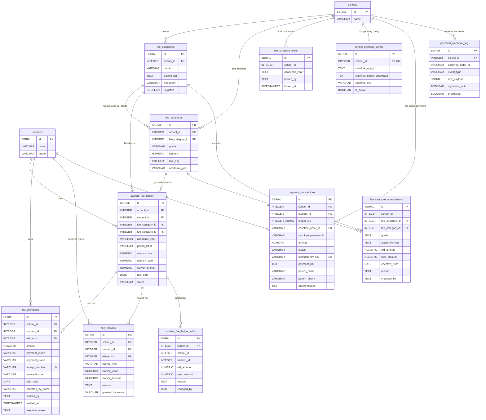

# Fees: Fee Management, Payments & Online Transactions

This diagram covers the complete fee lifecycle: category definitions, grade-level fee structures, per-student ledger entries, payments (cash and online), waivers, and the online payment gateway integration (Cashfree).

## Tables

| Table | Purpose |
|---|---|
| **fee_categories** | Fee types defined by a school (Tuition, Transport, Exam Fee, etc.). Each has a frequency (monthly/quarterly/annual/one_time). |
| **fee_structures** | Amount per category per grade per academic year. Defines how much each grade pays for each fee category. |
| **fee_structure_locks** | Locks a school's fee structure for an academic year to prevent accidental edits after finalization. |
| **fee_structure_amendments** | Audit trail when a locked fee structure amount is changed. Records old/new amounts and reason. |
| **student_fee_ledger** | Per-student billing records. One row per student per fee category per period. Tracks amount due, paid, and status. |
| **student_fee_ledger_edits** | Audit trail for manual edits to individual student ledger entries. |
| **fee_payments** | Payment records against ledger entries. Supports cash, cheque, DD, online, UPI. Each gets a receipt number. |
| **fee_waivers** | Discount/waiver records (percentage, fixed amount, or full). Linked to specific ledger entries. |
| **school_payment_config** | Per-school Cashfree gateway configuration. Secret is AES-256-GCM encrypted. |
| **payment_transactions** | Online payment link records created for parents. Tracks Cashfree order lifecycle. |
| **payment_webhook_log** | Raw Cashfree webhook payloads logged for idempotency and audit. |

## Entity Relationship Diagram

