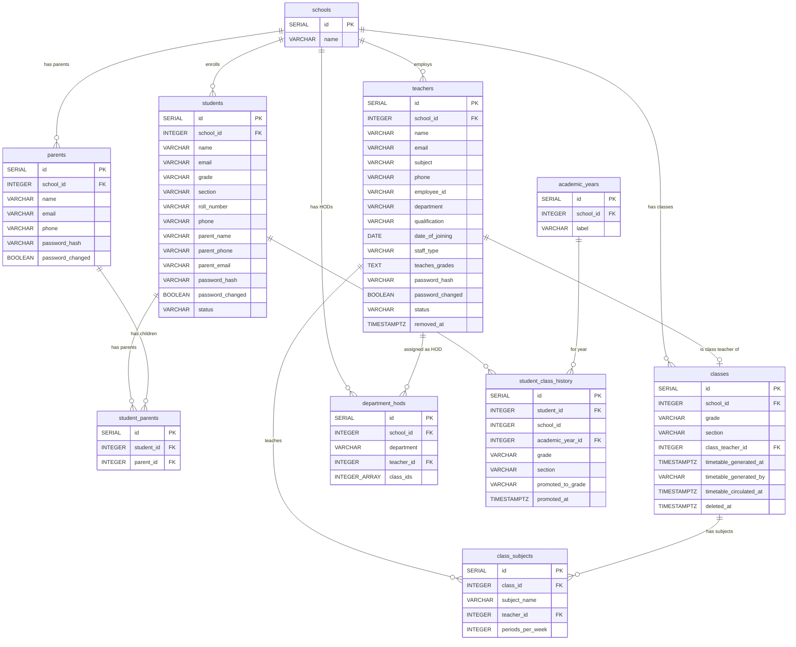

# People: Teachers, Students, Parents & Classes

This diagram covers the people entities and their class assignments. These are the core actors in the school management system.

## Tables

| Table | Purpose |
|---|---|
| **teachers** | School staff. Can be teaching or support staff. Logs in via employee_id + password. Soft-deleted via removed_at. |
| **students** | Enrolled students. Assigned to a grade + section. Logs in via roll_number + password. |
| **parents** | Parent/guardian records. Linked to students via the student_parents join table. Logs in via email. |
| **student_parents** | Many-to-many join: a student can have multiple parents, a parent can have multiple children. |
| **classes** | A specific grade + section combination (e.g. "6A"). Has a class teacher. Unique per school. |
| **class_subjects** | Subjects taught in a class, with the assigned teacher and periods-per-week for timetable generation. |
| **department_hods** | Head of Department assignments. A teacher can be HOD for a department overseeing specific classes. |
| **student_class_history** | Immutable audit trail: which grade+section a student was in for each academic year. Written during rollover. |

## Entity Relationship Diagram

