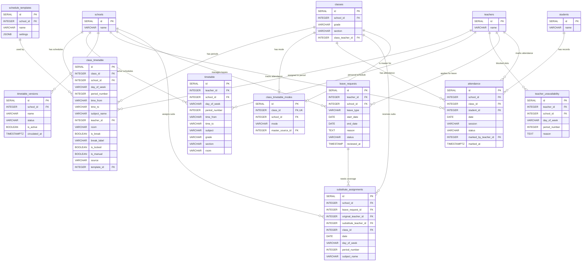

# Scheduling: Timetable, Attendance, Leave & Substitutes

This diagram covers the scheduling domain: timetable generation, teacher/student attendance, leave management, and substitute teacher assignments.

## Tables

| Table | Purpose |
|---|---|
| **class_timetable** | Source of truth for each class's schedule. One row per class + day + period. Includes breaks, lock state, and source tracking (auto/manual/cloned). |
| **timetable** | Teacher's personal schedule view, synced from class_timetable. Denormalized for fast teacher-portal queries. |
| **timetable_versions** | Version tracking for timetable snapshots (draft vs. published). |
| **class_timetable_modes** | Master/slave/independent mode per class. Slave classes clone their timetable from a master source class. |
| **teacher_unavailability** | Hard constraints for the timetable generator. Teachers mark specific day+period slots as unavailable. |
| **attendance** | Student attendance records. Two sessions per day (morning + afternoon). Marked by a teacher. |
| **leave_requests** | Teacher leave applications. Flows through pending -> approved/rejected. |
| **substitute_assignments** | When a teacher is on approved leave, admin assigns substitute teachers per period. Linked to the leave request. |

## Entity Relationship Diagram

