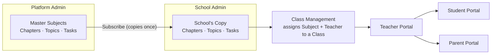
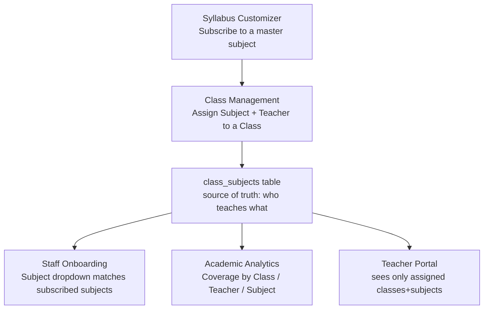

# Syllabus Module — End-to-End Workflow

**Status:** Built and merged to `dev` (PR #75, commit `413a876`).
**Audience:** Engineering team testing the full syllabus flow across all 5 portals.

This is a workflow reference, not a test-case list. It explains how the pieces connect so anyone testing the module knows what to click, in what order, and why a given screen shows what it shows.

---

## 1. The core idea

There are two layers of syllabus data:

1. **Master catalog** — owned by Platform Admin. One central library of subjects → chapters → topics → tasks, shared across every school on the platform.
2. **School copy** — owned by each School Admin. When a school "subscribes" to a master subject, the whole subject tree (chapters, topics, tasks) is **copied** into that school's own tables. It is not a live link — editing the master copy later does not retroactively change what a school already has.

Everything downstream (Class Management, teacher visibility, student view, parent view, tracking/analytics) reads from the **school's copy**, never the master catalog directly.

---

## 2. Who does what — module by module

### Platform Admin — builds the master catalog

**Screen:** Curriculum Builder (`/platform-admin/curriculum`)

- Creates subjects, chapters, topics, tasks/quizzes at the platform level.
- Two categories: **Board Subjects** (Maths, Science, tied to a real board/grade) and **Extra Subjects** (Dance, Music, Art — same structure, just tagged differently so schools can tell them apart).
- Supports bulk import of a whole subject's chapters/topics/quiz from JSON (useful for loading a full syllabus at once instead of typing chapter by chapter).
- Nothing here is visible to any school until a School Admin subscribes to it.

### School Admin — subscribes, assigns, tracks

Four connected screens, in the order a school admin would actually touch them:

**a) Syllabus Customizer** — subscribe to subjects
- Browse the master catalog (filtered by Board Subjects / Extra Subjects), pick a subject for a grade, subscribe.
- This **copies** the subject's full chapter/topic/task tree into the school's own tables for the active academic year.
- A school can also add its own custom chapters/topics on top of what it subscribed to.

**b) Class Management** — assign subject + teacher to a class
- Once subjects are subscribed for a grade, the "add subject to class" dropdown only offers subjects the school has actually subscribed to — no free typing, no mismatched spelling. This is deliberate: it's what makes the teacher-visibility link work reliably.
- Assigning a teacher here is what makes a class/subject show up in that teacher's portal. This one table (`class_subjects` — class + subject + teacher) is the single source of truth for "who teaches what" everywhere else in the app.

**c) Staff Onboarding** — subject field lines up with the above
- When onboarding a teacher, the "Subject" field is a dropdown of the school's subscribed subjects (same list as Class Management), so a teacher's subject can never drift out of sync (e.g. "Maths" vs "Mathematics").
- If a school hasn't subscribed to anything yet, it falls back to the full platform catalog instead of forcing free text.
- Supports both plain CSV and an Excel template with a real in-cell dropdown for Subject.

**d) Academic Analytics / Syllabus Tracking** — see coverage
- Three views: by Class, by Teacher, by Subject — each shows how many topics are marked "covered" vs. total, as a percentage.
- "By Teacher" is driven by the same `class_subjects` assignment table from Class Management (b) — if a teacher isn't assigned there, they won't show up here even if they're teaching in practice.
- All of this is scoped to one academic year at a time — every portal shows a small "📅 [year]" badge so it's obvious which year's data is on screen.

### Teacher — the day-to-day user

**Screen:** Class View → Syllabus tab

- A teacher only sees the classes and subjects they were assigned in Class Management (via `class_subjects`) — this is checked the same way in every teacher screen (Syllabus, My Classes, My Students, Smart Snapshot, Tasks), so it's consistent no matter which tab you're in.
- Per chapter, a list of topics. Each topic has a "mark taught" toggle. Marking it taught/covered is what moves the needle on the School Admin's coverage percentages.
- Each pending topic also has an optional **Schedule** button — set a target date and a delay reason, so a topic that's running behind is visible, not just silently overdue.
- Subject teachers (not just the class teacher) now also get a **Students** tab on the class, so they can look up a student without needing to be the homeroom teacher.

### Student — read-only progress view

**Screen:** My Syllabus

- Sees the same chapter/topic structure, with a clear "taught" vs "not yet" status per topic.
- Topics that are taught show a simple quiz if one was attached at the platform level.

### Parent — read-only, covered topics only

**Screen:** Syllabus tab in the parent portal

- Mirrors the student view but only shows topics that have actually been marked as covered — a parent isn't shown what's still pending, only what's been taught so far.

---

## 3. Two things worth testing carefully

**Academic year consistency.** Every screen above is scoped to "whichever academic year is currently active" for that school. If a school's active-year flag is ever pointed at the wrong year (e.g. after a Year Rollover), screens that used to show data can suddenly look empty. The year badge in every portal header exists specifically so this is visible immediately instead of looking like a bug with no explanation. When testing, check the badge matches what's expected before assuming something else is broken.

**Extra Subjects vs Board Subjects.** These use the exact same underlying structure — subscribing, assigning, tracking all work identically for "Dance" as for "Maths." The only difference is the category tag used to keep them visually separated when picking a subject to subscribe to.

---

## 4. Known gaps — not bugs, not yet built

Worth knowing about before anyone reports these as broken:

- **Homework auto-suggestion after marking a topic taught doesn't work yet.** The teacher screen attempts to call an AI suggestion feature when you mark a topic covered, but the backend for it was never built. It fails silently (no crash, just no suggestion appears).
- **Marking a topic "taught" doesn't lock/unlock anything.** There's no concept yet of topics being sequentially gated — every topic's quiz is visible to students regardless of whether the teacher has marked it taught.
- **Quiz attempts aren't saved anywhere.** Both the student and parent quiz views are display-only; there's no record of what a student actually answered. (This is separate from the standalone Weekly Test feature, which does save results.)

---

## 5. Quick reference — screens in testing order

| Order | Portal | Screen | What to check |
|---|---|---|---|
| 1 | Platform Admin | Curriculum Builder | Create/import a subject with chapters + topics |
| 2 | School Admin | Syllabus Customizer | Subscribe to that subject for a grade |
| 3 | School Admin | Class Management | Assign the subject + a teacher to a class |
| 4 | School Admin | Staff Onboarding | Confirm the subject dropdown offers exactly what was subscribed |
| 5 | Teacher | Class → Syllabus | Confirm only the assigned class/subject shows; mark a topic taught |
| 6 | School Admin | Academic Analytics | Confirm the marked topic reflects in coverage % |
| 7 | Student | My Syllabus | Confirm the topic shows as taught |
| 8 | Parent | Syllabus | Confirm the same topic shows (and only covered ones) |
